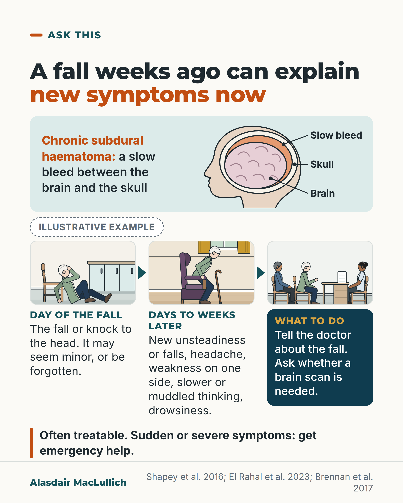

# G001: Weeks after the fall

- Category: C01 Falls and fear of falling
- Audience: public
- Series: Ask this
- Post type: public_explanation
- Visual format: diagram (timeline) with drawn vignettes
- Status: text text_final, visual final
- Working id: C01-P01 (candidate C01-28)

## Insight

A slow bleed between the brain and the skull (chronic subdural haematoma) can follow even a minor knock and show itself weeks later as new unsteadiness, headache, one-sided weakness, slower thinking or drowsiness. It is often treatable, so the earlier fall should be mentioned to the doctor.

## Angle and position

A fall can be the cause and, weeks later, the symptom. Position: if new problems appear in the weeks after a fall, tell the doctor about the fall, however minor it seemed, and ask whether a brain scan is needed; sudden or severe symptoms need emergency help.

Basis: mixed: the link with age and blood thinners, the symptoms, the delay and the treatments are empirical findings (cohorts, reviews, trials); the instruction to mention the fall and ask about a scan is clinical interpretation drawn from the reviews, not a guideline quotation.

## X (916 characters)

```text
Blood can collect slowly between the brain and the skull after a fall. The first signs often appear weeks later, when everyone has stopped thinking about the fall.

This is called a chronic subdural haematoma. It is much more common in later life, and blood thinners make it more likely.

In a Swiss study of people treated for it, the commonest problem was unsteadiness or falls, in about 6 in 10. Headache, weakness or other one-sided signs, and slower or muddled thinking were also common. Some people became drowsy.

About 6 in 10 people with this bleed have a recent knock to the head on record. The rest have none recorded, often because the knock seemed too small to mention or was forgotten.

If new problems appear in the weeks after a fall, tell the doctor about the fall and ask whether a brain scan is needed. When it causes symptoms, it is often treatable. Sudden or severe symptoms need emergency help.
```

## LinkedIn (2252 characters)

```text
Blood can collect slowly between the brain and the skull after a fall. The first signs often appear weeks later, when everyone has stopped thinking about the fall.

The name is chronic subdural haematoma. It is much more common in later life. In Switzerland in 2013, about 64 in every 100,000 people in their 80s were treated for it. Across all ages, the figure was about 8 in 100,000, so the rate in their 80s was about 8 times as high. Those figures count only people who had surgery.

The bleed can grow slowly, so problems come on over days to weeks. In a Swiss study of people treated for it, about 6 in 10 were unsteady or had falls, and about 5 in 10 had headache. Weakness or other one-sided signs, and slower or muddled thinking, each affected about 4 in 10. Some people became drowsy. In older people it can look like a stroke, or like dementia getting quickly worse. These were people treated in specialist units, so milder cases are under-represented.

About 6 in 10 people with this bleed have a recent knock to the head on record. The rest have none recorded, often because the knock seemed too small to mention or was forgotten.

Blood thinners (anticoagulants and aspirin-type medicines) make this bleed more likely. In a UK study, over 4 in 10 people treated for it were taking one. Please don't stop a blood thinner on your own: that decision weighs bleeding against clots, and is one to make with your doctor.

A brain scan shows it. When it causes symptoms, it is often treatable, usually by draining it through small holes in the skull. A newer procedure blocks the artery feeding the membrane around the bleed. It is usually added to drainage. In two of three large trials published in 2024, adding it meant the bleed was less likely to come back, or to need more treatment. The third did not show a clear difference. Longer-term safety is still being studied. Not everyone needs an operation, and outcomes are poorer in the oldest patients.

If new unsteadiness, headache, drowsiness, weakness or slower thinking appears in the weeks after a fall, tell the doctor about the fall. Mention it even if it seemed too minor. Ask whether a brain scan is needed. Sudden or severe symptoms need emergency help, not a routine appointment.
```

## Bluesky (297 characters)

```text
Weeks after a fall, even a minor knock, blood can collect slowly between the brain and skull.

Watch for new unsteadiness, headache, one-sided weakness, slower thinking or drowsiness. Tell the doctor about the fall and ask about a brain scan. Often treatable. Sudden or severe: get emergency help.
```

## Threads (435 characters)

```text
Weeks after a fall, even a minor knock to the head, blood can collect slowly between the brain and the skull.

Watch for new unsteadiness or falls, headache, weakness on one side, slower thinking or drowsiness. It is more common in later life and with blood thinners.

Tell the doctor about the fall, however small it seemed, and ask whether a brain scan is needed. It is often treatable. Sudden or severe symptoms need emergency help.
```

## Source reply

Sources: https://doi.org/10.1007/s13670-016-0166-9 (review) https://doi.org/10.3389/fneur.2023.1206996 (Swiss cohort) https://pubmed.ncbi.nlm.nih.gov/28306417/ (UK cohort) https://doi.org/10.1093/ageing/afad240 (Age and Ageing review) https://doi.org/10.1056/NEJMoa2313472 https://doi.org/10.1056/NEJMoa2409845 https://doi.org/10.1056/NEJMoa2401201 (2024 embolisation trials)

## Visual



Alt text: Illustrative timeline. An older woman sits on her kitchen floor after a fall, hand to her forehead. Weeks later she is tired rising from her armchair: new unsteadiness, headache, one-sided weakness, muddled thinking or drowsiness. At the GP with her son: mention the fall, ask about a scan. A head diagram shows a slow bleed between brain and skull. Often treatable; sudden or severe: emergency help.

Editable source: `visuals/src/G001.html`

Design instructions: Single 4:5 light card. h1.s headline with orange em. Mint panel: definition text left, schematic head cross-section right (SVG, face left, skull ring, pink brain, pale orange crescent top right, leader labels). Illustrative-example badge, then 3-column timeline with teal arrow shapes: kit vignettes on sand (1 kitchen floor on_floor pose, hand to forehead, beside chair; 2 rising from plum armchair, stick leaning nearby; 3 GP desk: son (olive skin), woman, GP (tan, bun, doctor role) facing left). Third station text in deep teal box with gold label. Orange-ruled bold note. Claims C01-28-a to i (no numeric data).

## Sources and verification

- C01-28-a (supported): Chronic subdural haematoma is especially common in older people, and its incidence rises steeply with age.
  - Source: El Rahal A, et al. Incidence, therapy, and outcome in the management of chronic subdural hematoma in Switzerland: a population-based multicenter cohort study. Front Neurol. 2023;14:1206996.; Kolias AG, Chari A, Santarius T, Hutchinson PJ. Chronic subdural haematoma: modern management and emerging therapies. Nat Rev Neurol. 2014;10(10):570-8.; Brennan PM, Kolias AG, Joannides AJ, Shapey J, Marcus HJ, Gregson BA, et al. The management and outcome for patients with chronic subdural hematoma: a prospective, multicenter, observational cohort study in the United Kingdom. J Neurosurg. 2017:1-8.
  - Passage: "The overall incidence rate was 8.2/100,000 persons ... Overall, the highest incidence rate was 64.2/100,000 persons in patients 80–89 years old. (El Rahal 2023) / Chronic subdural haematoma (CSDH) is one of the most common neurological disorders, and is especially prevalent among elderly individuals. (Kolias 2014) / The median age of patients admitted was 77 years (range 20-99). (Brennan 2017)" (El Rahal Results, Incidence of cSDH; Kolias Abstract; Brennan Results)
- C01-28-b (supported): It often follows a head injury, which may be minor and may not be remembered or mentioned; about 4 in 10 people have no recalled or recorded recent head injury.
  - Source: Shapey J, Glancz LJ, Brennan PM. Chronic subdural haematoma in the elderly: is it time for a new paradigm in management? Curr Geriatr Rep. 2016;5:71-7.; Brennan PM, Kolias AG, Joannides AJ, Shapey J, Marcus HJ, Gregson BA, et al. The management and outcome for patients with chronic subdural hematoma: a prospective, multicenter, observational cohort study in the United Kingdom. J Neurosurg. 2017:1-8.; Iliescu IA. Current diagnosis and treatment of chronic subdural haematomas. J Med Life. 2015;8(3):278-84.
  - Passage: "Head injury is a common risk factor and in a study of 1000 patients, 61.7 % recalled a recent one. (Shapey 2016) / 62% (514/823) had a documented history of head injury in the preceding 3 months. (Brennan 2017) / Moreover, in the context of a usual brain injury, which can pass unobserved and may frequently be ignored, the chronic subdural haematoma has a latent period until the appearance of the clinical symptoms ... Therefore, the main element that can lead to the diagnosis of chronic subdural haematoma is the minor brain injury; however, it should not be forgotten that it is seriously taken into account only by some of the patients or their families. (Iliescu 2015)" (Shapey Pathophysiology; Brennan Results; Iliescu Clinical diagnosis)
- C01-28-c (supported): Symptoms usually develop over days to weeks, and the haematoma often shows itself weeks or months after the original bleed.
  - Source: Shapey J, Glancz LJ, Brennan PM. Chronic subdural haematoma in the elderly: is it time for a new paradigm in management? Curr Geriatr Rep. 2016;5:71-7.; Iliescu IA. Current diagnosis and treatment of chronic subdural haematomas. J Med Life. 2015;8(3):278-84.
  - Passage: "CSDHs often present several weeks or months after the index bleed, because as the initial acute haematoma liquefies it enlarges. ... Patients with chronic subdural haematomas can present in a variety of ways, and symptom onset and progression may range from days to weeks. (Shapey 2016) / Chronic subdural hematoma – the clinical manifestations appear after 21 days (Iliescu 2015, Definition)" (Shapey Pathophysiology and Clinical Presentation; Iliescu Definition)
- C01-28-d (supported): Common presenting problems include unsteadiness or falls, headache, weakness on one side, slower or muddled thinking and drowsiness; in older people it can look like a stroke or rapidly worsening dementia.
  - Source: El Rahal A, et al. Incidence, therapy, and outcome in the management of chronic subdural hematoma in Switzerland: a population-based multicenter cohort study. Front Neurol. 2023;14:1206996.; Brennan PM, Kolias AG, Joannides AJ, Shapey J, Marcus HJ, Gregson BA, et al. The management and outcome for patients with chronic subdural hematoma: a prospective, multicenter, observational cohort study in the United Kingdom. J Neurosurg. 2017:1-8.; Shapey J, Glancz LJ, Brennan PM. Chronic subdural haematoma in the elderly: is it time for a new paradigm in management? Curr Geriatr Rep. 2016;5:71-7.
  - Passage: "Gait disturbance was the most common clinical presentation in 362 (58.6%) patients, followed by headache in 286 (46.4%) patients, focal neurological deficits in 252 (40.7%) patients, and cognitive deterioration in 246 (39.8%) patients. ... Table 1: Drowsiness/coma 109 (618) 17.6 (El Rahal 2023) / Cognitive impairment was the most frequent presenting symptom of transferred patients (58%), followed by hemiparesis (41%) and headache (41%) (Brennan 2017) / Elderly patients frequently present with multiple symptoms that may mimic a stroke or rapidly progressive dementia. (Shapey 2016)" (El Rahal Results and Table 1; Brennan Results; Shapey Clinical Presentation)
- C01-28-e (supported): Anticoagulant and antiplatelet medicines are risk factors, and many people with the condition take them.
  - Source: Shapey J, Glancz LJ, Brennan PM. Chronic subdural haematoma in the elderly: is it time for a new paradigm in management? Curr Geriatr Rep. 2016;5:71-7.; Brennan PM, Kolias AG, Joannides AJ, Shapey J, Marcus HJ, Gregson BA, et al. The management and outcome for patients with chronic subdural hematoma: a prospective, multicenter, observational cohort study in the United Kingdom. J Neurosurg. 2017:1-8.; Rickard F, Gale J, Williams A, Shipway D. New horizons in subdural haematoma. Age Ageing. 2023;52(12).
  - Passage: "Other risk factors include coagulopathy, use of antiplatelet or anticoagulant medication ... Anticoagulant and antiplatelet use are both implicated in CSDH development and recurrence. (Shapey 2016) / Of the patients transferred, 356/823 (43%) were prescribed anticoagulant or antiplatelet medication at the time of referral: 171 aspirin (21%), 160 warfarin (19%), 36 clopidogrel (4%) (Brennan 2017) / Anticoagulant and antiplatelet use are commonly indicated in older people with SDH, but few data inform decision-making surrounding these agents in the context of intracranial bleeding. (Rickard 2023)" (Shapey Pathophysiology and Anticoagulation section; Brennan Results, Perioperative clotting; Rickard Abstract)
- C01-28-f (supported_with_qualification): It is diagnosed with a brain scan (CT or MRI), and symptomatic cases are often treatable, mainly by surgical drainage through burr holes.
  - Source: Iliescu IA. Current diagnosis and treatment of chronic subdural haematomas. J Med Life. 2015;8(3):278-84.; Kolias AG, Chari A, Santarius T, Hutchinson PJ. Chronic subdural haematoma: modern management and emerging therapies. Nat Rev Neurol. 2014;10(10):570-8.; Rickard F, Gale J, Williams A, Shipway D. New horizons in subdural haematoma. Age Ageing. 2023;52(12).; Brennan PM, Kolias AG, Joannides AJ, Shapey J, Marcus HJ, Gregson BA, et al. The management and outcome for patients with chronic subdural hematoma: a prospective, multicenter, observational cohort study in the United Kingdom. J Neurosurg. 2017:1-8.; El Rahal A, et al. Incidence, therapy, and outcome in the management of chronic subdural hematoma in Switzerland: a population-based multicenter cohort study. Front Neurol. 2023;14:1206996.
  - Passage: "The suspicion of expansive intracranial injury makes us perform a paraclinical investigation (CT or MRI), which makes the diagnosis clearer by evidencing the iso- or hypodense subdural collection. (Iliescu 2015) / Surgical evacuation is the mainstay of management for symptomatic patients or haematomas exerting significant mass effect. (Kolias 2014) / However, burr hole drainage can be safe and effective in older adults with symptomatic chronic SDH (cSDH). Such patients need careful assessment to ensure symptoms arise from cSDH and not from coexisting medical pathology. (Rickard 2023) / Criteria on mortality (2%), rate of recurrence (9%), and unfavorable functional outcome (22%) were met ... Increasing patient age (p < 0.00001) ... independently predicted unfavorable functional outcomes (Brennan 2017) / A good outcome was seen in 81% of patients (El Rahal 2023)" (Iliescu Clinical diagnosis; Kolias Abstract; Rickard Abstract; Brennan Abstract; El Rahal Abstract)
- C01-28-h (supported_with_qualification): Blocking the middle meningeal artery (embolisation), added to standard treatment, reduced recurrence in two 2024 trials; a third did not show a clear difference.
  - Source: Davies JM, Knopman J, Mokin M, Hassan AE, et al. Adjunctive middle meningeal artery embolization for subdural hematoma. N Engl J Med. 2024;391(20):1890-900.; Fiorella D, Monteith SJ, Hanel R, Atchie B, Boo S, McTaggart RA, et al. Embolization of the middle meningeal artery for chronic subdural hematoma. N Engl J Med. 392(9):855-64 (published online 2024 Nov 20).; Liu J, Ni W, Zuo Q, Yang H, et al. Middle meningeal artery embolization for nonacute subdural hematoma. N Engl J Med. 2024;391(20):1901-12.; Rickard F, Gale J, Williams A, Shipway D. New horizons in subdural haematoma. Age Ageing. 2023;52(12).
  - Passage: "Hematoma recurrence or progression leading to repeat surgery occurred in 8 patients (4.1%) in the treatment group, as compared with 23 patients (11.3%) in the control group (relative risk, 0.36 ...). ... Further study is needed to evaluate the safety of middle meningeal artery embolization (EMBOLISE) / a primary-outcome event occurred in 19 of 120 patients (16%) in the embolization group, as compared with 47 of 129 patients (36%) in the control group ... Further study of longer-term safety outcomes is warranted. (STEM) / Symptomatic recurrence or progression of subdural hematoma within 90 days occurred in 24 patients (6.7%) in the embolization group and in 36 (9.9%) in the usual-care group (between-group difference, -3.3 percentage points; 95% confidence interval, -7.4 to 0.8; P = 0.10). The incidence of serious adverse events was lower in the embolization group (MAGIC-MT) / the emerging treatment of middle meningeal artery embolisation offers a well-tolerated, minimally invasive intervention which may reduce the risks of rebleeding in older adults (Rickard 2023)" (Abstracts)
- C01-28-i (supported_with_qualification): Families should mention a recent fall or knock to the head, even a minor one, if new unsteadiness, headache, drowsiness, weakness or slower thinking appears in the following weeks, and ask whether a scan is needed.
  - Source: Iliescu IA. Current diagnosis and treatment of chronic subdural haematomas. J Med Life. 2015;8(3):278-84.; Shapey J, Glancz LJ, Brennan PM. Chronic subdural haematoma in the elderly: is it time for a new paradigm in management? Curr Geriatr Rep. 2016;5:71-7.
  - Passage: "Therefore, the main element that can lead to the diagnosis of chronic subdural haematoma is the minor brain injury; however, it should not be forgotten that it is seriously taken into account only by some of the patients or their families. ... If the CT examination is currently very easily accessible, the diagnosis of chronic subdural haematoma has become quite simple, the main condition being that you only have to think about such a diagnosis. (Iliescu 2015) / Elderly patients frequently present with multiple symptoms that may mimic a stroke or rapidly progressive dementia. (Shapey 2016)" (Iliescu Clinical diagnosis; Shapey Clinical Presentation)

Verification notes: C01-28-a (El Rahal 2023 full text; Kolias 2014 abstract; Brennan 2017 full text): more common in later life; Swiss 80s about 8 times the overall rate, surgically treated cases only (qualification stated in LinkedIn). C01-28-b (Shapey 2016 full text; Brennan; Iliescu 2015 full text): about 6 in 10 have a recorded knock; 'often because it seemed too small or was forgotten' is the narrative-review explanation, used in its safe wording. C01-28-c: delay of days to weeks. C01-28-d (El Rahal Table 1): unsteadiness or falls 58.6%, headache 46.4%, focal deficit 40.7%, cognitive deterioration 39.8%, drowsiness 17.6%; neurosurgical cohort caveat carried in LinkedIn; thinking change described as slower or muddled thinking. C01-28-e (Brennan 43% on a blood thinner; Rickard 2023 abstract): no advice to stop blood thinners; LinkedIn tells readers not to stop on their own. C01-28-f: 'often treatable', drainage through small holes, not everyone needs surgery, poorer outcomes in the oldest. C01-28-h (EMBOLISE, STEM, MAGIC-MT abstracts): embolisation as an add-on, two of three 2024 trials positive. C01-28-i: practical advice, not a guideline quotation; emergency line for sudden or severe symptoms. The definition 'blood collecting between the brain and the skull' is the standard meaning of subdural haematoma, used as a plain definition.

## Attention and follow potential

Pause: Families may already be seeing new unsteadiness or drowsiness without linking it to a fall weeks earlier.

Gain: A connection to make, a sentence to say to the doctor, and a clear line on when to seek emergency help.

Follow: Explanations that help families join up events that services see separately.

## Open issues

- The plain definition 'a slow bleed between the brain and the skull' is the standard anatomical meaning of subdural haematoma and is not a separate claim in C01-B1; fact-checker to confirm it is acceptable as a definition. Resolved: the C01 fact-check (notes) accepts it as a plain definition of chronic subdural haematoma.
- Visual rendered and read back by the designer; not independently inspected.
