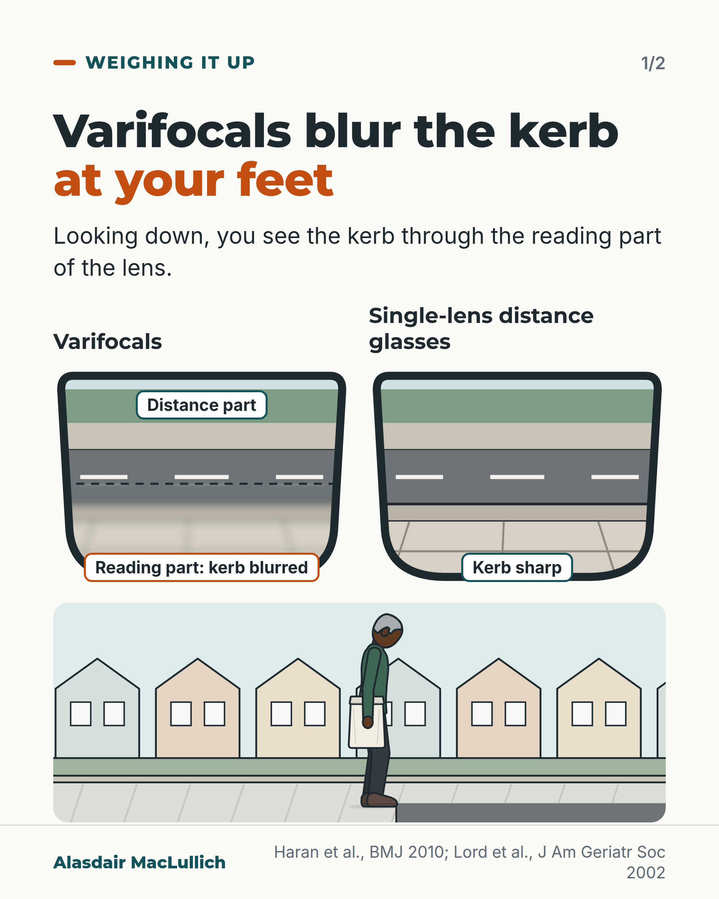
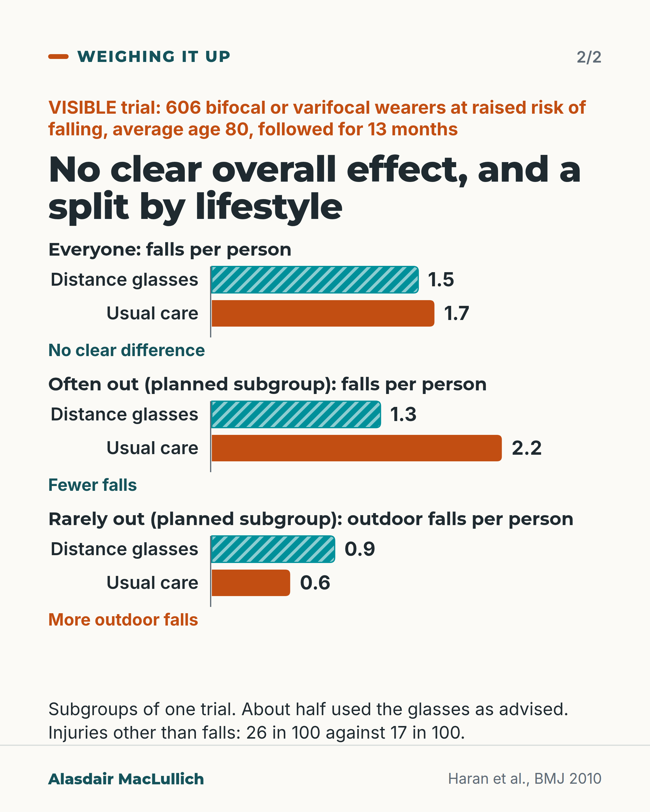

# G002: Varifocals and the kerb

- Category: C01 Falls and fear of falling
- Audience: both
- Series: Weighing it up
- Post type: decision_support
- Visual format: carousel (drawn illustration + comparison chart)
- Status: text text_final, visual final
- Working id: C01-P02 (candidate C01-23)

## Insight

The reading part of bifocals and varifocals blurs the kerb at your feet. In a trial, separate distance glasses for walking outside did not clearly reduce falls overall; in planned subgroups they reduced falls in people who went out a lot and increased outdoor falls in people who rarely went out.

## Angle and position

Weighing a sensible-sounding change honestly: the overall result first, then both planned subgroups, then the costs. Position: if you wear varifocals and are often out and about, a separate pair of distance glasses for walking outside is worth discussing with your optometrist; it is not a change for everyone.

Basis: mixed: the lens effect, the trial results and the guideline statement are empirical findings; the advice to discuss distance glasses with an optometrist follows the trial authors' suggestion and the World Falls Guidelines; 'not for everyone' is clinical interpretation of the subgroup results.

## X (1162 characters)

```text
Look down at a kerb through bifocals or varifocals and you are looking through the lower, reading part of the lens. That part blurs things at walking distance.

The VISIBLE trial in Australia included 606 people who wore bifocals or varifocals outdoors and were at raised risk of falling (average age 80). It randomly gave them either separate distance glasses for walking outside or usual care.

Over 13 months it did not show a clear difference in falls overall. There were about 1.5 falls per person with distance glasses and 1.7 with usual care. That gap could have been chance.

A comparison planned before the trial split people by how often they went out. Those often out fell less with distance glasses (about 1.3 falls per person against 2.2). Those rarely out had more falls outside the home (about 0.9 against 0.6). These are subgroups of one trial.

Only about half used the new glasses as advised. More had injuries other than falls (26 in 100 against 17), mostly minor.

If you wear varifocals and are out and about a lot, ask your optometrist about distance glasses for walking. If you rarely go out, the researchers suggest staying with one pair.
```

## LinkedIn (1915 characters)

```text
Look down at a kerb through bifocals or varifocals and you are looking through the lower, reading part of the lens. That part blurs things at walking distance. In laboratory tests, older people who wore these glasses judged depth and saw edges less well through that part of the lens.

A separate pair of distance glasses for walking outside sounds like an easy way to prevent falls. The VISIBLE trial in Australia tested it in 606 people with an average age of 80. All wore multifocals outdoors and were at raised risk of falling. Half were given single-lens distance glasses and advice; half had usual care.

Overall, the trial did not show a clear difference. Over 13 months there were about 1.5 falls per person with distance glasses and 1.7 with usual care. That gap could have been chance.

Before the trial, the researchers had planned to compare people by how much they went out.

1. People who went out a lot had fewer falls with distance glasses: about 1.3 per person over 13 months, against 2.2 with usual care. Outdoor falls and falls causing injury were also lower.
2. People who rarely went out had more falls outside the home with distance glasses: about 0.9 per person, against 0.6.

These are subgroups of one trial, not a settled answer. Only about half of those given distance glasses used them as advised for 7 months or more. More of them had injuries other than falls (26 in 100, against 17 in 100), mostly minor.

For active older people, the 2022 World Falls Guidelines list avoiding multifocals outdoors as one way to help prevent falls. They also say a falls assessment should check how multifocals are used.

If you wear varifocals and are often out and about, ask your optometrist about separate distance glasses for walking. If you rarely go out, the trial's authors suggest staying with one pair. This is a change for some people, and the trial gives no reason to make it for everyone.
```

## Bluesky (299 characters)

```text
Varifocals blur the kerb at your feet. In a trial of 606 people, distance glasses for walking outside did not clearly cut falls overall.

In that one trial, people who went out a lot fell less with them. People who rarely went out fell more often outdoors. If you go out a lot, ask your optometrist.
```

## Threads (497 characters)

```text
Varifocals blur the kerb at your feet: looking down, you see it through the reading part of the lens.

In a trial of 606 people at raised risk of falling, distance glasses for walking outside did not clearly cut falls overall.

In a planned comparison within this one trial, people who went out a lot fell less with them. People who rarely went out fell more often outdoors.

If you go out a lot, ask your optometrist about distance glasses. If you rarely go out, the researchers suggest one pair.
```

## Source reply

Sources: https://doi.org/10.1136/bmj.c2265 (VISIBLE trial, BMJ 2010) https://doi.org/10.1093/ageing/afac205 (World Falls Guidelines 2022)

## Visual



Alt text: Two views of a street through glasses. Through varifocals, the far road is sharp in the upper distance part, but the kerb at your feet is blurred in the lower reading part. Through single-lens distance glasses the kerb is sharp. Below, an older Black man in a green jacket, carrying a bag, pauses at the kerb and looks down.



Alt text: Bar chart, VISIBLE trial, 606 people, average age 80, 13 months. Everyone: 1.5 falls per person with distance glasses, 1.7 with usual care, no clear difference. Planned subgroup often out: 1.3 against 2.2, fewer falls. Rarely out: outdoor falls 0.9 against 0.6, more. Subgroups of one trial; about half used the glasses as advised; non-fall injuries 26 against 17 in 100.

Editable source: `visuals/src/G002.html`

Design instructions: Two 4:5 light cards. Card 1: h1.m headline with orange em, body line, two SVG lens views (same street: hedge, far pavement, road, kerb, near slabs); varifocal lens has lower zone Gaussian-blurred below a dashed line, single-lens all sharp; HTML pill labels (teal border, orange for blurred). Kit street band: older Black man (dark skin, grey cropped hair, green long-sleeved jacket, charcoal trousers, bag) standing at kerb edge, head tilted down. Card 2: three chart.js barChart groups on common 0 to 2.5 scale, labelled bars; distance glasses = teal #00909A with white diagonal hatch, usual care = orange solid; verdict under each pair. Data: C01-23-c (1.54 vs 1.66), C01-23-d (1.26 vs 2.16), C01-23-e (0.92 vs 0.59), C01-23-f (26 vs 17 in 100, 54% adherence).

## Sources and verification

- C01-23-a (supported): Looking down at a kerb or step through bifocals or varifocals means looking through the lower (reading) part of the lens, which blurs objects at that distance and impairs depth and edge perception.
  - Source: Haran MJ, Cameron ID, Ivers RQ, Simpson JM, Lee BB, Tanzer M, Porwal M, Kwan MM, Severino C, Lord SR. Effect on falls of providing single lens distance vision glasses to multifocal glasses wearers: VISIBLE randomised controlled trial. BMJ. 2010;340:c2265.; Lord SR, Dayhew J, Howland A. Multifocal glasses impair edge-contrast sensitivity and depth perception and increase the risk of falls in older people. J Am Geriatr Soc. 2002;50(11):1760-6.
  - Passage: "VISIBLE (Introduction): "The lower lenses of all types of multifocal glasses blur distant objects in the lower visual field, and this factor in particular may represent an important problem for older people." Lord 2002 (Abstract): "Eighty-seven subjects (55.8%) were regular wearers of multifocal (bifocal, trifocal, or progressive lens) glasses. These subjects performed significantly worse in the distant depth perception and distant edge-contrast sensitivity tests in conditions that forced them to view test stimuli through the lower segments of their glasses."" (Haran 2010 Introduction (full text); Lord 2002 Abstract, Results)
- C01-23-c (supported): In the VISIBLE trial, giving regular multifocal wearers single-lens distance glasses for walking outdoors did not clearly reduce falls overall.
  - Source: Haran MJ, Cameron ID, Ivers RQ, Simpson JM, Lee BB, Tanzer M, Porwal M, Kwan MM, Severino C, Lord SR. Effect on falls of providing single lens distance vision glasses to multifocal glasses wearers: VISIBLE randomised controlled trial. BMJ. 2010;340:c2265.
  - Passage: "Abstract: "606 regular wearers of multifocal glasses (mean age 80 (SD 7) years). Inclusion criteria included increased risk of falls (fall in previous year or timed up and go test >15 seconds) and outdoor use of multifocal glasses at least three times a week." ... "In the 299 intervention and 298 control participants available to follow-up, the intervention resulted in an 8% reduction in falls (incidence rate ratio 0.92, 95% confidence interval 0.73 to 1.16)." Results: "In the 597 participants who completed calendars, fall rates did not differ significantly between the groups." Table 2, All falls, Overall: intervention 299, fallers 170 (57), total falls 461, rate 1.54; control 298, fallers 175 (59), total falls 496, rate 1.66; IRR 0.92 (0.73 to 1.16)." (Abstract; Results (Effect of intervention on falls); Table 2)
- C01-23-d (supported_with_qualification): In a pre-planned subgroup of people who regularly took part in outdoor activities, distance glasses reduced falls, outdoor falls and injurious falls.
  - Source: Haran MJ, Cameron ID, Ivers RQ, Simpson JM, Lee BB, Tanzer M, Porwal M, Kwan MM, Severino C, Lord SR. Effect on falls of providing single lens distance vision glasses to multifocal glasses wearers: VISIBLE randomised controlled trial. BMJ. 2010;340:c2265.
  - Passage: "Abstract: "Pre-planned sub-group analyses showed that the intervention was effective in significantly reducing all falls (incidence rate ratio 0.60, 0.42 to 0.87), outside falls, and injurious falls in people who regularly took part in outside activities." Results: "Significant interactions were evident between the intervention and self reported baseline outdoor activity levels (assessed with the Adelaide activities profile) for the outcomes of all falls, falls outside the home, and injurious falls (P<0.001)." Table 2, All falls, High AAP level: intervention 148, fallers 77 (52), total falls 187, rate 1.26; control 113, fallers 68 (60), total falls 244, rate 2.16; IRR 0.60 (0.42 to 0.87)." (Abstract; Methods (Statistical analysis: three pre-planned subgroup analyses); Results; Table 2)
- C01-23-e (supported): In people who took part in little outdoor activity, distance glasses increased falls outside the home.
  - Source: Haran MJ, Cameron ID, Ivers RQ, Simpson JM, Lee BB, Tanzer M, Porwal M, Kwan MM, Severino C, Lord SR. Effect on falls of providing single lens distance vision glasses to multifocal glasses wearers: VISIBLE randomised controlled trial. BMJ. 2010;340:c2265.
  - Passage: "Abstract: "A significant increase in outside falls occurred in people in the intervention group who took part in little outside activity." Results: "In contrast, in those who had Adelaide activities profile outdoor subtotal scores less than or equal to the median, intervention group participants had a non-significant increase in all falls and injurious falls and a significant increase in falls outside the home; the number needed to harm was 4.5." Table 2, Outside falls, Low AAP level: intervention 151, fallers 77 (51), falls 102, rate 0.92; control 185, fallers 66 (36), falls 76, rate 0.59; IRR 1.56 (1.11 to 2.19). All falls, Low AAP level: rate 1.81 vs 1.36; IRR 1.29 (0.95 to 1.75). Conclusions: "The intervention may be harmful, however, in multifocal glasses wearers with low levels of outdoor activity."" (Abstract; Results; Table 2; Conclusions)
- C01-23-f (supported): Only about half of those given distance glasses used them as advised for most of the year, and non-fall injuries were more common in the intervention group.
  - Source: Haran MJ, Cameron ID, Ivers RQ, Simpson JM, Lee BB, Tanzer M, Porwal M, Kwan MM, Severino C, Lord SR. Effect on falls of providing single lens distance vision glasses to multifocal glasses wearers: VISIBLE randomised controlled trial. BMJ. 2010;340:c2265.
  - Passage: "Abstract: "162 (54%) of the intervention group reported satisfactory use of distance glasses for walking and outdoor activities for at least 7/12 months after dispensing." Adverse events: "Seventy-seven (26%) intervention participants had one or more non-fall injuries (laceration, lifting or twisting injury, burn/scald, eye injury, collision, pedestrian injuries) compared with 51 (17%) controls (χ=6.61,df=1, P=0.01)." Discussion: "Intervention group participants were more likely to have non-fall injuries. However, these injuries were generally minor and not related to increased healthcare use."" (Abstract; Results (Adverse events); Discussion)
- C01-23-g (supported): The World Falls Guidelines 2022 support active older people avoiding multifocal glasses outdoors, and include checking multifocal use in a falls assessment.
  - Source: Montero-Odasso M, van der Velde N, Martin FC, Petrovic M, Tan MP, Ryg J, et al; Task Force on Global Guidelines for Falls in Older Adults. World guidelines for falls prevention and management for older adults: a global initiative. Age Ageing. 2022;51(9):afac205.
  - Passage: "Vision interventions: "Evidence from randomised controlled trials and prospective studies indicates cataract surgery for the first eye, [] and both eyes [] and achieving optimal safe functional vision by active older adults avoiding the wearing of multifocal glasses when outside [] are effective fall prevention strategies." ... "In fact, it is recommended that optometrists counsel their clients about likely short-term increased fall risk when dispensing new prescription glasses." Assessment table: "Objective assessment of visual problems and acuity and appropriate use of glasses (including check multi−/bifocal glasses)If indicated, refer to ophthalmologist or optometrist"" (Full text, Vision interventions (Recommendation details and justification); multifactorial assessment table (Sensory function))
- C01-23-h (supported): The trial authors recommend separate distance glasses outdoors for people who are often out, and one pair of multifocals for those who rarely go out.
  - Source: Haran MJ, Cameron ID, Ivers RQ, Simpson JM, Lee BB, Tanzer M, Porwal M, Kwan MM, Severino C, Lord SR. Effect on falls of providing single lens distance vision glasses to multifocal glasses wearers: VISIBLE randomised controlled trial. BMJ. 2010;340:c2265.
  - Passage: "Policy and practice implications: "Secondly, older people with considerable correctable distance refractive error who take part in frequent outdoor activities should use single lens distance glasses when outdoors and in other unfamiliar settings." ... "Thirdly, older regular wearers of multifocal glasses with considerable correctable distance refractive error who take part in little outdoor activity should use multifocal glasses for most activities (rather than using multiple pairs of glasses)." Conclusions: "clinicians should be conservative in eyewear prescription, particularly in frail older people who do not often leave their homes."" (Discussion, Policy and practice implications; Conclusions)

Verification notes: C01-23-a (VISIBLE full text; Lord 2002 abstract): lower lens blurs at walking distance; lab depth and edge findings. C01-23-c (VISIBLE full text): 606 randomised, mean age 80, 1.54 against 1.66 falls per person over 13 months, IRR 0.92 (0.73 to 1.16), stated first. C01-23-d: pre-planned subgroup, 1.26 against 2.16 falls per person; outdoor and injurious falls lower; subgroup-of-one-trial caveat carried in every version. C01-23-e: outside falls 0.92 against 0.59 in the low-outdoor group. C01-23-f: 54% satisfactory use for 7 months or more; non-fall injuries 26% against 17%, mostly minor. C01-23-g (World Falls Guidelines full text): active older people avoiding multifocals outside; check multifocal use. C01-23-h: authors' recommendations (not a guideline). Not used: Lord 2002 odds ratio (C01-23-b), the paper's number needed to treat. A published erratum to VISIBLE exists but could not be opened; figures match the abstract and Table 2.

## Attention and follow potential

Pause: A physical experience many varifocal wearers recognise, followed by a result that went two ways.

Gain: A specific conversation to have with the optometrist, and who it probably does not suit.

Follow: Trials read in full, with the subgroup that went the wrong way reported as plainly as the one that went the right way.

## Open issues

- A published erratum to the VISIBLE trial could not be opened (C01-B2); the figures used match the abstract and Table 2. Fact-check C01: the erratum concerns the trial registration number only; trial figures unaffected.
- Visual rendered and read back by the designer; not independently inspected.
