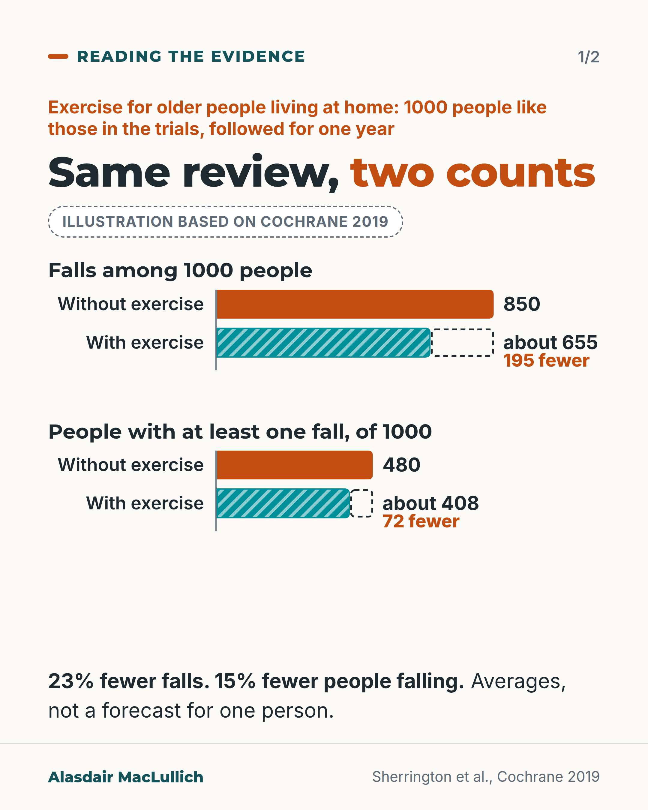
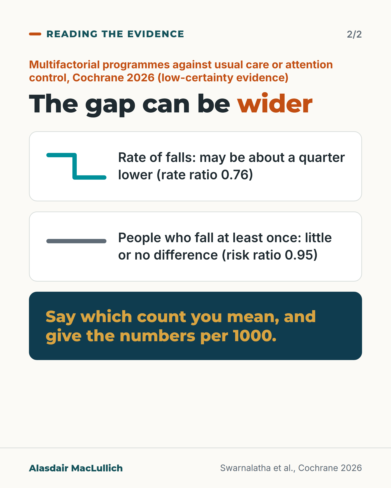

# G003: Fewer falls, or fewer people falling?

- Category: C01 Falls and fear of falling
- Audience: practitioners
- Series: Reading the evidence
- Post type: evidence_interpretation
- Visual format: carousel (bar chart + comparison card)
- Status: text text_final, visual final
- Working id: C01-P03 (candidate C01-02)

## Insight

Falls trials report two counts: the number of falls and the number of people who fell. Exercise cut the first by about a quarter and the second by about a sixth, and some programmes lower the falls rate with little or no change in how many people fall.

## Angle and position

Counting events and counting people answer different questions. Position (judgement): anyone quoting a falls prevention result should say which count it uses and give the absolute numbers per 1000.

Basis: mixed: both results and the per-1000 illustration are empirical findings (Cochrane 2019, Cochrane 2026); the explanation of what each number counts is methodological interpretation; the instruction to name the count is a judgement.

## X (993 characters)

```text
About 195 fewer falls, and about 72 fewer people falling at least once, for every 1000 older people followed for a year: 23% fewer falls, 15% fewer fallers. Both results come from the same 2019 Cochrane review of exercise for older people living at home, and both are high certainty.

They count different things. Without exercise, 1000 people like those in the trials would have about 850 falls in a year, and about 480 of them would fall at least once.

A person who falls three times counts three times in the first figure and once in the second.

The gap can be wider. In the 2026 Cochrane review, programmes of individual falls assessment and matched treatment were compared with usual care or attention control. They may lower the falls rate by about a quarter but may make little or no difference to how many people fall (low-certainty evidence).

When you quote a falls result, say whether it counts falls or people, and give the numbers per 1000. Neither is a forecast for one person.
```

## LinkedIn (2013 characters)

```text
About 195 fewer falls, and about 72 fewer people falling at least once, for every 1000 older people followed for a year: 23% fewer falls (rate ratio 0.77), 15% fewer fallers (risk ratio 0.85). Both results come from the 2019 Cochrane review of exercise for older people living at home, and both are high-certainty evidence from dozens of trials.

So exercise cut falls by about a quarter, but the number of people falling by about a sixth. The two figures count different things. For 1000 people like those in the trials, followed for one year:

1. Falls: about 850 without exercise, and about 195 fewer with it.
2. People who fall at least once: about 480 without exercise, and about 72 fewer with it, so about 408.

Falls repeat. A person who falls three times counts three times in the number of falls and once in the number of people who fell. So a programme can prevent some repeat falls without changing whether a person falls at all.

The gap can be wider. The 2026 Cochrane review of multifactorial programmes (an individual falls assessment followed by treatments matched to each person's risks) compared them with usual care or attention control. The programmes may lower the rate of falls by about a quarter (rate ratio 0.76) but may make little or no difference to the number of people who fall (risk ratio 0.95). That evidence is low certainty. A 2024 review for the US Preventive Services Task Force found the same pattern.

In the exercise review, the two outcomes come from overlapping but not identical sets of trials (59 and 63). The per-1000 figures are averages built from the control groups, not a forecast for one person. The fallers figure is closer to the question a patient asks, which is whether they will fall this year.

Cochrane falls reviews report the rate of falls and the number of people who fall as two separate main outcomes. When we quote a falls result to patients, colleagues or commissioners, we should say which one we mean and give the absolute numbers.

#FallsPrevention
```

## Bluesky (284 characters)

```text
Exercise for older people at home: 23% fewer falls, but 15% fewer people falling (Cochrane 2019). Per 1000 people over a year: 195 fewer falls (from 850), 72 fewer fallers (from 480).

Repeat falls count many times in the first figure. When quoting a result, say which count you mean.
```

## Threads (431 characters)

```text
Per 1000 older people followed for a year, exercise meant about 195 fewer falls (from 850): 23% fewer. It also meant about 72 fewer people falling at all (from 480): 15% fewer. Both figures come from the 2019 Cochrane review of exercise for older people living at home.

Someone who falls three times counts three times in the first number, once in the second.

When you quote a falls result, say whether it counts falls or people.
```

## Source reply

Sources: https://doi.org/10.1002/14651858.CD012424.pub2 (Cochrane 2019, exercise) https://doi.org/10.1002/14651858.CD012221.pub3 (Cochrane 2026, multifactorial) https://doi.org/10.1001/jama.2024.4166 (USPSTF review 2024)

## Visual



Alt text: Bar chart, illustration based on Cochrane 2019: 1000 older people living at home followed for a year. Falls: 850 without exercise, about 655 with exercise, 195 fewer. People with at least one fall: 480 without exercise, about 408 with exercise, 72 fewer. 23% fewer falls, 15% fewer people falling. Averages, not a forecast for one person.



Alt text: Card: the gap can be wider. Cochrane 2026, multifactorial programmes against usual care or attention control, low-certainty evidence. Rate of falls, shown by a line stepping down: may be about a quarter lower (rate ratio 0.76). People who fall at least once, shown by a level line: little or no difference (risk ratio 0.95). Say which count you mean and give numbers per 1000.

Editable source: `visuals/src/G003.html`

Design instructions: Two 4:5 light cards. Card 1: orange kicker, h1.m with orange em, dashed Illustrative badge; two chart.js horizontal barChart pairs on a common 0 to 900 scale; without exercise = orange solid, with exercise = teal #00909A with white diagonal hatch; dashed outline ghost segment shows the removed falls, value then orange 'N fewer' label at its end. Data C01-02-b (850, 195; 480, 72; 655 and 408 by subtraction), C01-02-a (23%, 15%). Card 2: two white panels, each with a schematic line glyph (teal step down; grey level line) and statement; deep teal CTA panel with gold Montserrat text. Data C01-02-d (RaR 0.76, RR 0.95).

## Sources and verification

- C01-02-a (supported): In the 2019 Cochrane review of exercise for community-dwelling older people, exercise reduced the rate of falls by 23% and the number of people having one or more falls by 15%.
  - Source: Sherrington C, Fairhall NJ, Wallbank GK, Tiedemann A, Michaleff ZA, Howard K, Clemson L, Hopewell S, Lamb SE. Exercise for preventing falls in older people living in the community. Cochrane Database Syst Rev. 2019;1(1):CD012424.
  - Passage: ""Exercise reduces the rate of falls by 23% (rate ratio (RaR) 0.77, 95% confidence interval (CI) 0.71 to 0.83; 12,981 participants, 59 studies; high-certainty evidence)." ... "Exercise also reduces the number of people experiencing one or more falls by 15% (risk ratio (RR) 0.85, 95% CI 0.81 to 0.89; 13,518 participants, 63 studies; high-certainty evidence)." Plain language summary: "Exercise reduces the number of falls over time by around one‐quarter (23% reduction)." ... "Exercise also reduces the number of people experiencing one or more falls (number of fallers) by around one‐sixth (15%) compared with control."" (Abstract, Main results (Exercise (all types) versus control); Plain language summary)
- C01-02-b (supported_with_qualification): The review's absolute illustration: 850 falls per 1000 people followed for a year becomes about 195 fewer falls with exercise; 480 fallers per 1000 people becomes about 72 fewer fallers.
  - Source: Sherrington C, Fairhall NJ, Wallbank GK, Tiedemann A, Michaleff ZA, Howard K, Clemson L, Hopewell S, Lamb SE. Exercise for preventing falls in older people living in the community. Cochrane Database Syst Rev. 2019;1(1):CD012424.
  - Passage: ""Based on an illustrative risk of 850 falls in 1000 people followed over one year (data based on control group risk data from the 59 studies), this equates to 195 (95% CI 144 to 246) fewer falls in the exercise group." ... "Based on an illustrative risk of 480 fallers in 1000 people followed over one year (data based on control group risk data from the 63 studies), this equates to 72 (95% CI 52 to 91) fewer fallers in the exercise group."" (Abstract, Main results)
- C01-02-c (supported_with_qualification): Falls are recurrent events: some people fall more than once, so a count of falls and a count of people who fell measure different things.
  - Source: Robertson MC, Campbell AJ, Herbison P. Statistical analysis of efficacy in falls prevention trials. J Gerontol A Biol Sci Med Sci. 2005;60(4):530-4.; Sherrington C, Fairhall NJ, Wallbank GK, Tiedemann A, Michaleff ZA, Howard K, Clemson L, Hopewell S, Lamb SE. Exercise for preventing falls in older people living in the community. Cochrane Database Syst Rev. 2019;1(1):CD012424.; Fleming J, Brayne C. Inability to get up after falling, subsequent time on floor, and summoning help: prospective cohort study in people over 90. BMJ. 2008;337:a2227.
  - Passage: "Robertson 2005: "These techniques a) allow for the fact that falls are frequent, recurrent events with a non-normal distribution; b) adjust for the follow-up time of individual participants; and c) allow the addition of covariates." Fleming 2008 (Results): "There were 265 reported falls in total as most people fell at least twice." Cochrane 2019: "850 falls in 1000 people" versus "480 fallers in 1000 people followed over one year"." (Robertson 2005 Abstract; Fleming 2008 Results (Falling in different residential settings); Cochrane 2019 Abstract)
- C01-02-d (supported_with_qualification): Some falls interventions reduce the rate of falls without clearly reducing the number of people who fall; the 2026 Cochrane review of multifactorial interventions is the clearest example.
  - Source: Swarnalatha C, Wood L, Newell P, Clark CE, Adedire O, Clemson L, Sherrington C, Lamb SE. Multifactorial and multiple component interventions for preventing falls in older people living in the community. Cochrane Database Syst Rev. 2026;9(9):CD012221.; Guirguis-Blake JM, Perdue LA, Coppola EL, Bean SI. Interventions to prevent falls in older adults: updated evidence report and systematic review for the US Preventive Services Task Force. JAMA. 2024;332(1):58-69.
  - Passage: "Swarnalatha 2026: "Multifactorial interventions may reduce falls rate (RaR 0.76, 95% CI 0.67 to 0.87; I² = 92%; 29 trials, 9442 participants; low-certainty evidence) and the risk of recurrent falls (RR 0.87, 95% CI 0.78 to 0.98; I² = 45%; 17 trials, 4826 participants; low-certainty evidence). They may have little or no effect on the risk of falling (RR 0.95, 95% CI 0.90 to 1.01; I² = 55%; 38 trials, 12,774 participants; low-certainty evidence)." Guirguis-Blake 2024: "Multifactorial interventions were associated with a statistically significant reduction in falls (incidence rate ratio [IRR], 0.84 [95% CI, 0.74-0.95]) but not a statistically significant reduction in individual risk of 1 or more falls (relative risk [RR], 0.96 [95% CI, 0.91-1.02])"" (Swarnalatha 2026 Abstract, Main results; Guirguis-Blake 2024 Abstract, Results)
- C01-02-f (supported): Major falls reviews report the rate of falls and the number of people who fall as separate critical outcomes.
  - Source: Swarnalatha C, Wood L, Newell P, Clark CE, Adedire O, Clemson L, Sherrington C, Lamb SE. Multifactorial and multiple component interventions for preventing falls in older people living in the community. Cochrane Database Syst Rev. 2026;9(9):CD012221.; McLennan C, Dyer SM, Kwok WS, Suen J, Marin TS, Haley M, Murray GR, Sutcliffe K, Kneale D, Sherrington C, Cameron ID. Interventions for preventing falls in older people in hospitals. Cochrane Database Syst Rev. 2026;5(5):CD016065.
  - Passage: "Swarnalatha 2026: "Our critical outcomes were falls rate (falls per person-year), risk of falling (number of people sustaining one or more falls), and risk of recurrent falls (number of people sustaining two or more falls)." McLennan 2026: "Critical outcomes were rate of falls (number of falls per unit time) and risk of falling (number of fallers)."" (Abstracts, Methods)

Verification notes: C01-02-a (Cochrane 2019 abstract): RaR 0.77 and RR 0.85, high certainty, 59 and 63 studies. C01-02-b (abstract): 850 falls and 480 fallers per 1000 people followed for one year; 195 and 72 fewer; the denominator is '1000 people followed over one year'; 408 and 655 are subtraction (655 is 850 minus 195, the same operation the evidence file records for 408); labelled as an illustration and as averages, not a prediction for one person. C01-02-c (Robertson 2005 abstract; Cochrane): explanation limited to what each number counts; no claim that a minority has most falls. C01-02-d (Cochrane 2026 abstract; USPSTF 2024 abstract): multifactorial RaR 0.76, RR 0.95, low certainty, 'may' wording kept. C01-02-f: Cochrane reports both as separate main outcomes; ProFaNE not cited. Summary of findings table not opened; figures from the abstract.

## Attention and follow potential

Pause: Practitioners who quote 'exercise cuts falls by about a quarter' meet the second, smaller figure from the same review.

Gain: A habit for reading and quoting any falls result accurately, with absolute numbers.

Follow: The account explains how to read the evidence, not only what it says.

## Open issues

- The 'about 655' bar is derived (850 minus 195) from the review's absolute figures; C01-02-b records the parallel derivation of 408 but not 655 explicitly. Non-blocking for the text: 655 appears only on the visual and in its alt text, and is 850 minus 195, both figures from the review abstract (C01-02-b).
- Visual rendered and read back by the designer; not independently inspected.
