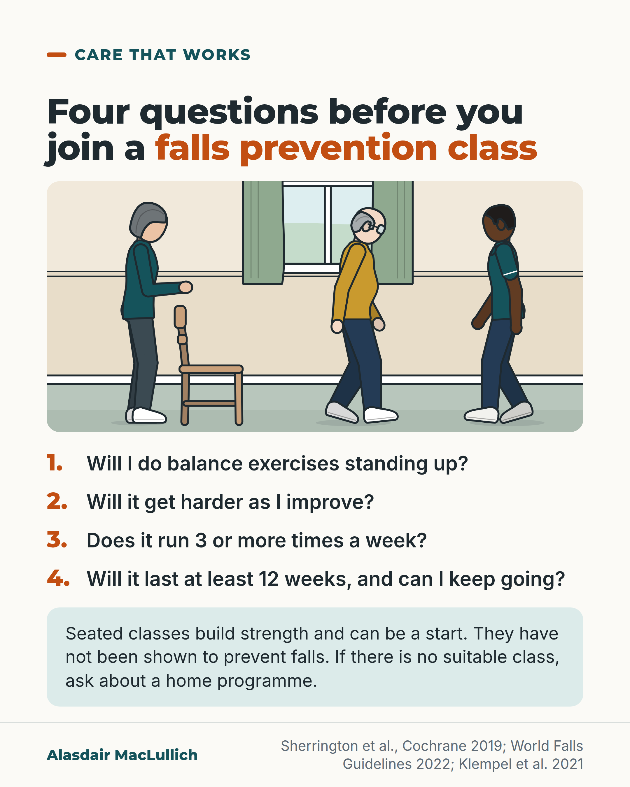

# G004: Is it the right kind of class?

- Category: C01 Falls and fear of falling
- Audience: public
- Series: Care that works
- Post type: decision_support
- Visual format: question card with drawn illustration
- Status: text text_final, visual final
- Working id: C01-P04 (candidate C01-25)

## Insight

Exercise that prevents falls challenges your balance while standing, gets harder as you improve, runs three or more times a week and lasts for months. A seated class builds strength and can be a start, but it has not been shown to prevent falls.

## Angle and position

What makes a falls prevention class work, turned into questions an older person can ask before joining. Position: choose a class that includes standing balance work, gets progressively harder and runs often for months; if none exists, ask about a home programme.

Basis: mixed: exercise types, balance definition, frequency, duration, seated-class evidence and the Otago result are empirical findings and guideline recommendations; turning them into questions to ask is clinical interpretation.

## X (924 characters)

```text
Before you join an exercise class to prevent falls, ask whether it includes balance exercises done standing up.

The 2019 Cochrane review combined results from many exercise trials in older people living at home. Programmes built mainly on balance and everyday movements, such as standing up from a chair and stepping, cut falls by about a quarter. For classes that are mainly walking, dancing or strength training, the effect on falls is uncertain.

Ask too whether it gets harder as you improve. Does it run three or more times a week? Does it last at least 12 weeks, with a way to keep going? The benefits are lost when people stop.

Seated classes build arm and leg strength, and can be a good start if you can't yet stand for long. They have not been shown to prevent falls.

If there is no suitable class near you, ask about a home programme. In trials, the Otago home programme cut the rate of falls by about a third.
```

## LinkedIn (2082 characters)

```text
Before you join an exercise class to prevent falls, ask whether it includes balance exercises done standing up.

The 2019 Cochrane review combined results from many exercise trials in older people living at home. Programmes built mainly on balance and everyday movements, such as standing up from a chair and stepping, cut falls by about a quarter. Programmes that mix balance with strength work probably help too. For classes that are mainly walking, dancing or strength training, the effect on falls is uncertain. That gap in the evidence does not mean these classes fail to help.

In the trials, the most challenging balance exercises were done standing. People stood with feet closer together or on one leg, used their hands less for support, and practised controlled shifts of body weight.

Ask the person running the class:

1. Will I do balance exercises standing up?
2. Will it get harder as I improve?
3. Does it run three or more times a week? The World Falls Guidelines advise 3 or more sessions a week, and the World Health Organization 3 or more days.
4. Will it last at least 12 weeks, and can I keep going afterwards? The benefits are lost when people stop.

Across trials, programmes that challenged balance and added up to 3 hours or more a week had the biggest effects. That comes from comparing different trials, so treat 3 hours as a guide rather than a rule.

Seated classes have real benefits: a 2021 review of 25 studies found they improved arm and leg strength. They did not clearly improve balance or walking, and the review did not report on falls. A seated class can be a good start if you can't yet stand for long.

If you are frail or have fallen before, the guidelines recommend more supervision or smaller groups. If there is no suitable class near you, ask about a home programme. In a review of 7 trials, the Otago home programme cut the rate of falls by about a third. Of those still in the studies after a year, only about 37 in 100 were still exercising three times a week, so ask what support is offered to help you keep going.

#FallsPrevention
```

## Bluesky (281 characters)

```text
Before joining a falls prevention class, ask: will I do balance exercises standing up? Will it get harder? Is it 3 or more times a week, for at least 12 weeks?

Seated classes build strength but have not been shown to prevent falls. If there's no class, ask about a home programme.
```

## Threads (407 characters)

```text
If you're choosing a class to prevent falls, ask four things. Will I do balance exercises standing up? Will it get harder as I improve? Does it run 3 or more times a week? Will it last at least 12 weeks, with a way to keep going?

Seated classes build strength and can be a start, but they have not been shown to prevent falls.

If there's no suitable class nearby, ask about a home programme such as Otago.
```

## Source reply

Sources: https://doi.org/10.1002/14651858.CD012424.pub2 (Cochrane 2019) https://doi.org/10.1093/ageing/afac205 (World Falls Guidelines 2022) https://doi.org/10.3390/ijerph18041902 (seated exercise review) https://doi.org/10.1093/ageing/afq102 (Otago review)

## Visual



Alt text: Drawing of a balance class: an older woman stands with a hand just above a chair back, an older man in glasses practises stepping, a physiotherapist demonstrates. Four questions before joining: balance exercises standing up? Harder as I improve? 3 or more times a week? At least 12 weeks, and can I keep going? Seated classes have not been shown to prevent falls; ask about a home programme.

Editable source: `visuals/src/G004.html`

Design instructions: Single 4:5 light card. h1.s headline with orange em. Full-width kit scene (care_home_lounge, window with sage curtains): older woman (fair skin, dark grey bob, teal top, white trainers) standing behind a wooden chair, near hand hovering above the chair back; older broad white man with glasses (mustard top) stepping; physio role, Black man, walking in from right facing left. Numbered questions with orange Montserrat numerals, 34px. Mint caveat panel. Claims C01-25-a to h (no chart data).

## Sources and verification

- C01-25-a (supported): Exercise programmes built mainly on balance and functional exercises reduce falls; programmes that are mainly strength training, dance or walking have uncertain effects.
  - Source: Sherrington C, Fairhall NJ, Wallbank GK, Tiedemann A, Michaleff ZA, Howard K, Clemson L, Hopewell S, Lamb SE. Exercise for preventing falls in older people living in the community. Cochrane Database Syst Rev. 2019;1(1):CD012424.
  - Passage: ""Compared with control, balance and functional exercises reduce the rate of falls by 24% (RaR 0.76, 95% CI 0.70 to 0.81; 7920 participants, 39 studies; high-certainty evidence) and the number of people experiencing one or more falls by 13% (RR 0.87, 95% CI 0.82 to 0.91; 8288 participants, 37 studies; high-certainty evidence). Multiple types of exercise (most commonly balance and functional exercises plus resistance exercises) probably reduce the rate of falls by 34% (RaR 0.66, 95% CI 0.50 to 0.88; 1374 participants, 11 studies; moderate-certainty evidence)" ... "Tai Chi may reduce the rate of falls by 19% (RaR 0.81, 95% CI 0.67 to 0.99; 2655 participants, 7 studies; low-certainty evidence)" ... "We are uncertain of the effects of programmes that are primarily resistance training, or dance or walking programmes on the rate of falls and the number of people who experience falls."" (Abstract, Main results (Different exercise types versus control))
- C01-25-b (supported): The balance exercises that prevented falls best were challenging exercises done standing.
  - Source: Sherrington C, Whitney JC, Lord SR, Herbert RD, Cumming RG, Close JCT. Effective exercise for the prevention of falls: a systematic review and meta-analysis. J Am Geriatr Soc. 2008;56(12):2234-43.
  - Passage: ""The greatest relative effects of exercise on fall rates (RR=0.58, 95% CI=0.48-0.69, 68% of between-study variability explained) were seen in programs that included a combination of a higher total dose of exercise (>50 hours over the trial period) and challenging balance exercises (exercises conducted while standing in which people aimed to stand with their feet closer together or on one leg, minimize use of their hands to assist, and practice controlled movements of the center of mass) and did not include a walking program."" (Abstract, Results)
- C01-25-c (supported_with_qualification): Programmes that challenged balance and involved more than about 3 hours a week had larger effects (between-trial comparison).
  - Source: Sherrington C, Michaleff ZA, Fairhall N, Paul SS, Tiedemann A, Whitney J, Cumming RG, Herbert RD, Close JCT, Lord SR. Exercise to prevent falls in older adults: an updated systematic review and meta-analysis. Br J Sports Med. 2017;51(24):1750-1758.; Sherrington C, Fairhall N, Kwok W, Wallbank G, Tiedemann A, Michaleff ZA, Ng CACM, Bauman A. Evidence on physical activity and falls prevention for people aged 65+ years: systematic review to inform the WHO guidelines on physical activity and sedentary behaviour. Int J Behav Nutr Phys Act. 2020;17(1):144.
  - Passage: "Sherrington 2017: "Overall, exercise reduced the rate of falls in community-dwelling older people by 21% (pooled rate ratio 0.79, 95% CI 0.73 to 0.85, p<0.001, I47%, 69 comparisons) with greater effects seen from exercise programmes that challenged balance and involved more than 3 hours/week of exercise. These variables explained 76% of the between-trial heterogeneity and in combination led to a 39% reduction in falls (incident rate ratio 0.61, 95% CI 0.53 to 0.72, p<0.001)." Sherrington 2020: "Interventions with a total weekly dose of 3+ h that included balance and functional exercises were particularly effective with a 42% reduction in rate of falls compared to control (Incidence Rate Ratio (IRR) 0.58, 95% CI 0.45 to 0.76)."" (Sherrington 2017 Abstract; Sherrington 2020 Abstract)
- C01-25-d (supported): The World Falls Guidelines recommend balance-challenging and functional exercise, three or more times a week, individualised and progressed for at least 12 weeks and continued longer; benefits are lost when people stop.
  - Source: Montero-Odasso M, van der Velde N, Martin FC, Petrovic M, Tan MP, Ryg J, et al; Task Force on Global Guidelines for Falls in Older Adults. World guidelines for falls prevention and management for older adults: a global initiative. Age Ageing. 2022;51(9):afac205.
  - Passage: ""We recommend exercise programmes for fall prevention for community-dwelling older adults which include balance challenging and functional exercises (e.g. sit-to-stand, stepping), with sessions three times or more weekly which are individualised, progressed in intensity for at least 12 weeks and continued longer for greater effect." (1A) "We recommend inclusion, when feasible, of Tai Chi and/or additional individualised progressive resistance strength training." (1B) "Exercise needs to be progressive initially and maintained once a plateau is reached." "Benefits of exercise are lost on cessation so opportunities to continue with appropriate activity at the end of the programme are important."" (Full text, WG4 Exercise interventions table; Component interventions, Exercise and physical activity interventions)
- C01-25-e (supported): WHO 2020 guidelines advise older adults to do varied multicomponent activity emphasising balance and strength on 3 or more days a week to prevent falls (replaces the UK CMO claim, which could not be opened).
  - Source: Bull FC, Al-Ansari SS, Biddle S, Borodulin K, Buman MP, Cardon G, et al. World Health Organization 2020 guidelines on physical activity and sedentary behaviour. Br J Sports Med. 2020;54(24):1451-1462.
  - Passage: ""As such it is recommended that as part of their weekly physical activity, older adults should do varied multicomponent physical activity at moderate or greater intensity on 3 or more days a week in order to enhance functional capacity and prevent falls." ... "Third, with respect to older adults, the recommendation regarding multicomponent physical activity that emphasises functional balance and strength training to enhance functional capacity and prevent falls now applies to all older adults rather than specifically those with poor mobility."" (Full text, Older adults section; Discussion (differences from 2010 guidelines))
- C01-25-f (supported_with_qualification): Seated (chair-based) exercise has other benefits but has not been tested well as a way to prevent falls, and did not clearly improve balance.
  - Source: Klempel N, Blackburn NE, McMullan IL, Wilson JJ, Smith L, Cunningham C, O'Sullivan R, Caserotti P, Tully MA. The effect of chair-based exercise on physical function in older adults: a systematic review and meta-analysis. Int J Environ Res Public Health. 2021;18(4):1902.; Anthony K, Robinson K, Logan P, Gordon AL, Harwood RH, Masud T. Chair-based exercises for frail older people: a systematic review. Biomed Res Int. 2013;2013:309506.
  - Passage: "Klempel 2021 (Abstract): "In this systematic review including 1388 participants, results demonstrated that chair-based exercise programmes improve upper extremity (handgrip strength: MD = 2.10; 95% CI = 0.76, 3.43 and 30 s arm curl test: MD = 2.82; 95% CI = 1.34, 4.31) and lower extremity function (30 s chair stand: MD 2.25; 95% CI = 0.64, 3.86)." Results: "No significant differences between groups were observed in the Berg balance scale, timed up and go test or gait speed between the intervention and control groups." Discussion: "The findings of a lack of effect on balance are in keeping with a previous review of chair-based exercise []." Anthony 2013: "The quality of the evidence base for CBEs is low with inconclusive findings to clearly inform practice."" (Klempel 2021 Abstract, Results 3.5, Discussion; Anthony 2013 Abstract)
- C01-25-g (supported): For people who are frail or at higher risk, guidelines recommend more supervision or smaller groups, and exercise adapted to their abilities.
  - Source: Montero-Odasso M, van der Velde N, Martin FC, Petrovic M, Tan MP, Ryg J, et al; Task Force on Global Guidelines for Falls in Older Adults. World guidelines for falls prevention and management for older adults: a global initiative. Age Ageing. 2022;51(9):afac205.
  - Passage: ""Exercise programmes that need to be of sufficient intensity and duration should be delivered in a way that ensures safety and considers functional abilities." ... "Higher supervision levels or smaller group numbers are recommended for those at higher risk of a fall including those who are frail [,]."" (Full text, Exercise and physical activity interventions (Recommendation details and justification))
- C01-25-h (supported_with_qualification): If no suitable class exists, exercise can be taught as an individual home programme; the Otago home programme reduced falls.
  - Source: Montero-Odasso M, van der Velde N, Martin FC, Petrovic M, Tan MP, Ryg J, et al; Task Force on Global Guidelines for Falls in Older Adults. World guidelines for falls prevention and management for older adults: a global initiative. Age Ageing. 2022;51(9):afac205.; Thomas S, Mackintosh S, Halbert J. Does the 'Otago exercise programme' reduce mortality and falls in older adults?: a systematic review and meta-analysis. Age Ageing. 2010;39(6):681-7.
  - Passage: "WFG: "Exercise programmes can be delivered in a group or taught and supported as an individualised home exercise programme or a mix of both in order to achieve an effective dose [,]." Thomas 2010: "seven trials, involving 1503 participants were included. The mean age of participants was 81.6 (±3.9) years." ... "and significantly reduced fall rates (incidence rate ratio = 0.68, 95% CI = 0.56-0.79)." ... "Of the 747 participants who remained in the studies at 12 months, 274 (36.7%) were still exercising three or more times per week."" (WFG full text, Exercise section; Thomas 2010 Abstract)

Verification notes: C01-25-a (Cochrane 2019 abstract): balance and functional exercise cut falls by about a quarter; multi-type probably; walking, dance, strength alone uncertain, described as a gap, not proof of no effect. C01-25-b (Sherrington 2008 abstract): definition of challenging standing balance exercise. C01-25-c (Sherrington 2017, 2020 abstracts): 3 hours a week is a between-trial finding, presented as a guide. C01-25-d (World Falls Guidelines full text): 3 or more times a week, progressed, at least 12 weeks, continued; benefits lost when people stop. C01-25-e (WHO 2020 full text): 3 or more days a week; UK CMO figure not used. C01-25-f (Klempel 2021 full text; Anthony 2013 abstract): seated exercise improved strength, not clearly balance or walking, the review did not report on falls; framed as a start not shown to prevent falls, not as worthless (wording corrected after fact-check C01). C01-25-g: supervision or smaller groups for frail people. C01-25-h (Otago review abstract): IRR 0.68 across 7 trials, adherence about 37 in 100 at 12 months. The E065 point (balance exercise reduces falls) is used only as the reason for the first question; the post's argument is how to choose a class.

## Attention and follow potential

Pause: Many people assume any exercise class prevents falls; the questions show what to look for.

Gain: Four questions to ask before signing up, and a fallback if no suitable class exists.

Follow: Questions that help people get care that matches the evidence.

## Open issues

- Justified checker hit: 'World Health Organization' in the LinkedIn caption is the organisation's official proper name, flagged as a possible US spelling.
- Visual rendered and read back by the designer; not independently inspected.
