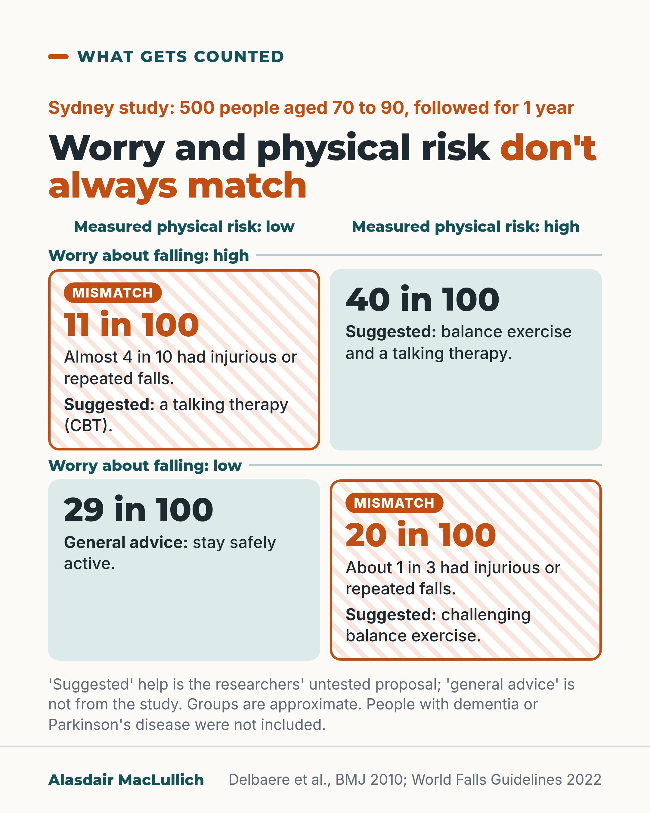

# G005: How worried, and how at risk?

- Category: C01 Falls and fear of falling
- Audience: both
- Series: What gets counted
- Post type: evidence_interpretation
- Visual format: diagram (2 by 2 grid)
- Status: text text_final, visual final
- Working id: C01-P05 (candidate C01-19)

## Insight

How worried someone is about falling and how likely they are to fall often don't match. In one study about 1 in 3 people had a mismatch, and both kinds of mismatch had falls, so a falls check needs to measure worry and physical risk.

## Angle and position

An assessment that measures only one of worry or physical risk misreads a sizeable group. Position: falls assessment should check worry about falling alongside a test of balance or walking, as the World Falls Guidelines advise.

Basis: mixed: the four groups, their sizes and fall rates are empirical findings from one cohort; the matched help per group is the researchers' proposal (labelled as such); measuring both is a guideline recommendation.

## X (887 characters)

```text
In about 1 in 3 older people in a Sydney study, worry about falling did not match their measured physical risk.

The study followed 500 people aged 70 to 90 living at home. Some were very worried despite a low physical risk (11 in 100). Others were unworried despite a high one (20 in 100).

Both mismatched groups had falls. Over the next year, almost 4 in 10 of the very worried, low-risk group had an injurious fall or repeated falls. So did about 1 in 3 of the unworried, high-risk group.

For the worried group, the researchers suggested a talking therapy called cognitive behavioural therapy. For the unworried high-risk group, they suggested challenging balance exercise. That is their proposal from one study, not a tested plan.

A falls check that measures only worry, or only strength and balance, will miss one of these groups. The World Falls Guidelines advise checking both.
```

## LinkedIn (2176 characters)

```text
In about 1 in 3 older people in a Sydney study, worry about falling did not match their measured physical risk.

The study followed 500 people aged 70 to 90 living at home. It measured how worried each person was about falling. It also measured physical risk, from tests of vision, feeling in the legs, leg strength, reaction time and balance. Most people's worry matched their risk.

1. Very worried, low physical risk: 11 in 100. They were more likely to have low mood, a more anxious temperament and slower thinking on a planning test. They were no less active than people with low risk and low worry. Almost 4 in 10 had an injurious fall or repeated falls over the next year.
2. Unworried, high physical risk: 20 in 100. They tended to be younger, stronger, more active and more positive. About 1 in 3 had an injurious fall or repeated falls. That share was lower than in people who were both worried and at high risk. It was higher than in people who were unworried and at low risk. Of the 34 who fell, only 6 became more concerned afterwards.

In this study, worry and physical risk were each linked with injurious or repeated falls, even after allowing for the other. Across other studies, worry predicts falls less consistently.

The researchers suggested matching help to the mismatch. For the very worried at low risk: a talking therapy (cognitive behavioural therapy) to rebuild confidence. For the unworried at high risk: challenging balance exercise. For people who are worried and at high risk: both. That matching is their proposal, not a tested strategy. Guidelines do recommend exercise, cognitive behavioural therapy or occupational therapy to reduce worry about falling.

This was one study, published in 2010, of a fairly healthy group of Australian volunteers. People with dementia or Parkinson's disease were not included. The researchers said their dividing lines were estimates that need checking in other groups.

The World Falls Guidelines advise checking worry about falling alongside a test of balance or walking, so the worry can be read in context. An assessment that measures only one of the two will misread some people. We should measure both.
```

## Bluesky (279 characters)

```text
In a Sydney study of 500 people aged 70 to 90, 11 in 100 were very worried about falling despite a low physical risk. Another 20 in 100 were unworried despite a high one.

Both groups had injurious or repeated falls. One study, but a falls check should measure worry and balance.
```

## Threads (422 characters)

```text
Worry about falling and the physical risk of falling often don't match.

In a Sydney study of 500 people aged 70 to 90, 11 in 100 were very worried despite a low physical risk. Another 20 in 100 were unworried despite a high one. Both groups had injurious or repeated falls over the next year.

It is one study, with approximate groups. The lesson for any falls check still holds: measure worry and balance, not one alone.
```

## Source reply

Sources: https://doi.org/10.1136/bmj.c4165 (Delbaere et al., BMJ 2010) https://doi.org/10.1093/ageing/afac205 (World Falls Guidelines 2022)

## Visual



Alt text: Grid of worry about falling against measured physical risk, Sydney study of 500 people aged 70 to 90 followed for a year. Matched: low risk, low worry 29 in 100; high risk, high worry 40 in 100. Mismatches: low risk, high worry 11 in 100, almost 4 in 10 had injurious or repeated falls; high risk, low worry 20 in 100, about 1 in 3. Suggested help is the researchers' untested proposal.

Editable source: `visuals/src/G005.html`

Design instructions: Single 4:5 light card. Orange kicker, h1.s with orange em. HTML 2 by 2 grid: column headers (physical risk low, high) above, row header bands (worry high on top, low below). Matched cells (top right, bottom left) mint; mismatch cells white with pale orange diagonal hatch, 4px orange border and orange 'Mismatch' tag; big Montserrat share per cell, then short lines. Grey note below. Data C01-19-a (29, 40, 11, 20 in 100), C01-19-c (almost 4 in 10), C01-19-d (about 1 in 3), C01-19-e, C01-19-g.

## Sources and verification

- C01-19-a (supported): In a Sydney cohort of 500 older people living at home, combining concern about falling with measured physical risk gave four groups, and about a third had a mismatch between the two.
  - Source: Delbaere K, Close JC, Brodaty H, Sachdev P, Lord SR. Determinants of disparities between perceived and physiological risk of falling among elderly people: cohort study. BMJ. 2010;341:c4165.
  - Passage: "Methods: "A total of 500 people aged 70–90 years participated in the prospective cohort study with a one year follow-up for falls. They were randomly recruited from a cohort of 1037 men and women living in the community in eastern Sydney and participating in the first stage of the Sydney Memory and Ageing Study (January 2006 to October 2007)." ... "Falls frequency during the one year follow-up was monitored with monthly falls diaries." Results: "Most people had an accurate perception of their fall risk: 144 (29%) comprised a “vigorous” group who had both low physiological and perceived fall risks, and 202 (40%) comprised an “aware” group who had both high physiological and perceived fall risks. About a third of our population, however, had disparities between their perceived and physiological fall risk: 54 (11%) had low physiological fall risk but a high perceived risk and were classified as “anxious,” and 100 (20%) had a high physiological risk but low perceived risk and were classified as “stoic.”"" (Full text, Methods (Participants; Falls follow-up); Results (Classification tree); Abstract)
- C01-19-b (supported_with_qualification): Both concern about falling and physical risk predicted injurious or repeated falls over the next year, each independently of the other.
  - Source: Delbaere K, Close JC, Brodaty H, Sachdev P, Lord SR. Determinants of disparities between perceived and physiological risk of falling among elderly people: cohort study. BMJ. 2010;341:c4165.; Montero-Odasso M, van der Velde N, Martin FC, Petrovic M, Tan MP, Ryg J, et al; Task Force on Global Guidelines for Falls in Older Adults. World guidelines for falls prevention and management for older adults: a global initiative. Age Ageing. 2022;51(9):afac205.
  - Passage: "Delbaere 2010: "Fallers were defined as people who had at least one injurious fall or at least two non-injurious falls during the 12 month follow-up period." ... "Multivariate logistic regression analysis identified both risk factors as independent of each other and of similar importance (χ=13.32, df=2, P=0.001) (table 2)." Abstract: "Multivariate logistic regression analyses showed that perceived and physiological fall risk were both independent predictors of future falls." Results: "In all, 149 (30%) of participants reported one or more falls in the previous year, and 214 (43%) reported one or more falls during the one year follow-up (six participants were lost during follow-up for falls)." WFG 2022: "Concerns about falling—or the closely related notion of fear of falling—shows heterogeneous results in predicting future falls in the community."" (Delbaere: Methods (Statistical analyses), Results (Predicting injurious or multiple falls, Table 2), Abstract. WFG: Concerns about falling and falls, Recommendation details and justification)
- C01-19-c (supported): The 'anxious' group (low physical risk, high concern) had more depressive symptoms, more neurotic personality traits and poorer executive function; almost 40% of them had injurious or repeated falls, and they were not less active.
  - Source: Delbaere K, Close JC, Brodaty H, Sachdev P, Lord SR. Determinants of disparities between perceived and physiological risk of falling among elderly people: cohort study. BMJ. 2010;341:c4165.
  - Passage: "Abstract: "The anxious group (54 (11%)) had a low physiological risk but high perceived fall risk, which was related to depressive symptoms (P=0.029), neurotic personality traits (P=0.026), and decreased executive functioning (P=0.010)." Discussion: "About 10% of the study population showed excessive levels of perceived fall risk and were classified as anxious. Despite their low physiological fall risk, almost 40% of the anxious group experienced multiple or injurious falls during the one year follow-up. In keeping with previous studies, we anticipated that self imposed restriction on levels of physical activity would contribute to overall risk in this group.However, there was no indication of lower levels of activity, so other reasons need to be explored as to why “anxious” participants fell more than “vigorous” participants during follow-up." Results: "the people who rated their fall risk inappropriately high (“anxious”) were more likely to be female, showed higher levels of self rated disability, had a lower quality of life, had more symptoms of depression, showed higher levels of neuroticism, scored poorly on executive functioning, and performed badly on the coordinated stability test compared with the group with an accurate perception of their low fall risk (“vigorous”)."" (Abstract; Results (Differences between groups, Table 1); Discussion (Comparison with other studies))
- C01-19-d (supported): The 'stoic' group (high physical risk, low concern) were younger, stronger, more active and more positive; about 1 in 3 had injurious or repeated falls, fewer than the 'aware' group, and most who fell stayed unconcerned.
  - Source: Delbaere K, Close JC, Brodaty H, Sachdev P, Lord SR. Determinants of disparities between perceived and physiological risk of falling among elderly people: cohort study. BMJ. 2010;341:c4165.
  - Passage: "Results: "People who rated their fall risk inappropriately low (“stoic”) were younger, took fewer medications in total and fewer psychotropic medications, had lower levels of self rated disability, had a better reported quality of life, did more planned exercise, had fewer symptoms of depression, showed lower levels of neuroticism, were stronger, and performed better on the coordinated stability test compared with the group with an accurate perception of their high fall risk (“aware”)." ... "Only six of the 34 stoics who fell during the follow-up year increased their concern about fall risk after an injurious or multiple fall, while the remainder stayed unconcerned about falls." Discussion: "About one in three stoics fell in the follow-up year—a rate intermediate between those of the vigorous group and the aware group." ... "However, the psychological profile of stoics did not indicate excessive risk taking behaviour but rather a positive attitude to life, emotional stability, and low reactivity to stress."" (Results (Differences between groups); Discussion (Comparison with other studies))
- C01-19-e (supported_with_qualification): The authors suggested matching help to the group: psychological therapy (CBT) for the anxious, balance-challenging exercise for the stoic, both for the aware; guideline and trial evidence support exercise and CBT for reducing concerns.
  - Source: Delbaere K, Close JC, Brodaty H, Sachdev P, Lord SR. Determinants of disparities between perceived and physiological risk of falling among elderly people: cohort study. BMJ. 2010;341:c4165.; Montero-Odasso M, van der Velde N, Martin FC, Petrovic M, Tan MP, Ryg J, et al; Task Force on Global Guidelines for Falls in Older Adults. World guidelines for falls prevention and management for older adults: a global initiative. Age Ageing. 2022;51(9):afac205.; Liu TW, Ng GY, Chung RC, Ng SS. Cognitive behavioural therapy for fear of falling and balance among older people: a systematic review and meta-analysis. Age Ageing. 2018;47(4):520-527.; Kendrick D, Kumar A, Carpenter H, Zijlstra GA, Skelton DA, Cook JR, et al. Exercise for reducing fear of falling in older people living in the community. Cochrane Database Syst Rev. 2014;(11):CD009848.
  - Passage: "Delbaere 2010: "People equivalent to our anxious group should be guided towards cognitive behavioural therapy with the aim of improving self efficacy and sense of control over falling,reducing symptoms of depression,and promoting an active and healthy lifestyle.Stoics should be motivated to participate in exercise programmes specifically designed to reduce fall risk, comprising high intensity balance training,in addition to their own exercise regimen. For the aware, a combination of both exercise and cognitive behavioural therapy is likely to be most effective." WFG 2022: "We recommend exercise, cognitive behavioural therapy and/or occupational therapy (as part of a multidisciplinary approach) to reduce concerns about falling in community-dwelling older adults" Liu 2018: "Our analysis suggests that CBT interventions have significant immediate and retention effects up to 12 months on reducing fear of falling, and 6 months post-intervention effect on enhancing balance." Kendrick 2014: "Exercise interventions in community-dwelling older people probably reduce fear of falling to a limited extent immediately after the intervention, without increasing the risk or frequency of falls."" (Delbaere: Discussion (Clinical and future research implications). WFG: Concerns about falling and falls interventions. Liu 2018 and Kendrick 2014: Abstracts)
- C01-19-f (supported): Guidelines recommend assessing concern about falling together with balance or gait, to put the concern in context.
  - Source: Montero-Odasso M, van der Velde N, Martin FC, Petrovic M, Tan MP, Ryg J, et al; Task Force on Global Guidelines for Falls in Older Adults. World guidelines for falls prevention and management for older adults: a global initiative. Age Ageing. 2022;51(9):afac205.; Delbaere K, Close JC, Brodaty H, Sachdev P, Lord SR. Determinants of disparities between perceived and physiological risk of falling among elderly people: cohort study. BMJ. 2010;341:c4165.
  - Passage: "WFG 2022: "We recommend clinicians adopt a holistic approach, combining concern about falling with balance and/or gait assessment as this will help to put the degree of concern in context, when assessing older adults in the community." ... "an older adult inappropriately very fearful of falling may be reluctant to increase their physical activity and follow an exercise programme if this is not dealt with" Delbaere 2010 Conclusion: "Measures of both physiological and perceived fall risk should be included in fall risk assessments and the proposed disparity categorisation may assist in designing tailored interventions for preventing falls in elderly people."" (WFG: Concerns about falling and falls, Recommendation details and justification. Delbaere: Conclusion)
- C01-19-g (supported): The four groups are approximate: the cut-points were derived in this sample, did not separate four distinct groups, and have not been confirmed elsewhere.
  - Source: Delbaere K, Close JC, Brodaty H, Sachdev P, Lord SR. Determinants of disparities between perceived and physiological risk of falling among elderly people: cohort study. BMJ. 2010;341:c4165.
  - Passage: ""Although dichotomising the physiological profile assessment and the falls efficacy scale international provided a parsimonious way of assessing disparities between perceived and physiological fall risk, the cut-points we derived for these measures should be considered estimates only, as it can be seen from fig 2that the cut-points did not identify four distinct groups. Further studies are therefore necessary to confirm the cut-points in external samples, and to investigate whether the same disparity categorisation can also be found in elderly people at increased risk of falls, including those with cognitive impairment and Parkinson’s disease." Also: "Our sample largely consists of healthy, community dwelling, elderly adults"" (Discussion, Limitations of study)

Verification notes: All from Delbaere 2010 (full text) unless stated. C01-19-a: 500 people aged 70 to 90; group sizes 144 (29%), 202 (40%), 54 (11%), 100 (20%); about a third mismatched; physical risk is the Physiological Profile Assessment. C01-19-b: each measure independently linked with injurious or multiple falls in this study; World Falls Guidelines note inconsistent prediction elsewhere (stated in LinkedIn); odds ratios not converted. C01-19-c: anxious group mood, temperament, executive function; almost 40% injurious or multiple falls; not less active. C01-19-d: stoics younger, stronger, more active, more positive; 34 of 100 fell, fewer than the aware group; 6 of 34 became more concerned; not framed as most endangered. C01-19-e (with Liu 2018, Kendrick 2014 abstracts): matching is the researchers' proposal, labelled; low-low cell uses general advice as the evidence file directs. C01-19-f (World Falls Guidelines full text): check concern alongside balance or gait. C01-19-g: cut-points approximate, not replicated.

## Attention and follow potential

Pause: A grid readers can place themselves or a parent in, showing that feeling safe and being safe are measured separately.

Gain: Why reassurance helps one person and balance exercise another, and a reason to ask for both checks.

Follow: Research explained in a form people can use, with its limits stated.

## Open issues

- Visual rendered and read back by the designer; not independently inspected.
