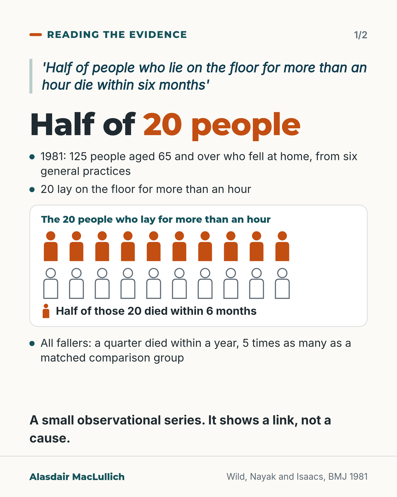
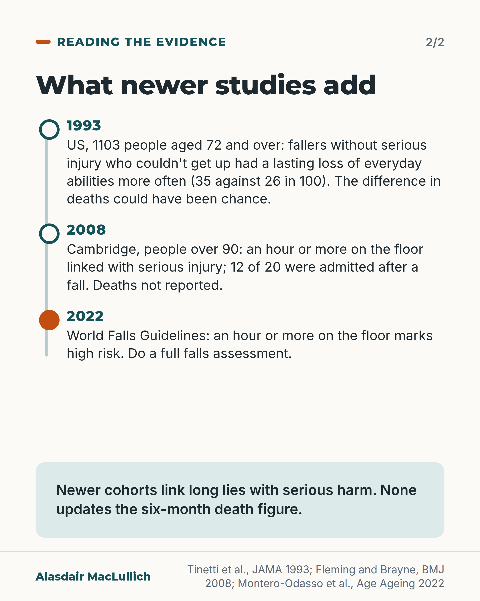

# G006: Checking the six-month figure

- Category: C01 Falls and fear of falling
- Audience: practitioners
- Series: Reading the evidence
- Post type: evidence_interpretation
- Visual format: carousel (statement card with icon row + timeline)
- Status: text text_final, visual final
- Working id: C01-P06 (candidate C01-08)

## Insight

The line that half of people who lie on the floor for over an hour die within six months comes from a 1981 study of 20 people with long lies, and it describes an association. Newer studies still link long lies with serious harm, so the case for preventing them stands on better evidence.

## Angle and position

Test a familiar teaching statistic against its source and teach it accurately. Position (judgement): give the source, size and design of the 1981 figure, describe it as an association, and rest the case for preventing long lies on newer cohorts and guidelines.

Basis: mixed: the study details, the 1993 and 2008 cohort findings and the guideline statement are empirical findings; 'the deaths can't all be put down to the lie' is an interpretation of the design; how to teach the figure is a judgement.

## X (1146 characters)

```text
The line 'half of people who lie on the floor for more than an hour die within six months' comes from a 1981 BMJ study. It rests on 20 people, and it describes a link, not a cause.

The researchers followed 125 people aged 65 and over who fell at home, found through six general practices. Twenty lay on the floor for more than an hour. Half of those 20 died within six months.

A quarter of all the fallers died within a year, five times as many as in a comparison group of the same age and sex. The authors concluded that falls at home are often a sign of severe ill health. So the deaths can't all be put down to the time on the floor.

In a larger 1993 US cohort, fallers without serious injury who couldn't get up without help were more likely to lose everyday abilities for good. They were also more likely to die, but that difference could have been chance.

A 2008 Cambridge study of people over 90 still linked long lies with serious injury and hospital admission. The World Falls Guidelines treat an hour on the floor as a sign of high risk.

Teach the figure with its size and design: half of 20 people, describing a link, not a cause.
```

## LinkedIn (2098 characters)

```text
The line 'half of people who lie on the floor for more than an hour die within six months' comes from a 1981 BMJ study. It rests on 20 people, and it describes a link, not a cause.

The researchers followed 125 people aged 65 and over who had fallen at home, found through six general practices. Twenty lay on the floor for more than an hour, and half of those 20 died within six months.

The same study found that a quarter of all the fallers died within a year, five times as many as in a comparison group of the same age and sex. The authors' own conclusion was that falls at home are often a sign of severe ill health. People who can't get up after a fall are, on average, older, with weaker balance and walking, and more often have low mood or memory problems. So the deaths can't all be put down to the time on the floor.

A larger 1993 US study followed 1103 people aged 72 and over. Among those who fell without serious injury, almost half (148 of 313) could not get up without help at least once. They were more likely to lose everyday abilities for good (35 in 100, against 26 in 100 of those who could get up). They were also more likely to die, but that difference could have been chance.

A 2008 Cambridge study followed people over 90 for a year. Of the 66 who fell, 20 lay on the floor for an hour or more at least once, and 12 of those 20 were admitted to hospital after a fall. Long lies were linked with serious injury. That study did not report deaths by time on the floor, so it does not update the six-month figure. Injury can also cause a long lie.

There is no agreed definition of a long lie: studies have used anything from 5 minutes to an hour or more, so their figures are not directly comparable.

The case for preventing long lies does not depend on the 1981 figure. The 2022 World Falls Guidelines count an hour or more on the floor as a sign of high risk of further falls, and say it should lead to a full falls assessment.

When we teach the six-month line, we should give its source, its size and its design: half of 20 people, in an observational series from 1981.
```

## Bluesky (296 characters)

```text
'Half of people who lie on the floor for over an hour die within six months' comes from a 1981 study: half of 20 people. Its authors said falls at home often signal severe ill health.

Newer studies still link long lies with serious injury. Teach the figure with its size, as a link, not a cause.
```

## Threads (495 characters)

```text
'Half of people who lie on the floor for more than an hour die within six months' comes from a 1981 study: half of 20 people.

Its authors concluded that falls at home often signal severe ill health, so the deaths can't all be put down to the lie. In a larger 1993 cohort, more fallers who couldn't get up died, but that could have been chance.

Long lies are still linked with serious injury and admission, and guidelines treat an hour on the floor as high risk. Teach the figure with its size.
```

## Source reply

Sources: https://doi.org/10.1136/bmj.282.6260.266 (Wild 1981) https://pubmed.ncbi.nlm.nih.gov/8416408/ (Tinetti 1993) https://doi.org/10.1136/bmj.a2227 (Fleming 2008) https://doi.org/10.1093/ageing/afac205 (World Falls Guidelines 2022)

## Visual



Alt text: Card: the line 'half of people who lie on the floor for more than an hour die within six months' comes from a 1981 study of 125 fallers aged 65 and over. 20 lay over an hour, shown as 20 person icons, 10 filled: half of those 20 died within 6 months. A quarter of all fallers died within a year. Small observational series: a link, not a cause.



Alt text: Timeline. 1993, US, 1103 people aged 72 and over: fallers without serious injury who couldn't get up had a lasting loss of everyday abilities more often, 35 against 26 in 100; death difference could be chance. 2008, Cambridge, people over 90: long lies linked with serious injury, 12 of 20 admitted; deaths not reported. 2022 guidelines: an hour on the floor marks high risk.

Editable source: `visuals/src/G006.html`

Design instructions: Two 4:5 light cards. Card 1: italic deep-teal quote with pale left rule, h1 'Half of 20 people' with orange em, dot list, white panel with chart.js iconArray (20 person icons, 2 rows of 10: top 10 filled orange, bottom 10 white with grey outline) and a filled-icon key, final fact, bold closing line. Data C01-08-a (125, 20, half of 20), C01-08-b (a quarter, 5 times). Card 2: base.css vertical timeline (1993, 2008, 2022 hot), mint closing panel. Data C01-08-d (35 vs 26 in 100), C01-08-e (12 of 20), C01-08-f.

## Sources and verification

- C01-08-a (supported): Wild, Nayak and Isaacs (BMJ 1981) studied 125 people aged 65 and over who fell at home, found through six general practices; 20 lay on the floor for more than an hour, and half of those 20 died within six months of the fall.
  - Source: Wild D, Nayak US, Isaacs B. How dangerous are falls in old people at home? Br Med J (Clin Res Ed). 1981;282(6260):266-8.; Fleming J, Brayne C. Inability to get up after falling, subsequent time on floor, and summoning help: prospective cohort study in people over 90. BMJ. 2008;337:a2227.
  - Passage: "Wild 1981 abstract: "From a survey in six general practices information was obtained on 125 people aged 65 and over who fell in their own homes. Three fractured their femurs and 15 had other fractures; most of the rest suffered only trivial injuries. Twenty lay on the floor for more than one hour; none were known to have suffered hypothermia. One-quarter of these patients died within one year of the fall, five times as many as in an age- and sex-matched control group; while of those who lay on the floor for more than one hour, half died within six months of the fall." Fleming 2008 (Discussion): "In a UK survey in general practice 16% of those aged over 65 who fell in their own homes lay on the floor for more than an hour."" (Wild 1981 Abstract (full text not available as text); Fleming 2008 Discussion (Key findings in context))
- C01-08-b (supported): In the same 1981 study, fallers as a whole had high mortality, and the authors themselves concluded that falls at home often signal severe ill health.
  - Source: Wild D, Nayak US, Isaacs B. How dangerous are falls in old people at home? Br Med J (Clin Res Ed). 1981;282(6260):266-8.
  - Passage: ""One-quarter of these patients died within one year of the fall, five times as many as in an age- and sex-matched control group" ... "Factors associated with mortality from falls were impaired mobility, abnormal balance, and a disturbed pattern of gait. Falls at home in old age are often indicative of the presence of severe ill health."" (Abstract)
- C01-08-c (supported): People who cannot get up after a fall differ from those who can: they are older, have poorer balance, gait and mobility, and more depression or cognitive impairment.
  - Source: Tinetti ME, Liu WL, Claus EB. Predictors and prognosis of inability to get up after falls among elderly persons. JAMA. 1993;269(1):65-70.; Fleming J, Brayne C. Inability to get up after falling, subsequent time on floor, and summoning help: prospective cohort study in people over 90. BMJ. 2008;337:a2227.; Kubitza J, Schneider IT, Reuschenbach B. Concept of the term long lie: a scoping review. Eur Rev Aging Phys Act. 2023;20(1):16.
  - Passage: "Tinetti 1993: "Compared with non-fallers, the risk factors independently associated with inability to get up included the following: an age of at least 80 years (adjusted relative risk [RR], 1.6; 95% confidence interval [CI], 1.2 to 2.1); depression (RR, 1.5; CI, 1.1 to 2.0); and poor balance and gait (RR, 2.0; CI, 1.5 to 2.7)." Fleming 2008 abstract: "Difficulty in getting up was consistently associated with age, reported mobility, and severe cognitive impairment. Cognition was the only characteristic that predicted lying on the floor for a long time." Kubitza 2023: "Older adults suffered falls [–,–,,–], but it has been the frailty of the individuals that affected their inability to get up after the fall [–,,–,]."" (Tinetti Abstract (Results); Fleming Abstract; Kubitza Findings (Causes and associated factors))
- C01-08-d (supported): In a larger 1993 US cohort, fallers who could not get up were more likely to have a lasting decline in daily activities; differences in death and hospital admission pointed the same way but were not statistically significant.
  - Source: Tinetti ME, Liu WL, Claus EB. Predictors and prognosis of inability to get up after falls among elderly persons. JAMA. 1993;269(1):65-70.
  - Passage: ""Inability to get up without help was reported after 220 of 596 non-injurious falls. Of 313 non-injured fallers, 148 (47%) reported inability to get up after at least one fall." ... "Compared with fallers who were able to get up, fallers who were unable to get up were more likely to suffer lasting decline in activities of daily living (35% vs 26%). Fallers who were unable to get up were more likely to die, to be hospitalized, and to suffer a decline in activities of daily living for at least 3 days, and were less likely to be placed in a nursing home than were fallers who were able to get up, but these trends were not statistically significant."" (Abstract (Results))
- C01-08-e (supported_with_qualification): A 2008 UK cohort of people over 90 linked lying on the floor for an hour or more with serious injury and fall-related hospital admission; the link with moving into a care home was uncertain after adjustment, and death was not reported.
  - Source: Fleming J, Brayne C. Inability to get up after falling, subsequent time on floor, and summoning help: prospective cohort study in people over 90. BMJ. 2008;337:a2227.
  - Passage: "Abstract: "Of the 60% who fell, 80% (53/66) were unable to get up after at least one fall and 30% (20/66) had lain on the floor for an hour or more." Results: "Serious injury, however, was consistently associated with lying on the floor for a long time, regardless of adjustment. Of the 20 people who were reported to be on the floor over an hour after falling, 60% (12) had a fall related hospital admission during the follow-up year (4.0, 1.3 to 12.3)." ... "giving a threefold increased odds of admission to a care home, though the risk estimate did not reach significance in this smaller sample (n=51 not living in care who fell) until the censoring, conducted when everyone had completed their year since interview (crude hazard ratio 3.4 (1.2 to 9.5), adjusted 2.3 (0.8 to 7.0))." Limitations: "Some caution is warranted in interpreting the analyses of association between risk factors and these consequences of falling; lack of association might indicate only the limited power of the small sample size."" (Abstract; Results (Factors associated with inability to get up and lying on the floor for a long time; Table 4); Discussion (Limitations))
- C01-08-f (supported): Current guidelines treat an hour or more on the floor as a sign of high falls risk that should lead to a full falls assessment, and list harms linked with long lies.
  - Source: Montero-Odasso M, van der Velde N, Martin FC, Petrovic M, Tan MP, Ryg J, et al; Task Force on Global Guidelines for Falls in Older Adults. World guidelines for falls prevention and management for older adults: a global initiative. Age Ageing. 2022;51(9):afac205.
  - Passage: ""An adult who sustains an injury requiring medical (including surgical) treatment, reports recurrent falls (≥2) in the previous 12 months, was laying on the floor unable to rise independently for at least one hour, is considered frail or is suspected to have experienced a transient loss of consciousness should be regarded as at high risk of future falls" ... "These high-risk older adults should be offered a multifactorial falls risk assessment." ... "Lying on the floor for more than an hour is associated with dehydration, electrolyte disturbance, renal failure, hypothermia, pneumonia and urinary tract infections, skin damage and pain [,], and declines in mobility and restrictions in activity, probably due to fear of a repeat fall. ‘Lift and assist’ call outs should trigger falls prevention interventions []."" (Full text: Older adults presenting with falls or related injuries; Assessment and algorithm flow; Exercise and physical activity interventions (Recommendation details and justification))
- C01-08-g (supported): There is no agreed definition of a 'long lie'; studies have used thresholds from five minutes to an hour or more.
  - Source: Kubitza J, Schneider IT, Reuschenbach B. Concept of the term long lie: a scoping review. Eur Rev Aging Phys Act. 2023;20(1):16.
  - Passage: "Abstract: "The results show that a standard concept of a long lie is lacking. The duration of lying and the location alone are not relevant criteria." Findings: "In eight studies, a specific time was also used to determine long lie, ranging from five minutes [], ten minutes [], and fifteen minutes [] to one hour or more [,,,,]. While seven studies were more unspecific in this aspect and used the terms longer time [,,–,] or several hours to days [], five studies did not use time restrictions at all [,,,,]." Discussion: "The consequences significantly improve with increasing lying time, but they can already occur in less than one hour"" (Abstract; Findings (Indicators and definition); Discussion)

Verification notes: C01-08-a (Wild 1981 abstract; Fleming 2008 full text restatement): 125 fallers aged 65 and over from six practices; 20 lay over an hour; half of those 20 died within six months; no exact death count or screening numbers given; not called 'often quoted' (C01-08-h not found). C01-08-b (Wild abstract): a quarter of fallers died within a year, five times matched controls; authors' conclusion on severe ill health; 'can't all be put down' presented as a reading of the design. C01-08-c (Tinetti, Fleming, Kubitza): characteristics of people who can't get up. C01-08-d (Tinetti 1993 abstract): 148 of 313, 35% against 26%, death difference not statistically clear. C01-08-e (Fleming 2008 full text): 20 of 66, 12 of 20 admitted, serious injury link, care-home link uncertain (not claimed), deaths not reported, injury can cause a long lie. C01-08-f (World Falls Guidelines full text): an hour or more marks high risk and should prompt full assessment. C01-08-g (Kubitza 2023 full text): no agreed definition.

## Attention and follow potential

Pause: Clinicians who have heard or repeated the six-month line will want to see its source and size.

Gain: A more accurate way to teach about long lies, with the newer evidence that still supports preventing them.

Follow: The account traces well-known numbers back to their sources. The explicit series invitation was removed after the C01 cold read (it made an empty close), so the C01 set now carries no invitation to follow.

## Open issues

- Visual rendered and read back by the designer; not independently inspected.
