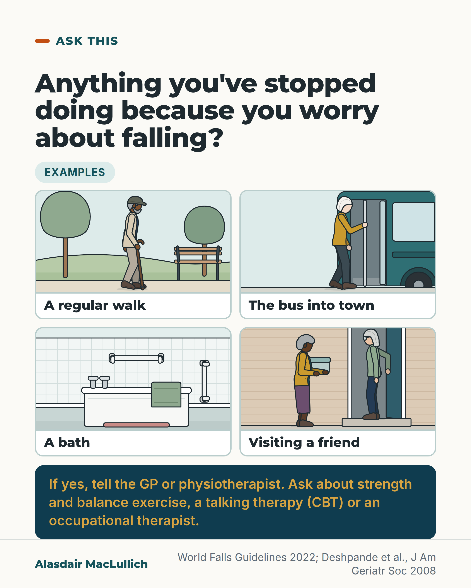

# G007: The question about what has stopped

- Category: C01 Falls and fear of falling
- Audience: both
- Series: Ask this
- Post type: decision_support
- Visual format: question card with drawn illustration
- Status: text text_final, visual final
- Working id: C01-P07 (candidate C01-13)

## Insight

Asking an older person what they have stopped doing because they worry about falling finds restriction that a count of falls misses, and the answer points to help: exercise, a talking therapy or an occupational therapist.

## Angle and position

The question to ask whenever falls come up is about the activities dropped since. Position: families and clinicians should ask it after any fall and whenever falls come up, and tell the GP or physiotherapist what has stopped.

Basis: mixed: the guideline recommendations and the Italian cohort association are empirical; 'whenever falls come up' and 'tell the GP or physiotherapist' are practical advice (clinical interpretation), marked as advice.

## X (932 characters)

```text
Is there anything you have stopped doing because you are worried about falling?

Ask yourself, or ask your mother or father. The answer might be a regular walk, the bus into town, a bath or visiting a friend. A count of falls won't show it.

International falls guidelines include this question after any fall. Families can ask it whenever falls come up.

An Italian study followed 673 people aged 65 and over who said they were afraid of falling. Three in 4 had cut back or avoided at least one activity. Those who had cut back or avoided three or more activities lost everyday abilities faster over the next 3 years. That is a link; it doesn't show the cutting back caused the decline.

If the answer is yes, tell the GP or physiotherapist what has stopped. Guidelines recommend strength and balance exercise, a talking therapy called cognitive behavioural therapy, or help from an occupational therapist with the activity itself.
```

## LinkedIn (1873 characters)

```text
Is there anything you have stopped doing because you are worried about falling?

Ask yourself, or ask your mother or father. The answer might be a regular walk, the bus into town, a bath or visiting a friend. None of these shows up in a count of falls.

International falls guidelines include this question in the history after any fall, and suggest it in routine check-ups where time allows. Families can ask it whenever falls come up. The older people who advised the guideline panel preferred the word 'concern' to 'fear'.

Worry about falling is common in later life, including in people who have never fallen. An Italian study followed 673 people aged 65 and over who said they were afraid of falling. Three in 4 had cut back or avoided at least one activity because of it. Those who had cut back or avoided three or more activities lost everyday abilities and leg function faster over the next 3 years. This held even after allowing for other health differences. That is a link, and it does not show that the cutting back caused the decline.

If the answer is yes, tell the GP or physiotherapist what has stopped. Guidelines recommend strength and balance exercise, a talking therapy called cognitive behavioural therapy, or help from an occupational therapist with the activity itself. Exercise reduces worry a little, at least by the end of the programme. The talking therapy has shown benefit lasting up to a year. The exercise trials did not measure whether people took up the activities they had dropped.

A 'no' is not an all-clear. A Sydney study assessed 500 people aged 70 to 90. One in 5 had a high physical risk of falling but little worry about it. Some caution after a fall is sensible, and some is more than the risk warrants. Either way, if worry about falling is high, tell the GP: falls specialists treat it as a sign that something needs looking at.
```

## Bluesky (289 characters)

```text
Is there anything you've stopped doing because you're worried about falling? Ask yourself, or your parent.

In one study, 3 in 4 people afraid of falling had cut back an activity. If yes, tell the GP or physio: guidelines recommend exercise, a talking therapy or an occupational therapist.
```

## Threads (407 characters)

```text
Is there anything you've stopped doing because you're worried about falling? Ask yourself, or ask your mother or father.

In an Italian study, 3 in 4 people who were afraid of falling had cut back at least one activity.

If the answer is yes, tell the GP or physiotherapist what has stopped. Guidelines recommend strength and balance exercise, a talking therapy (CBT) or help from an occupational therapist.
```

## Source reply

Sources: https://doi.org/10.1093/ageing/afac205 (World Falls Guidelines 2022) https://doi.org/10.1111/j.1532-5415.2007.01639.x (Deshpande 2008, InCHIANTI) https://doi.org/10.1093/ageing/afy010 (CBT review)

## Visual



Alt text: Question card: anything you've stopped doing because you worry about falling? Four drawn examples: a man with a stick walking in a park, a woman stepping onto a bus holding the pole, a bath with grab rails and a towel, a woman with a cake tin at a friend's door. If yes, tell the GP or physiotherapist; ask about strength and balance exercise, a talking therapy (CBT) or an occupational therapist.

Editable source: `visuals/src/G007.html`

Design instructions: Single 1080x1350 light card, series Ask this. Headline 60px. 'Examples' mint badge above a 2x2 grid of sand vignettes drawn with kit.js (viewBox 600x333), each with a Montserrat 30px label below: older South Asian man with crook stick and custom flat cap on a park path (trees, bench); older white woman walking into a teal low-floor bus door, near hand on the pole; bathroom with bath, pillar taps, horizontal and vertical grab rails, sage towel draped on rim, no person; older Black woman holding a cake tin at a brick front door opened by an older white friend. Answer in deep teal band with gold 31px text. Footer source line. Claims C01-13-a, C01-13-d, C01-13-e, C01-13-f; no chart.

## Sources and verification

- C01-13-a (supported): The World Falls Guidelines 2022 advise asking older people whether concerns about falling limit their usual activities, both in routine contacts and after a fall.
  - Source: Montero-Odasso M, van der Velde N, Martin FC, Petrovic M, Tan MP, Ryg J, et al; Task Force on Global Guidelines for Falls in Older Adults. World guidelines for falls prevention and management for older adults: a global initiative. Age Ageing. 2022;51(9):afac205.
  - Passage: ""Clinicians should routinely ask about falls in their interactions with older adults, as they often will not be spontaneously reported." ... "If resources and time are available, we conditionally recommend to additionally ask (iii) if they have experienced dizziness, loss of consciousness or any disturbance of gait or balance and (iv) if they experience any concerns about falling causing limitation of usual activities" ... "Older adults presenting with a fall or related injury should be asked about the details of the event and its consequences, previous falls, transient loss of consciousness or dizziness and any pre-existing impairment of mobility or concerns about falling causing limitation of usual activities."" (Full text: Opportunistic case-finding; Older adults presenting with falls or related injuries)
- C01-13-b (supported): The guidelines recommend including concern about falling in a full falls assessment, using the FES-I or Short FES-I, and using the word 'concern' rather than 'fear'.
  - Source: Montero-Odasso M, van der Velde N, Martin FC, Petrovic M, Tan MP, Ryg J, et al; Task Force on Global Guidelines for Falls in Older Adults. World guidelines for falls prevention and management for older adults: a global initiative. Age Ageing. 2022;51(9):afac205.
  - Passage: ""We recommend including an evaluation of concern about falling in a multifactorial falls risk assessment of older adults" (1B) ... "We recommend using a standardized instrument to evaluate concerns about falling such as the Falls Efficacy Scale International (FES-I) or Short FES-I in community-dwelling older adults." (1A) ... "The older adult panel we consulted about the recommendations preferred the term concern over fear. Based on this, we recommend that clinicians use the term concerns about falling when making enquiries."" (Full text: Table of recommendations (WG 12 Concerns about Falling and Falls); Concerns about falling and falls (Recommendation details and justification))
- C01-13-c (supported_with_qualification): Worry about falling is common in older people, including people who have never fallen, although estimates vary widely with how it is measured.
  - Source: Scheffer AC, Schuurmans MJ, van Dijk N, van der Hooft T, de Rooij SE. Fear of falling: measurement strategy, prevalence, risk factors and consequences among older persons. Age Ageing. 2008;37(1):19-24.; Xiong W, Wang D, Ren W, Liu X, Wen R, Luo Y. The global prevalence of and risk factors for fear of falling among older adults: a systematic review and meta-analysis. BMC Geriatr. 2024;24(1):321.
  - Passage: "Scheffer 2008: "fear of falling (FOF) is a major health problem among the elderly living in communities, present in older people who have fallen but also in older people who have never experienced a fall." ... "Due to the many different kinds of measurements used, the reported prevalence of FOF varied between 3 and 85%." ... "The main consequences were identified as a decline in physical and mental performance, an increased risk of falling and progressive loss of health-related quality of life." Xiong 2024: "A total of the 153 studies with 200,033 participants from 38 countries worldwide were identified. The global prevalence of fear of falling was 49.60%, ranging from 6.96-90.34%."" (Scheffer Abstract; Xiong Abstract (Results))
- C01-13-d (supported_with_qualification): Among older people who report fear of falling, most have cut back at least one activity, and cutting back three or more activities is linked with faster loss of physical function over three years.
  - Source: Deshpande N, Metter EJ, Lauretani F, Bandinelli S, Guralnik J, Ferrucci L. Activity restriction induced by fear of falling and objective and subjective measures of physical function: a prospective cohort study. J Am Geriatr Soc. 2008;56(4):615-20.
  - Passage: ""Six hundred seventy-three community-living elderly (≥65) participants in the Invecchiare in Chianti Study who reported FF." ... "One-quarter (25.5%) of participants did not report any activity restriction, 59.6% reported moderate activity restriction (restriction or avoidance of <3 activities), and 14.9% reported severe activity restriction (restriction or avoidance of ≥3 activities)." ... "Severe activity restriction was a significant independent predictor of worsening ADL disability and accelerated decline in lower extremity performance on SPPB over the 3-year follow-up. Severe and moderate activity restriction were independent predictors of worsening IADL disability. Results were consistent even after adjusting for multiple potential confounders."" (Abstract (Participants; Results))
- C01-13-e (supported): The standard questionnaires ask about concern during specific everyday activities, inside and outside the home, physical and social.
  - Source: Yardley L, Beyer N, Hauer K, Kempen G, Piot-Ziegler C, Todd C. Development and initial validation of the Falls Efficacy Scale-International (FES-I). Age Ageing. 2005;34(6):614-9.; Kempen GI, Yardley L, van Haastregt JC, Zijlstra GA, Beyer N, Hauer K, Todd C. The Short FES-I: a shortened version of the falls efficacy scale-international to assess fear of falling. Age Ageing. 2008;37(1):45-50.; Delbaere K, Close JC, Brodaty H, Sachdev P, Lord SR. Determinants of disparities between perceived and physiological risk of falling among elderly people: cohort study. BMJ. 2010;341:c4165.
  - Passage: "Yardley 2005: "Factor analysis suggested a unitary underlying factor, with two dimensions assessing concern about less demanding physical activities mainly in the home, and concern about more demanding physical activities mainly outside the home." ... "The FES-I has close continuity with the best existing measure of fear of falling, excellent psychometric properties, and assesses concerns relating to basic and more demanding activities, both physical and social." Kempen 2008: "the Short FES-I is a good and feasible measure to assess fear of falling in older persons." Delbaere 2010: "Using the falls efficacy scale international (FES-I), we assessed participants’ perceived fall risk by asking about concern about falling across a wide range of activities of daily living (such as cleaning the house, shopping, walking on uneven surfaces)."" (Yardley Abstract; Kempen Abstract; Delbaere Methods (Neuropsychological assessment))
- C01-13-f (supported_with_qualification): What to do with the answer: exercise, cognitive behavioural therapy and occupational therapy are recommended to reduce concerns about falling, though the evidence on restoring the activities people have given up is thin.
  - Source: Montero-Odasso M, van der Velde N, Martin FC, Petrovic M, Tan MP, Ryg J, et al; Task Force on Global Guidelines for Falls in Older Adults. World guidelines for falls prevention and management for older adults: a global initiative. Age Ageing. 2022;51(9):afac205.; Kendrick D, Kumar A, Carpenter H, Zijlstra GA, Skelton DA, Cook JR, et al. Exercise for reducing fear of falling in older people living in the community. Cochrane Database Syst Rev. 2014;(11):CD009848.; Liu TW, Ng GY, Chung RC, Ng SS. Cognitive behavioural therapy for fear of falling and balance among older people: a systematic review and meta-analysis. Age Ageing. 2018;47(4):520-527.
  - Passage: "WFG 2022: "We recommend exercise, cognitive behavioural therapy and/or occupational therapy (as part of a multidisciplinary approach) to reduce concerns about falling in community-dwelling older adults" ... "Existing fall prevention strategies, i.e. exercise interventions, can reduce concerns about falling in older adults." Kendrick 2014: "Exercise interventions in community-dwelling older people probably reduce fear of falling to a limited extent immediately after the intervention, without increasing the risk or frequency of falls. There is insufficient evidence to determine whether exercise interventions reduce fear of falling beyond the end of the intervention or their effect on other outcomes." ... "No studies reported the effects of exercise interventions on activity avoidance or costs." Liu 2018: "Our analysis suggests that CBT interventions have significant immediate and retention effects up to 12 months on reducing fear of falling, and 6 months post-intervention effect on enhancing balance."" (WFG: Concerns about falling and falls interventions; Kendrick Abstract (Results, Authors' conclusions); Liu Abstract)
- C01-13-g (supported_with_qualification): Concern about falling can be sensible caution or excessive; either way, high concern is a signal for clinical attention, and a 'no' does not prove low risk.
  - Source: Ellmers TJ, Freiberger E, Hauer K, Hogan DB, McGarrigle L, Lim ML, et al. Why should clinical practitioners ask about their patients' concerns about falling? Age Ageing. 2023;52(4):afad057.; Delbaere K, Close JC, Brodaty H, Sachdev P, Lord SR. Determinants of disparities between perceived and physiological risk of falling among elderly people: cohort study. BMJ. 2010;341:c4165.
  - Passage: "Ellmers 2023: "On the one hand, high CaF can lead to overly cautious or hypervigilant behaviours that increase the risk of falling, and may also cause undue activity restriction ('maladaptive CaF'). But concerns can also encourage individuals to make appropriate modifications to their behaviour to maximise safety ('adaptive CaF'). We discuss this paradox and argue that high CaF-irrespective of whether 'adaptive' or 'maladaptive'-should be considered an indication that 'something is not right', and that is represents an opportunity for clinical engagement. We also highlight how CaF can be maladaptive in terms of inappropriately high confidence about one's balance." Delbaere 2010: "100 (20%) had a high physiological risk but low perceived risk and were classified as “stoic.”"" (Ellmers Abstract; Delbaere Results)

Verification notes: C01-13-a (World Falls Guidelines full text): the question is part of the history after a fall and conditionally recommended in routine contacts; 'whenever falls come up' is marked as advice to families. C01-13-b: FES-I recommended; panel preferred 'concern'. C01-13-c (Scheffer 2008, Xiong 2024 abstracts): common, including in people who have never fallen; no single prevalence figure used. C01-13-d (Deshpande 2008 abstract): 673 people with fear of falling; 3 in 4 restricted at least one activity (59.6% plus 14.9%); three or more linked with faster decline over 3 years; association wording. C01-13-e: the four example activities are labelled 'Examples', not FES-I items. C01-13-f (WFG; Kendrick 2014; Liu 2018): exercise, CBT, OT recommended; exercise effect small; CBT up to a year; lost activities not promised to return. C01-13-g (Ellmers 2023; Delbaere 2010): a 'no' is not an all-clear; 1 in 5 of the whole sample had high physical risk but little worry (denominator corrected after fact-check C01). Distinct from E076, which described fear of falling as a disability.

## Attention and follow potential

Pause: A direct question readers can ask a parent, or themselves, today.

Gain: A way to find hidden restriction and what to ask for next.

Follow: Questions that open useful conversations between families and clinicians.

## Open issues

- Visual rendered and read back by the designer; not independently inspected.
