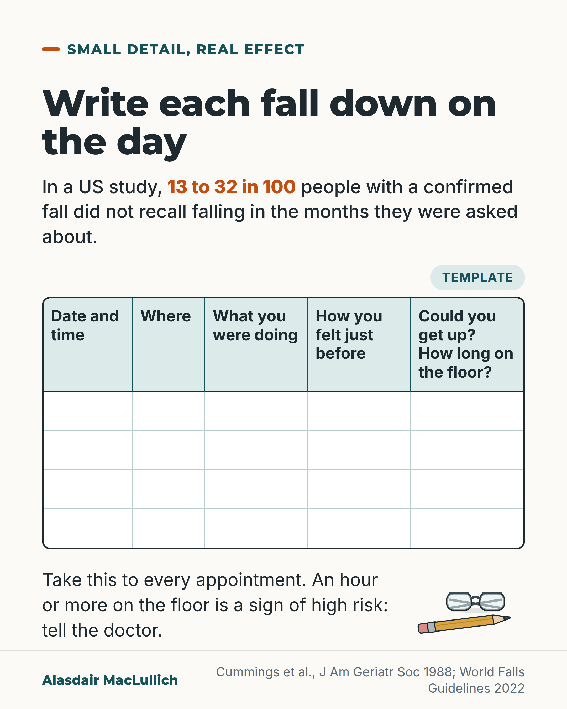

# G008: Write the fall down

- Category: C01 Falls and fear of falling
- Audience: public
- Series: Small detail, real effect
- Post type: public_explanation
- Visual format: checklist (printable template)
- Status: text text_final, visual final
- Working id: C01-P08 (candidate C01-31)

## Insight

People often forget their own falls within months, so a note written on the day (time, place, activity, how you felt, whether you could get up and for how long) gives the doctor details that memory loses.

## Angle and position

Falls research uses calendars because recall is unreliable, and families can do the same at home. Position (practical advice): write each fall down on the day and take the note to appointments.

Basis: mixed: the recall findings and the guideline history items are empirical; writing a note at home is practical advice drawn from them and has not itself been tested.

## X (880 characters)

```text
Falls are easily forgotten, even by the person who fell.

In a US study, researchers checked on 304 people over 60 every week for a year and confirmed each fall. At the end, they asked people about falls in the past 3, 6 or 12 months. Depending on the period, between 13 and 32 in 100 of those who had fallen did not recall falling in that period.

A German study followed people with dementia for a year. At the end, about half who had recorded a fall did not recall falling. Their GPs knew about only 14 in 100 of their falls.

Falls researchers don't rely on memory. They ask people to mark each fall on a calendar as it happens. You can do the same.

Write each fall down on the day. Note the date and time, where you were and what you were doing. Note how you felt just before, whether you could get up, and how long you were on the floor. Take the note to your appointments.
```

## LinkedIn (1713 characters)

```text
Falls are easily forgotten, even by the person who fell.

In a US study, researchers checked on 304 people over 60 every week for a year and visited to confirm each fall. At the end, they asked people about falls in the past 3, 6 or 12 months. Depending on the period, between 13 and 32 in 100 of those with a confirmed fall did not recall falling in that period. People with poorer memory test scores forgot more often.

In a review of six studies, people were asked about falls in the past year. Of those who had fallen, 80 to 89 in 100 remembered it. So asking about the year misses 1 or 2 in 10 people who fell. Falls that caused an injury were remembered better.

A German study followed 110 people with dementia for a year. About half of those who had recorded a fall did not remember falling when asked at the end. Their GPs knew about only 14 in 100 of the falls. Information from carers made the record more accurate.

Falls researchers don't rely on memory. They ask people to mark each fall on a calendar or diary as it happens and send it in every week or month.

You can do the same at home. Write each fall down on the day:

1. The date and time.
2. Where you were.
3. What you were doing.
4. How you felt just before: dizzy, blacked out, or fine.
5. Whether you could get up, and how long you were on the floor.

These are the details falls guidelines ask doctors to find out. An hour or more on the floor is a sign of high risk. The guidelines also note that fewer than a third of older people, particularly men, mention a fall unless asked.

A note like this has not been tested as a way to prevent falls. It gives the doctor details that memory loses. If you help a parent, your note counts too.
```

## Bluesky (276 characters)

```text
Falls are easily forgotten. In a US study, 13 to 32 in 100 people with a confirmed fall did not recall falling in the months asked about.

Write each fall down on the day: time, place, what you were doing, how you felt, whether you could get up. Take the note to appointments.
```

## Threads (416 characters)

```text
Falls are easily forgotten. In a US study, 13 to 32 in 100 people with a confirmed fall did not recall falling in the months they were asked about.

Write each fall down on the day. Note the date and time, where you were and what you were doing. Note how you felt just before, whether you could get up, and how long you were on the floor.

Take the note to your appointments. Those details are what the doctor needs.
```

## Source reply

Sources: https://doi.org/10.1111/j.1532-5415.1988.tb06155.x (Cummings 1988) https://doi.org/10.1017/S1041610211002122 (Zieschang 2012, dementia) https://doi.org/10.1093/ageing/afac205 (World Falls Guidelines 2022)

## Visual



Alt text: Printable falls note: write each fall down on the day. In a US study, 13 to 32 in 100 people with a confirmed fall did not recall falling in the months they were asked about. Blank table, five columns: date and time; where; what you were doing; how you felt just before; could you get up, how long on the floor. Take it to every appointment; an hour or more on the floor is a sign of high risk.

Editable source: `visuals/src/G008.html`

Design instructions: Single light card, series Small detail, real effect. h1.m headline; stat sentence 35px with '13 to 32 in 100' bold orange (claim C01-31-a, range by recall period, people not falls). 'Template' badge right-aligned above an HTML grid: 5 columns (168/138/196/196/rest px), mint header band with 30px bold Inter headings (last heading broken after 'get up?'), ink outer border, four empty 74px ruled rows. Below: body text left, small kit drawing right of a yellow pencil and folded reading glasses. Footer credit Cummings 1988; World Falls Guidelines 2022 (C01-31-f for the hour-on-floor point).

## Sources and verification

- C01-31-a (supported): In a 1988 US study, between 13% and 32% of people who had a confirmed fall did not remember falling when asked at the end of the year, depending on the period asked about.
  - Source: Cummings SR, Nevitt MC, Kidd S. Forgetting falls. The limited accuracy of recall of falls in the elderly. J Am Geriatr Soc. 1988;36(7):613-6.
  - Passage: ""we studied 304 ambulatory men and women over the age of 60 years who completed a 12-month prospective study of risk factors for falling. We developed a system of weekly follow-up and home visits to record and confirm all falls. During the study, 179 participants suffered at least one fall that was confirmed by home visit. At the end of the study, all subjects were interviewed by telephone about whether they had suffered a fall during the preceding 3, 6, or 12 months. Depending on the time period of recall, 13% to 32% of those with confirmed falls did not recall falling during the specific period of time. Recall was better for the preceding 12 months than for 3 or 6 months." ... "Those with lower scores on the Mini-Mental State Examination were more likely to forget falls."" (Abstract)
- C01-31-b (supported): A systematic review found that asking people about falls over the past year misses about 1 or 2 in 10 people who fell; injurious falls are remembered better.
  - Source: Ganz DA, Higashi T, Rubenstein LZ. Monitoring falls in cohort studies of community-dwelling older people: effect of the recall interval. J Am Geriatr Soc. 2005;53(12):2190-4.
  - Passage: ""Six studies met the inclusion criteria. Recall of falls in the previous year was specific (specificity 91-95%) but less sensitive (sensitivity 80-89%) than the criterion standard of ongoing prospective collection of fall data using fall calendars or postcards. Patients with injurious falls were more likely to recall their falls. Lower Mini-Mental State Examination score was associated with poorer recall of falls in the one study addressing this issue."" (Abstract (Results))
- C01-31-d (supported): In people with dementia, about half of those who recorded a fall did not recall it a year later, GPs knew of few falls, and information from carers improved accuracy.
  - Source: Zieschang T, Schwenk M, Becker C, Oster P, Hauer K. Feasibility and accuracy of fall reports in persons with dementia: a prospective observational study. Int Psychogeriatr. 2012;24(4):587-98.
  - Passage: ""GPs knew of only 14% of falls and 19% of fallers. In addition, 49% of subjects who documented a fall prospectively did not recall a fall after 12 months." ... "If feasible, recall periods should be as short as one week; additional information by care-givers increases accuracy of reports. Retrospective recall of falling with long recall periods is not recommended."" (Abstract (Results; Conclusion))
- C01-31-e (supported): Falls research records falls as they happen, on daily calendars or diaries returned weekly or monthly, because recall over months is unreliable.
  - Source: Ganz DA, Higashi T, Rubenstein LZ. Monitoring falls in cohort studies of community-dwelling older people: effect of the recall interval. J Am Geriatr Soc. 2005;53(12):2190-4.; Hannan MT, Gagnon MM, Aneja J, Jones RN, Cupples LA, Lipsitz LA, et al. Optimizing the tracking of falls in studies of older participants: comparison of quarterly telephone recall with monthly falls calendars in the MOBILIZE Boston Study. Am J Epidemiol. 2010;171(9):1031-6.; Delbaere K, Close JC, Brodaty H, Sachdev P, Lord SR. Determinants of disparities between perceived and physiological risk of falling among elderly people: cohort study. BMJ. 2010;341:c4165.; Fleming J, Brayne C. Inability to get up after falling, subsequent time on floor, and summoning help: prospective cohort study in people over 90. BMJ. 2008;337:a2227.
  - Passage: "Ganz 2005: "Whenever accurate data on all falls are critical, such as with interventions to decrease the rate of falls, researchers should gather information on falls every week or every month from study participants. The optimal method of fall monitoring--postcard, calendar, diary, telephone, or some combination of these--remains unknown." Hannan 2010: "Calendars should be considered the preferred method of ascertaining falls in longitudinal studies." Delbaere 2010: "Falls frequency during the one year follow-up was monitored with monthly falls diaries." Fleming 2008 abstract: "1 year follow-up of participants in a prospective cohort study of ageing, using fall calendars, phone calls, and visits."" (Ganz Abstract (Conclusion); Hannan Abstract; Delbaere Methods; Fleming Abstract)
- C01-31-f (supported): Guidelines ask clinicians to take a detailed history of each fall: how often, the circumstances, dizziness or blackout, consequences, and whether the person could get up; recollection of falls is unreliable, and many people do not mention falls unless asked.
  - Source: Montero-Odasso M, van der Velde N, Martin FC, Petrovic M, Tan MP, Ryg J, et al; Task Force on Global Guidelines for Falls in Older Adults. World guidelines for falls prevention and management for older adults: a global initiative. Age Ageing. 2022;51(9):afac205.
  - Passage: ""Older adults in contact with healthcare for any reason should be asked, at least once yearly, if they have (i) experienced one or more falls in the last 12 months, and (ii) about the frequency, characteristics, context, severity and consequences of any fall/s." ... "Older adults presenting with a fall or related injury should be asked about the details of the event and its consequences, previous falls, transient loss of consciousness or dizziness and any pre-existing impairment of mobility or concerns about falling causing limitation of usual activities." ... "Furthermore, recollection of the occurrence or date (e.g., how many months ago) of previous falls is unreliable []" ... "Studies indicate that older adults, particularly men, are reluctant to report falls with less than a third mentioning them to their clinician if not directly asked []." ... "was laying on the floor unable to rise independently for at least one hour"" (Full text: Opportunistic case-finding; Older adults presenting with falls or related injuries; Assessment and algorithm flow; Multifactorial falls risk assessment (Recommendation details))

Verification notes: C01-31-a (Cummings 1988 abstract): 304 people over 60, weekly contact, falls confirmed; 13% to 32% of people with confirmed falls did not recall falling in the period asked (range given, no single 12-month figure; figures are for people, not falls). C01-31-b (Ganz 2005 abstract): 12-month recall sensitivity 80% to 89%; injurious falls remembered better. C01-31-d (Zieschang 2012 abstract): 110 people with dementia, 49% did not recall, GPs knew 14% of falls, carers improved accuracy. C01-31-e (Ganz, Hannan, Delbaere, Fleming): research uses calendars or diaries returned weekly or monthly. C01-31-f (World Falls Guidelines full text): history items, an hour on the floor marks high risk, fewer than a third of older adults, particularly men, mention falls unless asked. C01-31-g (partly supported) is not used as evidence: keeping a note is framed as practical advice, and the post says it has not been tested.

## Attention and follow potential

Pause: A surprising fact about memory: people forget their own falls.

Gain: A template to use today and take to the next appointment.

Follow: Useful tools, not only warnings.

## Open issues

- Visual rendered and read back by the designer; not independently inspected.
