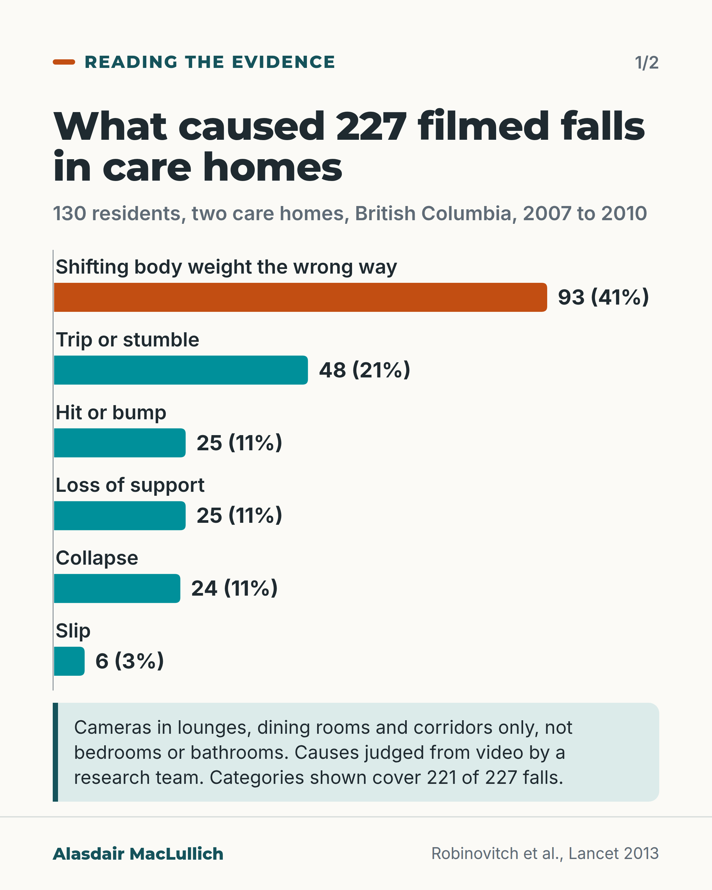
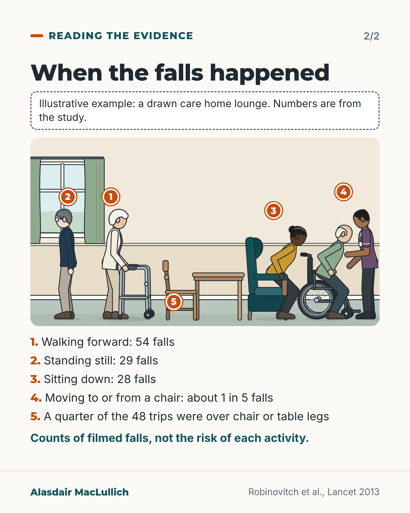

# G009: What the cameras showed

- Category: C01 Falls and fear of falling
- Audience: practitioners
- Series: Reading the evidence
- Post type: evidence_interpretation
- Visual format: carousel (bar chart + annotated scene)
- Status: text text_final, visual final
- Working id: C01-P09 (candidate C01-18)

## Insight

When falls in two care homes were filmed, about 4 in 10 came from shifting body weight the wrong way during ordinary movement, and trips and slips together caused about 1 in 4. The commonest moments were walking, standing still and sitting down, and about 1 in 5 happened during transfers.

## Angle and position

Filmed falls show causes that a trip-hazard checklist does not cover. Position (judgement): care homes should give sitting down, standing up and transfers the same attention as clearing trip hazards; the video study did not test this.

Basis: mixed: the causes, activities and limitations are empirical findings from one video study; the recommendation on transfers is a judgement drawn from the findings and the authors' suggestion, not a tested intervention.

## X (807 characters)

```text
Researchers filmed 227 falls by 130 residents of two care homes in British Columbia, Canada, between 2007 and 2010.

About 4 in 10 (93 falls) came from shifting body weight the wrong way during an ordinary movement. Trips and slips together caused about 1 in 4 (54).

The commonest moments were walking forward (54 falls), standing still (29) and sitting down (28). About 1 in 5 happened while moving to or from a chair.

Cameras were in lounges, dining rooms and corridors only, not bedrooms or bathrooms. And these are counts of falls, not the risk of each activity.

We should give sitting down, standing up and transfers the same attention as trip hazards. That is a judgement from the findings; the study did not test it. A quarter of the trips were over chair or table legs, so furniture still counts.
```

## LinkedIn (1469 characters)

```text
Researchers filmed 227 falls by 130 residents of two care homes in British Columbia, Canada, between 2007 and 2010. A research team watched each video and judged what caused the loss of balance and what the person was doing.

The commonest cause, in about 4 in 10 falls (93 of 227), was shifting body weight the wrong way during an ordinary movement. About 1 in 5 (48) came from a trip or stumble, and 6 from a slip. Hitting or bumping into something, losing support from an object, and collapsing each caused about 1 in 10.

The commonest moments were walking forward (54 falls), standing still (29) and sitting down (28). About 1 in 5 falls happened while moving to or from a chair.

Two limits apply. The cameras were in lounges, dining rooms and corridors only; falls in bedrooms and bathrooms were not filmed. And these are counts of falls, not the risk per minute of each activity, so they partly reflect how often residents do each thing.

The authors suggested strength exercise and better support when people move to and from chairs. They also noted that a quarter of the trips were over chair or table legs, so trip hazards still deserve attention.

This is a judgement drawn from the findings, not a tested intervention: we should give sitting down, standing up and transfers the same attention in care homes as clearing trip hazards. That includes support from staff at those moments, and furniture arranged so that legs don't stick out into walking routes.
```

## Bluesky (294 characters)

```text
Filmed falls in two Canadian care homes: about 4 in 10 came from shifting body weight the wrong way. Trips and slips together caused about 1 in 4. Common moments: walking, standing, sitting down. Shared areas only.

We should support transfers as closely as we clear trip hazards (a judgement).
```

## Threads (439 characters)

```text
When 227 falls in two Canadian care homes were filmed, about 4 in 10 came from shifting body weight the wrong way during an ordinary movement. Trips and slips together were about 1 in 4.

The commonest moments were walking forward, standing still and sitting down. Cameras covered shared areas only.

We should give sitting down, standing up and transfers the same attention as trip hazards. That is a judgement, not a tested intervention.
```

## Source reply

Source: https://doi.org/10.1016/S0140-6736(12)61263-X (Robinovitch et al., Lancet 2013)

## Visual



Alt text: Bar chart of causes of 227 falls filmed in two Canadian care homes, 2007 to 2010: shifting body weight the wrong way 93 (41%), trip or stumble 48 (21%), hit or bump 25, loss of support 25, collapse 24 (11% each), slip 6 (3%). Cameras in shared areas only, not bedrooms or bathrooms; causes judged from video.



Alt text: Illustrative care home lounge, five numbered moments: a man by a window, a woman walking with a wheeled frame, a woman lowering into an armchair, a care worker beside a man rising from a wheelchair, a chair pulled into the walkway. Counts: walking forward 54 falls, standing still 29, sitting down 28, moving to or from a chair about 1 in 5, a quarter of 48 trips over chair or table legs.

Editable source: `visuals/src/G009.html`

Design instructions: Two light cards, series Reading the evidence, 1/2 and 2/2. Card 1: h1.s headline, grey subtitle, chart.js barChart labels above bars, sorted, max 93, top bar orange (b) others teal (a), values '93 (41%)' etc from claim C01-18-b (93, 48, 25, 25, 24, 6 of 227; sum 221), camera-limitation note in mint panel with teal left rule (C01-18-d). Card 2: dashed 'Illustrative example' note, kit.js care_home_lounge scene viewBox 1300x700 with orange pins 1-5 (walking-frame woman, man by window, woman lowering into teal armchair, older man rising from wheelchair with South Asian male care worker, dining chair and table), numbered key 30px with orange bold numerals (C01-18-c, C01-18-e), teal caveat line. Footer Robinovitch et al., Lancet 2013.

## Sources and verification

- C01-18-a (supported): Robinovitch and colleagues analysed 227 falls from 130 residents, captured on video between 2007 and 2010 in two long-term care facilities in British Columbia, Canada.
  - Source: Robinovitch SN, Feldman F, Yang Y, Schonnop R, Leung PM, Sarraf T, et al. Video capture of the circumstances of falls in elderly people residing in long-term care: an observational study. Lancet. 2013;381(9860):47-54.
  - Passage: "We did this observational study between April 20, 2007, and June 23, 2010, in two long-term care facilities in British Columbia, Canada. Digital video cameras were installed in common areas (dining rooms, lounges, hallways). ... We captured 227 falls from 130 individuals (mean age 78 years, SD 10)." (Abstract, Methods and Findings)
- C01-18-b (supported): The commonest cause of falling was incorrect shifting of body weight (41%); trips or stumbles caused 21% and slips only 3%.
  - Source: Robinovitch SN, Feldman F, Yang Y, Schonnop R, Leung PM, Sarraf T, et al. Video capture of the circumstances of falls in elderly people residing in long-term care: an observational study. Lancet. 2013;381(9860):47-54.
  - Passage: "The most frequent cause of falling was incorrect weight shifting, which accounted for 41% (93 of 227) of falls, followed by trip or stumble (48, 21%), hit or bump (25, 11%), loss of support (25, 11%), and collapse (24, 11%). Slipping accounted for only 3% (six) of falls." (Abstract, Findings)
- C01-18-c (supported_with_qualification): Falls happened most often during forward walking, standing quietly and sitting down; about a fifth happened during transfers.
  - Source: Robinovitch SN, Feldman F, Yang Y, Schonnop R, Leung PM, Sarraf T, et al. Video capture of the circumstances of falls in elderly people residing in long-term care: an observational study. Lancet. 2013;381(9860):47-54.
  - Passage: "The three activities associated with the highest proportion of falls were forward walking (54 of 227 falls, 24%), standing quietly (29 falls, 13%), and sitting down (28 falls, 12%). Compared with previous reports from the long-term care setting, we identified a higher occurrence of falls during standing and transferring, a lower occurrence during walking ... 21% of falls occurred during transferring, suggesting the need for exercises to enhance muscle strength, and improved assistive devices that provide adequate body support (eg, locking of wheels) when moving to and from chairs. ... The activities associated with fewest falls were standing and reaching, standing and turning, and seated or wheeling in a wheelchair (table 4)." (Abstract, Findings; Results; Discussion)
- C01-18-d (supported): Cameras were only in common areas, not bedrooms or bathrooms, so the findings describe falls in shared spaces.
  - Source: Robinovitch SN, Feldman F, Yang Y, Schonnop R, Leung PM, Sarraf T, et al. Video capture of the circumstances of falls in elderly people residing in long-term care: an observational study. Lancet. 2013;381(9860):47-54.
  - Passage: "Digital video cameras were installed in common areas (dining rooms, lounges, hallways); Delta View had a network of 216 cameras, and New Vista had 48. No cameras were located in bedrooms or bathrooms. ... In 2010, at Delta View, 45% of falls documented on incident report occurred in common areas, of which 65% were captured on video. At New Vista, 34% of documented falls occurred in common areas, of which 28% were captured on video. ... We did not measure (and were unable to incorporate in a risk analysis) the amount of time spent doing the various activities associated with falls. ... We stress that our results summarise the situational context of falls in common areas of the long-term care environment." (Methods, Procedures; Results; Discussion (limitations))
- C01-18-e (supported_with_qualification): Falls prevention in care homes should give as much attention to transfers and sitting down as to trip hazards.
  - Source: Robinovitch SN, Feldman F, Yang Y, Schonnop R, Leung PM, Sarraf T, et al. Video capture of the circumstances of falls in elderly people residing in long-term care: an observational study. Lancet. 2013;381(9860):47-54.
  - Passage: "Our findings emphasise the need to target each of these activities in fall risk assessment and prevention strategies. ... We showed that 25% of trips occurred due to the foot being caught on a chair or table leg, suggesting the need for improved staff awareness of this hazard, and improvements in environmental planning and furniture design. 21% of falls occurred during transferring, suggesting the need for exercises to enhance muscle strength, and improved assistive devices that provide adequate body support (eg, locking of wheels) when moving to and from chairs." (Discussion)

Verification notes: All from Robinovitch 2013 (full text). C01-18-a: 227 falls, 130 residents, two facilities, British Columbia, 2007 to 2010. C01-18-b: 41% weight shifting (93), 21% trip or stumble (48), 3% slip (6), 11% each hit or bump, loss of support, collapse (25, 25, 24); trips and slips together 54 of 227; no claim that most falls did not involve an object. The 221 of 227 on the chart is the sum of the six published categories. C01-18-c: walking forward 54, standing 29, sitting down 28, transfers about 1 in 5; turning not listed as a common moment; counts, not risk per activity. C01-18-d: cameras in common areas only, stated on the chart. C01-18-e: authors' suggestions; the transfers position is marked as a judgement and not a tested intervention; furniture-leg point kept.

## Attention and follow potential

Pause: A specific, filmed finding that differs from the usual trip-hazard account of falls.

Gain: A reason to put staff attention on transfers and sitting down, while keeping furniture layout in view.

Follow: Useful research brought into everyday care, with its limits stated.

## Open issues

- Visual rendered and read back by the designer; not independently inspected.
