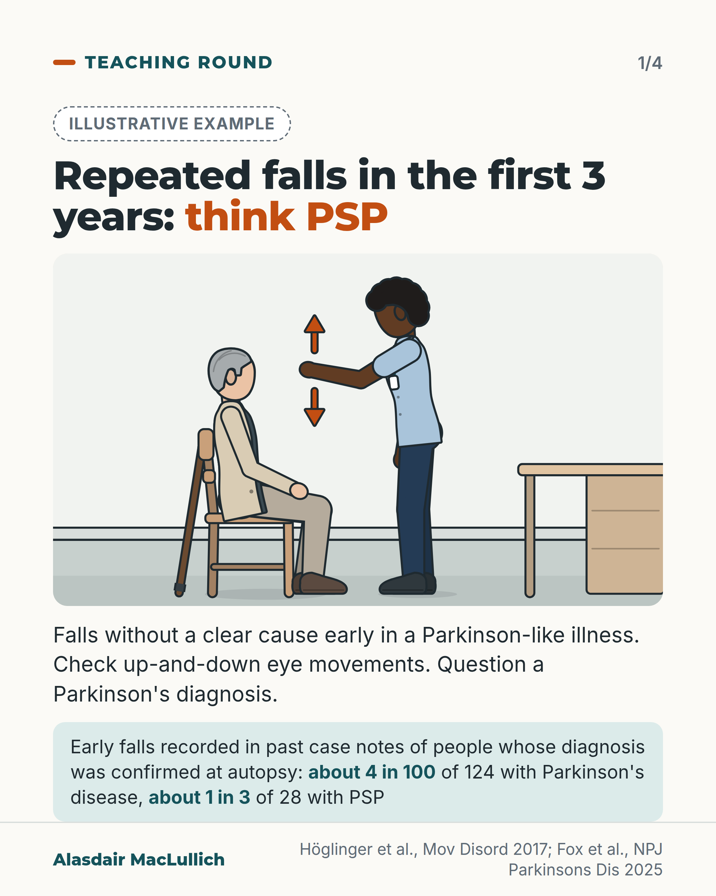
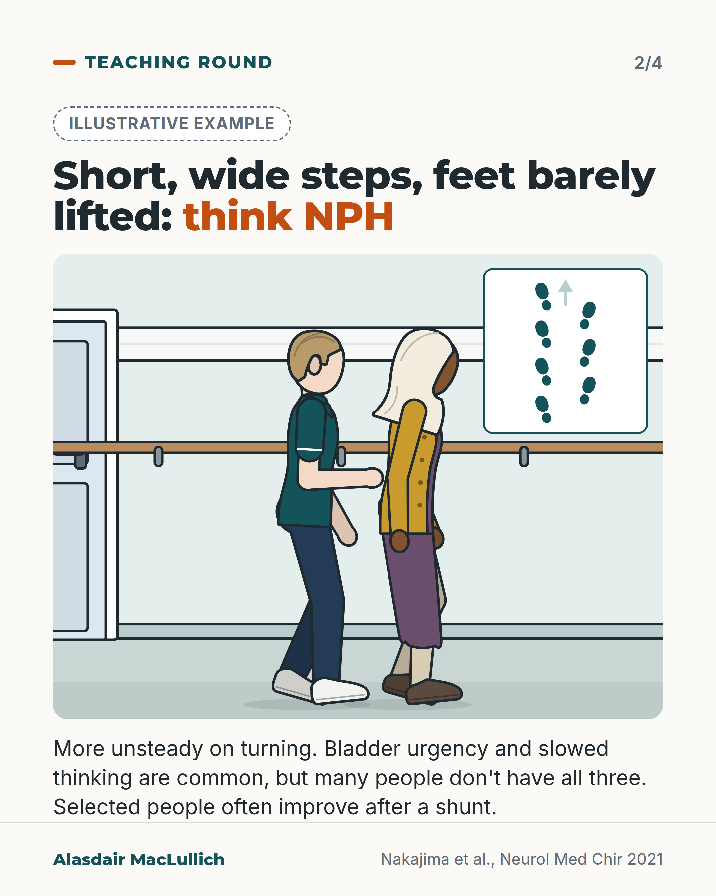
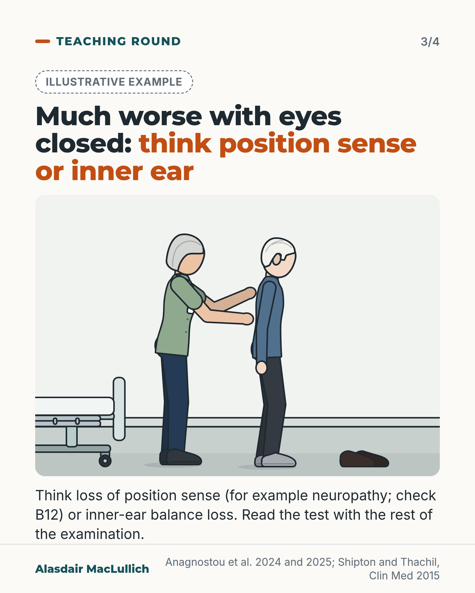
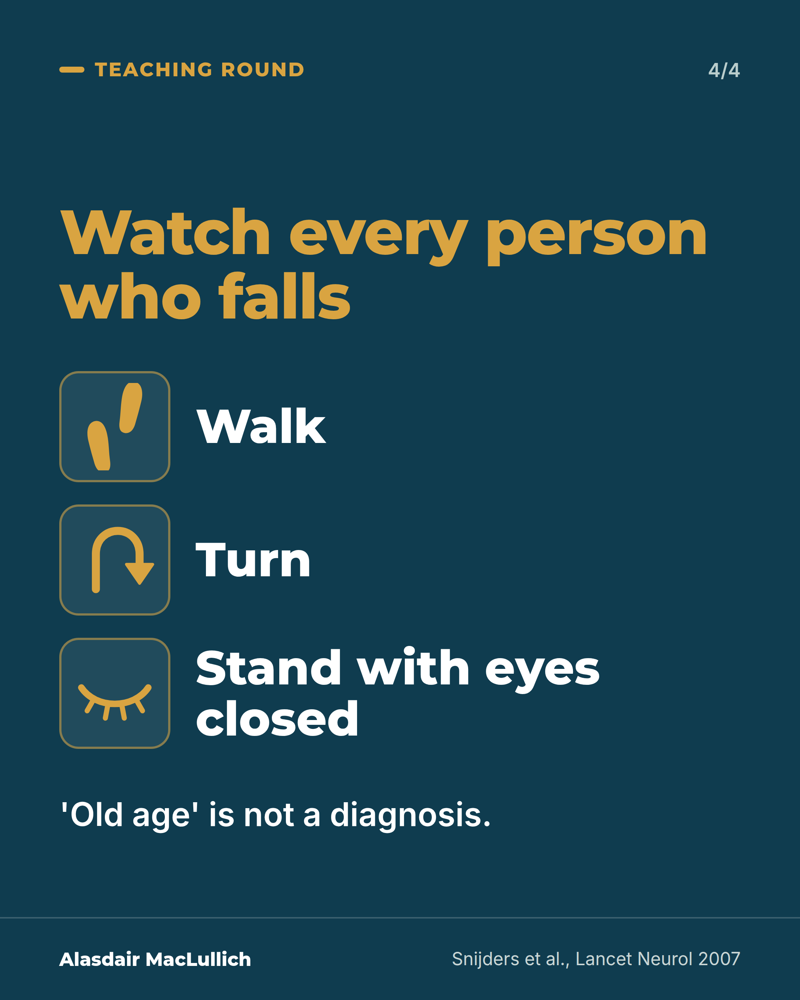

# G010: Watch the walk

- Category: C01 Falls and fear of falling
- Audience: practitioners
- Series: Teaching round
- Post type: teaching
- Visual format: carousel (3 drawn illustrations + statement card)
- Status: text text_final, visual final
- Working id: C01-P10 (candidate C01-27)

## Insight

Three patterns of walking and falling point towards named, sometimes treatable conditions: repeated early falls in a Parkinson-like illness (think PSP), short wide-based steps with feet barely lifted (think NPH), and much worse balance with eyes closed (think loss of position sense or inner-ear balance loss).

## Angle and position

Falls as a symptom of something else. Position: watch every person who falls walk, turn and stand with eyes closed before putting the problem down to age.

Basis: mixed: the diagnostic criteria, gait descriptions and shunt outcomes are empirical and guideline findings; the instruction to examine every faller this way is clinical interpretation.

## X (980 characters)

```text
Repeated falls from poor balance in the first 3 years of a Parkinson-like illness are a reason to question the diagnosis.

In the Movement Disorder Society criteria they are a warning sign against Parkinson's disease. In small autopsy-confirmed series, past case notes recorded such falls in about 4 in 100 people with Parkinson's disease and about 1 in 3 with progressive supranuclear palsy (PSP). With slowed up-and-down eye movements, they support probable PSP.

Short, wide-based steps, feet barely lifted, more unsteady on turning: think normal pressure hydrocephalus. Bladder urgency and slowed thinking are common, but many people don't have all three. Selected people often improve after a shunt.

Much more unsteady with eyes closed than open: think loss of position sense, for example from neuropathy (B12 deficiency is one treatable cause), or loss of inner-ear balance.

Watch every person who falls walk, turn and stand with eyes closed before putting it down to age.
```

## LinkedIn (2147 characters)

```text
Repeated falls from poor balance in the first 3 years of a Parkinson-like illness are a reason to question the diagnosis.

A walking problem in later life usually has a cause that can be named. 'Old age' is not a diagnosis. Watch for three patterns.

1. Repeated falls without a clear cause in the first 3 years: think progressive supranuclear palsy (PSP). In the Movement Disorder Society criteria for PSP, repeated unprovoked falls within 3 years of the first symptoms are a core feature; with slowed or restricted up-and-down eye movements, they support probable PSP. In the Parkinson's disease criteria, the same early falls are a warning sign that the illness may be something else. In small autopsy-confirmed series, past case notes recorded early falls in about 4 in 100 people with Parkinson's disease and about 1 in 3 with PSP. It is a warning sign, not an exclusion: make sure dopamine treatment is adequate before relying on it. Remember too that in this small series (28 PSP cases, from past notes), about two thirds had no early falls recorded.
2. Short, wide-based steps, feet barely lifted, more unsteady on turning: think normal pressure hydrocephalus (NPH). Almost everyone with NPH has the walking problem. Bladder urgency and slowed thinking are common, but many people don't have all three, so don't wait for the full set. In reported series, roughly 6 to 8 in 10 people selected for a shunt were better a year later, and walking improved most.
3. Much more unsteady standing with eyes closed than open: the person is relying on vision to balance. Think loss of position sense in the feet and legs, for example from neuropathy, or loss of inner-ear balance function. One treatable cause of neuropathy to check is vitamin B12 deficiency, which can damage nerves and the spinal cord even when the blood count is normal. Read the test with the rest of the examination.

Gait problems in older people often have several causes at once, so one named condition may not explain everything. It may still be the part that can be treated.

Watch every person who falls walk, turn and stand with eyes closed before putting it down to age.
```

## Bluesky (295 characters)

```text
Before blaming falls on age, watch the walk. Repeated early falls in a Parkinson-like illness: think progressive supranuclear palsy.

Short, wide steps, feet barely lifted, unsteady on turning: think normal pressure hydrocephalus. Much worse with eyes closed: think neuropathy or inner-ear loss.
```

## Threads (444 characters)

```text
Before putting falls down to age, watch the walk.

Repeated falls without a clear cause in the first 3 years of a Parkinson-like illness: think progressive supranuclear palsy (PSP), and question the diagnosis.

Short, wide-based steps, feet barely lifted, unsteady on turning: think normal pressure hydrocephalus. Selected people often improve after a shunt.

Much worse with eyes closed: think neuropathy (check B12) or inner-ear balance loss.
```

## Source reply

Sources: https://doi.org/10.1002/mds.26987 (PSP criteria) https://doi.org/10.1038/s41531-025-01206-6 (PD criteria and autopsy data) https://doi.org/10.2176/nmc.st.2020-0292 (NPH guideline) https://doi.org/10.7861/clinmedicine.15-2-145 (B12 review)

## Visual



Alt text: Illustrative drawing: a clinician raises her hand in front of a seated older man's eyes, arrows showing up-and-down movement. Text: repeated falls in the first 3 years, think PSP; check up-and-down eye movements; question a Parkinson's diagnosis. Early falls were recorded in about 4 in 100 of 124 autopsy-confirmed Parkinson's cases and about 1 in 3 of 28 PSP cases.



Alt text: Illustrative drawing: an older South Asian woman walks a hospital corridor with short steps, a physiotherapist a pace behind with a hand ready. An inset shows footprints from above, short steps set wide apart. Text: think normal pressure hydrocephalus; more unsteady on turning; bladder urgency and slowed thinking are common but often not all three; selected people often improve after a shunt.



Alt text: Illustrative drawing: an older man in socks stands with feet together, shoes beside him, while a clinician stands behind with both hands ready near his back, not touching. Text: much worse with eyes closed, think loss of position sense, for example neuropathy (check B12), or inner-ear balance loss; read the test with the rest of the examination.



Alt text: Card: watch every person who falls walk, turn and stand with eyes closed. 'Old age' is not a diagnosis.

Editable source: `visuals/src/G010.html`

Design instructions: Four cards, series Teaching round. Cards 1-3 light: dashed illustrative badge, h1.s headline with orange em phrase, kit.js scene, 32px body. Card 1 gp_room: seated older white man in cardigan, stick leaning on chair, Black female clinician standing with hand at his eye level, orange up/down arrows; mint stat box (claim C01-27-b: 3.8% of 124 PD, 33.6% of 28 PSP as about 4 in 100 and about 1 in 3). Card 2 hospital corridor with handrail and door: South Asian woman (headscarf, plum kameez as midi skirt, oat salwar, mustard cardigan) walking stride 0.18, white male physio behind, hand ready; inset top-down footprints short and wide (C01-27-c,d,e). Card 3 gp_room: East Asian man side view, feet together, grey socks, shoes on floor; white female clinician behind with both hands near his back (C01-27-f,g). Card 4 deep teal: gold headline, three rows with gold line icons (footprints, turn arrow, closed eye) and 64px white words, closing line (C01-27-h).

## Sources and verification

- C01-27-a (supported_with_qualification): Repeated unprovoked falls within 3 years of onset are a core feature (P1, highest certainty level) in the MDS criteria for progressive supranuclear palsy; 'backward' falls are not part of the criterion wording.
  - Source: Hoglinger GU, Respondek G, Stamelou M, Kurz C, Josephs KA, Lang AE, et al. Clinical diagnosis of progressive supranuclear palsy: the Movement Disorder Society criteria. Mov Disord. 2017;32(6):853-64.
  - Passage: "Table 2, Postural instability, Level 1: "P1: Repeated unprovoked falls within 3 years". Table 4 definition: "Spontaneous loss of balance while standing, or history of more than one unprovoked fall, within 3 years after onset of PSP-related features." Discussion: "We are also aware of several other clinical signs that have been proposed to indicate the diagnosis of PSP, for example, retropulsion with spontaneous backward falls ... Whereas these signs may indeed be helpful to raise suspicion about PSP, we found no clear evidence suggesting that they would indeed contribute reliable information to substantiate the diagnosis of PSP." Table 5: Probable PSP = "(O1 or O2) + (P1 or P2)", "PSP with Richardson's syndrome"." (Tables 2, 4 and 5; Discussion)
- C01-27-b (supported_with_qualification): Recurrent falls due to impaired balance within 3 years of onset are a red flag against Parkinson's disease in the 2015 MDS criteria, and in autopsy-confirmed cases they were documented far less often in PD than in atypical parkinsonism.
  - Source: Fox SH, et al. Revisiting the 2015 MDS diagnostic criteria for Parkinson disease: insights from autopsy-confirmed cases. NPJ Parkinsons Dis. 2025.
  - Passage: "Red Flags were described as negative features which are potential signs of alternate pathology, but with lower or uncertain specificity. Red Flags rule out probable PD only when they cannot be counterbalanced by supportive criteria ... Table 1: "Recurrent falls (>1 per year) within first 3 years". Results: "'Recurrent falling because of impaired balance within 3 y' was reported in 3.8% of 124 PD cases and 28% in 19 DLB cases. In 274 MSA cases, these early falls were reported in 28.8%, in 33.6% of 28 PSP cases and in 22% of 27 CBD cases." Discussion: "Items with less clear discriminative value were 'rapid progression of gait impairment', 'recurrent falls', and 'bilateral symmetric Parkinsonism', as these features were reported in 3.8–17.6% of PD cases."" (Introduction; Table 1; Results, Red Flags; Discussion)
- C01-27-c (supported): The gait of idiopathic normal pressure hydrocephalus (NPH) is small-stepped, magnetic (feet barely lifted) and broad-based, and becomes unstable on turning.
  - Source: Nakajima M, Yamada S, Miyajima M, Ishii K, Kuriyama N, Kazui H, et al. Guidelines for management of idiopathic normal pressure hydrocephalus (third edition): endorsed by the Japanese Society of Normal Pressure Hydrocephalus. Neurol Med Chir (Tokyo). 2021;61(2):63-97.
  - Passage: "Gait disturbance in iNPH has three characteristics: small-step gait, magnet gait, and broad-based gait. Walking becomes unstable and slow. ... When changing directions, steps are small and unstable. ... pathological gait features, such as small-step gait (short length of stride), broad-based gait (increasingly large step intervals), instability, difficulty in changing directions, frozen gait (no first step taken), and shuffle (dragging of feet and decreased elevation)" (Chapter 1, Characteristics and evaluation of gait disturbance; Chapter 3, CSF drainage test)
- C01-27-d (supported_with_qualification): Gait disturbance is the commonest symptom of NPH; bladder symptoms and cognitive change are common but the full triad is often incomplete.
  - Source: Nakajima M, Yamada S, Miyajima M, Ishii K, Kuriyama N, Kazui H, et al. Guidelines for management of idiopathic normal pressure hydrocephalus (third edition): endorsed by the Japanese Society of Normal Pressure Hydrocephalus. Neurol Med Chir (Tokyo). 2021;61(2):63-97.
  - Passage: "The percentage of gait disturbance is 94–100%, which is consistent in almost all studies and is seen in almost all iNPH cases. The rates reported for cognitive impairment and urinary dysfunction vary, being 78–98% and 60–92%, respectively. Consistently, gait disturbance is the most common symptom of iNPH, followed by cognitive impairment and urinary incontinence. Many reports state that the triad is complete in approximately 60% of cases. Meanwhile, a large-scale questionnaire survey conducted in Japan in 2012 revealed that the full triad was present in only 12.1% of 1524 patients. ... Urge incontinence associated with an overactive bladder is characteristic of dysuria in patients with iNPH." (Chapter 1, sections 4 and 5)
- C01-27-e (supported_with_qualification): Shunt surgery is effective for NPH and many people improve, with walking improving most.
  - Source: Nakajima M, Yamada S, Miyajima M, Ishii K, Kuriyama N, Kazui H, et al. Guidelines for management of idiopathic normal pressure hydrocephalus (third edition): endorsed by the Japanese Society of Normal Pressure Hydrocephalus. Neurol Med Chir (Tokyo). 2021;61(2):63-97.
  - Passage: "CSF shunt intervention is effective for treating iNPH. Recommendation Grade 1, Level of Evidence B ... Symptoms usually improve after surgical intervention. ... The degree of improvement in gait disturbance is the highest, followed by cognitive impairment and urinary dysfunction. ... Based on evaluations such as mRS, improvement rate after shunt intervention is reported to be approximately 39–81% in 3–6 months, 63–84% in 1 year, 69% in 2 years, and approximately 60–74% in 3–6 years. ... gait disturbance showed the highest rate of improvement ... approximately 60–77%." (Chapter 4, CQ-10; Chapter 5, CQ-14 and prognosis)
- C01-27-f (supported_with_qualification): Marked unsteadiness with eyes closed (a positive Romberg test) points to loss of position sense, for example from neuropathy, but also occurs with loss of inner-ear balance function; it is not a test of cerebellar function.
  - Source: Anagnostou E, Gamvroula A, Kouvli M, Karagianni E, Stranjalis G, Skoularidou M, et al. A refined vestibular Romberg test to differentiate somatosensory from vestibular-induced disequilibrium. Diagnostics (Basel). 2025;15(13):1621.; Anagnostou E, Kouvli M, Karagianni E, Gamvroula A, Kalamatianos T, Stranjalis G, et al. Romberg's test revisited: changes in classical and advanced sway metrics in patients with pure sensory neuropathy. Neurophysiol Clin. 2024;54(5):102999.
  - Passage: "In clinical neurology, the Romberg test is traditionally used to assess postural stability by altering visual input, thereby unmasking disequilibrium in patients with sensory ataxia caused by proprioceptive deficits. ... The classic Romberg test primarily evaluates proprioceptive function, particularly the integrity of the posterior columns of the spinal cord. ... It is not a test of cerebellar function, as cerebellar dysfunction typically leads to balance impairment regardless of visual input. ... While the Romberg test is standard, it fails to clearly differentiate vestibular from sensory ataxia. (Anagnostou 2025) / ... sensory ataxia, as both conditions typically present with a positive classical Romberg test. (Anagnostou 2025 abstract) / We conclude that the Romberg test ... had an unsatisfactory classification value in terms of distinguishing patients from healthy controls. Instead, it should be interpreted within the comprehensive context of the broader neurological examination and the electrodiagnosis of peripheral nerve function. (Anagnostou 2024 abstract)" (Anagnostou 2025 Abstract and Introduction; Anagnostou 2024 Abstract)
- C01-27-g (supported_with_qualification): Vitamin B12 deficiency can cause peripheral neuropathy and spinal cord degeneration, sometimes without anaemia, and damage can become permanent if untreated.
  - Source: Shipton MJ, Thachil J. Vitamin B12 deficiency: a 21st century perspective. Clin Med (Lond). 2015;15(2):145-50.
  - Passage: "Table 2 Neurological: "Peripheral neuropathy, subacute combined degeneration of the cord and autonomic eg bowel/urinary incontinence and erectile dysfunction" ... "No particular correlation between haematological and neurological features has been demonstrated, such that those with neurological symptoms may have no haematological abnormalities, and vice-versa." ... "Sequelae of untreated vitamin B12 deficiency includes not only permanent neurological symptoms, but also osteoporosis and cardiovascular disease."" (Table 2; When should vitamin B12 deficiency be suspected?; Learning points)
- C01-27-h (supported): Gait disorders in older people are not an unpreventable consequence of ageing but point to underlying diseases that need specific tests.
  - Source: Snijders AH, van de Warrenburg BP, Giladi N, Bloem BR. Neurological gait disorders in elderly people: clinical approach and classification. Lancet Neurol. 2007;6(1):63-74.
  - Passage: "Another relevant message is that gait disorders are not an unpreventable consequence of ageing, but implicate the presence of underlying diseases that warrant specific diagnostic tests." (Abstract)

Verification notes: C01-27-a (Höglinger 2017 full text): repeated unprovoked falls within 3 years a core PSP feature; with vertical eye movement signs support probable PSP; 'backward' not used. C01-27-b (Fox 2025 full text): early recurrent falls a warning sign against PD (the criteria term is rendered as warning sign); 3.8% of 124 PD and 33.6% of 28 PSP autopsy cases; not an exclusion; check dopamine treatment; two thirds of PSP without early falls. Postuma 2015 not opened; wording from Fox. C01-27-c and d (Nakajima 2021 guideline full text): gait description; triad often incomplete. C01-27-e: 63% to 84% improved at 1 year in selected patients, stated as roughly 6 to 8 in 10. C01-27-f (Anagnostou 2024 abstract, 2025 full text): eyes-closed instability, position sense or inner-ear loss; a pointer. C01-27-g (Shipton 2015 full text): B12 linked to neuropathy and cord damage, not to the Romberg sign directly. C01-27-h (Snijders 2007 abstract): gait disorders have nameable causes; often multifactorial (stated). The unverified fourth vignette (Parkinson's gait) was cut.

## Attention and follow potential

Pause: A specific diagnostic point clinicians can use on the next ward round or in clinic.

Gain: A structured way to watch gait, and three named conditions to consider, some treatable.

Follow: High-yield clinical teaching with each label matched to its source.

## Open issues

- Visual rendered and read back by the designer; not independently inspected.
