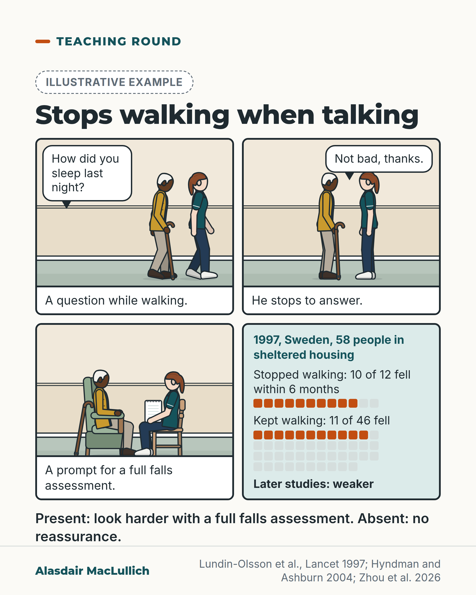

# G011: Stops walking when talking

- Category: C01 Falls and fear of falling
- Audience: practitioners
- Series: Teaching round
- Post type: teaching
- Visual format: comic strip (4 panels)
- Status: text text_final, visual final
- Working id: C01-P11 (candidate C01-24)

## Insight

Stopping walking to answer a question was linked with falls in a very small 1997 study, where it was rarely a false alarm but missed most people who fell. Later studies found it weaker, so a positive sign means look harder and a negative sign does not reassure.

## Angle and position

A famous bedside sign from a tiny study: useful when present, weak as reassurance when absent. Position: treat stopping walking when talking as a prompt for a full falls assessment; its absence gives no reassurance.

Basis: mixed: the counts and later study results are empirical findings; the rule for using the sign is clinical interpretation drawn from them.

## X (820 characters)

```text
Some older people stop walking when you start talking to them. A small 1997 study in Sweden linked this with falls.

Of 58 older people in sheltered housing, 12 stopped walking when someone started a conversation. Ten of those 12 fell in the next 6 months, compared with 11 of the 46 who kept walking.

So the sign was rarely a false alarm. But most of the people who fell (11 of 21) had kept walking.

Later studies found it weaker. In people with stroke living at home, it gave more false alarms: 10 of the 26 who stopped did not fall, and it still missed about half of those who fell. Among over 4000 healthy older volunteers, fewer than 3 in 100 stopped, and stopping was not linked with past falls.

If someone stops walking to talk, do a full falls assessment. If they keep walking, don't take that as reassurance.
```

## LinkedIn (1301 characters)

```text
Some older people stop walking when you start talking to them. A small 1997 study in Umeå, Sweden, linked this with falls.

The researchers studied 58 older people in sheltered housing, many with dementia, depression or stroke. Twelve stopped walking when someone started a conversation. Ten of those 12 fell in the next 6 months, compared with 11 of the 46 who kept walking.

Read those numbers both ways. Of the 37 people who did not fall, only 2 had stopped walking, so the sign was rarely a false alarm. But of the 21 who fell, 11 had kept walking. Most fallers would have passed the test.

The sign rests on 12 people in one setting, and later studies found it weaker. In 63 people with stroke living at home, it gave more false alarms (10 of the 26 who stopped did not fall) and, as in 1997, missed about half of those who fell. A 2000 report, cited by the stroke study's authors, could not repeat the 1997 result in people with Parkinson's disease. Among over 4000 healthy older volunteers, fewer than 3 in 100 stopped walking, and stopping was not linked with past falls.

It may work best in frail older people like those in the original study, many of whom had dementia, depression or stroke.

A positive sign means look harder: do a full falls assessment. A negative sign does not reassure.
```

## Bluesky (293 characters)

```text
Stopping walking to answer a question: in a 1997 Swedish study, 10 of 12 people who did this fell within 6 months, against 11 of 46 who kept walking. In a stroke study, this sign missed about half of those who later fell.

If present, do a full falls assessment. If absent, don't be reassured.
```

## Threads (439 characters)

```text
Some older people stop walking when you start talking to them.

In a 1997 Swedish study of 58 people in sheltered housing, 10 of the 12 who did this fell within 6 months, against 11 of the 46 who kept walking. In a stroke study, this sign missed about half of those who later fell. Among healthy older volunteers, few people showed it at all.

If someone stops to talk, do a full falls assessment. If they keep walking, don't be reassured.
```

## Source reply

Sources: https://doi.org/10.1016/S0140-6736(97)24009-2 (Lundin-Olsson 1997) https://doi.org/10.1136/jnnp.2003.016014 (stroke study 2004) https://doi.org/10.1186/s11556-026-00423-z (healthy volunteers 2026)

## Visual



Alt text: Illustrative comic. A physiotherapist asks an older man with a stick a question while walking; he stops to answer; they sit and she takes notes. Panel 4: 1997 Swedish study of 58 people in sheltered housing; stopped walking, 10 of 12 fell within 6 months; kept walking, 11 of 46 fell (filled squares); later studies weaker. Present: look harder with a full falls assessment. Absent: no reassurance.

Editable source: `visuals/src/G011.html`

Design instructions: Single light card, series Teaching round. Dashed illustrative badge, h1.s headline, .strip.p4 2x2: panels 1-3 kit.js care_home_lounge (viewBox 500x370, scale 0.66) with physio (white woman, ponytail, teal polo) and older Black man (white hair, navy, mustard cardigan, crook stick); typeset speech bubbles in panels 1-2, captions below. Panel 4 mint: study text 26px plus square arrays 10 of 12 and 11 of 46 filled orange (claim C01-24-a), 'Later studies: weaker' (C01-24-c). Bold 31px rule line below. Footer three-source credit.

## Sources and verification

- C01-24-a (supported_with_qualification): In a 1997 study of 58 residents of sheltered accommodation in Umea, Sweden, 10 of the 12 who stopped walking when a conversation started fell within 6 months, compared with 11 of the 46 who kept walking.
  - Source: Lundin-Olsson L, Nyberg L, Gustafson Y. "Stops walking when talking" as a predictor of falls in elderly people. Lancet. 1997;349(9052):617.; Hyndman D, Ashburn A. "Stops walking when talking" as a predictor of falls in people with stroke living in the community. J Neurol Neurosurg Psychiatry. 2004;75(7):994-7.
  - Passage: "58 residents in sheltered accommodation in Umea, Sweden, were included. All were able to walk with or without aids and able to follow simple instructions (mean age [SD] 80·1 [6·1] years; 72% women). The most common diagnoses (some had more than one) were dementia (n=26), depression (25), and previous stroke (20). ... The staff registered falls indoors during a followup of 6 months. ... 12 people stopped walking when a conversation started and ten of them fell during the 6-month follow-up. 21 people fell at least once. ... The positive predictive value of “stops walking when talking” was 83% (10/12) and the negative predictive value was 76% (35/46). (Lundin-Olsson 1997, letter text) / Lundin-Olsson and colleagues12 13 reported that this test demonstrated good specificity (95%) as well as acceptable positive predictive values (PPV, 83%) and negative predictive values (NPV, 76%) with moderate sensitivity (48%) in predicting falls. (Hyndman 2004, Introduction)" (Lundin-Olsson 1997 letter (text via Consensus record); Hyndman 2004 Introduction)
- C01-24-c (supported): Later studies in other populations found the sign less accurate or not linked with falls.
  - Source: Hyndman D, Ashburn A. "Stops walking when talking" as a predictor of falls in people with stroke living in the community. J Neurol Neurosurg Psychiatry. 2004;75(7):994-7.; Zhou T, Straub E, Kiesel A, Gehring D, Granacher U, Haslbauer A, et al. Functional reserve mitigates cognitive-motor dual-task costs in older adults: insights from age, cohort, and behavioural strategies. Eur Rev Aging Phys Act. 2026;23(1).
  - Passage: "Twenty six subjects stopped walking when a conversation was started and 16 of them fell during the six month follow up period ... For all fallers (>=1) the positive predictive value of SWWT was 62% (16/26), the negative predictive value 62% (23/37), specificity 70% (23/33) and sensitivity 53% (16/30). ... Although the SWWT test was easy to use, its clinical usefulness as a single indicator of fall risk in identifying those community dwelling people with stroke most at risk of falls and in need of therapeutic intervention is questionable. ... In summary, although the SWWT test has shown promising results in predicting falls among frail elderly subjects, these findings could not be repeated among people with PD. (Hyndman 2004) / SWWT was rare (2.8%), yet associated with higher motor DTCs but not falls, suggesting compensatory strategy. ... SWWT (β=0.01, p = .951) ... were nonsignificant. ... First, the cross-sectional design inherently limits causal inferences. (Zhou 2026)" (Hyndman 2004 Abstract and Introduction; Zhou 2026 Abstract, Results, Limitations)

Verification notes: C01-24-a (Lundin-Olsson 1997 via the Consensus reproduction of the letter; percentages also in Hyndman 2004 full text): 58 residents of sheltered accommodation, many with dementia, depression or stroke; 10 of 12 who stopped fell within 6 months, 11 of 46 who kept walking. The '2 of 37 non-fallers stopped' and '11 of 21 fallers kept walking' statements are arithmetic from these counts (21 fell; 58 minus 21 is 37). The specific-but-insensitive reading is the original study's own and is not attributed to Beauchet 2009; C01-24-b (partly supported, because of that misattribution) is not cited. C01-24-c (Hyndman 2004 full text; Zhou 2026 full text): stroke study sensitivity 53%, specificity 70%; healthy volunteers 2.8% stopped, not linked with past falls (cross-sectional); Parkinson's point is second-hand from Hyndman. 'May work best in frail older people like those in the original study' follows the conflicting-evidence note (setting wording corrected after fact-check C01). Dual-task background (C01-24-d) not used.

## Attention and follow potential

Pause: A moment clinicians see every day, and a sign many were taught.

Gain: A quick sign and exactly how much weight to give it either way.

Follow: The account teaches how to judge the evidence behind bedside signs.

## Open issues

- The Lundin-Olsson 1997 counts come from the Consensus reproduction of the letter (PubMed has no abstract); percentages are also in the Hyndman 2004 full text.
- Visual rendered and read back by the designer; not independently inspected.
