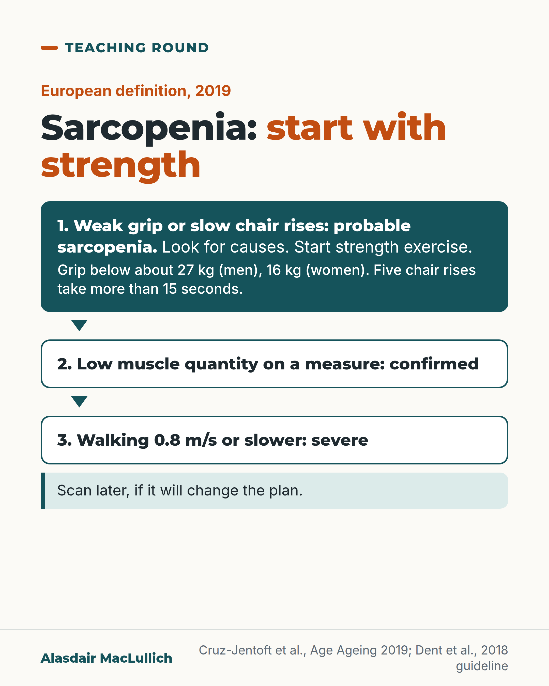

# G012: Sarcopenia starts with a weak grip

- Category: C02 Mobility, deconditioning and rehabilitation
- Audience: practitioners
- Series: Teaching round
- Post type: teaching
- Visual format: diagram (flow)
- Status: text text_final, visual final
- Working id: C02-P01 (candidate C02-18)

## Insight

Under the European definition, weak grip or slow chair rises already mean probable sarcopenia, which is enough to look for causes and start strength training. A muscle scan can come later if it will change what you do.

## Angle and position

Teach the strength-first pathway and argue that treatment should not wait for imaging.

Basis: mixed: the pathway, cut-offs and treatment recommendations are empirical/consensus statements (EWGSOP2, ICFSR); 'do not wait for a scan to start exercise' is clinical interpretation consistent with EWGSOP2's own practice statement

## X (669 characters)

```text
A grip dynamometer and an ordinary chair are enough to find probable sarcopenia (loss of muscle strength and mass).

Since 2019 the European definition puts strength first. Grip below about 27 kg in men or 16 kg in women, or more than 15 seconds for five chair rises without the arms, counts as low strength.

In everyday practice, the European group says that is enough to look for causes and start treatment. A muscle scan can come later, if it will change what you do.

The treatment the international guideline strongly recommends is resistance (strength) exercise. No medicine is licensed for sarcopenia.

Test grip in anyone who falls, feels weak or walks slowly.
```

## LinkedIn (1760 characters)

```text
A grip dynamometer and an ordinary chair are enough to find probable sarcopenia (loss of muscle strength and mass).

Since 2019, the main European definition (EWGSOP2) has put strength first:

1. Low strength means sarcopenia is "probable": grip below about 27 kg in men or 16 kg in women, or more than 15 seconds to stand up five times from a chair without using the arms.
2. A measure of muscle quantity confirms it.
3. A usual walking speed of 0.8 metres per second or slower marks it as severe.

In everyday practice, the European group says weak grip or slow chair rises are enough to start looking for causes and to start treatment. A scan to measure muscle can come later, if the result will change what you do.

"Look for causes" is part of the instruction. Low strength can have other causes, such as depression, stroke, balance disorders or peripheral vascular disease.

On treatment, the international sarcopenia guideline (ICFSR, 2018) strongly recommends resistance exercise and gives a weaker recommendation for extra protein. It makes no recommendation for vitamin D or hormones. A 2022 expert review notes there is no licensed medicine for sarcopenia.

One proposed starting programme from that review: strength exercises for arms and legs twice a week, one to three sets of 6 to 12 repetitions, hard enough that the last few feel like real effort. Adapt it for pain, heart disease and frailty, with a physiotherapist where needs are complex.

The cut-offs are European and grip needs a calibrated dynamometer used in a standard way. Other regions use their own thresholds.

In the patient who falls, feels weak or walks slowly, test grip today rather than waiting for a scan.

More Teaching round posts take one clinical distinction at a time.
```

## Bluesky (296 characters)

```text
Sarcopenia (loss of muscle strength and mass) starts with weakness.

European definition: grip below about 27 kg (men) or 16 kg (women), or more than 15 seconds for five chair rises, means probable sarcopenia.

That is enough to look for causes and start strength training. A scan can come later.
```

## Threads (459 characters)

```text
A dynamometer and a chair can find probable sarcopenia (loss of muscle strength and mass).

European definition since 2019: grip below about 27 kg in men or 16 kg in women, or more than 15 seconds for five chair rises without arms, means low strength.

The European group says that is enough to look for causes and start treatment. The guideline's strongly recommended treatment is strength exercise.

A muscle scan can come later, if it will change the plan.
```

## Source reply

Sources: EWGSOP2 https://doi.org/10.1093/ageing/afy169 ; ICFSR guideline https://doi.org/10.1007/s12603-018-1139-9 ; Sayer and Cruz-Jentoft 2022 https://doi.org/10.1093/ageing/afac220

## Visual



Alt text: Flow diagram of the European sarcopenia definition, 2019. Step 1: weak grip (below about 27 kg in men, 16 kg in women) or five chair rises over 15 seconds means probable sarcopenia; look for causes and start strength exercise. Step 2: low muscle quantity confirms it. Step 3: walking 0.8 m/s or slower marks it severe. A scan can come later if it will change the plan.

Editable source: `visuals/src/G012.html`

Design instructions: Flow diagram card, three stacked steps, first step in deep teal to show treatment starts at step 1.

## Sources and verification

- C02-18-a (supported): Under the 2019 European definition (EWGSOP2), low muscle strength is the primary parameter: low strength means probable sarcopenia, low muscle quantity or quality confirms it, and low physical performance marks it as severe.
  - Source: Cruz-Jentoft AJ, Bahat G, Bauer J, Boirie Y, Bruyère O, Cederholm T, et al. Sarcopenia: revised European consensus on definition and diagnosis. Age Ageing. 2019;48(1):16-31.
  - Passage: ""In its 2018 definition, EWGSOP2 uses low muscle strength as the primary parameter of sarcopenia; muscle strength is presently the most reliable measure of muscle function (Table). Specifically, sarcopenia is probable when low muscle strength is detected. A sarcopenia diagnosis is confirmed by the presence of low muscle quantity or quality. When low muscle strength, low muscle quantity/quality and low physical performance are all detected, sarcopenia is considered severe." Also: "In these revised guidelines, muscle strength comes to the forefront, as it is recognised that strength is better than mass in predicting adverse outcomes"" (Full text, section 'Sarcopenia: operational definition')
- C02-18-b (supported_with_qualification): EWGSOP2 cut-offs: grip strength below 27 kg in men and 16 kg in women, or more than 15 seconds for five chair rises, indicate low strength; a usual gait speed of 0.8 m/s or less indicates severe sarcopenia.
  - Source: Cruz-Jentoft AJ, Bahat G, Bauer J, Boirie Y, Bruyère O, Cederholm T, et al. Sarcopenia: revised European consensus on definition and diagnosis. Age Ageing. 2019;48(1):16-31.; Habboub B, Oludowole E, Speer R, Masuch J, Berger U, Gosch M, Singler K. Parker Mobility Score as a screening tool for sarcopenia in older German adults: a cross-sectional analysis of trial data. Health Sci Rep. 2026;9(4):e72341.; Brennan-Olsen SL, Bowe SJ, Kowal P, Naidoo N, Quashie NT, Eick G, et al. Functional measures of sarcopenia: prevalence, and associations with functional disability in 10,892 adults aged 65 years and over from six lower- and middle-income countries. Calcif Tissue Int. 2019;105(6):609-18.; Huemer MT, Kluttig A, Fischer B, Ahrens W, Castell S, Ebert N, et al. Grip strength values and cut-off points based on over 200,000 adults of the German National Cohort - a comparison to the EWGSOP2 cut-off points. Age Ageing. 2023;52(1):afac324.
  - Passage: "EWGSOP2 Figure 2 caption: "Cut-off points based on T-score of ≤ -2.5 are shown for males and females (≤ 27 kg and 16 kg, respectively)." EWGSOP2 text: "The chair stand test measures the amount of time needed for a patient to rise five times from a seated position without using his or her arms" and "For simplicity, a single cut-off speed ≤0.8 m/s is advised by EWGSOP2 as an indicator of severe sarcopenia." Habboub 2026 abstract: "Sarcopenia was defined using EWGSOP2 criteria: probable sarcopenia as handgrip strength < 27 kg (men) or < 16 kg (women) and/or chair stand test > 15 s." Brennan-Olsen 2019: "the EWGSOP2 cut-points [11] of < 27 kg for men and < 16 kg for women as indicative of low grip strength"" (EWGSOP2 full text (Figure 2 caption; 'Muscle strength' and 'Physical performance' sections); Habboub 2026 Abstract, Methods; Brennan-Olsen 2019 full-text excerpt)
- C02-18-c (supported_with_qualification): EWGSOP2 states that in clinical practice low muscle strength (probable sarcopenia) is enough to trigger assessment of causes and to start intervention, without waiting for a muscle-mass measurement.
  - Source: Brennan-Olsen SL, Bowe SJ, Kowal P, Naidoo N, Quashie NT, Eick G, et al. Functional measures of sarcopenia: prevalence, and associations with functional disability in 10,892 adults aged 65 years and over from six lower- and middle-income countries. Calcif Tissue Int. 2019;105(6):609-18.; Cruz-Jentoft AJ, Bahat G, Bauer J, Boirie Y, Bruyère O, Cederholm T, et al. Sarcopenia: revised European consensus on definition and diagnosis. Age Ageing. 2019;48(1):16-31.
  - Passage: "Brennan-Olsen 2019 (full-text excerpt): "The revised EWGSOP2 consensus regarding sarcopenia identified that, in clinical practice, low grip strength is enough to trigger assessment of causes and start intervention for sarcopenia [11], which is indicative of an increasing focus on muscle strength rather than muscle mass as a key determinant of sarcopenia". EWGSOP2 Figure 1 note (PMC text): "Consider other reasons for low muscle strength (e.g. depression, sroke, balance disorders, peripheral vascular disorders)."" (Brennan-Olsen 2019 Discussion (Scite full-text excerpt); EWGSOP2 Figure 1 legend)
- C02-18-d (supported): The 2018 international (ICFSR) guideline strongly recommends resistance-based physical activity to treat sarcopenia, conditionally recommends protein supplementation or a protein-rich diet, and gives no recommendation for vitamin D or anabolic hormones.
  - Source: Dent E, Morley JE, Cruz-Jentoft AJ, Arai H, Kritchevsky SB, Guralnik J, et al. International Clinical Practice Guidelines for Sarcopenia (ICFSR): screening, diagnosis and management. J Nutr Health Aging. 2018;22(10):1148-61.; Sayer AA, Cooper R, Arai H, Cawthon PM, Ntsama Essomba MJ, Fielding RA, et al. Sarcopenia. Nat Rev Dis Primers. 2024;10(1):68.
  - Passage: "Dent 2018: "To treat sarcopenia, we strongly recommend the prescription of resistance-based physical activity, and conditionally recommend protein supplementation/a protein-rich diet. No recommendation is given for Vitamin D supplementation or for anabolic hormone prescription. There is a lack of robust evidence to assess the strength of other treatment options." Sayer 2024: "Resistance exercise is currently the mainstay of treatment; however, it is not suitable for all."" (Dent 2018 Abstract (Results); Sayer 2024 Abstract)
- C02-18-g (supported_with_qualification): No medicine is licensed for sarcopenia.
  - Source: Sayer AA, Cruz-Jentoft A. Sarcopenia definition, diagnosis and treatment: consensus is growing. Age Ageing. 2022;51(10):afac220.
  - Passage: ""Progress in developing effective drug treatments has been slow [,] and there are no licenced drugs for sarcopenia because initially promising avenues to date have not been supported by findings from well conducted randomised controlled trials []."" (Full text, 'Looking ahead')
- C02-18-h (supported_with_qualification): A practical starting dose of resistance exercise for sarcopenia is two sessions a week of upper- and lower-body exercises, 1-3 sets of 6-12 repetitions, with a relatively high degree of effort.
  - Source: Sayer AA, Cruz-Jentoft A. Sarcopenia definition, diagnosis and treatment: consensus is growing. Age Ageing. 2022;51(10):afac220.
  - Passage: ""For example, a recent review on the prescription and delivery of resistance exercise for sarcopenia proposed a programme that consisted of two exercise sessions per week involving a combination of upper- and lower-body exercises performed with a relatively high degree of effort for 1–3 sets of 6–12 repetitions []." Also: "The consensus on the benefit of resistance exercise for the treatment of sarcopenia within the research world has yet to translate into consistent provision of resistance exercise in clinical practice"" (Full text, 'Looking ahead')

Verification notes: EWGSOP2 full text (strength first, 0.8 m/s, grip cut-offs from Figure 2 caption); chair-stand cut-off and 'enough to trigger assessment and start intervention' via secondary sources quoting EWGSOP2 (Brennan-Olsen full-text excerpt; Habboub abstract). ICFSR guideline abstract. No licensed medicine and proposed dose: Sayer 2022 full text, framed as a review statement and proposal. Qualified: European cut-offs, 'about 27/16 kg', look for other causes, confirmation still by muscle quantity.

## Attention and follow potential

Pause: Practitioners who wait for a scan before calling it sarcopenia will notice that the pathway lets them act on grip alone.

Gain: Exact cut-offs, what to do at step one, and a proposed starting exercise dose.

Follow: Teaching round posts give usable bedside distinctions with the source.

## Open issues

- check_posts flags 'Aging' in the visual source line: it is the journal title J Nutr Health Aging, kept as published.
- check_posts us_spelling? 'Aging' in visual_text[8] is justified: it is the journal title J Nutr Health Aging.
