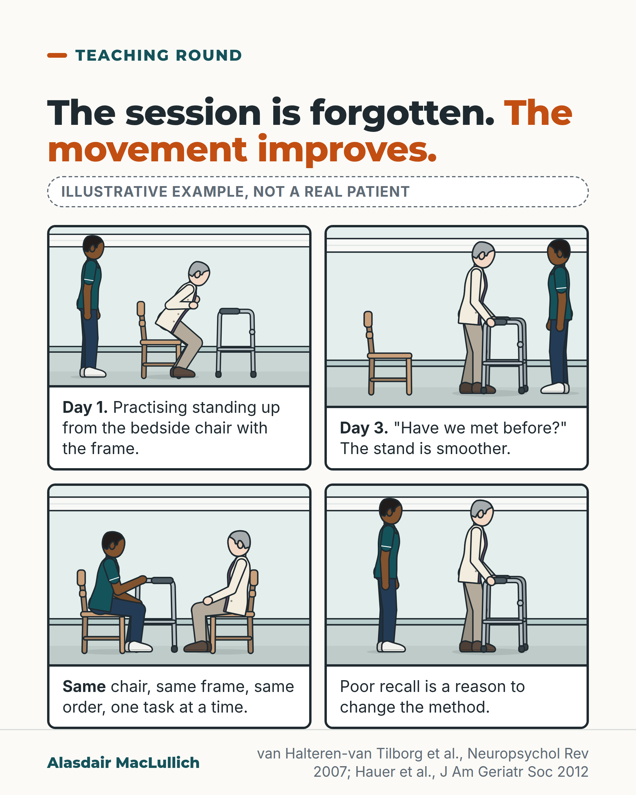

# G013: Forgetting the session, keeping the movement

- Category: C02 Mobility, deconditioning and rehabilitation
- Audience: practitioners
- Series: Teaching round
- Post type: teaching
- Visual format: comic strip
- Status: text text_final, visual final
- Working id: C02-P02 (candidate C02-21)

## Insight

People with Alzheimer's disease often still improve at a movement with repeated practice even when they do not recall the practice. Poor recall is a reason to change how rehabilitation is taught.

## Angle and position

Poor recall of therapy should not by itself exclude someone with dementia from rehabilitation; adapt the method.

Basis: mixed: preserved motor learning (review) and the dementia-adapted training trial are empirical; 'do not exclude on recall alone' and 'show, few words' are clinical interpretation and practical suggestion

## X (717 characters)

```text
Forgetting yesterday's physiotherapy and learning from it can happen in the same person.

A 2007 review of 23 laboratory studies found that people with Alzheimer's disease still got better at movement tasks with practice, though they stayed slower than people without dementia.

A German trial in 122 people with mild to moderate dementia found that 3 months of adapted strength and balance training improved strength and chair rises compared with gentle placebo exercise. The degree of cognitive impairment did not predict who improved.

So poor recall of a session should not by itself end rehabilitation. Practise the same movement the same way, in the real place, with the real chair or frame, one task at a time.
```

## LinkedIn (1550 characters)

```text
Forgetting yesterday's physiotherapy and learning from it can happen in the same person.

A 2007 review of 23 laboratory studies found that people with Alzheimer's disease still got better at movement tasks with repeated practice. They stayed slower than people without dementia, and the learning carried over little to other skills. This kind of learning is often relatively preserved, not normal.

A rehabilitation trial points the same way. In a German trial, 122 people with mild to moderate dementia had 3 months of supervised strength and balance training designed for them, or gentle placebo exercise. The training group became stronger and quicker at standing from a chair. How much memory and thinking were affected did not predict who improved, and those who started weakest gained most. Gains were only partly kept 3 months after training stopped.

The review authors recommend consistent practice because it relies less on remembering the session:

1. The same movement, done the same way each time.
2. In the place, and with the chair, frame or bed, the person will actually use.
3. One task at a time, with glasses on.

Showing rather than telling, and using few words, are practical suggestions that were not tested in these studies.

Limits: most of this research used laboratory tasks in Alzheimer's disease, some studies find weaker learning, and other dementias are less clear.

In my reading (a judgement, not a finding), "doesn't remember the session" should prompt a change of teaching method, not a discharge from the caseload.
```

## Bluesky (277 characters)

```text
A review of 23 lab studies found people with Alzheimer's disease still improved at movement tasks with practice, though more slowly than people without dementia.

Poor recall should not end rehabilitation on its own. Practise the same movement, the same way, in the real place.
```

## Threads (487 characters)

```text
You can forget yesterday's physio and still learn from it.

In 23 lab studies, people with Alzheimer's disease still improved at movement tasks with practice, if more slowly. In a trial in 122 people with mild to moderate dementia, adapted strength training beat gentle placebo exercise for strength and chair rises. Degree of cognitive impairment did not predict who improved.

Poor recall alone should not end rehabilitation. Practise the same movement the same way, in the real place.
```

## Source reply

Sources: van Halteren-van Tilborg 2007 https://doi.org/10.1007/s11065-007-9030-1 ; Hauer 2012 https://doi.org/10.1111/j.1532-5415.2011.03778.x ; Palma 2023 https://doi.org/10.1177/00315125231182732

## Visual



Alt text: Illustrative four-panel drawing, not a real patient. A physiotherapist and an older woman with a walking frame practise standing from a bedside chair. Day 1 she stands with effort; day 3 she asks if they have met before yet stands more smoothly; then same chair, frame and order, one task at a time; poor recall is a reason to change the method.

Editable source: `visuals/src/G013.html`

Design instructions: Four-panel illustrative comic in kit style, hospital bay, physiotherapist and older woman with frame; labelled illustrative.

## Sources and verification

- C02-21-a (supported_with_qualification): People with Alzheimer's disease can still improve a movement skill through repeated practice (implicit or procedural learning), even without being aware of learning it, though their performance stays below that of people without dementia.
  - Source: van Halteren-van Tilborg IA, Scherder EJ, Hulstijn W. Motor-skill learning in Alzheimer's disease: a review with an eye to the clinical practice. Neuropsychol Rev. 2007;17(3):203-12.
  - Passage: ""The present review discusses 23 experimental studies on implicit motor-skill learning in patients with Alzheimer's disease (AD). All studies found intact implicit motor-learning capacities." (Abstract) ... "In implicit learning, skills are mastered without awareness, often simply by repeated exposure, and can be unconsciously revived from implicit memory" (Introduction) ... "All the studies found preserved motor-skill learning in AD patients although their overall performance levels in terms of reaction and movement time were always inferior to those of the controls." ... "Patients are capable of acquiring motor skills without awareness simply by repeated exposure, although their performances will not reach normal levels." (Conclusions)" (Abstract; full text Introduction, Performance and Amount of Learning, Conclusions and Recommendations)
- C02-21-b (supported_with_qualification): The review recommends frequent, consistent practice of the same movement, in a setting and with equipment like those the person uses in daily life, avoiding doing two things at once, and good vision; it found no Alzheimer's studies testing demonstration.
  - Source: van Halteren-van Tilborg IA, Scherder EJ, Hulstijn W. Motor-skill learning in Alzheimer's disease: a review with an eye to the clinical practice. Neuropsychol Rev. 2007;17(3):203-12.
  - Passage: ""The studies we reviewed showed that in (re)learning motor skills, constant, or rather frequent and consistent practice is important in AD patients. This way of learning draws less on episodic memory and other cognitive functions compromised in AD patients. These data also suggest that practice under dual-task conditions should also be avoided." ... "Because AD patients have difficulty in generalizing the motor skills learned during the sessions, training has to take place in an environment that closely resembles the one in which the skill is going to be used and presumably with tools used by the AD patient in his or her daily life." ... "Patients with AD appear to remain dependent upon visual feedback throughout training and performance. Screening and subsequent correction of visual problems or the use of visual aids can be effective in the training process in this group" ... On guidance, observation and mental practice: "Our automated computer search and an extra search combining the three keywords with Alzheimer dementia both failed to generate any relevant studies that employed one of these training methods." ... On verbal feedback: "it may be hypothesized that both forms of feedback knowledge probably place too much weight on the cognitive abilities in AD patients and therefore contribute little to successful performance."" (Full text: Conclusions and Recommendations; Practice; Feedback)
- C02-21-c (supported): In a randomised trial, dementia-adapted strength and function training improved strength and chair-stand performance in people with mild to moderate dementia, and the degree of cognitive impairment did not predict who benefited.
  - Source: Hauer K, Schwenk M, Zieschang T, Essig M, Becker C, Oster P. Physical training improves motor performance in people with dementia: a randomized controlled trial. J Am Geriatr Soc. 2012;60(1):8-15.
  - Passage: ""Individuals with confirmed mild to moderate dementia, no severe somatic or psychological disease, and ability to walk 10 m." ... "Supervised, progressive resistance and functional group training for 3 months specifically developed for people with dementia (intervention, n = 62) compared with a low-intensity motor placebo activity (control, n = 60)." ... "Training significantly improved both primary outcomes" ... "Training gains were partly sustained during follow-up. Low baseline performance on motor tasks but not cognitive impairment predicted positive training response." ... "The intensive, dementia-adjusted training was feasible and substantially improved motor performance in frail, older people with dementia"" (Abstract (Participants, Intervention, Results, Conclusion))
- C02-21-e (supported): The evidence on preserved motor learning comes mainly from laboratory tasks in Alzheimer's disease; transfer to everyday tasks and to other dementias is less certain, and some studies find learning is impaired.
  - Source: van Halteren-van Tilborg IA, Scherder EJ, Hulstijn W. Motor-skill learning in Alzheimer's disease: a review with an eye to the clinical practice. Neuropsychol Rev. 2007;17(3):203-12.; Palma GCS, Freitas TB, Bonuzzi GMG, Torriani-Pasin C. Does cognitive impairment impact motor learning? A scoping review of elderly individuals with Alzheimer's disease and mild cognitive impairment. Percept Mot Skills. 2023;130(5):1924-51.
  - Passage: "van Halteren 2007: "It should be noted that in all studies the patients that could not perform the task were eliminated from the analyses." ... "Clearly, AD patients show preserved implicit learning abilities that can be utilized in teaching (motor) skills, yet transfer to other skills is minimal." Palma 2023: "we selected 15 studies describing cognitive assessment tools, experimental designs, and the severity of cognitive impairment. Although seven studies reported that cognitive impairment impaired motor learning, most studies included a high risk of bias."" (van Halteren full text (Implicit Learning Ability; Conclusions); Palma abstract)

Verification notes: Review full text (23 lab studies, preserved but below-normal learning, consistent-practice recommendation). Hauer 2012 abstract (122 people, strength and chair stand, cognition did not predict response). Palma 2023 abstract for counter-evidence. 'Show, few words' labelled as untested suggestions. 'Relatively preserved', not intact.

## Attention and follow potential

Pause: Therapists who have heard 'she can't carry over' as a reason to stop will recognise the situation.

Gain: A concrete way to teach movement to someone who does not recall sessions, with the evidence and its limits.

Follow: Practical, evidence-checked teaching on rehabilitation in dementia.

## Open issues

None.
