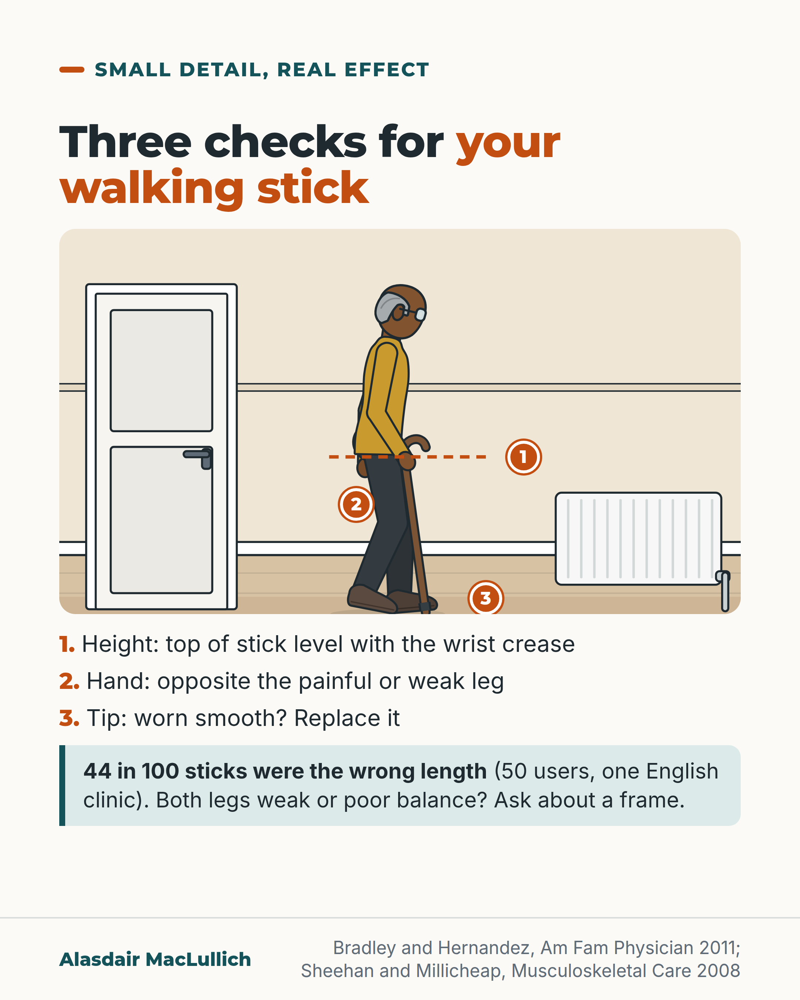

# G014: Three checks for your walking stick

- Category: C02 Mobility, deconditioning and rehabilitation
- Audience: public
- Series: Small detail, real effect
- Post type: public_explanation
- Visual format: annotated scene
- Status: text text_final, visual final
- Working id: C02-P03 (candidate C02-01)

## Insight

A walking stick helps only when it is the right height, in the right hand and in good repair, and surveys of stick users find these basics are often wrong.

## Angle and position

Three checks anyone can do at home turn a borrowed or shop-bought stick into a better-fitted aid.

Basis: mixed: fitting advice is professional advice from a clinical review; how often sticks are wrong is empirical (Sheehan survey); 'get it checked' is practical judgement

## X (571 characters)

```text
Stand up straight with your arms hanging loosely, and look at where your walking stick reaches.

The top should be level with the crease on the inside of your wrist.

Hold it in the hand opposite your painful or weak leg, and move it forward with that leg.

Turn it over. If the rubber tip is worn smooth, replace it.

In one English clinic survey of 50 stick users, 44 in 100 sticks were the wrong length and 54 in 100 were in poor condition, mostly a worn tip.

If both legs are weak or your balance is poor, a frame may suit you better. Ask a physiotherapist to check.
```

## LinkedIn (1300 characters)

```text
Stand up straight with your arms hanging loosely, and look at where your walking stick reaches.

The top of the stick should be level with the crease on the inside of your wrist. That is the professional advice in a clinical review of walking aids.

Three checks you can do at home:

1. Height: wrist crease, standing upright, arms relaxed.
2. Hand: hold the stick on the opposite side to the painful or weak leg, and move it forward at the same time as that leg. This rule is for problems on one side.
3. Tip: turn the stick over. If the tread is worn smooth, replace the tip.

These basics are often wrong. One English hospital arthritis clinic surveyed 50 stick users. Of every 100 sticks, 44 were the wrong length and 54 were in poor condition, most often a worn tip. Separately, about 4 in 10 people used the stick wrongly, usually in the wrong hand. The clinic patients were not all older people, and the survey was small.

A US study of 93 stick users over 65 found the same kinds of problems. Many had never had professional advice when choosing their stick.

A stick is the wrong aid for some people. If both legs are weak or balance is poor, a walking frame may be safer.

If your stick came from a relative's cupboard or a shop shelf, ask a physiotherapist or your GP to check it fits you.
```

## Bluesky (251 characters)

```text
Check your walking stick: standing straight, arms loose, the top should reach the crease of your wrist.

Hold it opposite the weak leg. Replace a worn rubber tip.

In one English clinic survey of 50 stick users, 44 in 100 sticks were the wrong length.
```

## Threads (440 characters)

```text
Stand up straight, arms loose. The top of your walking stick should reach the crease on the inside of your wrist.

Hold it in the hand opposite your painful or weak leg. If the rubber tip is worn smooth, replace it.

In one English clinic survey of 50 stick users, 44 in 100 sticks were the wrong length and 54 in 100 were in poor condition.

If both legs are weak or balance is poor, ask a physiotherapist whether a frame suits you better.
```

## Source reply

Sources: Bradley and Hernandez 2011 https://pubmed.ncbi.nlm.nih.gov/21842786/ ; Sheehan and Millicheap 2008 https://doi.org/10.1002/msc.122 ; Liu 2011 https://doi.org/10.1016/j.archger.2010.04.003

## Visual



Alt text: Drawing of an older man standing upright in a hallway with a walking stick, numbered 1 to 3. Check 1: stick top level with the wrist crease (dotted line). Check 2: stick in the hand opposite the painful or weak leg. Check 3: replace a worn rubber tip. In one English clinic survey of 50 users, 44 in 100 sticks were the wrong length.

Editable source: `visuals/src/G014.html`

Design instructions: Annotated scene: older man with stick in a hallway, three numbered pins, dotted wrist-height line, key below with survey fact.

## Sources and verification

- C02-01-a (supported): The top of a walking stick should be level with the crease of the wrist when the person stands upright with arms relaxed by their sides.
  - Source: Bradley SM, Hernandez CR. Geriatric assistive devices. Am Fam Physician. 2011;84(4):405-11.
  - Passage: ""The top of a cane or walker should be the same height as the wrist crease when the patient is standing upright with arms relaxed at his or her sides."" (Abstract)
- C02-01-b (supported_with_qualification): A stick is held in the hand opposite the weak or painful leg and moved forward at the same time as that leg.
  - Source: Bradley SM, Hernandez CR. Geriatric assistive devices. Am Fam Physician. 2011;84(4):405-11.
  - Passage: ""A cane should be held contralateral to a weak or painful lower extremity and advanced simultaneously with the contralateral leg."" (Abstract)
- C02-01-c (supported_with_qualification): Among people who use walking sticks, wrong height, poor condition, use in the wrong hand and lack of professional advice are common.
  - Source: Sheehan NJ, Millicheap P. Talk the walk: the importance of teaching patients how to use their walking stick effectively and safely. Musculoskeletal Care. 2008;6(3):150-4.; Liu HH, Eaves J, Wang W, Womack J, Bullock P. Assessment of canes used by older adults in senior living communities. Arch Gerontol Geriatr. 2011;52(3):299-303.; Bradley SM, Hernandez CR. Geriatric assistive devices. Am Fam Physician. 2011;84(4):405-11.; George J, Binns VE, Clayden AD, Mulley GP. Aids and adaptations for the elderly at home: underprovided, underused, and undermaintained. Br Med J (Clin Res Ed). 1988;296(6633):1365-6.
  - Passage: "Sheehan 2008: "Fifty randomly selected patients attending a rheumatology department were surveyed to determine whether their stick was appropriate to their needs and whether they were using it correctly." ... "Of the 50 patients, 38% used their stick incorrectly, usually in the wrong hand. Forty-four per cent of sticks were of the wrong length and 54% were in imperfect condition, the main defect being a worn ferrule." Liu 2011: "Five major problems from data analysis were identified: lack of medical consultation for device selection/use, incorrect cane height/maintenance, placement of cane in improper hand, inability to maintain the proper reciprocal gait pattern, and improper posture during ambulation." Bradley 2011: "Most patients with assistive devices have never been instructed on the proper use and often have devices that are inappropriate, damaged, or are of the incorrect height." George 1988: "Many of the aids that the elderly had were faulty, including half of the walking aids and 15% of hearing aids, reading spectacles, and dentures"" (Abstracts)
- C02-01-d (supported_with_qualification): A worn rubber tip (ferrule) is a common defect and should be checked and replaced.
  - Source: Sheehan NJ, Millicheap P. Talk the walk: the importance of teaching patients how to use their walking stick effectively and safely. Musculoskeletal Care. 2008;6(3):150-4.
  - Passage: ""Walking sticks are used widely by people with arthritis, principally to reduce pain and improve stability and balance. However, they are frequently used incorrectly and can be dangerous if not properly maintained." ... "54% were in imperfect condition, the main defect being a worn ferrule." ... "These findings highlight the importance of educating patients on how to obtain greatest benefit from their walking stick and of the necessity to check it regularly for defects to ensure safe usage."" (Abstract)
- C02-01-e (supported): The right aid depends on strength, balance and cognition; people with weakness or poor balance may need a frame rather than a stick, and clinicians should check height, fit and maintenance.
  - Source: Bradley SM, Hernandez CR. Geriatric assistive devices. Am Fam Physician. 2011;84(4):405-11.
  - Passage: ""Selection of a suitable device depends on the patient's strength, endurance, balance, cognitive function, and environmental demands." ... "Walkers improve stability in those with lower extremity weakness or poor balance and facilitate improved mobility by increasing the patient's base of support and supporting the patient's weight. Walkers require greater attentional demands than canes and make using stairs difficult." ... "Clinicians should routinely evaluate their patients' assistive devices to ensure proper height, fit, and maintenance, and also counsel patients on correct use of the device."" (Abstract)

Verification notes: Fitting and hand advice: Bradley 2011 clinical review abstract (professional advice, not trial). Frequency: Sheehan 2008 abstract (50 users, 44%, 54%, 38%; not all older people). Liu 2010 abstract (93 users, no percentages quoted). Worn tip: most common defect; 'grips less well' not claimed. 'In your usual shoes' omitted from captions; drawing shows shoes only.

## Attention and follow potential

Pause: Anyone using a borrowed or shop-bought stick can check it within a minute.

Gain: Three checks and a cue to ask about a frame.

Follow: Small practical details with a real effect, checked against sources.

## Open issues

None.
