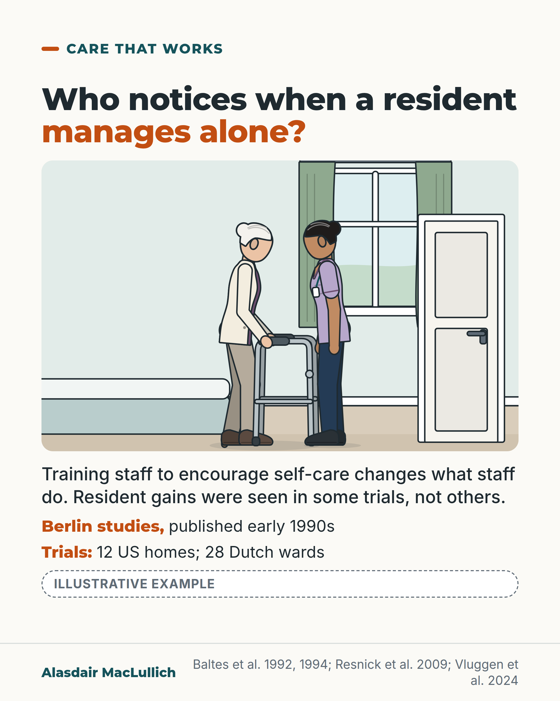

# G015: Who notices when a resident manages alone

- Category: C02 Mobility, deconditioning and rehabilitation
- Audience: both
- Series: Care that works
- Post type: good_care
- Visual format: drawn illustration
- Status: text text_final, visual final
- Working id: C02-P04 (candidate C02-14)

## Insight

Classic German studies found that staff responded when residents were dependent but rarely when they managed alone, and training staff shifted this. Modern trials change staff behaviour, with resident gains in some homes and not others.

## Angle and position

Supported self-care needs time and training built into how care is organised, not only goodwill.

Basis: mixed: observational and trial findings are empirical; the call for time and training in how care is organised is ethical and organisational judgement

## X (720 characters)

```text
In care homes studied by Berlin researchers, who published in the early 1990s, residents who needed help got attention. Residents who managed alone mostly went unnoticed.

When staff in 3 institutions were trained, they did less for residents, encouraged them more, and residents did more of their own self-care.

Modern trials are mixed. In 12 US nursing homes, a programme like this improved residents' walking and bathing. In 28 Dutch wards, nurses changed what they did, but residents' independence did not change clearly. Those nurses named time pressure and staff shortages as reasons they still took over.

Care homes should build time and training for supported self-care into the rota, not leave it to goodwill.
```

## LinkedIn (1565 characters)

```text
In care homes studied by Berlin researchers, who published in the early 1990s, residents who needed help got attention. Residents who managed alone mostly went unnoticed.

A 1992 study of 22 older people living at home found the same pattern: when they did something for themselves, family or nurses were about twice as likely to step in and help as to encourage them.

A 1994 study then trained staff in 3 care institutions in communication, ageing and simple behaviour principles. Afterwards staff did less for residents and encouraged them more, and residents did more of their own self-care. These were small studies, and how long the change lasted is not known.

Modern trials show that this can be taught, with mixed results for residents:

1. In 12 US nursing homes, training care assistants to encourage residents to do what they could improved walking, balance, bathing and stair climbing over a year.
2. In 28 Dutch nursing home wards, training changed what nurses did, but residents' independence did not change clearly over 6 months, though it declined a little less on trained wards.

The Dutch nurses named time pressure and staff shortages among the reasons they still took over tasks residents could do.

No study here shows that doing tasks for people causes loss of ability. The reasoning is simpler: if staff always do it, residents get less practice.

My position, as a judgement: care homes and commissioners should build time and training for supported self-care into staffing and rotas. Goodwill from stretched staff is not enough on its own.
```

## Bluesky (298 characters)

```text
Berlin care home studies (early 1990s): residents got help when they needed it, rarely when they managed alone. Training staff changed that.

Newer trials were mixed: better walking, bathing in 12 US homes, no clear change in 28 Dutch wards.

Helping residents do things themselves takes rota time.
```

## Threads (444 characters)

```text
In care homes studied by Berlin researchers publishing in the early 1990s, residents got attention when they needed help and rarely when they managed alone. Training staff changed this.

Modern trials are mixed: better walking and bathing in 12 US homes, no clear change in independence on 28 Dutch wards, where nurses named time pressure and staff shortages.

Supported self-care needs time and training built into the rota, not only goodwill.
```

## Source reply

Sources: Baltes 1994 https://pubmed.ncbi.nlm.nih.gov/8054165/ ; Baltes and Wahl 1992 https://pubmed.ncbi.nlm.nih.gov/1388862/ ; Resnick 2009 https://doi.org/10.1111/j.1532-5415.2009.02327.x ; Vluggen 2024 https://doi.org/10.1016/j.ijnurstu.2024.104914 ; Bleijlevens 2026 https://doi.org/10.1016/j.ijnsa.2026.100525

## Visual



Alt text: Illustrative drawing of a care home bedroom: an older woman with a walking frame beside her bed, a care assistant next to her with hands open, not reaching in, and a second care worker at the door. Text: training staff to encourage self-care changes what staff do; resident gains were seen in some trials (12 US homes) and not others (28 Dutch wards).

Editable source: `visuals/src/G015.html`

Design instructions: Drawn bedroom scene: woman with frame, care assistant not reaching in, second worker at door; no clock; labelled illustrative.

## Sources and verification

- C02-14-a (supported_with_qualification): Observational research by Baltes and colleagues described a pattern in which dependent behaviour of older people was met with help while independent behaviour was ignored or met with more help, in institutions and at home.
  - Source: Baltes MM, Neumann EM, Zank S. Maintenance and rehabilitation of independence in old age: an intervention program for staff. Psychol Aging. 1994;9(2):179-88.; Baltes MM, Wahl HW. The dependency-support script in institutions: generalization to community settings. Psychol Aging. 1992;7(3):409-18.
  - Passage: "Baltes 1994: "Research has attested to the prevalence of a "dependency-support" and "independence-ignore" script characterizing the interactions between staff and elderly residents in long-term care institutions." Baltes and Wahl 1992: "This study tested the generalizability of the dependency-support script, a behavioral system describing and explaining dependent behaviors of the institutionalized elderly. A comparative study with 22 community-dwelling elderly was conducted, which identified typical interaction patterns between the elderly and family members or home health nurses. The dominant interaction pattern in the community setting, too, was the dependency-support script." ... "Independent behaviors were followed about twice as often by an incongruent (dependence-supportive) than by a congruent (independence-supportive) response."" (Abstracts)
- C02-14-b (supported_with_qualification): A staff training programme in 3 institutions reduced dependence-supportive staff behaviour, increased independence-supportive behaviour and increased residents' independent self-care behaviour.
  - Source: Baltes MM, Neumann EM, Zank S. Maintenance and rehabilitation of independence in old age: an intervention program for staff. Psychol Aging. 1994;9(2):179-88.
  - Passage: ""To examine whether the scripts could be modified, a staff training program (focusing on communication skills, knowledge about aging, and basic behavior principles) was implemented in 3 different institutions. Observational data on staff-resident interactions in the context of self-care were collected pre- and postintervention. Findings revealed significant changes for the experimental group. Specifically, a decrease in dependence-supportive behavior of staff and an increase in their independence-supportive behavior, an increase in independent behavior of residents, and an increase in independence-related interaction patterns were demonstrated."" (Abstract)
- C02-14-c (supported_with_qualification): Function-focused (restorative) care has been tested in randomised trials in nursing homes; in a 12-home US trial it improved mobility, walking, bathing and stair climbing.
  - Source: Resnick B, Gruber-Baldini AL, Zimmerman S, Galik E, Pretzer-Aboff I, Russ K, et al. Nursing home resident outcomes from the Res-Care intervention. J Am Geriatr Soc. 2009;57(7):1156-65.
  - Passage: ""A randomized controlled repeated-measure design was used, and generalized estimating equations were used to evaluate status at baseline and 4 and 12 months after initiation of the Res-Care intervention." ... "Twelve nursing homes in Maryland." ... "Four hundred eighty-seven residents consented and were eligible" ... "Res-Care was a two-tiered self-efficacy-based intervention focused on motivating nursing assistants and residents to engage in functional and physical activities." ... "Significant treatment-by-time interactions (P<.05) were found for the Tinetti Mobility Score and its gait and balance subscores and for walking, bathing, and stair climbing." ... "The findings provide some evidence for the utility and safety of a Res-Care intervention in terms of improving function in NH residents."" (Abstract)
- C02-14-d (supported): A recent Dutch cluster-randomised trial of a staff programme improved nurses' encouragement of residents' independence but did not show a statistically significant change in residents' self-reliance.
  - Source: Vluggen S, de Man-van Ginkel J, van Breukelen G, Bleijlevens M, Zwakhalen S, Huisman-de Waal G, et al. Effectiveness of the 'SELF-program' on nurses' activity encouragement behavior and nursing home resident's ADL self-reliance; a cluster-randomized trial. Int J Nurs Stud. 2024;160:104914.
  - Passage: ""Twenty-eight nursing home wards, with 287 nurses and 241 residents participated in the study. A statistically significant treatment by time interaction effect was observed in nurses' activity encouragement behavior at three months (d = 0.53; p = .003; 95 % CI 1.88-8.02) and at nine months (d = 0.38; p = .02; 95 % CI 0.67-7.27). No statistically significant treatment by time interaction effects were observed in residents' self-reliance in activities of daily living. However, a trend was observed towards a less pronounced decrease in self-reliance in those residents allocated to wards that exposed nurses to the SELF-program"" (Abstract (Results))
- C02-14-e (supported_with_qualification): Time pressure and staff shortages are reasons staff give for still taking over tasks residents could do themselves.
  - Source: Bleijlevens M, de Man-van Ginkel J, van Breukelen G, Zwakhalen S, Hermens L, Metzelthin S, et al. Process-evaluation alongside a cluster-randomized trial examining the effectiveness of the 'SELF-program' on nurses' activity encouragement behavior. Int J Nurs Stud Adv. 2026;10:100525.
  - Passage: ""Still, time constraints, staffing shortages and lack of motivation were put forwards as factors leading some nurses to still take over tasks." ... "Contextual barriers to program implementation and outcomes included staffing shortages, low program attendance, time constraints, lack of manager support, and delivery of the program during the COVID-19 pandemic."" (Abstract (Results))
- C02-14-g (not_supported): Doing a task for someone saves time today and can cost them ability later.
  - Source: Vluggen S, de Man-van Ginkel J, van Breukelen G, Bleijlevens M, Zwakhalen S, Huisman-de Waal G, et al. Effectiveness of the 'SELF-program' on nurses' activity encouragement behavior and nursing home resident's ADL self-reliance; a cluster-randomized trial. Int J Nurs Stud. 2024;160:104914.; Baltes MM, Neumann EM, Zank S. Maintenance and rehabilitation of independence in old age: an intervention program for staff. Psychol Aging. 1994;9(2):179-88.
  - Passage: "Vluggen 2024 (background, not a finding): "However, nurses often take over tasks unnecessarily, which can deprive resident's remaining abilities."" (Vluggen 2024 abstract, Background)

Verification notes: Baltes 1992 and 1994 abstracts (small German studies; responses, not long-term function). Resnick 2009 abstract (12 homes, 487 residents, no effect sizes). Vluggen 2024 abstract (28 wards, no clear change, p=.07). Bleijlevens 2026 abstract (staff-reported barriers). C02-14-g used only as reasoning with explicit statement that no study shows causation. Judgement marked.

## Attention and follow potential

Pause: Care staff and families will recognise the moment of stepping in to do it faster.

Gain: The evidence on training for supported self-care and its mixed results, with an organisational ask.

Follow: Care that works posts show what good care needs, including staff conditions.

## Open issues

None.
