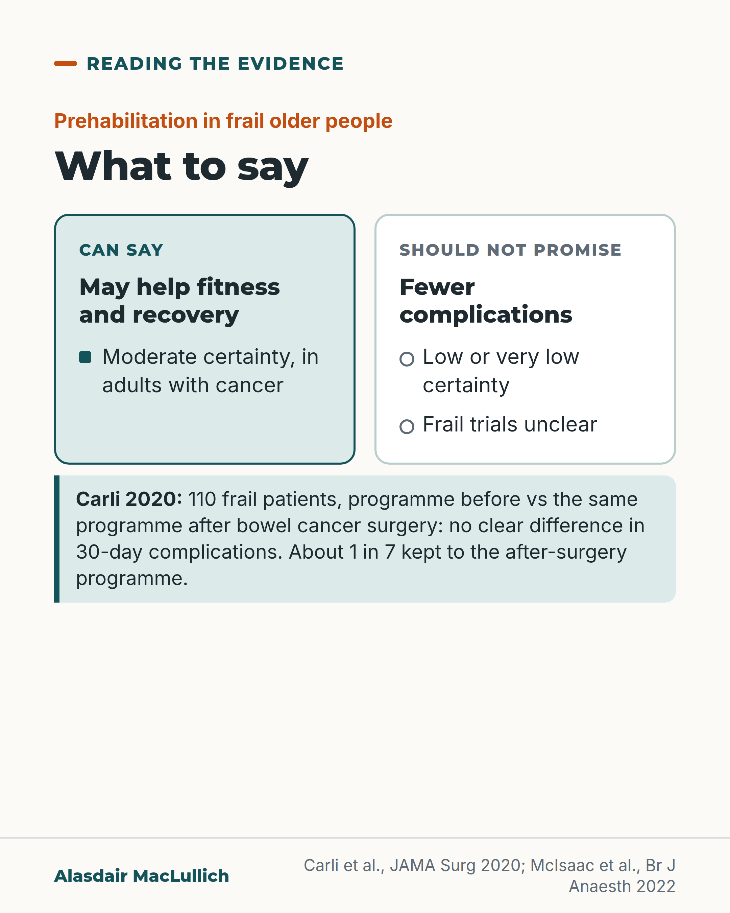

# G016: What to promise frail patients about prehabilitation

- Category: C02 Mobility, deconditioning and rehabilitation
- Audience: practitioners
- Series: Reading the evidence
- Post type: evidence_interpretation
- Visual format: comparison
- Status: text text_final, visual final
- Working id: C02-P05 (candidate C02-24)

## Insight

The trial built for frail older people compared prehabilitation with the same programme after surgery and found no clear difference in complications; pooled evidence on complications is low or very low certainty and inconsistent.

## Angle and position

Offer prehabilitation for possible gains in fitness and recovery, but do not promise frail older people fewer complications.

Basis: mixed: trial and review results are empirical; the counselling wording is clinical interpretation

## X (650 characters)

```text
Should a frail older person be told that exercise before surgery will cut their complications?

In a Montreal trial, 110 frail people (average age 78) having bowel cancer surgery did a 4-week exercise, nutrition and support programme before the operation, compared with the same programme after it. Complications over 30 days did not differ clearly. Only about 1 in 7 kept to the after-surgery programme.

A Canadian home-exercise trial in 182 frail older people found no clear gain in walking after surgery. Reviews disagree, and certainty for complications is low or very low.

Offer it for fitness and recovery. Do not promise fewer complications.
```

## LinkedIn (1746 characters)

```text
Should a frail older person be told that exercise before surgery will cut their complications?

Prehabilitation means exercise, nutrition and psychological support in the weeks before an operation.

The trial designed for frail older people (Carli, JAMA Surgery 2020) randomised 110 frail patients aged 65 and over, average age 78, having bowel cancer surgery. One group did a 4-week programme before the operation: a supervised session once a week plus daily walking and home strength work. The comparison group was offered the same programme after surgery.

Complications in the 30 days after surgery did not differ clearly. Walking 4 weeks after the operation, time in hospital and readmissions were similar. Only about 1 in 7 kept to the after-surgery programme, so in practice the comparison was close to no programme. The surgery took place within a well-run enhanced recovery pathway, and 110 is a small trial.

A Canadian trial of home exercise before cancer surgery in 182 older people with frailty found no clear difference in walking distance afterwards.

Pooled evidence disagrees. One 2026 meta-analysis of 9 trials in people 60 and over having bowel or stomach cancer surgery found about a third fewer complications in relative terms, but the result for frail patients alone was uncertain. Another, of 5 trials in frail older people, found no clear gain in walking or length of stay. A 2022 umbrella review rated evidence on complications as low or very low certainty, with moderate certainty for better physical recovery after cancer surgery in adults generally.

Counselling wording I would suggest: prehabilitation may help your fitness and recovery; it has not been shown reliably to prevent complications in frail older people.
```

## Bluesky (255 characters)

```text
A trial in 110 frail older people having bowel cancer surgery compared a 4-week prehab programme before surgery with the same programme after. Complications did not differ clearly.

Offer prehab for fitness and recovery. Don't promise fewer complications.
```

## Threads (462 characters)

```text
Should frail older people be promised fewer complications from exercise before surgery?

A Montreal trial in 110 frail patients (average age 78) compared a 4-week programme before bowel cancer surgery with the same programme after it. Complications did not differ clearly. Pooled reviews disagree, and certainty for complications is low or very low.

Offer prehabilitation for possible gains in fitness and recovery. Do not promise it will prevent complications.
```

## Source reply

Sources: Carli 2020 https://doi.org/10.1001/jamasurg.2019.5474 ; McIsaac 2022 (PREHAB) https://doi.org/10.1016/j.bja.2022.04.006 ; McIsaac umbrella review https://doi.org/10.1016/j.bja.2021.11.014 ; Liu 2026 https://doi.org/10.3389/fonc.2026.1777929 ; López-González 2025 https://doi.org/10.3390/ijerph22091381

## Visual



Alt text: Two-column card on prehabilitation in frail older people. Can say: may help fitness and recovery (moderate certainty, adults with cancer). Should not promise: fewer complications (low or very low certainty; frail trials unclear). Carli 2020: 110 frail patients, no clear difference in 30-day complications; about 1 in 7 kept to the after-surgery programme.

Editable source: `visuals/src/G016.html`

Design instructions: Two-column comparison card, shape markers as well as colour, with a trial fact strip below.

## Sources and verification

- C02-24-a (supported_with_qualification): In a randomised trial of 110 frail patients aged 65+ (mean 78) having colorectal cancer surgery within an enhanced recovery pathway, a multimodal programme started before surgery did not reduce 30-day complications compared with the same programme started after surgery.
  - Source: Carli F, Bousquet-Dion G, Awasthi R, Elsherbini N, Liberman S, Boutros M, et al. Effect of multimodal prehabilitation vs postoperative rehabilitation on 30-day postoperative complications for frail patients undergoing resection of colorectal cancer: a randomized clinical trial. JAMA Surg. 2020;155(3):233-42.
  - Passage: ""A total of 418 patients 65 years or older were assessed for eligibility. Of these, 298 patients were excluded (not frail [n = 290], unable to exercise [n = 3], and planned neoadjuvant treatment [n = 5]), and 120 frail patients (Fried Frailty Index,≥2) were randomized." ... "Hence, 110 patients were included in the intention-to-treat analysis (55 in the prehabilitation [Prehab] and 55 in the rehabilitation [Rehab] groups)." ... "Multimodal program involving exercise, nutritional, and psychological interventions initiated before (Prehab group) or after (Rehab group) surgery. All patients were treated within a standardized enhanced recovery pathway." ... "Of 110 patients randomized, mean (SD) age was 78 (7) years" ... "There was no between-group difference in the primary outcome measure, 30-day Comprehensive Complications Index (adjusted mean difference, -3.2; 95% CI, -11.8 to 5.3; P = .45)." Discussion (via Scite, the article's own text): "The low adherence of patients to the rehabilitation program (14%), however, supports that this control intervention was closer to a sham condition than to an active comparator." ... "Although our sample size was relatively small (n = 110), the lower bounds of the 95% CI observed for between-group differences in CCI (11.8) suggest that we were unlikely to miss a meaningful benefit of the intervention due to type II error (when accounting for the reported minimal important difference of 10)."" (Abstract; Discussion (verbatim sentences retrieved through Scite))
- C02-24-b (supported): Secondary outcomes, including recovery of walking capacity, length of stay and readmissions, did not differ between groups.
  - Source: Carli F, Bousquet-Dion G, Awasthi R, Elsherbini N, Liberman S, Boutros M, et al. Effect of multimodal prehabilitation vs postoperative rehabilitation on 30-day postoperative complications for frail patients undergoing resection of colorectal cancer: a randomized clinical trial. JAMA Surg. 2020;155(3):233-42.
  - Passage: ""Secondary outcomes were 30-day overall and severe complications, primary and total length of hospital stay, 30-day emergency department visits and hospital readmissions, recovery of walking capacity, and patient-reported outcome measures." ... "Secondary outcome measures were also not different between groups." Discussion (via Scite): "We also did not observe between-group differences in primary and total LOS, rates of readmission and emergency department visits, postoperative walking capacity, and PROMs."" (Abstract; Discussion)
- C02-24-c (supported): The prehabilitation programme lasted about 4 weeks before surgery.
  - Source: Carli F, Bousquet-Dion G, Awasthi R, Elsherbini N, Liberman S, Boutros M, et al. Effect of multimodal prehabilitation vs postoperative rehabilitation on 30-day postoperative complications for frail patients undergoing resection of colorectal cancer: a randomized clinical trial. JAMA Surg. 2020;155(3):233-42.
  - Passage: "(via Scite, the article's own text) "Eligible patients were randomly assigned 1:1 to receive a 4-week prehabilitation program (Prehab group) or a 4-week postoperative rehabilitation program (Rehab group)." ... "The program started after the baseline visit and continued for 4 weeks before surgery, as recommended by the Canadian Oncological Society." ... "Patients were asked to attend training sessions supervised by a trained kinesiologist at the hospital prehabilitation unit once a week for 4 weeks." ... "In addition to the supervised exercise sessions, participants were prescribed a personalized home-based program of aerobic activities (walk daily for a total of 30 minutes as moderate-intensity aerobic activity) and resistance training (elastic band routine 3 times per week)" ... Discussion: "Third, a prehabilitation program lasting 4 to 5 weeks may not be sufficient to increase physiological reserve preoperatively and reduce postoperative complications."" (Methods (Study procedures; Prehabilitation; Exercise intervention) and Discussion, verbatim via Scite)
- C02-24-d (supported_with_qualification): An umbrella review found low to very low certainty evidence that prehabilitation reduces complications, and moderate certainty evidence that any prehabilitation improves functional recovery after cancer surgery.
  - Source: McIsaac DI, Gill M, Boland L, Hutton B, Branje K, Shaw J, et al. Prehabilitation in adult patients undergoing surgery: an umbrella review of systematic reviews. Br J Anaesth. 2022;128(2):244-57.
  - Passage: ""From 1412 titles, 55 systematic reviews were included. For patients with cancer undergoing surgery who participate in any prehabilitation, moderate certainty evidence supports improvements in functional recovery. Low to very low certainty evidence supports reductions in complications (mixed, cardiovascular, and cancer surgery), non-home discharge (orthopaedic surgery), and length of stay (mixed, cardiovascular, and cancer surgery). There was low to very low certainty evidence that exercise prehabilitation reduces the risk of complications, non-home discharge, and length of stay." ... "Low certainty evidence suggests that prehabilitation may improve postoperative outcomes."" (Abstract (Results, Conclusions))
- C02-24-e (supported): A home-based exercise prehabilitation trial in older people with frailty having cancer surgery did not significantly improve its primary outcome (walking distance).
  - Source: McIsaac DI, Hladkowicz E, Bryson GL, Forster AJ, Gagne S, Huang A, et al. Home-based prehabilitation with exercise to improve postoperative recovery for older adults with frailty having cancer surgery: the PREHAB randomised clinical trial. Br J Anaesth. 2022;129(1):41-8.
  - Passage: ""This double blind randomised trial enrolled people ≥60 yr having elective cancer surgery and ≥3 weeks from enrolment to surgery as eligible. Participation in a remotely supported, home-based exercise prehabilitation program plus nutritional guidance was compared with standard care plus written advice on age-appropriate activity and nutrition. The primary outcome was 6-min walk test (6MWT) distance at the first postoperative clinic visit." ... "Of 543 patients assessed, 254 were eligible and 204 (80%) were randomised (102 per arm); 182 (94 intervention and 88 control) had surgery and were analysed. Mean age was 74 yr and 57% were female. Mean duration of participation was 5 weeks, mean adherence was 61% (range 0%-100%). We found no significant difference in 6MWT at follow-up (+14 m, 95% confidence interval -26-55 m, P=0.486), or for secondary outcomes. Analyses using a prespecified adherence definition of ≥80% supported improvements in 6MWT distance, complication count, and disability."" (Abstract)
- C02-24-f (supported_with_qualification): Recent pooled analyses of prehabilitation in older and frail surgical patients disagree, and frail patients remain understudied.
  - Source: Liu X, Bao L, Xie Y. Prehabilitation to reduce postoperative complications in frail and elderly patients with gastrointestinal cancer: a systematic review and meta-analysis. Front Oncol. 2026;16:1777929.; López-González M, Álvarez-Bueno C, Rodríguez-Martín B, Lorenzo-García P, Ruiz-Grao MC, Priego-Jiménez S. Effect of prehabilitation on the 6-minute walk test and length of hospital stay in frail older people: a meta-analysis of randomized controlled trials. Int J Environ Res Public Health. 2025;22(9):1381.; Buckinx F, Rousseau AF, Louis E, De Roover A, Detry O, Durieux R, et al. Effects of prehabilitation programmes on postoperative outcomes in older adults undergoing major abdominal, cardiac or vascular surgery: a systematic review. Aging Clin Exp Res. 2026;38(1).
  - Passage: "Liu 2026: "Nine randomized controlled trials involving 1027 patients were included. The meta-analysis showed that prehabilitation significantly reduced the risk of postoperative complications (risk ratio [RR] = 0.67, 95% confidence interval [CI]: 0.46 to 0.99, p = 0.04), with low heterogeneity among studies (I² = 24%). Subgroup analyses indicated a greater trend towards risk reduction in frail patients (RR = 0.53, 95% CI: 0.24 to 1.16)" ... "the trend suggesting potentially greater benefit in specifically frail patients requires confirmation in future larger, specifically designed trials." Lopez-Gonzalez 2025: "Five studies involving 400 participants were included. The p-MD for the 6MWT showed no significant improvement at any time point" ... "The LOS was also not significantly reduced" ... "Prehabilitation did not significantly improve aerobic capacity or reduce hospital stay." Buckinx 2026: "Nine studies (n = 36–182; mean/median age 68–82) were included." ... "Vascular surgery studies showed modest reductions in complications and hospital stay, whereas abdominal surgery studies generally reported no significant improvements, except for isolated reductions in severe complications or gains in functional reserve." ... "Prehabilitation in older adults remains understudied, especially in frail patients, the oldest old, and cardiac surgery."" (Abstracts)

Verification notes: Carli 2020 full text (comparator same programme after surgery, per editor guidance; 14% adherence; outcomes). McIsaac 2022 PREHAB abstract (Br J Anaesth). Umbrella review abstract (certainty ratings, all adults). Liu 2026 (RR 0.67, relative only), Lopez-Gonzalez 2025, Buckinx 2026 abstracts. Retracted Xie 2025 not cited. The counselling line is marked as a suggestion.

## Attention and follow potential

Pause: Surgeons, geriatricians and anaesthetists who counsel frail patients will want the wording.

Gain: An accurate reading of the trial comparator and a counselling sentence.

Follow: Reading the evidence posts show what a trial compared, not only its headline.

## Open issues

None.
