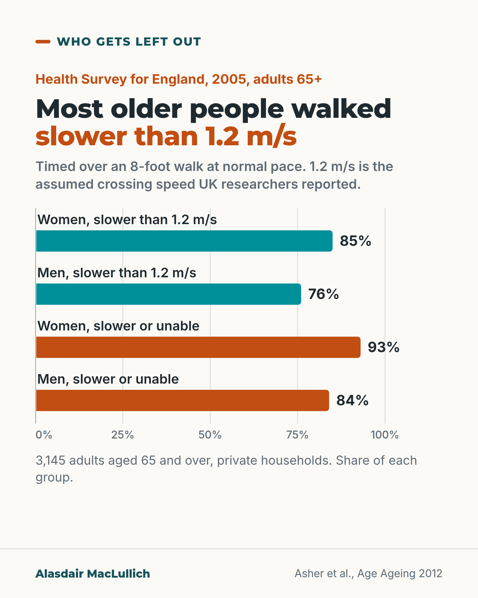

# G017: The green man and the 2005 walking survey

- Category: C02 Mobility, deconditioning and rehabilitation
- Audience: both
- Series: Who gets left out
- Post type: criticism
- Visual format: chart (bars)
- Status: text text_final, visual final
- Working id: C02-P06 (candidate C02-05)

## Insight

UK researchers reported that crossing times assume 1.2 metres per second, yet in a 2005 survey in England 85% of women and 76% of men aged 65 and over walked slower than that.

## Angle and position

Getting out depends on streets as well as legs; report the researchers' recommendation without proposing policy.

Basis: mixed: survey figures and associations are empirical; the recommendation to reconsider timings is the researchers'; the framing that streets shape mobility is judgement

## X (721 characters)

```text
UK researchers reported in 2012 and 2017 that pedestrian crossing times assume a walking speed of 1.2 metres per second (about 2.7 miles per hour).

In a 2005 national survey in England, 85% of women and 76% of men aged 65 and over walked slower than that. The walk was timed over 8 feet at normal pace.

A larger English study (2002 to 2014) counted measurements, not people. Only 1 in 10 walking-speed measurements in people over 60 was fast enough. Women, the oldest, the poorest and people in worse health were least likely to be fast enough.

Some newer crossings, called Puffin crossings, can hold traffic longer when someone is still crossing.

The researchers concluded that crossing times should be reconsidered.
```

## LinkedIn (1556 characters)

```text
UK researchers reported in 2012 and 2017 that pedestrian crossing times in the UK are based on an assumed walking speed of 1.2 metres per second (about 2.7 miles per hour). They cited Department for Transport guidance from 2005. Whether current guidance still uses that figure was not checked for this post.

How fast do older people walk? In a 2005 national survey in England of 3,145 adults aged 65 and over, average walking speed was 0.9 metres per second for men and 0.8 for women.

More than 8 in 10 women (85%) and about 3 in 4 men (76%) walked slower than 1.2 metres per second. Counting those who could not safely do the walk, it was over 9 in 10 women (93%) and more than 8 in 10 men (84%).

A caveat: speed was timed over a short 8-foot (2.4 metre) walk at normal pace in private households, which may not match speed on a real crossing.

A second, larger English study (2002 to 2014) found only 1 in 10 walking-speed measurements in people over 60 was fast enough. Women, the oldest, the poorest and people in worse health were least likely to walk fast enough. These are associations; they do not show that poverty causes slow walking.

Some newer UK crossings, called Puffin crossings, can hold traffic for longer when someone is still crossing. How many do so, and whether the extra time is enough, is not known from this evidence.

Both research teams concluded that crossing times should be reconsidered to allow for older people's slower walking.

Whether an older person gets to the shop or the surgery depends on streets as well as legs.
```

## Bluesky (288 characters)

```text
UK researchers reported that crossing times assume a walking speed of 1.2 metres per second (2.7 mph).

In a 2005 survey in England, 85% of women and 76% of men aged 65 and over walked slower than that, over a short timed walk.

The researchers said crossing times should be reconsidered.
```

## Threads (494 characters)

```text
UK researchers reported that crossing times assume a walking speed of 1.2 metres per second (2.7 mph).

In a 2005 survey in England, 85% of women and 76% of men aged 65 and over walked slower than that, timed over a short walk.

A larger English study counted measurements, not people: only 1 in 10 in people over 60 was fast enough. Women, the oldest, the poorest and people in worse health were least likely to be fast enough.

The researchers concluded crossing times should be reconsidered.
```

## Source reply

Sources: Asher 2012 https://doi.org/10.1093/ageing/afs076 ; Webb 2017 https://doi.org/10.1016/j.jth.2017.02.009 ; Hassan 2016 https://doi.org/10.7307/ptt.v29i5.2225

## Visual



Alt text: Bar chart, Health Survey for England 2005, 3,145 adults aged 65 and over. Walked slower than 1.2 m/s: women 85%, men 76%. Slower or unable to do the 8-foot walk: women 93%, men 84%. 1.2 m/s is the crossing speed UK researchers reported as assumed.

Editable source: `visuals/src/G017.html`

Design instructions: Horizontal bar chart from zero, direct value labels, 0 to 100% axis, denominator note; slower-or-unable bars in orange with label.

## Sources and verification

- C02-05-a (supported_with_qualification): UK pedestrian crossing timings assume a walking speed of 1.2 m/s.
  - Source: Asher L, Aresu M, Falaschetti E, Mindell J. Most older pedestrians are unable to cross the road in time: a cross-sectional study. Age Ageing. 2012;41(5):690-4.; Webb E, Bell S, Lacey RE, et al. Crossing the road in time: inequalities in older people's walking speeds. J Transp Health. 2017;5:77-83.; Department for Transport. Traffic Signs Manual, Chapter 6: Traffic Control. London: DfT; 2019.
  - Passage: "Asher 2012 abstract: "to compare walking speed in the UK older population with the speed required to utilise pedestrian crossings (≥1.2 m/s)" and "An assumed normal walking speed for pedestrian crossings of 1.2 m/s is inappropriate for older adults and revision of these timings should be considered." Asher 2012 introduction (Scite excerpt): "UK pedestrian crossing timings assume a minimum walking speed of 1.2m/s (2.7miles/hr)." Webb 2017 introduction: "Pedestrian crossings in the UK and US require people to walk at 1.2 m/s to cross in time ( Pedestrian Facilities at Signal-Controlled Junctions, 2005 ; Fitzpatrick et al., 2006 )"" (Asher Abstract and Introduction; Webb Introduction)
- C02-05-b (supported): In Health Survey for England 2005 data on 3,145 adults aged 65+, mean usual walking speed was 0.9 m/s in men and 0.8 m/s in women; 84% of men and 93% of women either walked slower than 1.2 m/s or could not do the test.
  - Source: Asher L, Aresu M, Falaschetti E, Mindell J. Most older pedestrians are unable to cross the road in time: a cross-sectional study. Age Ageing. 2012;41(5):690-4.
  - Passage: ""random population sample of 3,145 adults (1,444 men) aged ≥65 years." "walking speed was assessed by timing a walk of 8 feet at normal pace. Walking impairment was defined as walking speed <1.2 m/s or non-participation in the test due to being unsafe or unable." "the mean walking speed was 0.9 m/s in men and 0.8 m/s in women; 84% of men and 93% of women ≥65 years had walking impairment." Full-text excerpt: "76% men and 85% women had a walking speed <1.2m/s; 93% of woman and 84% of men had walking impairment" and "90% of men and 87% of women took the walking speed test; 5.7% of men and 7.2% of women were unable to walk short distances or felt unsafe"" (Abstract; Results (Scite full-text excerpt))
- C02-05-c (supported): Female sex, older age, lower socioeconomic status, poorer health and lower grip strength were associated with walking impairment.
  - Source: Asher L, Aresu M, Falaschetti E, Mindell J. Most older pedestrians are unable to cross the road in time: a cross-sectional study. Age Ageing. 2012;41(5):690-4.; Webb E, Bell S, Lacey RE, et al. Crossing the road in time: inequalities in older people's walking speeds. J Transp Health. 2017;5:77-83.
  - Passage: "Asher: "Female gender, increasing age, lower socio-economic status, poorer health and lower grip strength were predictors of walking impairment." Webb: "Female, less wealthy and less healthy older people had slower walking speeds. For instance, predicted probability of crossing the road in time at age 60 was 14.8% (10.1, 18.5) and 2.7% (1.5, 3.8) for the richest and poorest men"" (Asher Abstract; Webb Abstract)
- C02-05-d (supported): The study authors recommended that crossing timings be reconsidered.
  - Source: Asher L, Aresu M, Falaschetti E, Mindell J. Most older pedestrians are unable to cross the road in time: a cross-sectional study. Age Ageing. 2012;41(5):690-4.; Webb E, Bell S, Lacey RE, et al. Crossing the road in time: inequalities in older people's walking speeds. J Transp Health. 2017;5:77-83.
  - Passage: "Asher: "An assumed normal walking speed for pedestrian crossings of 1.2 m/s is inappropriate for older adults and revision of these timings should be considered." Webb: "Crossing times should be increased to allow for older peoples' slower walking speeds or other policies considered to improve walkability, and to help avoid injuries and social isolation."" (Asher Abstract (Conclusions); Webb Abstract (Conclusions))
- C02-05-e (supported): In the English Longitudinal Study of Ageing (2002-2014), only 10% of measured walking speeds among people aged 60+ were fast enough to cross in the allotted time.
  - Source: Webb E, Bell S, Lacey RE, et al. Crossing the road in time: inequalities in older people's walking speeds. J Transp Health. 2017;5:77-83.
  - Passage: ""31,015 walking speed measurements were taken from 10,249 men and women aged 60+ years in waves 1-7 of the English Longitudinal Study of Ageing (2002-2014)." "10% of measured walking speeds were fast enough to cross the road in time." Methods: "Participants walked eight feet (2.44 m) and back at their usual walking pace, using walking aids if required." Limitations: "our analyses only included the 74% of potential walking speeds which were measured"" (Abstract; Methods and Discussion (Scite full-text excerpts))
- C02-05-g (supported_with_qualification): Some UK crossings (Puffin crossings) can extend the crossing time for people who take longer to cross.
  - Source: Hassan SA, Hounsell NB, Shrestha BP. Investigating the applicability of upstream detection strategy at pedestrian signalised crossings. Promet Traffic Transp. 2017;29(5):503-10.
  - Passage: ""In the UK, the Puffin crossing has provision to extend pedestrian green time for those who take longer to cross."" (Abstract (first sentence; rest of abstract not available))

Verification notes: Asher 2012 and Webb 2017 full text (1.2 m/s reported as background citing DfT 2005; 2005 survey figures; ELSA 10% of measurements; associations). Puffin line: one abstract sentence (Hassan). DfT current guidance not opened: no present-tense claim. Recommendation reported as the researchers'.

## Attention and follow potential

Pause: Anyone who has watched an older relative hurry at a green man.

Gain: The numbers behind a familiar problem, with the survey's limits.

Follow: Who gets left out posts look at how everyday design excludes older people.

## Open issues

None.
