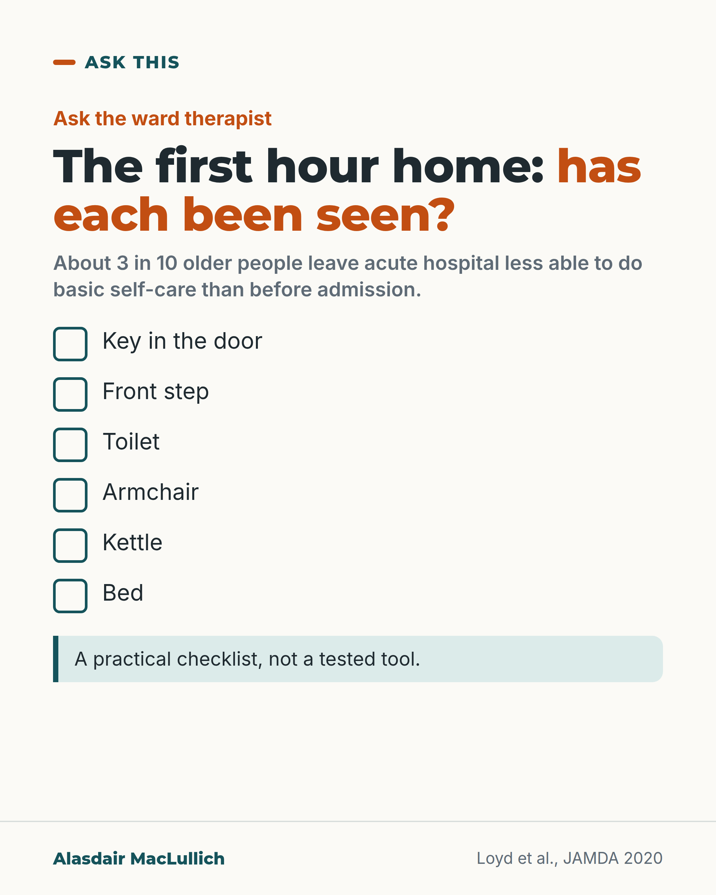

# G018: The first hour home

- Category: C02 Mobility, deconditioning and rehabilitation
- Audience: public
- Series: Ask this
- Post type: decision_support
- Visual format: checklist
- Status: text text_final, visual final
- Working id: C02-P07 (candidate C02-10)

## Insight

About 3 in 10 older people leave acute hospital less able to do basic self-care than before admission, so families can ask whether the tasks of the first hour home have been seen and practised.

## Angle and position

A concrete first-hour checklist (key, step, toilet, chair, kettle, bed) to ask the ward therapist about before discharge.

Basis: mixed: the 3 in 10 figure is empirical (Loyd 2020); the checklist and first-hour framing are practical judgement, not a tested tool

## X (587 characters)

```text
The key in the door. The front step. The toilet. The armchair. The kettle. The bed.

That is the first hour home after a hospital stay.

A 2020 analysis pooled 15 studies of older people admitted to an acute hospital (one that treats sudden illness). About 3 in 10 came out less able than before. They found it harder to wash, dress, use the toilet, or get out of a bed or chair.

Some of that loss starts with the illness itself.

Before discharge, ask the ward therapist: have you seen them do each of these six? If one has not been tried, can it be practised, and is equipment needed?
```

## LinkedIn (1377 characters)

```text
The key in the door. The front step. The toilet. The armchair. The kettle. The bed.

That is the first hour home after a hospital stay.

A 2020 analysis pooled 15 studies of 7,375 people aged 65 and over admitted to an acute hospital (one that treats sudden illness). About 3 in 10 came out less able than before. They found it harder to wash, dress, use the toilet, eat, or get in and out of a bed or chair.

In the studies that asked about abilities 2 weeks before admission, it was about 1 in 3. Both figures describe the same kind of loss; the second looks further back.

The studies varied widely, and most were from the US. Some of the loss starts with the illness before admission. The figure does not show that the hospital stay caused it.

Those studies counted the toilet, the chair and the bed. The key, the step and the kettle are everyday tasks I suggest adding. This checklist is practical advice, not a tested tool.

Before discharge, you can ask the ward physiotherapist or occupational therapist (a specialist in everyday tasks):

1. Have you seen them do each of these six things?
2. If one has not been tried, can it be practised before they leave?
3. Is any equipment needed?
4. Should an occupational therapist look at the home?

A home visit is not needed or offered for everyone. Asking still tells you which of the six have been seen and which have not.
```

## Bluesky (292 characters)

```text
Key in the door. Front step. Toilet. Chair. Kettle. Bed.

About 3 in 10 older people leave acute hospital less able to do basic self-care than before admission. Some of that starts with the illness.

Before discharge, ask the ward therapist which of these six they have seen your relative do.
```

## Threads (460 characters)

```text
Key in the door. Front step. Toilet. Armchair. Kettle. Bed. That is the first hour home.

About 3 in 10 older people admitted to an acute hospital (one that treats sudden illness) left less able than before. They found it harder to wash, dress, use the toilet or get out of a bed or chair. Some of that starts with the illness.

Before discharge, ask the ward therapist which of these six they have seen your relative do. Ask whether the rest can be practised.
```

## Source reply

Sources: Loyd 2020 https://doi.org/10.1016/j.jamda.2019.09.015 ; Lockwood 2015 https://doi.org/10.2340/16501977-1942

## Visual



Alt text: Checklist card: the first hour home. Has each been seen? Key in the door, front step, toilet, armchair, kettle, bed, each with an empty tick box. About 3 in 10 older people leave acute hospital less able to do basic self-care than before admission. A practical checklist, not a tested tool.

Editable source: `visuals/src/G018.html`

Design instructions: Checklist card with six empty tick boxes and a note that the checklist is untested.

## Sources and verification

- C02-10-a (supported_with_qualification): About 3 in 10 older people admitted to an acute hospital leave less able to do basic daily activities (washing, dressing, using the toilet, eating, getting in and out of bed or a chair, walking) than they were before they became ill.
  - Source: Loyd C, Markland AD, Zhang Y, Fowler M, Harper S, Wright NC, et al. Prevalence of hospital-associated disability in older adults: a meta-analysis. J Am Med Dir Assoc. 2020;21(4):455-461.e5.
  - Passage: ""Random effects meta-analysis showed the combined prevalence across studies was 30% (95% CI: 24%, 36%; p<0.001). Sensitivity analysis of only studies assessing ADL decline from 2 weeks prior to admission to discharge or within a month of discharge showed a combined prevalence of 33% (95% CI: 26%, 41%;)." ... "Prevalence among all hospital-based studies ranged from 17% to 61%" ... "The World Health Organization's International Classification of Functioning, Disability, and Health (ICF) describes functional impairments in activities as having a limitation in independent execution of daily tasks including self-care (bathing, dressing, using the toilet, and eating) and mobility (transferring from bed or a chair, walking across the room)."" (Full text, Results (Prevalence of Hospital-Associated Disability) and Introduction; abstract Results)
- C02-10-c (supported_with_qualification): The first-hour tasks (door key, front step, toilet, chair, kettle, bed) make a practical pre-discharge check; the toilet, chair and bed are the kinds of task the hospital-disability studies measured, while the key, step and kettle go beyond them.
  - Source: Loyd C, Markland AD, Zhang Y, Fowler M, Harper S, Wright NC, et al. Prevalence of hospital-associated disability in older adults: a meta-analysis. J Am Med Dir Assoc. 2020;21(4):455-461.e5.; Covinsky KE, Palmer RM, Fortinsky RH, Counsell SR, Stewart AL, Kresevic D, et al. Loss of independence in activities of daily living in older adults hospitalized with medical illnesses: increased vulnerability with age. J Am Geriatr Soc. 2003;51(4):451-8.
  - Passage: "Loyd 2020: "self-care (bathing, dressing, using the toilet, and eating) and mobility (transferring from bed or a chair, walking across the room)". Covinsky 2003: "interviewed about their independence in five ADLs (bathing, dressing, eating, transferring, and toileting)"." (Loyd full text, Introduction; Covinsky abstract, Methods)
- C02-10-d (supported_with_qualification): Occupational therapists can assess how a person manages at home, including by a home visit before discharge; families can ask whether this has happened.
  - Source: Lockwood KJ, Taylor NF, Harding KE. Pre-discharge home assessment visits in assisting patients' return to community living: a systematic review and meta-analysis. J Rehabil Med. 2015;47(4):289-99.
  - Passage: ""To determine the effectiveness of pre-discharge home assessment visits by occupational therapists in assisting hospitalized patients from a range of settings to return to community living." ... "There is low-to-moderate quality evidence that pre-discharge home assessment visits reduce patients' risk of falling and increase participation. The risk of readmission to hospital is also reduced, but not for patients following stroke." ... "There was no effect on activity or quality of life."" (Abstract, Objective, Results and Conclusions)

Verification notes: Loyd 2020 full text (30% pooled; 33% with 2-week baseline; range 17 to 61%; mostly US; not causal). Checklist framed as judgement (C02-10-c). Therapist questions from C02-10-d; home visit not promised, NICE not cited. Editor guidance followed: no hip fracture readiness framing; Covinsky not used.

## Attention and follow potential

Pause: Families preparing for a discharge will recognise the six tasks immediately.

Gain: A concrete question to ask before discharge, and the reason for asking.

Follow: Ask this posts give families specific questions that change what happens.

## Open issues

None.
