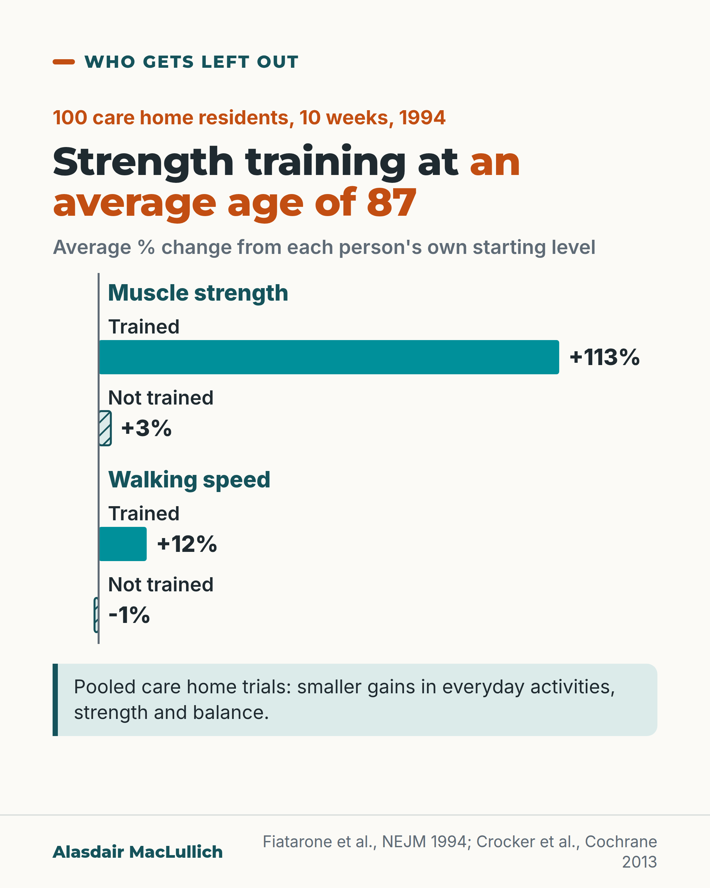

# G019: Strength training at 87

- Category: C02 Mobility, deconditioning and rehabilitation
- Audience: public
- Series: Who gets left out
- Post type: good_care
- Visual format: chart (bars)
- Status: text text_final, visual final
- Working id: C02-P08 (candidate C02-19)

## Insight

In a 1994 care home trial, residents averaging 87 more than doubled their strength with 10 weeks of strength training. Pooled trials show smaller gains, which may be overstated.

## Angle and position

Low expectations should not keep care home residents from strength exercise suited to them.

Basis: mixed: trial and review results are empirical; the call to offer strength exercise is ethical judgement

## X (663 characters)

```text
Average age 87. Oldest 98.

In a 1994 US trial, 100 frail care home residents were randomly given 10 weeks of high-intensity (hard) strength training or not. Those who trained more than doubled their muscle strength on average (up 113%, against 3% for those who did not). Their walking speed rose about 12%.

That was one trial. A Cochrane review (a pooled summary of trials) covered 67 care home trials. It found smaller gains. Exercise and rehabilitation probably help a little with everyday activities, strength and balance, without more deaths.

Care home residents should be offered strength exercise suited to them. Age alone is no reason to leave them out.
```

## LinkedIn (1408 characters)

```text
Average age 87. Oldest 98.

In a 1994 US trial, 100 frail care home residents were randomly given 10 weeks of high-intensity (hard) strength training or not. They were well enough to consent and take part.

Those who trained more than doubled their muscle strength on average: up 113% from where they started, against 3% in those who did not train. Their walking speed rose about 12%, while it fell slightly in the others. A supplement drink on its own made no difference.

These are changes from a low starting point, so they are large in relative terms.

The wider picture is more modest. A Cochrane review (a pooled summary of trials) covered 67 trials in care homes. It found that exercise and rehabilitation probably help a little with everyday activities and with strength and balance, without increasing deaths. The effects were small and may not apply to every resident. Weaknesses in the trials may have overstated them.

A 2022 review of more recent care home trials found that strength training improved simple tests, such as standing up from a chair and getting up and walking, compared with usual care.

Experts note that agreement on the value of strength exercise has not yet turned into consistent provision.

My position, as a judgement: residents of care homes, including the very old, should be offered strength exercise suited to them. Being 87 or 98 is not a reason to leave someone out.
```

## Bluesky (292 characters)

```text
In a 1994 trial, care home residents averaging 87 (oldest 98) more than doubled their strength after 10 weeks of strength training.

Pooled care home trials show smaller gains, which may be overstated by weaknesses in the trials.

Residents should be offered strength exercise suited to them.
```

## Threads (462 characters)

```text
Average age 87. Oldest 98.

In a 1994 US care home trial, residents who did 10 weeks of strength training more than doubled their strength on average (up 113%, against 3% without training), and walked about 12% faster while the others slowed slightly.

A review of 67 care home trials found smaller gains: a little better at everyday activities, strength and balance, with no extra deaths.

Care home residents should be offered strength exercise suited to them.
```

## Source reply

Sources: Fiatarone 1994 https://doi.org/10.1056/NEJM199406233302501 ; Crocker 2013 Cochrane https://doi.org/10.1002/14651858.CD004294.pub3 ; Pinheiro 2022 https://doi.org/10.1016/j.jamda.2022.06.009

## Visual



Alt text: Bar chart of average percentage change from each person's own starting level in a 1994 trial of 100 care home residents over 10 weeks. Strength: trained +113%, not trained +3%. Walking speed: trained +12%, not trained -1%. Pooled care home trials show smaller gains in everyday activities, strength and balance.

Editable source: `visuals/src/G019.html`

Design instructions: Custom bars from a zero line, hatched for not trained, solid for trained; small negative bar for -1%.

## Sources and verification

- C02-19-a (supported): In a randomised trial, 100 frail nursing home residents (mean age 87.1, range 72 to 98) received progressive resistance training, a nutritional supplement, both or neither for 10 weeks.
  - Source: Fiatarone MA, O'Neill EF, Ryan ND, Clements KM, Solares GR, Nelson ME, et al. Exercise training and nutritional supplementation for physical frailty in very elderly people. N Engl J Med. 1994;330(25):1769-75.
  - Passage: ""We conducted a randomized, placebo-controlled trial comparing progressive resistance exercise training, multinutrient supplementation, both interventions, and neither in 100 frail nursing home residents over a 10-week period." and "The mean (+/- SE) age of the 63 women and 37 men enrolled in the study was 87.1 +/- 0.6 years (range, 72 to 98); 94 percent of the subjects completed the study."" (Abstract (Methods, Results))
- C02-19-b (supported): Muscle strength increased by 113% with training versus 3% without; gait velocity rose 11.8% with training and fell 1.0% without; stair-climbing power improved 28.4% versus 3.6%. The supplement alone had no effect.
  - Source: Fiatarone MA, O'Neill EF, Ryan ND, Clements KM, Solares GR, Nelson ME, et al. Exercise training and nutritional supplementation for physical frailty in very elderly people. N Engl J Med. 1994;330(25):1769-75.
  - Passage: ""Muscle strength increased by 113 +/- 8 percent in the subjects who underwent exercise training, as compared with 3 +/- 9 percent in the nonexercising subjects (P < 0.001). Gait velocity increased by 11.8 +/- 3.8 percent in the exercisers but declined by 1.0 +/- 3.8 percent in the nonexercisers (P = 0.02). Stair-climbing power also improved in the exercisers as compared with the nonexercisers (by 28.4 +/- 6.6 percent vs. 3.6 +/- 6.7 percent, P = 0.01), as did the level of spontaneous physical activity." and "The nutritional supplement had no effect on any primary outcome measure."" (Abstract (Results))
- C02-19-d (supported): A Cochrane review of physical rehabilitation for older people in long-term care found small improvements in daily activities, did not show a clear effect on walking speed, found no increase in deaths, and warned that bias may have overestimated benefits.
  - Source: Crocker T, Forster A, Young J, Brown L, Ozer S, Smith J, et al. Physical rehabilitation for older people in long-term care. Cochrane Database Syst Rev. 2013;(2):CD004294.
  - Passage: ""We included 67 trials, involving 6300 participants." "The estimated effects of physical rehabilitation at the end of the intervention were an improvement in Barthel Index (0 to 100) scores of six points (95% confidence interval (CI) 2 to 11, P = 0.008, seven studies) ... and walking speed of 0.03 m/s (95% CI -0.01 to 0.07, P = 0.1, nine studies)." "Synthesis of secondary outcomes suggested there is a beneficial effect on strength, flexibility, and balance" "rehabilitation does not increase risk of mortality in this population (risk ratio 0.95, 95% CI 0.80 to 1.13). However, it is possible bias has resulted in overestimation of the positive effects of physical rehabilitation." "Physical rehabilitation for long-term care residents may be effective, reducing disability with few adverse events, but effects appear quite small and may not be applicable to all residents."" (Abstract (Main results, Authors' conclusions))
- C02-19-e (supported_with_qualification): A 2022 meta-analysis found resistance training and multicomponent training improved physical performance tests in nursing home residents compared with usual care.
  - Source: Pinheiro ÉP, Cavalheiro do Espírito Santo R, Peterson dos Santos L, Gonçalves WV, Forgiarini Junior LA, Xavier RM, Filippin LI. Multicomponent or resistance training for nursing home residents: a systematic review with meta-analysis. J Am Med Dir Assoc. 2022;23(12):1926.e1-1926.e10.
  - Passage: ""A total of 30 studies were included in the qualitative review (n = 1887, mean age 82.68 years and 70% female)." "Multicomponent training and resistance training showed statistically significant difference (P <= .05) in the physical performance of institutionalized older adults compared with the control groups (usual care); this was evaluated with the Short Physical Performance Battery (+1.2 points; +2 points), 30-second chair-stand (approximately +3 repetitions; both), and Timed Up and Go (-4 seconds on mean; both) tests." "Further studies with more representative sample numbers, an improvement in methodological quality, and a more specified prescription of the training used are necessary."" (Abstract (Results, Conclusions))
- C02-19-f (not_found): Care home residents in the UK have limited access to physiotherapy and progressive strength exercise.
  - Source: Sayer AA, Cruz-Jentoft A. Sarcopenia definition, diagnosis and treatment: consensus is growing. Age Ageing. 2022;51(10):afac220.
  - Passage: "No UK care-home-specific source found. Closest general statement (Sayer 2022): "The consensus on the benefit of resistance exercise for the treatment of sarcopenia within the research world has yet to translate into consistent provision of resistance exercise in clinical practice"" (Sayer 2022 full text, 'Looking ahead')

Verification notes: Fiatarone 1994 abstract (100 residents, mean 87.1, 72 to 98, 113% vs 3%, 11.8% vs -1.0%, supplement no effect); equipment not described. Cochrane 2013 abstract (67 trials, small effects, mortality not increased). Pinheiro 2022 abstract. Provision gap only as Sayer 2022 general statement (C02-19-f supportable wording); UK access claim not made. Judgement marked.

## Attention and follow potential

Pause: The age figures stop people who assume strength training is for the young-old.

Gain: The trial result and the realistic size of benefit across trials.

Follow: Who gets left out posts challenge low expectations for older people.

## Open issues

None.
