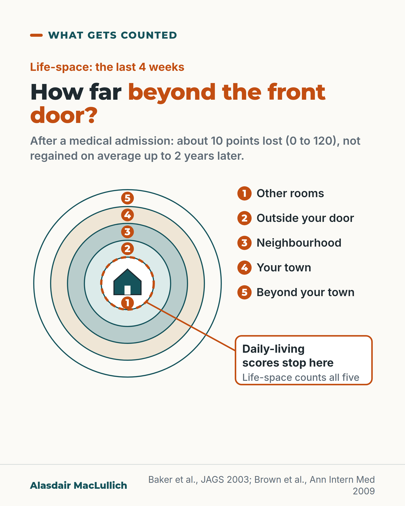

# G020: How far beyond the front door

- Category: C02 Mobility, deconditioning and rehabilitation
- Audience: both
- Series: What gets counted
- Post type: evidence_interpretation
- Visual format: diagram (concentric zones)
- Status: text text_final, visual final
- Working id: C02-P09 (candidate C02-23)

## Insight

Daily-living scores stop at the front door; life-space asks how far beyond it you get. After a medical admission, older people lost about 10 points of life-space and, as a group, had not recovered it up to two years later.

## Angle and position

Rehabilitation services and trials should also count how far people get beyond the front door.

Basis: mixed: life-space trajectories and trial findings are empirical; the call to count life-space is judgement

## X (617 characters)

```text
In the last 4 weeks, how far from your front door did you get, and how often?

That is what a life-space assessment asks. It scores from 0 to 120. Usual daily-living scores ask whether you can wash, dress, use the toilet and cross a room. They do not ask whether you reach the shop or a friend's house.

A US study followed older people at home. Those admitted to hospital for a medical illness lost about 10 points out of 120. As a group, they had not got it back up to two years later.

Rehabilitation services and trials should count how far people get beyond the front door, as well as what they manage inside it.
```

## LinkedIn (1540 characters)

```text
In the last 4 weeks, how far from your front door did you get, and how often?

That is the central question of a life-space assessment. It asks whether you have been to other rooms of your home, outside your door (garden, porch or landing), around your neighbourhood, elsewhere in your town, and beyond it. It also asks how often, and whether you needed a stick, a frame or another person. Scores run from 0 to 120.

Usual daily-living scores ask whether you can wash, dress, eat, use the toilet, get in and out of bed or a chair, and walk across a room. They do not ask whether you get to the shop, the bus stop or a friend's house.

Two findings suggest the difference counts:

1. In a US study that followed older people at home, those admitted for a medical (non-surgical) reason lost about 10 points of life-space on average and, as a group, had not recovered up to two years later. People admitted for surgery lost more at first but recovered within about a year. This is observational; averages hide individual variation.
2. In a small trial of 100 older US veterans, a hospital walking programme showed no difference on daily-living scores, which barely changed in either group. On life-space, the usual care group lost about 10 points by a month after discharge while the walking group stayed close to where they started. Life-space was not the trial's registered primary outcome, and it needs replication.

My position, as a judgement: rehabilitation services and trials should also count how far people get beyond the front door.
```

## Bluesky (296 characters)

```text
In the last 4 weeks, how far from your front door did you get? A life-space assessment asks this, scored 0 to 120.

Daily-living scores stop at the door. In a US study, older people lost about 10 of those 120 points after a medical hospital stay and, on average, had not regained them 2 years on.
```

## Threads (438 characters)

```text
In the last 4 weeks, how far from your front door did you get, and how often?

That is what a life-space assessment asks, on a scale of 0 to 120. Daily-living scores stop at washing, dressing and crossing a room.

In a US study, older people admitted to hospital for a medical illness lost about 10 of those 120 points. As a group, they had not regained them two years later.

Rehabilitation should count the distance beyond the door too.
```

## Source reply

Sources: Brown 2009 https://doi.org/10.7326/0003-4819-150-6-200903170-00005 ; Baker 2003 https://doi.org/10.1046/j.1532-5415.2003.51512.x ; Brown 2016 https://doi.org/10.1001/jamainternmed.2016.1870

## Visual



Alt text: Diagram of five concentric rings around a house: 1 other rooms, 2 outside your door, 3 neighbourhood, 4 your town, 5 beyond your town. A dashed line at the house wall is labelled daily-living scores stop here. After a medical admission about 10 points of 120 were lost and not regained on average up to 2 years later.

Editable source: `visuals/src/G020.html`

Design instructions: Concentric ring map with numbered rings, key, and dashed boundary callout.

## Sources and verification

- C02-23-a (supported): The Life-Space Assessment asks how far a person has moved from their bedroom out to beyond their town in the past 4 weeks, how often, and with what help.
  - Source: Brown CJ, Roth DL, Allman RM, Sawyer P, Ritchie CS, Roseman JM. Trajectories of life-space mobility after hospitalization. Ann Intern Med. 2009;150(6):372-8.; Baker PS, Bodner EV, Allman RM. Measuring life-space mobility in community-dwelling older adults. J Am Geriatr Soc. 2003;51(11):1610-4.; Brown CJ, Foley KT, Lowman JD, MacLennan PA, Razjouyan J, Najafi B, et al. Comparison of posthospitalization function and community mobility in hospital mobility program and usual care patients: a randomized clinical trial. JAMA Intern Med. 2016;176(7):921-7.
  - Passage: "Brown 2009 (Ann Intern Med) full text: "The LSA measures mobility during the four weeks preceding the assessment by asking about movement to specific life-space levels ranging from within one’s dwelling to beyond one’s town (–). Frequency of movement and use of assistance, either from equipment or another person, were assessed. Specifically, participants were asked: “During the past 4 weeks, have you: 1) been to other rooms in your home besides the room where you sleep; 2) been to an area outside your home such as your porch, deck, or patio, hallway of an apartment building, or garage; 3) been to places in your neighborhood other than your own yard or apartment building; 4) been to places outside your neighborhood, but within your town; and 5) been to places outside your town?”" ... "Life-Space composite scores ranged from 0 to 120 with higher scores representing greater mobility." Baker 2003: "The LSA assessed the range, independence, and frequency of movement over the 4 weeks preceding assessments." Brown 2016: "Life-space levels range from within one’s bedroom to beyond one’s town."" (Brown 2009 full text, Methods (Life-Space Mobility); Baker 2003 abstract, Measurements; Brown 2016 full text, Methods)
- C02-23-b (supported): Standard daily-living scales count self-care tasks done in and around the home (washing, dressing, eating, toilet, getting in and out of bed or a chair, walking across a room).
  - Source: Loyd C, Markland AD, Zhang Y, Fowler M, Harper S, Wright NC, et al. Prevalence of hospital-associated disability in older adults: a meta-analysis. J Am Med Dir Assoc. 2020;21(4):455-461.e5.; Brown CJ, Foley KT, Lowman JD, MacLennan PA, Razjouyan J, Najafi B, et al. Comparison of posthospitalization function and community mobility in hospital mobility program and usual care patients: a randomized clinical trial. JAMA Intern Med. 2016;176(7):921-7.
  - Passage: "Loyd 2020: "Included studies used the Katz Index of Independence in Activities of Daily Living or Barthel Index to measure ADL." ... "self-care (bathing, dressing, using the toilet, and eating) and mobility (transferring from bed or a chair, walking across the room)." Brown 2016: "Participants were asked at baseline to rate their ability to perform basic ADLs (bathing, dressing, feeding, toileting, grooming, transferring, and walking)"." (Loyd full text, Methods and Introduction; Brown 2016 full text, Methods (Functional Outcome Assessment))
- C02-23-c (supported_with_qualification): In a small randomised trial, a hospital walking programme showed no difference on a daily-living scale but a difference in life-space a month after discharge.
  - Source: Brown CJ, Foley KT, Lowman JD, MacLennan PA, Razjouyan J, Najafi B, et al. Comparison of posthospitalization function and community mobility in hospital mobility program and usual care patients: a randomized clinical trial. JAMA Intern Med. 2016;176(7):921-7.
  - Passage: "Abstract: "For all periods, groups were similar in ability to perform ADL; however, at 1-month after hospitalization, the LSA score was significantly higher in the MP (LSA score, 52.5) compared with the UC group (LSA score, 41.6) (P = .02). For the MP group, the 1-month posthospitalization LSA score was similar to the LSA score measured at admission. For the UC group, the LSA score decreased by approximately 10 points." Full text: "For all periods, groups were similar in their ability to perform ADL (= .62); furthermore, ability to perform ADL did not significantly change over time (= .77), and there were no significant group-time interactions (= .76)." ... "Our initial trial registration described time out of bed using accelerometers as our primary outcome. However, technical failures in this measure precluded use of accelerometer data. Therefore, this report focuses on outcomes from other aims in the protocol." ... "In addition, the study was not powered to see significant ADL changes." ... "An example of a 10-point decrease would be an older person who previously reported no assistance to go into town 1 to 3 times a week (LSA score, 64) but who now requires a cane to go into town and goes less than once a week (LSA score, 54)."" (Abstract, Results; full text, Methods (Hospital Mobility Assessment), Results and Discussion)
- C02-23-d (supported_with_qualification): After an emergency medical admission, older people's life-space falls and, on average, does not recover over up to two years.
  - Source: Brown CJ, Roth DL, Allman RM, Sawyer P, Ritchie CS, Roseman JM. Trajectories of life-space mobility after hospitalization. Ann Intern Med. 2009;150(6):372-8.
  - Passage: ""Immediately after hospitalization, covariate-adjusted LSA scores decreased in non-surgical patients by 10.31 points (95% CI −14.30 to −6.32) and in surgical patients by 22.45 points (95% CI −29.91 to −14.99)." ... "Indeed, LSA score recovery after non-surgical hospitalizations was non-significantly different from the null (average recovery of 0.66 points [95% CI −0.60 to 1.91] per log week). For example, at 12 weeks post-discharge, life-space recovered by an average of 1.69 points in non-surgical patients and by 13.80 points in surgical patients. As illustrated in, on average, within up to two years of the incident non-surgical hospitalization, these patients did not recover to their pre-hospital levels of life-space."" (Full text, Results)

Verification notes: Brown 2009 full text (10.31-point fall after non-surgical admission, no recovery to 2 years; surgical recovered). Baker 2003 abstract and Brown 2016 full text for LSA items. Brown 2016 trial: registered-outcome limitation and replication stated. Loyd 2020 for ADL items. Judgement marked.

## Attention and follow potential

Pause: The opening question is one any reader can answer about themselves or a parent.

Gain: A measure of recovery that families recognise, and the evidence that it can show losses daily-living scores miss.

Follow: What gets counted posts compare what services measure with what people live.

## Open issues

None.
