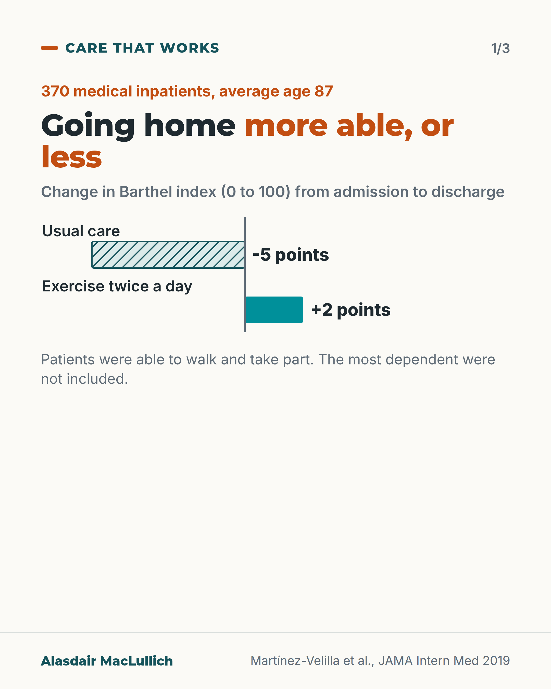
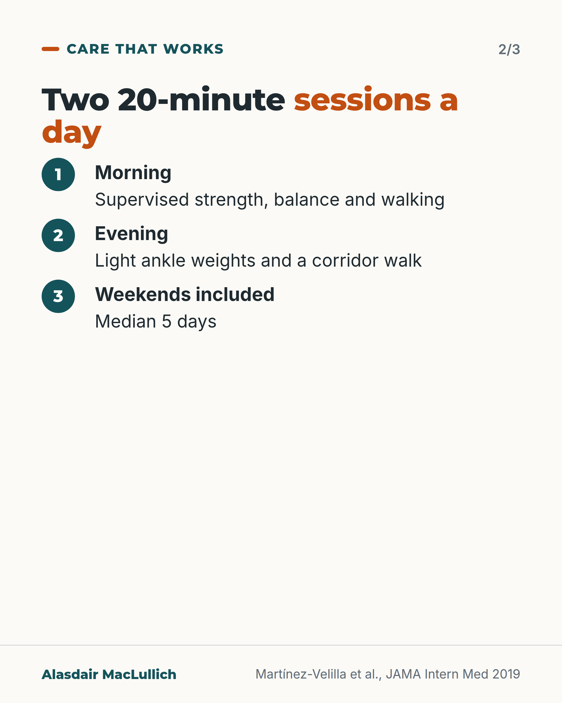
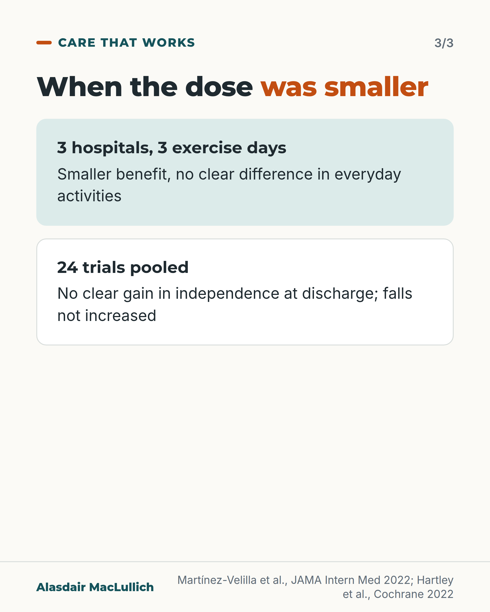

# G021: Two short sessions a day at 87

- Category: C02 Mobility, deconditioning and rehabilitation
- Audience: practitioners
- Series: Care that works
- Post type: good_care
- Visual format: carousel
- Status: text text_final, visual final
- Working id: C02-P10 (candidate C02-16)

## Insight

In a Spanish trial, very old medical inpatients who exercised twice daily went home slightly more able while usual care patients lost ground; a shorter replication and pooled trials show smaller or unclear benefit, with no increase in falls.

## Angle and position

Structured exercise is safe for relatively able very old inpatients; how much it helps depends on dose and delivery.

Basis: mixed: trial and review results are empirical; the dose explanation is the authors' interpretation; 'bed rest is not the safer choice' is clinical interpretation based on no excess falls or harms

## X (640 characters)

```text
When a Spanish hospital gave medical patients averaging 87 two 20-minute exercise sessions a day, they went home slightly more able instead of less.

Usual care: down 5 points on a 100-point scale of everyday activities. Exercise: up about 2. Between groups, about 7 points. No harms were recorded.

Then the harder part. Repeated in three hospitals with only 3 exercise days, the benefit shrank. Pooled across 24 trials, in-hospital exercise showed no clear gain in independence at discharge, and no rise in falls.

Structured exercise was safe for able very old inpatients. How much it helps seems to depend on dose, in the authors' view.
```

## LinkedIn (1735 characters)

```text
When a Spanish hospital gave medical patients averaging 87 two 20-minute exercise sessions a day, they went home slightly more able instead of less.

The trial (Martínez-Velilla, JAMA Internal Medicine 2019) randomised 370 patients aged 75 and over who could walk, with or without help. The most dependent and those expected to stay under 6 days were not included.

Mornings: supervised sit-to-stand, leg press, knee extension and chest press at moderate load, plus balance and walking practice. Evenings: light ankle-weight exercises and a corridor walk. Weekends included, for a median of 5 days. A physiotherapist and an exercise specialist shared the work seven days a week.

By discharge, usual care patients had lost 5 points on the Barthel index (a 0 to 100 scale of everyday activities); exercisers had gained about 2. The between-group difference was about 7 Barthel points and 2 points on the 12-point SPPB. That is modest against the 11-point yardstick used by Cochrane. No harms from exercise were recorded, and length of stay, falls, readmissions and deaths over 3 months did not differ.

The replication was less convincing. In three hospitals with only 3 exercise days, the SPPB gain was under 1 point and there was no clear Barthel difference. The authors attribute this to the shorter programme and sicker patients; that is their interpretation, not tested.

The 2022 Cochrane review (24 trials) found no clear, meaningful gain in independence at discharge (low certainty), and no increase in falls.

My reading: structured exercise appears safe for relatively able very old inpatients, and bed rest is not the safer default. How much it helps may depend on dose and delivery, though this has not been tested directly.
```

## Bluesky (276 characters)

```text
Spanish trial, inpatients averaging 87: two 20-minute exercise sessions a day. Usual care lost 5 points on a 100-point activities scale; exercisers gained 2.

A shorter repeat trial showed less benefit. Pooled trials showed no clear gain in independence, and no rise in falls.
```

## Threads (429 characters)

```text
Two 20-minute exercise sessions a day, for hospital patients averaging 87, in a Spanish trial.

Usual care patients went home 5 points worse on a 100-point scale of everyday activities. Exercisers were about 2 points better. No harms were recorded.

A 3-day repeat in three hospitals showed a smaller benefit, and pooled trials show no clear gain in independence, with no rise in falls. Dose seems to count, in the authors' view.
```

## Source reply

Sources: Martínez-Velilla 2019 https://doi.org/10.1001/jamainternmed.2018.4869 ; Martínez-Velilla 2022 https://doi.org/10.1001/jamainternmed.2021.7654 ; Hartley 2022 Cochrane https://doi.org/10.1002/14651858.CD005955.pub3

## Visual



Alt text: Bar chart of change in Barthel index (0 to 100) from admission to discharge in 370 medical inpatients, average age 87: usual care -5 points, exercise twice a day +2 points. Patients could walk and take part.



Alt text: Card: two 20-minute sessions a day. Morning supervised strength, balance and walking; evening light ankle weights and a corridor walk; weekends included, median 5 days.



Alt text: Card: when the dose was smaller. 3 hospitals with 3 exercise days: smaller benefit, no clear difference in everyday activities. 24 trials pooled: no clear gain in independence at discharge; falls not increased.

Editable source: `visuals/src/G021.html`

Design instructions: Three-card carousel: diverging bars, programme steps, wider evidence panels.

## Sources and verification

- C02-16-a (supported): A single-centre, single-blind randomised trial in an acute care of the elderly unit in Navarra, Spain, randomised 370 patients (mean age 87.3) to exercise or usual care.
  - Source: Martínez-Velilla N, Casas-Herrero A, Zambom-Ferraresi F, Sáez de Asteasu ML, Lucia A, Galbete A, et al. Effect of exercise intervention on functional decline in very elderly patients during acute hospitalization: a randomized clinical trial. JAMA Intern Med. 2019;179(1):28-36.
  - Passage: ""A single-center, single-blind randomized clinical trial was conducted from February 1, 2015, to August 30, 2017, in an acute care unit in a tertiary public hospital in Navarra, Spain. A total of 370 very elderly patients undergoing acute-care hospitalization were randomly assigned to an exercise or control (usual-care) intervention." "Of the 370 patients included in the analyses, 209 were women (56.5%); mean (SD) age was 87.3 (4.9) years."" (Abstract)
- C02-16-b (supported): The programme was two 20-minute sessions a day (morning and evening) for 5 to 7 consecutive days including weekends: a supervised morning session of individualised progressive resistance (machines, 30-60% of one-repetition maximum), balance and walking exercise, and an unsupervised evening session with light ankle weights, a grip ball and corridor walking. Median intervention length was 5 days.
  - Source: Martínez-Velilla N, Casas-Herrero A, Zambom-Ferraresi F, Sáez de Asteasu ML, Lucia A, Galbete A, et al. Effect of exercise intervention on functional decline in very elderly patients during acute hospitalization: a randomized clinical trial. JAMA Intern Med. 2019;179(1):28-36.
  - Passage: ""The intervention was programmed in 2 daily sessions (morning and evening) of 20 minutes’ duration during 5 to 7 consecutive days (including weekends). An experienced fitness specialist with in-depth training on safe patient handling techniques (F.Z.-F.) supervised each patient’s session" "The morning sessions included individualized supervised progressive resistance, balance, and walking training exercises. The resistance exercises were tailored to the individual's functional capacity using variable resistance training machines ... aiming at 2 to 3 sets of 8 to 10 repetitions with a load equivalent to 30% to 60% of the 1-repetition maximum." "The evening session consisted of functional unsupervised exercises using light loads (ie, 0.5- to 1-kg anklets and handgrip ball), such as knee extension and flexion, hip abduction, and daily walking in the corridor" Abstract: "Median duration of the intervention was 5 days (interquartile range, 0)"" (Methods (full text); Abstract)
- C02-16-c (supported): Delivering the programme required one physiotherapist hired for the project plus an exercise-physiology researcher, seven days a week, and about 4,000 euros of equipment.
  - Source: Martínez-Velilla N, Casas-Herrero A, Zambom-Ferraresi F, Sáez de Asteasu ML, Lucia A, Galbete A, et al. Effect of exercise intervention on functional decline in very elderly patients during acute hospitalization: a randomized clinical trial. JAMA Intern Med. 2019;179(1):28-36.
  - Passage: ""The costs derived from the intervention were basically those generated by hiring 1 physiotherapist (M.L.S.deA.) ad hoc for the project and the collaboration of a researcher (with a PhD background in exercise physiology) (F.Z.-F.) who shared the work during 7 days a week for the duration of the study. An initial investment of €4000 (US $4645) was made to buy the weight-training equipment"" (Methods (full text))
- C02-16-d (supported): At discharge, function fell with usual care (Barthel -5.0 points from baseline) and rose slightly with exercise (+1.9); the between-group differences were 6.9 Barthel points and 2.2 SPPB points in favour of exercise.
  - Source: Martínez-Velilla N, Casas-Herrero A, Zambom-Ferraresi F, Sáez de Asteasu ML, Lucia A, Galbete A, et al. Effect of exercise intervention on functional decline in very elderly patients during acute hospitalization: a randomized clinical trial. JAMA Intern Med. 2019;179(1):28-36.
  - Passage: ""At discharge, the exercise group showed a mean increase of 2.2 points (95% CI, 1.7-2.6 points) on the SPPB scale and 6.9 points (95% CI, 4.4-9.5 points) on the Barthel Index over the usual-care group. Hospitalization led to an impairment in functional capacity (mean change from baseline to discharge in the Barthel Index of -5.0 points (95% CI, -6.8 to -3.2 points) in the usual-care group, whereas the exercise intervention reversed this trend (1.9 points; 95% CI, 0.2-3.7 points). The intervention also improved the SPPB score (2.4 points; 95% CI, 2.1-2.7 points) vs 0.2 points; 95% CI, -0.1 to 0.5 points in controls)."" (Abstract; Results (full text))
- C02-16-e (supported): No adverse effects of the exercise were recorded, and there were no differences in length of stay, in-hospital falls, or 3-month readmission or mortality.
  - Source: Martínez-Velilla N, Casas-Herrero A, Zambom-Ferraresi F, Sáez de Asteasu ML, Lucia A, Galbete A, et al. Effect of exercise intervention on functional decline in very elderly patients during acute hospitalization: a randomized clinical trial. JAMA Intern Med. 2019;179(1):28-36.
  - Passage: ""No adverse effects associated with the prescribed exercises were recorded and no patient had to interrupt the intervention or had their hospital stay modified because of it." "There were, however, no significant differences between groups in the remainder of secondary outcomes, including incident delirium (P > .10) (Table 2), length of hospitalization, proportion of patients having 1 or more falls during hospitalization, 3-month hospital readmission rate/mortality, or patient transfer (all P > .10)"" (Results (full text))
- C02-16-f (supported): Participants had to be aged 75 or over, have a Barthel Index of 60 or more, be able to walk (with or without help) and be able to communicate and cooperate; people expected to stay under 6 days, with very severe dementia or terminal illness were excluded.
  - Source: Martínez-Velilla N, Casas-Herrero A, Zambom-Ferraresi F, Sáez de Asteasu ML, Lucia A, Galbete A, et al. Effect of exercise intervention on functional decline in very elderly patients during acute hospitalization: a randomized clinical trial. JAMA Intern Med. 2019;179(1):28-36.
  - Passage: ""inclusion criteria: age 75 years or older, Barthel Index score of 60 or more ..., being able to ambulate (with/without assistance), and being able to communicate and collaborate with the research team. Exclusion criteria included expected length of stay less than 6 days, very severe cognitive decline (ie, Global Deterioration Scale score, 7), terminal illness, uncontrolled arrhythmias, acute pulmonary embolism, recent myocardial infarction, recent major surgery, or extremity bone fracture in the past 3 months."" (Methods (full text))
- C02-16-g (supported): A three-hospital replication with 3 days of the same kind of exercise found a smaller SPPB benefit (0.93 points) and no clear Barthel benefit; the authors link the smaller effect to fewer training days and more illness.
  - Source: Martínez-Velilla N, Abizanda P, Gómez-Pavón J, Zambom-Ferraresi F, Sáez de Asteasu ML, Fiatarone Singh M, Izquierdo M. Effect of an exercise intervention on functional decline in very old patients during acute hospitalizations: results of a multicenter, randomized clinical trial. JAMA Intern Med. 2022;182(3):345-7.
  - Passage: ""We performed a multicenter randomized clinical trial (RCT) within departments of geriatric medicine in 3 tertiary hospitals in Spain" "The intervention group received 2 daily 20-minute sessions of exercise over 3 consecutive days." "200 patients were randomly assigned ... mean [SD] age, 86.5 [4.4] years" "At discharge, the exercise group had a mean increase of 0.93 points (95% CI, 0.39-1.48 points) on the SPPB scale over the usual care group (Table 2). There was a worsening over hospitalization in the Barthel Index over time of -11.0 points (95% CI, -14.6 to -7.44 points), with a trend for attenuated declines in the intervention group: -6.49 points; 95% CI, -10.20 to -2.73; P = .09." "Factors that could have reduced the efficacy of the intervention include the reduction of the number of training days (from 5 days to 3), and a greater complexity and number of baseline diseases (11 vs 9) per person."" (Methods, Results, Discussion (full text of research letter))
- C02-16-h (supported): Across 24 trials (Cochrane 2022), in-hospital exercise for older medical patients may make little difference to independence in daily activities at discharge, the effect on mobility is uncertain, and it probably does not increase falls.
  - Source: Hartley P, Keating JL, Jeffs KJ, Raymond MJ, Smith TO. Exercise for acutely hospitalised older medical patients. Cochrane Database Syst Rev. 2022;11(11):CD005955.
  - Passage: ""We included 24 studies ... with 7511 participants." "Exercise may have no clinically important effect on independence in activities of daily living at discharge from hospital compared to controls (16 studies, 5174 participants; low-certainty evidence)." "independence in activities of daily living was 1.8 points better (0.43 worse to 4.12 better) with exercise compared to controls. The minimally clinical important difference (MCID) is estimated to be 11 points." "We are uncertain regarding the effect of exercise on functional mobility at discharge" "Exercise interventions did not affect the risk of falls during hospitalisation (moderate-certainty evidence)." "Exercise may make little difference to independence in activities of daily living or QoL, but probably does not result in more falls in older medical inpatients."" (Abstract (Main results, Authors' conclusions))

Verification notes: Martínez-Velilla 2019 full text (370, 87.3, programme, staffing, -5.0/+1.9, 6.9 and 2.2 between groups, no harms, secondary outcomes). 2022 replication full text (SPPB 0.93, Barthel not clear; dose is authors' interpretation). Hartley 2022 Cochrane abstract (24 trials, low certainty, falls 34 vs 34 per 1000). Within and between-group figures kept separate.

## Attention and follow potential

Pause: Ward teams who default to bed rest for very old patients will see a concrete alternative with the numbers.

Gain: A clear picture of a working programme and an honest reading of the wider evidence.

Follow: Care that works posts describe programmes in enough detail to copy, with their limits.

## Open issues

None.
