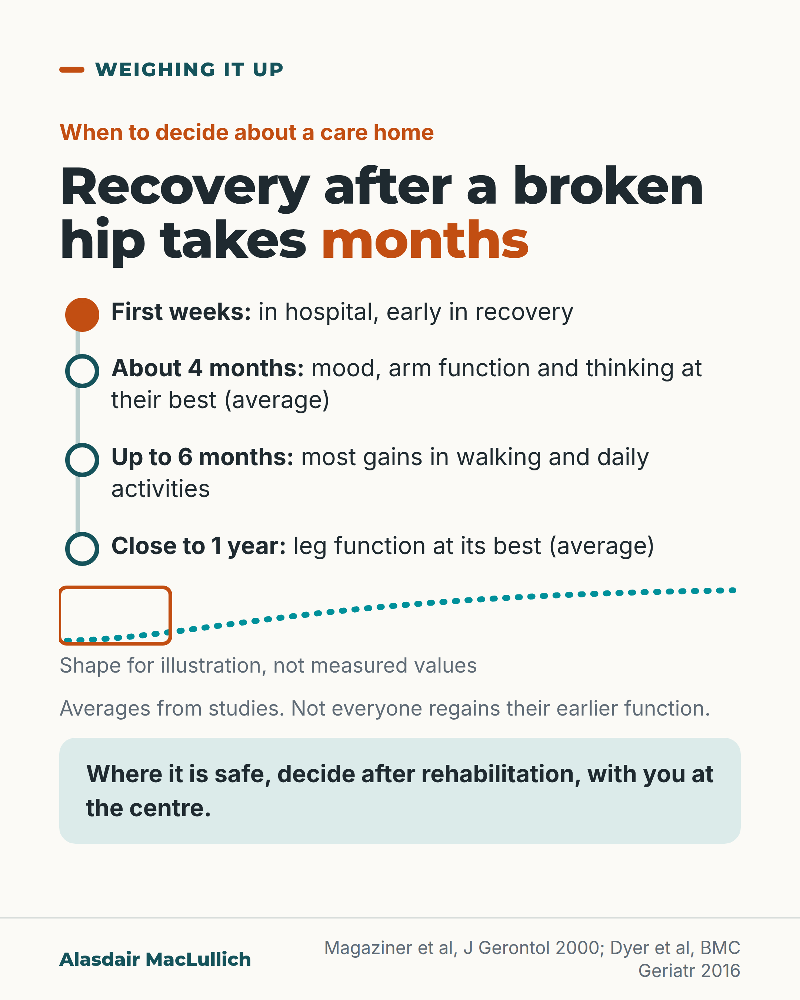

# G022: Decide the care home move after recovery has had its chance

- Category: C03 Hip fracture
- Audience: public
- Series: Weighing it up
- Post type: decision_support
- Visual format: diagram (timeline)
- Status: text text_final, visual final
- Working id: C03-P01 (candidate C03-12)

## Insight

Recovery after a broken hip goes on for months, with leg function reaching its best close to a year later on average in one large study. A permanent care home decision made in the first weeks is made while recovery has only just started.

## Angle and position

Owns the collection's argument about timing: where it is safe, do not decide a permanent care home move while recovery has only just started. A care home can be the right choice; the question is when to decide and who is at the centre of the decision.

Basis: mixed: recovery times, rehabilitation effect and policy summary are empirical or documented (Magaziner 2000, Dyer 2016, Cochrane 2021, Harrison 2017); 'wait for rehabilitation before deciding, where safe' is ethical and clinical judgement, marked as such

## X (1032 characters)

```text
After a broken hip, leg function can keep improving for close to a year. That is the average in one large US study of people who had lived at home before the fracture. The study ran in 1990 and 1991.

Across many studies, most of the recovery in walking and daily activities came in the first 6 months. After that the gains were smaller. Roughly 4 to 6 in 10 people got back to the mobility they had before the fracture. The rest did not.

Recovery goes on for months, so in the first weeks in hospital a person is usually still early in recovery. In our view, where it is safe to wait, that is the wrong moment to decide on a permanent move to a care home.

A 2017 paper said that policy in England and Scotland has been to avoid, where possible, moving a person into a care home straight from a hospital ward.

Sometimes a care home is the right choice. The person should take part in the decision, and it should rest on how they are after rehabilitation.

Ask: what rehabilitation is planned, and when will we look at this again?
```

## LinkedIn (1848 characters)

```text
Recovery from a broken hip goes on for months. In one large US study of people who had lived at home before the fracture, leg function took close to a year on average to reach its best. Mood, arm function and thinking reached their best at about 4 months. The study ran in 1990 and 1991.

A later review of many studies found that most of the recovery in walking and daily activities came in the first 6 months. After that the gains were smaller. Roughly 4 to 6 in 10 people got back to the mobility they had before the fracture. Fewer people who came from care homes did so.

These are averages for groups of people. Some people never regain their earlier function.

Specialist rehabilitation may help. In trials, rehabilitation in hospital led by a specialist team probably meant fewer people died or needed a move to a care home over the next 6 to 12 months. The figure was about 31 in 100, compared with about 35 in 100 with usual care. Deaths and moves to a higher level of care are counted together.

A 2017 paper said that policy in England and Scotland has been to avoid, where possible, moving a person into a care home straight from a hospital ward.

Sources: Magaziner et al, J Gerontol 2000; Dyer et al, BMC Geriatr 2016; Handoll et al, Cochrane 2021; Harrison et al, Age Ageing 2017.

Our judgement: recovery goes on for months, so in the first weeks after a hip fracture a person is usually still early in recovery. Where it is safe, a permanent care home decision should wait until the person has had time and rehabilitation to recover. Sometimes a care home is the right choice. The person should take part in that decision either way.

Questions you or your family can ask:
1. What rehabilitation is planned, and for how long?
2. When will we look at this decision again?
3. What would need to change for going home to be possible?
```

## Bluesky (283 characters)

```text
In one large US study run in 1990 and 1991, leg function kept improving for close to a year after a broken hip, on average.

In our view, a permanent care home decision in the first weeks is made early in recovery. Where it is safe, ask for rehabilitation first and a date to decide.
```

## Threads (497 characters)

```text
Leg function can keep improving for close to a year after a broken hip, on average. That is from one large US study, run in 1990 and 1991, of people who had lived at home. Most walking gains came in the first 6 months; later gains were smaller.

In the first weeks a person is usually still early in recovery. In our view, a permanent care home decision should wait for rehabilitation, where safe.

A care home can be the right choice. Ask: what rehabilitation is planned, and when will we decide?
```

## Source reply

Sources: https://doi.org/10.1093/gerona/55.9.m498 https://doi.org/10.1186/s12877-016-0332-0 https://doi.org/10.1002/14651858.CD007125.pub3 https://doi.org/10.1093/ageing/afw188

## Visual



Alt text: Timeline of recovery after a broken hip: first weeks in hospital, about 4 months for mood, arm function and thinking at their best, up to 6 months for most walking gains, close to 1 year for leg function at its best, all averages. A dotted rising line is illustrative only. Decide after rehabilitation where safe.

Editable source: `visuals/src/G022.html`

Design instructions: diagram (timeline); 1080x1350 card(s) via base.css, teal/orange palette, sand ground only on P09; data claims: ['C03-12-a', 'C03-12-b', 'C03-12-c', 'C03-12-d']. Source: visuals/src/C03-P01.html (generated by simple HTML/SVG, kit people only in P07, P09). Timeline list, dotted illustrative rise, mint closing panel. Claims per post claims_used.

## Sources and verification

- C03-12-a (supported_with_qualification): After a hip fracture, different abilities reach their best at different times: about 4 months for mood, arm function and thinking, and almost a year for leg function.
  - Source: Magaziner J, Hawkes W, Hebel JR, Zimmerman SI, Fox KM, Dolan M, et al. Recovery from hip fracture in eight areas of function. J Gerontol A Biol Sci Med Sci. 2000;55(9):M498-507.
  - Passage: "Community-residing hip fracture patients (n = 674) admitted to eight hospitals in Baltimore, Maryland, 1990-1991 were followed prospectively for 2 years from the time of hospitalization. ... Recuperation times were specific to area of function, ranging from approximately 4 months for depressive symptoms (3.9 months), upper extremity function (4.3 months), and cognition (4.4 months) to almost a year for lower extremity function (11.2 months)." (Abstract, Methods and Results)
- C03-12-b (supported): Most recovery of walking and daily activities happens in the first 6 months, and only about half of people regain their previous mobility.
  - Source: Dyer SM, Crotty M, Fairhall N, Magaziner J, Beaupre LA, Cameron ID, et al. A critical review of the long-term disability outcomes following hip fracture. BMC Geriatr. 2016;16(1):158.
  - Passage: "The bulk of recovery of walking ability and activities for daily living occurred within 6 months after fracture. Between 40 and 60 % of study participants recovered their pre-fracture level of mobility and ability to perform instrumental activities of daily living, while 40-70 % regained their level of independence for basic activities of daily living." (Abstract, Results)
- C03-12-c (supported_with_qualification): Rehabilitation in hospital by a specialist multidisciplinary team probably means fewer people die or have to move to a care home in the following 6 to 12 months.
  - Source: Handoll HH, Cameron ID, Mak JC, Panagoda CE, Finnegan TP. Multidisciplinary rehabilitation for older people with hip fractures. Cochrane Database Syst Rev. 2021;11(11):CD007125.
  - Passage: "Multidisciplinary rehabilitation probably results in fewer cases of 'poor outcome' (death or deterioration in residential status, generally requiring institutional care) at 6 to 12 months' follow-up (risk ratio (RR) 0.88, 95% confidence interval (CI) 0.80 to 0.98; 13 studies, 3036 participants; moderate-certainty evidence). Based on an illustrative risk of 347 people with hip fracture with poor outcome in 1000 people followed up between 6 and 12 months, this equates to 41 (95% CI 7 to 69) fewer people with poor outcome after multidisciplinary rehabilitation." (Abstract, Main results (inpatient comparison))
- C03-12-d (supported_with_qualification): UK health policy in England and Scotland has advised against moving people into a care home directly from an acute hospital.
  - Source: Harrison JK, Garrido AG, Rhynas SJ, Logan G, MacLullich AM, MacArthur J, et al. New institutionalisation following acute hospital admission: a retrospective cohort study. Age Ageing. 2017;46(2):238-244.; Scottish Government. Choosing a care home on discharge from hospital: guidance. Edinburgh: Scottish Government [web page not opened].
  - Passage: "Both NHS England and the Scottish Government policy argue that care home admission from acute hospitals should be avoided" (Harrison 2017, full text, Background (secondary statement citing the policy documents); abstract: 'with policy documents advising against this transition')

Verification notes: Magaziner 2000 (abstract): leg function close to 11 months, other domains about 4 months, group averages, Baltimore 1990-91, community dwelling. Dyer 2016 (abstract): most recovery within 6 months, 40 to 60% regain prior mobility, fewer from care homes. Handoll 2021 Cochrane (abstract): 31 vs 35 in 100 combined death or higher care, moderate certainty; supported discharge at home not claimed. Harrison 2017 (full text) summary of England and Scotland policy; no official document quoted or named; Alasdair is a co-author so the paper is not presented as his view and the single-centre findings (C03-12-e) are not used. Care home judgement marked 'in our view' / 'our judgement'. Editor: schedule away from C12-08. Fact-check fix 1: the claim that function is 'usually at its lowest in the first weeks' was removed because no source measures the lowest point; the text now says a person is early in recovery in the first weeks (an inference from the averages, C03-12-a, b), with the care home judgement marked 'in our view'; no week count is given. Fix2: dates given as the study period; 6-month and one-year figures reconciled ('after that the gains were smaller' follows from 'most of the recovery in the first 6 months'); policy sentence keeps 'has been' because the current policies were not checked.

## Attention and follow potential

Pause: Families facing a care home conversation in the second or third week of an admission recognise the moment.

Gain: A reason and the words to ask for rehabilitation and a later review before a permanent decision.

Follow: Shows the account weighs decisions around the person's recovery and wishes rather than bed pressures.

## Open issues

- Schedule well away from C12-08 (editor).
