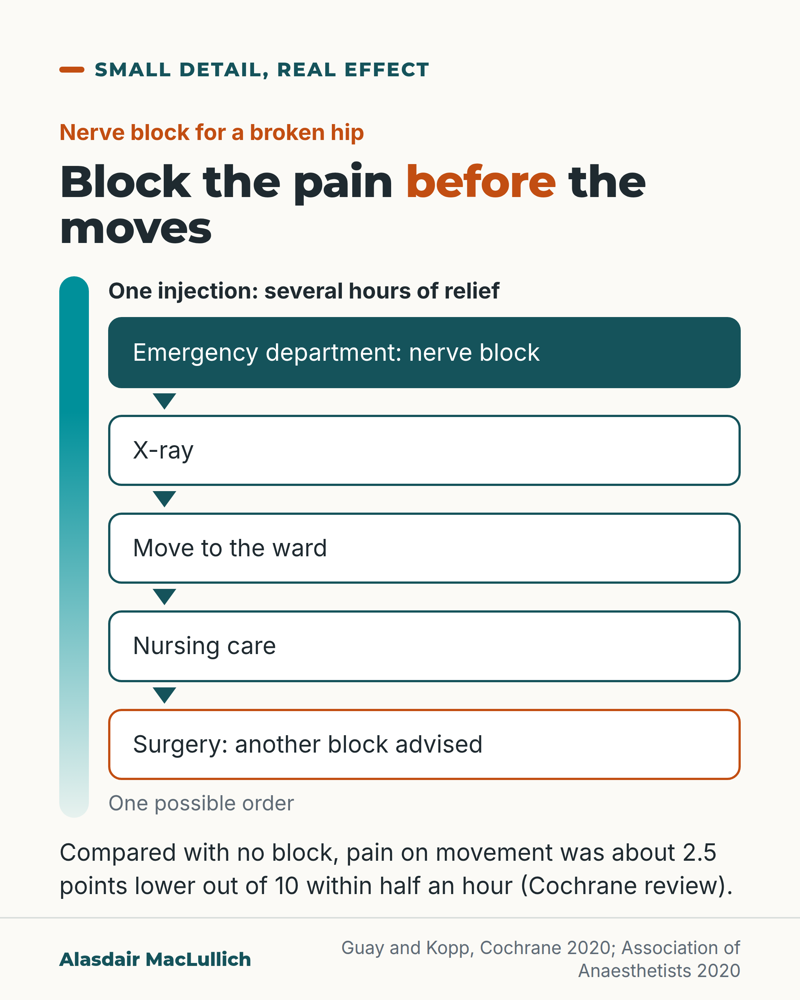

# G023: Block the pain before the moving

- Category: C03 Hip fracture
- Audience: both
- Series: Small detail, real effect
- Post type: teaching
- Visual format: diagram (flow)
- Status: text text_final, visual final
- Working id: C03-P02 (candidate C03-06)

## Insight

Pain from a broken hip is mostly on movement. A nerve block in the emergency department reduced pain on movement within half an hour compared with no block, and lasts several hours, which can cover the X-ray, the move to the ward and early nursing care.

## Angle and position

Time the block early, in the emergency department, before the moves rather than after them; families can ask whether one has been offered. The block does not last until surgery, which is why guidance advises another at the time of the operation.

Basis: mixed: effect sizes and guidance are empirical or documented (Cochrane 2020, Association of Anaesthetists 2020, Scottish standards, NICE); 'give it early, before the moves' is clinical interpretation consistent with the Scottish and anaesthetic guidance

## X (871 characters)

```text
Pain from a broken hip is often mild while lying still and severe when the person is moved. Scotland's hip fracture standards point this out, and name a nerve block as the first choice for pain relief in the emergency department.

A nerve block is an injection of local anaesthetic near the nerves to the hip. A Cochrane review, which pooled 11 trials, found it reduced pain on movement within half an hour by about 2.5 points on a 0 to 10 scale, compared with no block.

One injection gives several hours of relief. It does not last until the operation. Given early in the emergency department, it can cover the X-ray and the move to the ward. It can also cover the first hours of nursing care, for as long as it lasts. UK anaesthetic guidance also advises another block at the time of surgery.

If someone you love has broken a hip, ask: has a nerve block been offered?
```

## LinkedIn (1832 characters)

```text
Moving is what hurts most after a broken hip. Pain is often mild while the person lies still and severe when they are moved. Scotland's national hip fracture standards make this point, and name a nerve block (a fascia iliaca block) as the first choice for pain relief in the emergency department.

A nerve block is an injection of local anaesthetic near the nerves that supply the hip.

What the evidence shows:
1. A Cochrane review, which pools the results of trials, found that a block reduced pain on movement within half an hour by about 2.5 points on a 0 to 10 scale, compared with no block. This result comes from 11 trials with 503 people, and everyone could have other pain relief too.
2. Blocks probably mean fewer chest infections, and people getting out of bed about 11 hours sooner than with no block. These results come from only a few small trials, and whether blocks affect survival is uncertain.
3. People with dementia were often left out of these trials.

Timing is the practical detail. A single injection gives several hours of relief, not relief until the operation. The trials measured the benefit for up to 4 hours; one review put it at about 8 hours with a long-acting local anaesthetic. Given early in the emergency department, it can cover the X-ray and the move to the ward. It can also cover the first hours of nursing care, for as long as it lasts. The Association of Anaesthetists (the UK body for anaesthetists) also advises another block at the time of surgery.

NICE (health guidance for England and Wales) asks for pain relief good enough to allow moving for X-rays, nursing care and rehabilitation. It says to consider a block when paracetamol and morphine-type drugs are not enough.

Staff can time the block before the moves rather than after them. Families can ask whether one has been offered.
```

## Bluesky (297 characters)

```text
A broken hip hurts most when moved. A nerve block (local anaesthetic near the hip's nerves) cut pain on movement within half an hour, compared with no block, and lasts several hours.

Given early in the emergency department, it can cover the X-ray and the move to the ward. Ask if one was offered.
```

## Threads (441 characters)

```text
A broken hip often hurts little lying still and a lot when moved.

A nerve block is an injection of local anaesthetic near the nerves to the hip. In a review of trials it reduced pain on movement within half an hour, compared with no block. One injection lasts several hours. Given early in the emergency department, it can cover the X-ray and the move to the ward.

If someone you love has broken a hip, ask: has a nerve block been offered?
```

## Source reply

Sources: https://doi.org/10.1002/14651858.CD001159.pub3 https://doi.org/10.1111/anae.15291 https://www.nice.org.uk/guidance/cg124 https://publichealthscotland.scot/resources-and-tools/health-strategy-and-outcomes/scottish-national-audit-programme-snap/scottish-hip-fracture-audit-shfa/overview-of-shfa/

## Visual



Alt text: Flow of five steps after a broken hip: nerve block in the emergency department, X-ray, move to the ward, nursing care, surgery with another block advised. A fading bar shows one injection gives several hours of relief. Pain on movement was about 2.5 points lower out of 10 within half an hour.

Editable source: `visuals/src/G023.html`

Design instructions: diagram (flow); 1080x1350 card(s) via base.css, teal/orange palette, sand ground only on P09; data claims: ['C03-06-a', 'C03-06-b', 'C03-06-c', 'C03-06-d', 'C03-06-e', 'C03-06-f', 'C03-06-g']. Source: visuals/src/C03-P02.html (generated by simple HTML/SVG, kit people only in P07, P09). 

## Sources and verification

- C03-06-a (supported): In a Cochrane review, peripheral nerve blocks reduced pain on movement within 30 minutes of being placed, by the equivalent of about 2.5 points on a 0 to 10 scale (high-certainty evidence).
  - Source: Guay J, Kopp S. Peripheral nerve blocks for hip fractures in adults. Cochrane Database Syst Rev. 2020;11(11):CD001159.
  - Passage: ""We included 49 trials (3061 participants; 1553 randomized to PNBs and 1508 to no nerve block (or sham block))." ... "Results of 11 trials with 503 participants show that PNBs reduced pain on movement within 30 minutes of block placement (standardized mean difference (SMD) -1.05, 95% confidence interval (CI) -1.25 to -0.86; equivalent to -2.5 on a scale from 0 to 10; high-certainty evidence)." Authors' conclusions: "PNBs reduce pain on movement within 30 minutes after block placement..."" (Abstract (Main results; Authors' conclusions))
- C03-06-b (supported_with_qualification): Nerve blocks probably reduce chest infection and shorten the time to first getting out of bed by about 11 hours (moderate certainty, small numbers of trials); effects on death are uncertain.
  - Source: Guay J, Kopp S. Peripheral nerve blocks for hip fractures in adults. Cochrane Database Syst Rev. 2020;11(11):CD001159.
  - Passage: ""From three trials with 131 participants, PNBs probably reduce the risk for chest infection (RR 0.41, 95% CI 0.19 to 0.89; NNTB 7, 95% CI 5 to 72; moderate-certainty evidence). Based on 11 trials with 617 participants, the effects of PNBs on mortality within six months are uncertain due to very serious imprecision (RR 0.87, 95% CI 0.47 to 1.60; low-certainty evidence). From three trials with 208 participants, PNBs likely reduce time to first mobilization (mean difference (MD) -10.80 hours, 95% CI -12.83 to -8.77 hours; moderate-certainty evidence)."" (Abstract (Main results))
- C03-06-c (supported): People with dementia were often excluded from the nerve block trials.
  - Source: Guay J, Kopp S. Peripheral nerve blocks for hip fractures in adults. Cochrane Database Syst Rev. 2020;11(11):CD001159.
  - Passage: ""The average age of participants ranged from 59 to 89 years. People with dementia were often excluded from the included trials. Additional analgesia was available for all participants."" (Abstract (Main results))
- C03-06-d (supported): UK anaesthetic guidance recommends single-shot nerve blocks in the emergency department and again at the time of surgery, and notes that blocks reduce pain at rest and on movement, reduce time to getting moving and are not contraindicated in people on anticoagulants.
  - Source: Griffiths R, Babu S, Dixon P, Freeman N, Hurford D, Kelleher E, et al. Guideline for the management of hip fractures 2020: guideline by the Association of Anaesthetists. Anaesthesia. 2021;76(2):225-37.
  - Passage: ""Randomised controlled trials [25, 26], observational studies [19], consensus opinion [2], national audit initiatives [8] and systematic review [27] all support the widespread use of peripheral nerve blocks for analgesia on admission to hospital and in the early postoperative period. These are effective at reducing pain and quadriceps spasm at rest and on movement; reduce time to remobilisation; reduce opioid administration (to a patient population 40% of who have renal dysfunction and are at greater risk of postoperative delirium); and are not contra-indicated in anticoagulated patients [28]. The Working Party recommends that: 1Single shot nerve blocks should be provided in the Emergency Department and at the time of surgery (provided 6 h has passed between blocks) [27]. There is some evidence for their efficacy in providing pre-hospital analgesia [29]; 2Femoral or fascia iliaca blocks should be used, the latter possibly providing better incisional analgesia after surgery."" (Griffiths 2021 full text, 'Specific changes to the 2011 guidance' (analgesia))
- C03-06-e (supported_with_qualification): NICE recommends considering nerve blocks if paracetamol and opioids are not enough before surgery, or to limit opioid dose, and asks that pain relief be enough to allow the movements needed for investigations, nursing care and rehabilitation.
  - Source: National Clinical Guideline Centre. The management of hip fracture in adults (NICE clinical guideline 124). Full guideline: methods, evidence and guidance. London: NCGC/Royal College of Physicians; 2011 (with May 2017 update note).; Ong T, Vindlacheruvu M. A commentary update on NICE CG124. Hip fracture: management (2023). Age Ageing. 2023;52(6):afad110.
  - Passage: ""4.2.3 Analgesia ➢ Assess the patient's pain: • immediately upon presentation at hospital and • within 30 minutes of administering initial analgesia and • hourly until settled on the ward and • regularly as part of routine nursing observations throughout admission. ➢ Offer immediate analgesia to patients presenting at hospital with suspected hip fracture, including people with cognitive impairment. ➢ Ensure analgesia is sufficient to allow movements necessary for investigations (as indicated by the ability to tolerate passive external rotation of the leg), and for nursing care and rehabilitation." ... "➢ Consider adding nerve blocks if paracetamol and opioids do not provide sufficient preoperative pain relief, or to limit opioid dosage. Nerve blocks should be administered by trained personnel. Do not use nerve blocks as a substitute for early surgery."" (NICE full guideline section 4.2.3)
- C03-06-f (supported): The Scottish standards note that people with hip fracture often have little pain at rest but severe pain on movement, and make a fascia iliaca block the first-line choice in the emergency department.
  - Source: Public Health Scotland. Scottish standards of care for hip fracture patients. Version 1.2. Edinburgh: Public Health Scotland; May 2024, updated 15 September 2025.
  - Passage: ""Standard 2: The 'big six' bundle is carried out in the emergency department (ED)" ... "4. Provide pain relief: all patients who sustain this painful injury must be offered analgesia. It is important to recognise that patients often have little pain on rest but severe pain on movement and for this reason a fascia iliaca block is the first-line choice."" (Scottish standards of care for hip fracture patients (v1.2, Sep 2025), Standard 2 rationale)
- C03-06-g (supported_with_qualification): A single-injection block lasts hours, not the whole wait for surgery: a review puts a single-shot fascia iliaca block with bupivacaine at about 8 hours of pain relief, and trial evidence in the emergency department measured benefit up to 4 hours.
  - Source: Verbeek T, Adhikary S, Urman R, Liu H. The application of fascia iliaca compartment block for acute pain control of hip fracture and surgery. Curr Pain Headache Rep. 2021;25(4):22.; Makkar JK, Singh NP, Bhatia N, Samra T, Singh PM. Fascia iliaca block for hip fractures in the emergency department: meta-analysis with trial sequential analysis. Am J Emerg Med. 2021;50:654-60.; Griffiths R, Babu S, Dixon P, Freeman N, Hurford D, Kelleher E, et al. Guideline for the management of hip fractures 2020: guideline by the Association of Anaesthetists. Anaesthesia. 2021;76(2):225-37.
  - Passage: "Verbeek 2021 abstract: "Single-shot FICB is faster to place, yet providing about 8 h of analgesia when bupivacaine is used. Continuous FICB provides prolonged titratable analgesia..." Makkar 2021 abstract: "A significant difference in pain relief at rest and on movement started within 30 min and lasted till 4 h of the block." ... "However, the quality of evidence is low and additional trials are necessary." Griffiths 2021: "Single shot nerve blocks should be provided in the Emergency Department and at the time of surgery (provided 6 h has passed between blocks)"." (Verbeek 2021 abstract; Makkar 2021 abstract (Results, Conclusions); Griffiths 2021 analgesia section)

Verification notes: Guay and Kopp 2020 Cochrane (abstract): 2.5 points, 11 trials/503 people at 30 min; chest infection and mobilisation from few small trials; dementia often excluded. Association of Anaesthetists 2020 (full text): ED block plus block at surgery. Scottish standards v1.2 (official document): pain on movement, fascia iliaca block first line in ED; no audit results. NICE CG124 (official document): pain relief sufficient for movement; 'consider' block. Duration: narrative review about 8 h, trials to 4 h (Verbeek 2021, Makkar 2021). Transfer sequence (C03-06-h, not found) not stated as fact; only the guideline-supported 'covers the X-ray, move to the ward, early nursing care'. Confusion outcome omitted (excluded topic). Fix2: Cochrane review explained as pooled trials; 4-hour (trials) and 8-hour (one review, long-acting anaesthetic) durations reconciled in plain words; second block at surgery stated as UK guidance advice, not as a reason.

## Attention and follow potential

Pause: Families and ED staff who have watched someone cry out on every transfer.

Gain: A timing point staff can act on and a question families can ask.

Follow: Practical detail tied to trial evidence and current UK guidance.

## Open issues

None.
