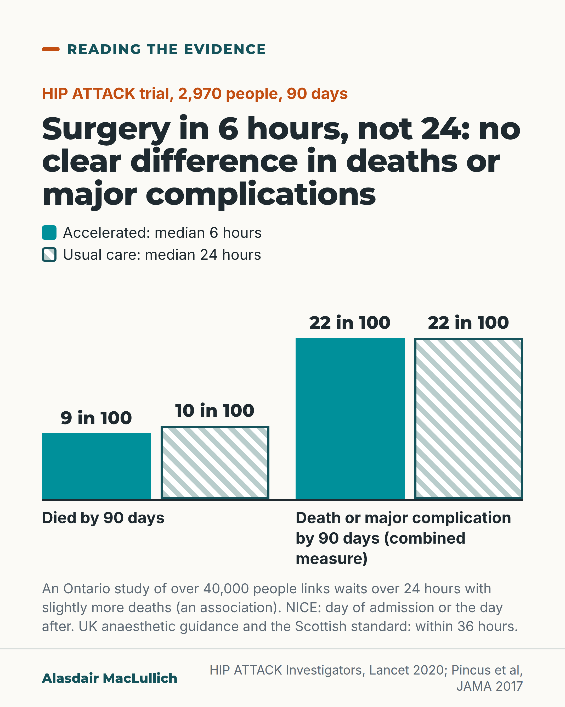

# G024: Fast enough, and faster

- Category: C03 Hip fracture
- Audience: practitioners
- Series: Reading the evidence
- Post type: evidence_interpretation
- Visual format: chart (paired bars)
- Status: text text_final, visual final
- Working id: C03-P03 (candidate C03-17)

## Insight

HIP ATTACK found that surgery within about 6 hours did not clearly reduce deaths or major complications compared with a median of 24 hours, while observational data link waits beyond a day with slightly more deaths. The two answer different questions.

## Angle and position

The target is removing avoidable delay (day of or day after admission, within 36 hours), not racing to operate within hours. Both findings can be true.

Basis: mixed: trial and cohort results are empirical; reconciling them into 'remove avoidable delay' is clinical interpretation consistent with UK guidance

## X (1041 characters)

```text
HIP ATTACK randomised 2,970 people with hip fracture in 17 countries to surgery at a median of 6 hours or 24 hours after diagnosis.

At 90 days, 9 in 100 had died in the fast group and 10 in 100 with usual care. Death or a major complication (a combined measure): 22 in 100 in both. Accelerated surgery did not clearly reduce either, though a small benefit is not ruled out.

In secondary outcomes, as summarised in UK anaesthetic guidance, the fast group got up sooner and left hospital sooner, with no sign of harm.

In Ontario, waits over 24 hours after arrival were linked with slightly more deaths at 30 days: 6.5 vs 5.8 in 100. That is a link. It does not show that the wait caused the deaths.

These answer different questions: very fast against fairly fast, and avoidable delay beyond a day. UK guidance sets these limits. NICE asks for surgery on the day of admission or the day after. UK anaesthetic guidance says within 36 hours of the fracture, and the Scottish standard within 36 hours of admission.

Remove the avoidable delay.
```

## LinkedIn (1963 characters)

```text
Operating within hours did not clearly reduce deaths in HIP ATTACK, a trial of 2,970 people with hip fracture in 69 hospitals across 17 countries. People were randomised to accelerated surgery or usual care. Median time from diagnosis to surgery was 6 hours in the accelerated group and 24 hours in the usual-care group.

At 90 days, about 9 in 100 had died in the accelerated group and 10 in 100 in the usual-care group. Death or a major complication (a combined measure) affected about 22 in 100 in both. Accelerated surgery did not clearly reduce either outcome. The uncertainty range runs from about 1 more to 3 fewer deaths per 100, so a small benefit is possible.

Secondary outcomes favoured speed: the accelerated group got up and about sooner and left hospital sooner, with no sign of harm (as summarised in the Association of Anaesthetists 2020 guideline).

Half of the usual-care group had surgery within about 24 hours of diagnosis, and three quarters within about 42 hours. So the trial tested very fast against fairly fast.

A large observational study in Ontario looked at a different question. In more than 40,000 people, those who waited more than 24 hours from arrival were slightly more likely to die within 30 days: about 6.5 in 100 compared with 5.8 in 100 in matched people operated on sooner. That is a link, and it does not show that the wait caused the deaths; people who wait may be sicker.

UK guidance asks for surgery on the day of admission or the day after (NICE), and within 36 hours (Association of Anaesthetists, counted from the fracture; Scottish standard, counted from admission).

Our reading: the target is to remove avoidable delay, not to operate as fast as is physically possible. The trial did not show that very fast surgery saves lives. The fast group did get up and leave hospital sooner. The Ontario data link waits of more than a day with slightly more deaths, so avoidable delay of a day or more is hard to defend.
```

## Bluesky (295 characters)

```text
HIP ATTACK trial: surgery in the fast group (median 6 hours after diagnosis) did not clearly reduce 90-day deaths (9 vs 10 in 100) or major complications, compared with usual care (median 24 hours).

In Ontario, waits over a day were linked with slightly more deaths. Aim for no avoidable delay.
```

## Threads (464 characters)

```text
In the HIP ATTACK trial, surgery at a median of 6 hours after diagnosis did not clearly reduce deaths at 90 days (9 vs 10 in 100) or major complications, compared with a median of 24 hours.

Ontario cohort data link waits over a day with slightly more deaths at 30 days. That is a link, not proof of cause.

NICE asks for surgery on the day of admission or the day after. UK anaesthetic guidance says within 36 hours of the fracture. The aim is no avoidable delay.
```

## Source reply

Sources: https://doi.org/10.1016/S0140-6736(20)30058-1 https://doi.org/10.1001/jama.2017.17606 https://doi.org/10.1111/anae.15291 https://www.nice.org.uk/guidance/cg124 https://publichealthscotland.scot/resources-and-tools/health-strategy-and-outcomes/scottish-national-audit-programme-snap/scottish-hip-fracture-audit-shfa/overview-of-shfa/

## Visual



Alt text: Bar chart from the HIP ATTACK trial of 2,970 people. Died by 90 days: 9 in 100 with surgery at a median 6 hours, 10 in 100 at a median 24 hours. Death or major complication: 22 in 100 in both groups. No clear difference. Observational and guideline timings are noted below.

Editable source: `visuals/src/G024.html`

Design instructions: chart (paired bars); 1080x1350 card(s) via base.css, teal/orange palette, sand ground only on P09; data claims: ['C03-17-a', 'C03-17-b', 'C03-17-c', 'C03-17-d']. Source: visuals/src/C03-P03.html (generated by simple HTML/SVG, kit people only in P07, P09). Paired vertical bars zero baseline, teal solid vs pale hatched. Claim C03-17-a.

## Sources and verification

- C03-17-a (supported): In the HIP ATTACK trial (2970 people with hip fracture, 69 hospitals, 17 countries), surgery at a median of 6 hours after diagnosis did not reduce deaths or major complications at 90 days compared with standard care at a median of 24 hours.
  - Source: HIP ATTACK Investigators (Borges FK, Bhandari M, Guerra-Farfan E, et al.). Accelerated surgery versus standard care in hip fracture (HIP ATTACK): an international, randomised, controlled trial. Lancet. 2020;395(10225):698-708.
  - Passage: ""HIP ATTACK was an international, randomised, controlled trial done at 69 hospitals in 17 countries. Patients with a hip fracture that required surgery and were aged 45 years or older were eligible." ... "2970 of these were enrolled and randomly assigned to receive accelerated surgery (n=1487) or standard care (n=1483). The median time from hip fracture diagnosis to surgery was 6 h (IQR 4-9) in the accelerated-surgery group and 24 h (10-42) in the standard-care group (p<0·0001). 140 (9%) patients assigned to accelerated surgery and 154 (10%) assigned to standard care died, with a hazard ratio (HR) of 0·91 (95% CI 0·72 to 1·14) and absolute risk reduction (ARR) of 1% (-1 to 3; p=0·40). Major complications occurred in 321 (22%) patients assigned to accelerated surgery and 331 (22%) assigned to standard care, with an HR of 0·97 (0·83 to 1·13) and an ARR of 1% (-2 to 4; p=0·71)." Interpretation: "Among patients with a hip fracture, accelerated surgery did not significantly lower the risk of mortality or a composite of major complications compared with standard care."" (Abstract (Methods, Findings, Interpretation))
- C03-17-b (supported_with_qualification): In HIP ATTACK, accelerated surgery did not harm patients, and it was linked with faster mobilisation after surgery, a shorter hospital stay and less postoperative confusion (secondary outcomes).
  - Source: Griffiths R, Babu S, Dixon P, Freeman N, Hurford D, Kelleher E, et al. Guideline for the management of hip fractures 2020: guideline by the Association of Anaesthetists. Anaesthesia. 2021;76(2):225-37.
  - Passage: ""This study found that accelerated surgery (within a goal of 6 h after diagnosis) did not improve either mortality or non-fatal major complications (myocardial infarction, stroke, venous thromboembolism, sepsis, pneumonia, life-threatening bleeding and major bleeding) 90 days later among 1487 people with hip fracture, compared with a similar number (n = 1483) who received standard care (median time from diagnosis to surgery of 24 h (IQR 10–42). Accelerated surgery did not harm patients, even for those with acute medical conditions. Interestingly, accelerated surgery significantly reduced both the prevalence of postoperative delirium (9% vs. 12%, HR 0.72 (95%CI 0.58–0.92), p = 0.0089) and length of inpatient stay, and improved the speed of postoperative mobilisation. The Working Party considers these data re-assuring and clinically important for patients but acknowledge that the resource implications of accelerated surgery need to be calculated before recommending its adoption into current UK practice."" (Griffiths 2021 guideline, full text, Controversies section (surgical delay); passage spanned two retrieved text chunks at '0.58–0' / '.92')
- C03-17-c (supported_with_qualification): In a large Ontario cohort, waiting more than 24 hours for hip fracture surgery was linked with a small increase in 30-day deaths (association, not proof of cause).
  - Source: Pincus D, Ravi B, Wasserstein D, Huang A, Paterson JM, Nathens AB, et al. Association between wait time and 30-day mortality in adults undergoing hip fracture surgery. JAMA. 2017;318(20):1994-2003.
  - Passage: ""Among 42 230 patients with hip fracture (mean [SD] age, 80.1 years [10.7], 70.5% women) who met study entry criteria, overall mortality at 30 days was 7.0%. The risk of complications increased when wait times were greater than 24 hours, irrespective of the complication considered. Compared with 13 731 propensity-score matched patients who received surgery earlier, 13 731 patients who received surgery after 24 hours had a significantly higher risk of 30-day mortality (898 [6.5%] vs 790 [5.8%]; % absolute RD, 0.79; 95% CI, 0.23-1.35) and the composite outcome (1680 [12.2%]) vs 1383 [10.1%]; % absolute RD, 2.16; 95% CI, 1.43-2.89)." Conclusion: "Among adults undergoing hip fracture surgery, increased wait time was associated with a greater risk of 30-day mortality and other complications. A wait time of 24 hours may represent a threshold defining higher risk."" (Abstract (Results, Conclusions))
- C03-17-d (supported): UK guidance sets the target: NICE recommends surgery on the day of, or the day after, admission; the Association of Anaesthetists recommends a 36-hour limit from fracture to surgery; the Scottish standard is surgery within 36 hours of admission.
  - Source: National Clinical Guideline Centre. The management of hip fracture in adults (NICE clinical guideline 124). Full guideline: methods, evidence and guidance. London: NCGC/Royal College of Physicians; 2011 (with May 2017 update note).; Ong T, Vindlacheruvu M. A commentary update on NICE CG124. Hip fracture: management (2023). Age Ageing. 2023;52(6):afad110.; Griffiths R, Babu S, Dixon P, Freeman N, Hurford D, Kelleher E, et al. Guideline for the management of hip fractures 2020: guideline by the Association of Anaesthetists. Anaesthesia. 2021;76(2):225-37.; Public Health Scotland. Scottish standards of care for hip fracture patients. Version 1.2. Edinburgh: Public Health Scotland; May 2024, updated 15 September 2025.
  - Passage: "NICE full guideline 4.2.2 Timing of surgery: "➢ Perform surgery on the day of, or the day after, admission." Ong 2023 abstract: "The scope of this recent update focussed on surgical implants for hip fracture. ... Other recommendations such as the importance of multidisciplinary orthogeriatric care, early surgery and prompt mobilisation remain." Griffiths 2021: "The Working Party continues to recommend a 36-h limit from fracture to surgery in the UK." Scottish standards: "Standard 6: Surgical repair of the hip fracture is performed within 36 hours of admission"." (NICE full guideline section 4.2.2; Ong 2023 abstract; Griffiths 2021 Controversies; Scottish standards, Standard 6)

Verification notes: HIP ATTACK (abstract): numbers, medians, IQR. Secondary outcomes via Association of Anaesthetists 2020 full text (C03-17-b); pain benefit not claimed; confusion outcome omitted. Pincus 2017 (abstract): association only, timed from arrival. Guidance targets C03-17-d (NICE full guideline Drive copy; Anaesthetists 2020; Scottish standards, no audit results). C03-17-e (partly_supported) contributed only the IQR description, which is in the C03-17-a trial abstract; the unsupported 'faster than many hospitals' line is not used. 'Our reading' marks the interpretation. Fix2: start point of each 36-hour limit stated from the evidence (Association of Anaesthetists: from fracture; Scottish standard: from admission); link-versus-cause stated for the Ontario data; series plug removed.

## Attention and follow potential

Pause: Challenges the assumption that faster is always better while refusing to excuse delay.

Gain: A precise way to reconcile trial and cohort evidence when setting local targets.

Follow: Explicit invitation: the Reading the evidence series sets trials and observational studies side by side.

## Open issues

None.
