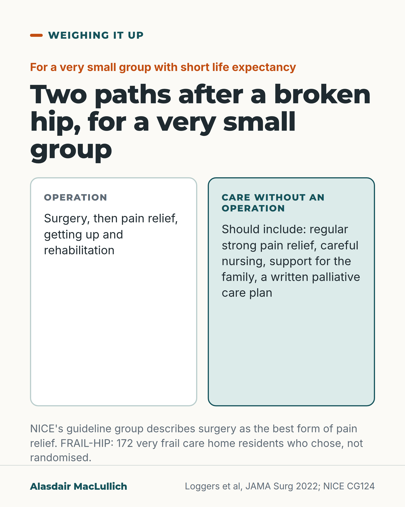

# G025: Care without an operation, for a very small group

- Category: C03 Hip fracture
- Audience: public
- Series: Weighing it up
- Post type: decision_support
- Visual format: comparison
- Status: text text_final, visual final
- Working id: C03-P04 (candidate C03-22)

## Insight

NICE's guideline group describes surgery as the best form of pain relief for a broken hip. For a very small group of very frail people near the end of life, a Dutch study of people who chose care without an operation, after discussion, found quality of life rated a little lower by relatives in the following weeks, within a margin set in advance; pain relief without surgery has to be good.

## Angle and position

Care without an operation is active care, not doing nothing; it deserves open discussion for the few for whom surgery is unlikely to add good time, and it is no default for anyone because they are old or frail.

Basis: mixed: FRAIL-HIP findings and guidance are empirical or documented; that non-operative care should be discussable and never a default by age is ethical judgement, marked as such

## X (1238 characters)

```text
NICE's guideline group describes surgery as the best form of pain relief for a broken hip. It says surgery should still be considered when a broken hip comes with a terminal illness.

A Dutch study looked at a very different group: 172 very frail care home residents, typical (median) age 88, with short life expectancy. After discussion, 88 chose care without an operation and 84 chose surgery. The groups were formed by people's own choices, not by random allocation.

Relatives and staff rated quality of life in the following weeks. By the study's own test, it was not lower without an operation by more than a difference the researchers had set in advance as acceptable. After about a month the comparison is unreliable, because most of those without an operation had died. About 8 in 10 of those who chose no operation died within a month, against 1 in 4 after surgery. The frailest people chose no operation, so that gap does not show the effect of surgery.

The researchers judged pain undertreated without surgery, and 2 people switched to an operation as their pain grew worse.

We should be able to talk about care without an operation for this small group, with strong pain relief. It should never be a default because of age.
```

## LinkedIn (2030 characters)

```text
NICE's guideline group describes surgery as the best form of pain relief for a broken hip. Even when a hip fracture comes with a terminal illness, it says the team should still consider surgery as part of palliative care. Palliative care eases pain and respects the person's wishes.

A Dutch study, FRAIL-HIP, looked at a very different group from most people with a broken hip. It followed 172 very frail care home residents, typical (median) age 88, whose life expectancy was already short. After talking it through, 88 chose care without an operation and 84 chose an operation. The groups were formed by people's own choices, not by random allocation.

What it found:
1. Relatives and care staff rated quality of life in the following weeks. By the study's own test, quality of life was not lower without an operation by more than a difference the researchers had set in advance as acceptable. These were other people's ratings, and comparisons after about a month are unreliable because most of the non-operative group had died.
2. About 8 in 10 of those who chose no operation died within a month, compared with 1 in 4 of those who had surgery. The frailest people chose no operation, so this gap does not show what the operation itself did.
3. About 50 relatives answered about a death without an operation. 26 rated the dying as good to almost perfect and 2 rated it as poor or terrible. These are relatives' judgements.
4. The researchers judged that pain was undertreated without an operation, and 2 people changed to surgery because their pain grew worse.

Scotland's hip fracture standards expect a written care or palliative care plan if a decision not to operate is agreed, and a fresh look at the decision if the person gets better.

Our judgement: care without an operation is active care. It needs regular, strong pain relief, careful nursing and support for the family. For a very small group it deserves an open conversation. It should never be offered as a default because someone is old, frail or has dementia.
```

## Bluesky (300 characters)

```text
In a Dutch study of 172 very frail care home residents with a broken hip, about 8 in 10 who chose no operation died within a month, against 1 in 4 who chose surgery. The frailest chose no operation, so this does not show surgery's effect. Pain was undertreated without it. Pain relief must be strong.
```

## Threads (497 characters)

```text
A Dutch study followed 172 very frail care home residents who chose whether to have surgery after a broken hip. Of those who chose none, about 8 in 10 died within a month, compared with 1 in 4 after surgery. The frailest chose no operation. Relatives rated quality of life as not lower by more than a preset margin. Researchers judged pain undertreated.

We should be able to discuss care without an operation for a few people, with strong pain relief. It should never be a default because of age.
```

## Source reply

Sources: https://doi.org/10.1001/jamasurg.2022.0089 https://www.nice.org.uk/guidance/cg124 https://publichealthscotland.scot/resources-and-tools/health-strategy-and-outcomes/scottish-national-audit-programme-snap/scottish-hip-fracture-audit-shfa/overview-of-shfa/

## Visual



Alt text: Two columns comparing paths after a broken hip for a very small group with short life expectancy. Operation: surgery, then pain relief, getting up and rehabilitation. Care without an operation should include strong pain relief, careful nursing, family support and a written palliative care plan.

Editable source: `visuals/src/G025.html`

Design instructions: comparison; 1080x1350 card(s) via base.css, teal/orange palette, sand ground only on P09; data claims: ['C03-22-a', 'C03-22-b', 'C03-22-c', 'C03-22-d', 'C03-22-e', 'C03-22-f', 'C03-22-g']. Source: visuals/src/C03-P04.html (generated by simple HTML/SVG, kit people only in P07, P09). 

## Sources and verification

- C03-22-a (supported): FRAIL-HIP studied 172 very frail care home residents aged 70 and over with limited life expectancy who broke a hip; after shared decision-making, 88 chose care without an operation and 84 chose an operation. It was not randomised.
  - Source: Loggers SAI, Willems HC, Van Balen R, Gosens T, Polinder S, Ponsen KJ, et al. Evaluation of quality of life after nonoperative or operative management of proximal femoral fractures in frail institutionalized patients: the FRAIL-HIP study. JAMA Surg. 2022;157(5):424-434.
  - Passage: "Eligible patients were aged 70 years or older, frail, and institutionalized and sustained a femoral neck or pertrochanteric fracture. The term frail implied at least 1 of the following characteristics was present: malnutrition (body mass index ... <18.5) or cachexia, severe comorbidities (American Society of Anesthesiologists physical status class of IV or V), or severe mobility issues (Functional Ambulation Category ≤2). ... Of the 172 enrolled patients with proximal femoral fractures (median [25th and 75th percentile] age, 88 [85-92] years; 135 women [78%]), 88 opted for nonoperative management and 84 opted for operative management." (Abstract, Design/Setting/Participants and Results; full-text excerpt: 'Only a randomized clinical trial would have avoided selection bias through the SDM process but was considered unfeasible and unethical.')
- C03-22-b (supported_with_qualification): In the weeks after the fracture, quality of life (rated by relatives and carers) in people who chose no operation was not worse than in those who had an operation, within the study's preset margin.
  - Source: Loggers SAI, Willems HC, Van Balen R, Gosens T, Polinder S, Ponsen KJ, et al. Evaluation of quality of life after nonoperative or operative management of proximal femoral fractures in frail institutionalized patients: the FRAIL-HIP study. JAMA Surg. 2022;157(5):424-434.
  - Passage: "The EQ-5D utility scores by proxies and caregivers in the nonoperative management group remained within the set 0.15 noninferiority limit of the operative management group (week 1 ... week 2 ... and week 4 ...). ... Although the short-term mortality in the nonoperative management group was higher than in the operative management group, there was no loss of QOL and HRQoL, and there was high treatment satisfaction and humane quality of dying." (Abstract, Results; full-text excerpt (Discussion) via Scite)
- C03-22-c (supported_with_qualification): Most people who chose no operation died within 30 days, but this reflects who chose it, not the effect of not operating.
  - Source: Loggers SAI, Willems HC, Van Balen R, Gosens T, Polinder S, Ponsen KJ, et al. Evaluation of quality of life after nonoperative or operative management of proximal femoral fractures in frail institutionalized patients: the FRAIL-HIP study. JAMA Surg. 2022;157(5):424-434.
  - Passage: "The 30-day mortality rate was 83% (n = 73) in the nonoperative management group and 25% (n = 21) in the operative management group ... The high mortality rate was as expected given that we hypothesized that the frailest patients would opt for nonoperative management and that the explicit choice for nonoperative management would most likely result in an earlier palliative care approach compared with patients who opted for operative management." (Abstract, Results; full-text excerpt (Discussion) via Scite. Also full text: 'Six months after the injury, 83 patients (94%) in the nonoperative management group and 40 patients (48%) in the operative management group had died')
- C03-22-d (supported_with_qualification): Relatives of about half of those who died without an operation rated the quality of dying as good to almost perfect.
  - Source: Loggers SAI, Willems HC, Van Balen R, Gosens T, Polinder S, Ponsen KJ, et al. Evaluation of quality of life after nonoperative or operative management of proximal femoral fractures in frail institutionalized patients: the FRAIL-HIP study. JAMA Surg. 2022;157(5):424-434.
  - Passage: "The dying process in both groups was judged as humane (eTable 13 in Supplement 1). The quality of dying was rated as good-almost perfect by 26 proxies (51%) in the nonoperative management group, with only 2 proxies (4%) rating the process as terrible-poor. The quality of dying in the operative management group was scored as intermediate by most proxies (13 [62%])." (Full-text excerpt (Results) via Scite; abstract gives the 26 (51%) figure)
- C03-22-e (supported): Care without an operation still needs active pain relief; in FRAIL-HIP the authors judged pain in the non-operative group to have been undertreated, and 2 people switched to surgery because of increasing pain.
  - Source: Loggers SAI, Willems HC, Van Balen R, Gosens T, Polinder S, Ponsen KJ, et al. Evaluation of quality of life after nonoperative or operative management of proximal femoral fractures in frail institutionalized patients: the FRAIL-HIP study. JAMA Surg. 2022;157(5):424-434.
  - Passage: "The study results do suggest that pain in the nonoperative management group was undertreated and was a factor in end-of-life care that should be improved. ... After initially opting for nonoperative management, 2 patients were treated surgically within the index admission because of progressive pain." (Full-text excerpts (Discussion; Results) via Scite)
- C03-22-f (supported): UK guidance treats surgery as the best pain relief for a broken hip and says surgery should still be considered even when the fracture comes with a terminal illness, as part of palliative care.
  - Source: National Clinical Guideline Centre. The management of hip fracture in adults (NICE clinical guideline 124). Full guideline: methods, evidence and guidance. London: NCGC/Royal College of Physicians; 2011 (with May 2017 update note).
  - Passage: "It is recognized surgery is the best form of analgesia and as over 30% present with cognitive impairment, it can be otherwise difficult to assess patients suffering. ... If a hip fracture complicates or precipitates a terminal illness, the multidisciplinary team should still consider the role of surgery, as part of a palliative care approach that: • minimises pain and other symptoms and • establishes patients' own priorities for rehabilitation and • considers patients' wishes about their end-of-life care." (NICE CG124 full guideline 2011: Timing of surgery, guideline group discussion (page 65); Guideline summary recommendations (page 38))
- C03-22-g (supported): Scottish hip fracture standards allow for a decision not to operate, provided a management or palliative care plan is recorded and the decision is reviewed if the person improves.
  - Source: Public Health Scotland. Scottish standards of care for hip fracture patients. Version 1.2. Edinburgh: Public Health Scotland; May 2024, updated 15 September 2025.
  - Passage: "Should conservative treatment be agreed, the management plan or palliative care plan, should be clearly recorded in the patient records. Best practice is to evaluate this decision should the patient's medical condition improve." (Standard 6 (surgical repair within 36 hours), page 21)

Verification notes: FRAIL-HIP (full text excerpts and abstract): 172, median age 88, 88/84 by choice, proxy-rated QoL non-inferior (no EQ-5D numbers), 30-day mortality 83% vs 25% with selection caveat, about half of responding proxies rated dying good to almost perfect (denominator is respondents), pain undertreated and 2 switched. NICE full guideline (official document): 'best form of analgesia' attributed to guideline group; consider surgery in terminal illness. Scottish standards (official document): written plan and review; no audit results. Judgement marked 'We should' / 'Our judgement'. 'Two kinds of active care' is judgement framing. Care-without-operation list on the visual is labelled 'should include' (judgement plus the Scottish written-plan expectation), not presented as what the study delivered. Fix2: quality-of-life wording changed from 'a little lower, within a margin' to the evidence wording (not lower by more than a preset acceptable difference), with the authors' caution that comparisons after about 30 days are unreliable; number of relatives answering the dying-quality question stated (26 of about 51; 2 poor or terrible).

## Attention and follow potential

Pause: Families of very frail relatives who have never heard that not operating can be discussed, and those who fear it will be imposed.

Gain: An honest picture of both paths, including that pain relief without surgery must be strong.

Follow: Treats hard decisions without either abandonment or burdensome treatment.

## Open issues

None.
