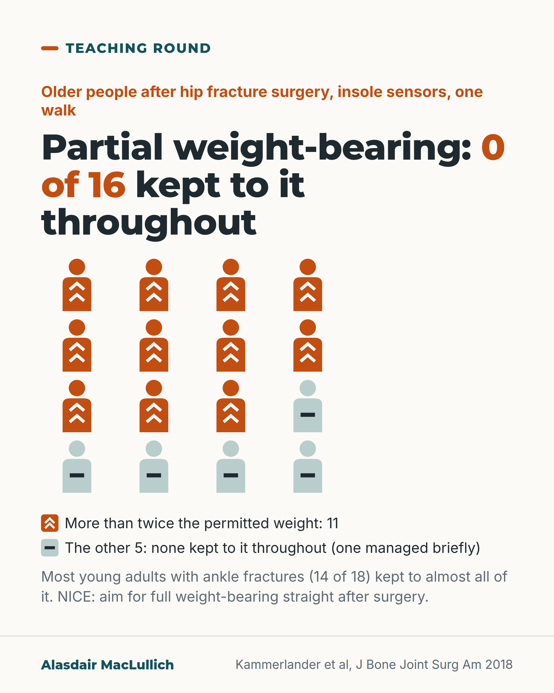

# G026: Partial weight-bearing: none of 16 older people kept to it throughout

- Category: C03 Hip fracture
- Audience: practitioners
- Series: Teaching round
- Post type: teaching
- Visual format: chart (icon array, 16 figures)
- Status: text text_final, visual final
- Working id: C03-P05 (candidate C03-19)

## Insight

In an insole-sensor study, none of 16 older people kept to a partial weight-bearing limit throughout after hip fracture surgery, and restriction in a second study reduced mobility without reducing load. NICE says to operate so the person can bear full weight straight away.

## Angle and position

Restricted weight-bearing after hip fracture surgery in older adults mostly buys less walking, not less load. Any restriction should come with a reason and a plan for how the person will move.

Basis: mixed: compliance and mobility findings are empirical (small studies); NICE aim is documented; harm evidence stated as mixed; the closing question is clinical judgement

## X (756 characters)

```text
Sixteen older people (aged 75 and over) walked on pressure-sensing insoles after hip fracture surgery, told to put only part of their weight through the leg.

None kept to the limit throughout; one managed it briefly. 11 of the 16 put more than twice the permitted weight through the leg. 14 of 18 young adults with ankle fractures kept to almost all of their weight limit.

In a second small study from the same group, older people told to restrict weight walked more slowly and had lower mobility scores on day 5, yet pressed just as hard through the leg.

NICE says to operate with the aim of full, unrestricted weight-bearing straight after surgery.

If a restriction is written, ask: what is the reason, and how will this person move safely meanwhile?
```

## LinkedIn (1310 characters)

```text
Sixteen older people (aged 75 and over) walked on pressure-sensing insoles after hip fracture surgery, each told to put only part of their weight through the operated leg.

None kept to the limit throughout the walk; one managed it briefly. 11 of the 16 put more than twice the permitted weight through the leg. By contrast, 14 of 18 young adults with ankle fractures kept to almost the entire restriction. (Kammerlander et al, J Bone Joint Surg Am 2018; one walking session, one centre.)

A second small German study, from the same research group, compared older people told to limit weight with those allowed full weight. The restricted group walked more slowly and had lower mobility scores on day 5, but pressed just as hard through the leg. It was a before-and-after comparison, not a randomised trial.

In these two small studies, older people told to restrict weight walked more slowly but did not load the leg any less.

NICE guidance says surgeons should operate with the aim of letting the person bear full weight, without restriction, straight after surgery. That is an aim. Clinicians still restrict weight-bearing for some fractures and fixations.

A question for the physiotherapist or the ward round: what is the reason for this restriction, and how will this person move safely in the meantime?
```

## Bluesky (300 characters)

```text
With pressure-sensing insoles, none of 16 people aged 75 and over kept to a partial weight-bearing limit throughout after hip fracture surgery. Eleven put over twice the permitted weight through the leg.

NICE aims for full weight-bearing straight after surgery. If a restriction is written, ask why.
```

## Threads (498 characters)

```text
In a German insole study, none of 16 older people kept to a partial weight-bearing limit throughout after hip fracture surgery; 11 put more than twice the permitted weight through the leg. A second small, non-randomised study found that older people told to restrict weight walked more slowly but loaded the leg as much as those allowed full weight.

NICE says to operate aiming for full weight-bearing straight away.

If a restriction is written, ask for the reason and the plan for moving safely.
```

## Source reply

Sources: https://doi.org/10.2106/JBJS.17.01222 https://doi.org/10.1007/s00402-019-03193-9 https://www.nice.org.uk/guidance/cg124

## Visual



Alt text: Icon array of 16 older people after hip fracture surgery. 11 icons marked with double chevrons put more than twice the permitted weight through the leg; the other 5, marked with a bar, did not keep to it throughout. None of 16 kept to partial weight-bearing. Young adults with ankle fractures mostly did (14 of 18).

Editable source: `visuals/src/G026.html`

Design instructions: chart (icon array, 16 figures); 1080x1350 card(s) via base.css, teal/orange palette, sand ground only on P09; data claims: ['C03-19-a', 'C03-19-b', 'C03-19-c']. Source: visuals/src/C03-P05.html (generated by simple HTML/SVG, kit people only in P07, P09). 4x4 person icons, 11 orange with chevrons, 5 pale with bar. Claim C03-19-a.

## Sources and verification

- C03-19-a (supported_with_qualification): In a gait study with pressure-sensing insoles, none of 16 people aged 75 and over after hip fracture surgery kept to a partial weight-bearing limit of 20 kg; 11 of 16 put more than twice that weight through the leg.
  - Source: Kammerlander C, Pfeufer D, Lisitano LA, Mehaffey S, Böcker W, Neuerburg C. Inability of older adult patients with hip fracture to maintain postoperative weight-bearing restrictions. J Bone Joint Surg Am. 2018;100(11):936-941.
  - Passage: "Both groups were instructed to maintain partial weight-bearing on the affected limb (≤20 kg) postoperatively. Following standardized physiotherapy training, gait analysis was performed. None of the patients in the elderly test group were able to comply with the weight-bearing restriction as recommended. We found that 69% (11 of 16) of the patients exceeded the specified load by more than twofold, whereas significantly more patients in the younger control group (>75% [14 of 18]) achieved almost the entire weight-bearing restriction (p < 0.001). Only 1 of the elderly patients was able to comply with the predetermined weight-bearing restriction, and only for a short period of time." (Abstract, Methods and Results)
- C03-19-b (supported_with_qualification): Told to partial weight-bear, older people after hip fracture walked less well and more slowly, yet put the same load through the leg as those allowed full weight-bearing.
  - Source: Pfeufer D, Zeller A, Mehaffey S, Böcker W, Kammerlander C, Neuerburg C. Weight-bearing restrictions reduce postoperative mobility in elderly hip fracture patients. Arch Orthop Trauma Surg. 2019;139(9):1253-1259.
  - Passage: "The postoperative Parker Mobility Score in the PWB group compared to the FWB group was significantly reduced (3.21 vs. 4.73, p < 0.001). Accordingly, a significantly lower gait speed in the PWB group of 0.16 m/s vs. 0.28 m/s was seen (p = 0.003). No difference in weight bearing was observed in between the groups (average peak force 350.25 N vs. 353.08 N, p = 0.918), nor any differences in the demographic characteristics, ASA Score, Barthel Index or EQ5D." (Abstract, Results)
- C03-19-c (supported): NICE recommends that hip fracture surgery should aim to let the person bear full weight without restriction straight after the operation.
  - Source: National Clinical Guideline Centre. The management of hip fracture in adults (NICE clinical guideline 124). Full guideline: methods, evidence and guidance. London: NCGC/Royal College of Physicians; 2011 (with May 2017 update note).
  - Passage: "4.2.6 Surgical procedures ➢ Operate on patients with the aim to allow them to fully weight bear (without restriction) in the immediate postoperative period." (NICE CG124 full guideline 2011, Guideline summary, section 4.2.6 Surgical procedures)

Verification notes: Kammerlander 2018 (abstract): 0 of 16 throughout, 1 briefly, 11 of 16 more than twofold, 14 of 18 young. Pfeufer 2019 (abstract): slower, lower mobility day 5, same load; small, non-randomised, same group. NICE full guideline (official document): full weight-bearing aim; clinicians still restrict for some fractures and fixations (C03-19-c). BOAST not cited. C03-19-d (partly_supported, evidence on harm from restriction) is not used. Fix2: wording only; no change to figures.

## Attention and follow potential

Pause: A routine instruction that almost nobody in the study could follow.

Gain: Grounds and a precise question to challenge an unexplained restriction.

Follow: Teaching that tests routine ward instructions against measurement.

## Open issues

None.
