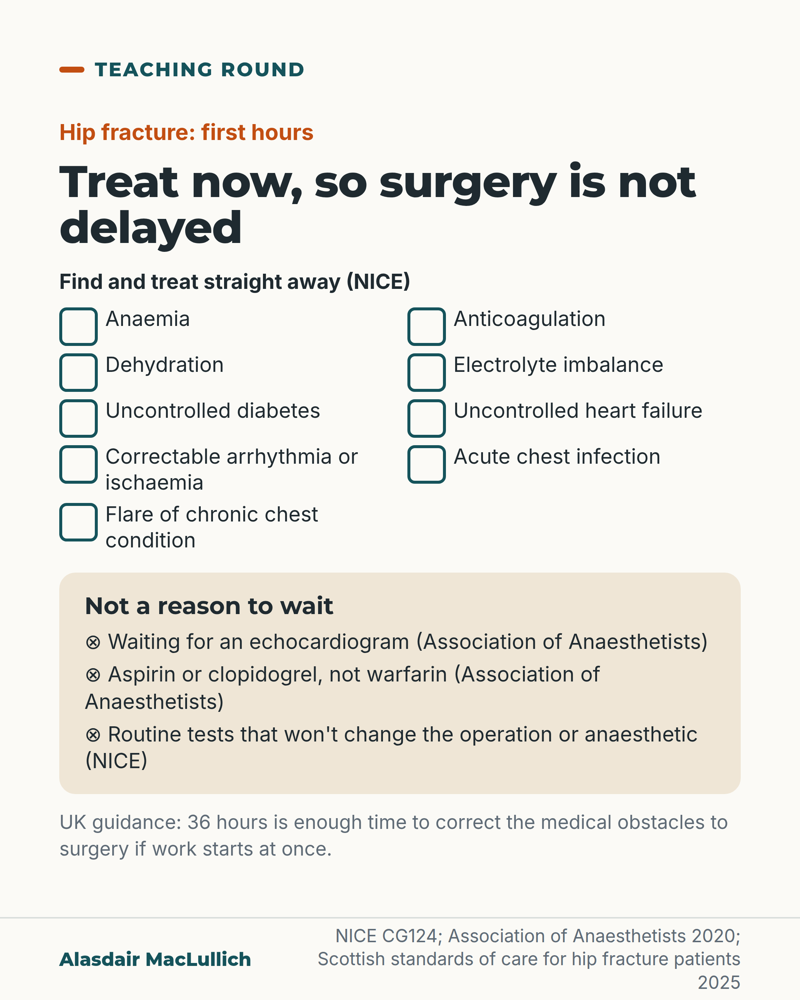

# G027: Treat now so surgery is not delayed

- Category: C03 Hip fracture
- Audience: practitioners
- Series: Teaching round
- Post type: teaching
- Visual format: checklist card
- Status: text text_final, visual final
- Working id: C03-P06 (candidate C03-21)

## Insight

NICE frames nine correctable problems as things to find and treat straight away so they do not delay hip fracture surgery; routine tests that will not change the operation, waiting for an echocardiogram, and aspirin or clopidogrel are not reasons to wait.

## Angle and position

Use NICE's own framing: the list is a to-do list for the first hours, not a list of reasons to postpone. Any hold-up should name the problem and the time by which it will be corrected (marked as judgement).

Basis: mixed: the NICE list, echo and antiplatelet advice, and the 36-hour statement are documented guidance; 'name the problem and a time' is ethical and clinical judgement

## X (827 characters)

```text
NICE lists nine problems to find and treat straight away, so that they do not delay hip fracture surgery.

They are: anaemia, anticoagulation, dehydration, electrolyte problems, uncontrolled diabetes, uncontrolled heart failure, a correctable arrhythmia or ischaemia, chest infection, and a flare of chronic lung disease.

These are jobs for the first hours.

NICE's guideline developers wrote that people should not wait for routine tests that will not change the operation or anaesthetic. UK anaesthetic guidance says not to wait for an echocardiogram, and since 2011 not to delay for aspirin or clopidogrel.

UK guidance says 36 hours is enough time to correct the medical obstacles to surgery, if the work starts at once on arrival at hospital.

We should expect any delay to name the problem and the time it will be fixed.
```

## LinkedIn (1890 characters)

```text
NICE lists nine problems to find and treat straight away, so that they do not delay hip fracture surgery:
1. Anaemia
2. Anticoagulation
3. Volume depletion (dehydration)
4. Electrolyte imbalance
5. Uncontrolled diabetes
6. Uncontrolled heart failure
7. Correctable cardiac arrhythmia or ischaemia
8. Acute chest infection
9. Exacerbation of a chronic chest condition

NICE frames these as problems to correct immediately, in the first hours. They are not a list of reasons to postpone surgery.

Three things that should not hold up the operation:

Routine tests that will not change the operation or the anaesthetic. NICE's guideline developers wrote that people should not be kept waiting for them.

A heart scan (echocardiogram). The Association of Anaesthetists says not to delay surgery for one. The result rarely changes how the anaesthetic is given. A valve problem is very unlikely to be treated before the hip. It still expects careful, monitored anaesthesia.

Aspirin or clopidogrel. Association of Anaesthetists guidance has advised since 2011, restated in its 2020 update, that surgery should not be delayed for these. Observational studies of people on clopidogrel having early surgery found slightly more transfusions but no rise in deaths. Warfarin is an anticoagulant, needs reversal, and belongs on the NICE list.

The 2020 guidance says 36 hours (or less) is enough time to correct medical obstacles to surgery, if the work starts at once on arrival. It says the team should say what needs to happen and document any decisions. The Scottish standards add that surgery should not be delayed unless the benefits of more medical treatment outweigh the risks of waiting. They also say 36 hours is enough if the work starts at once.

Our view: when a delay is given a medical reason, the record should name the problem being corrected and the time by which it will be corrected.
```

## Bluesky (297 characters)

```text
NICE lists nine problems (anaemia, anticoagulation, dehydration and others) to treat straight away so they don't delay hip fracture surgery.

UK anaesthetic guidance: don't delay surgery for an echo, aspirin or clopidogrel. In our view, any delay should name the problem and when it will be fixed.
```

## Threads (489 characters)

```text
NICE lists nine problems to find and treat straight away so they don't delay hip fracture surgery, from anaemia and anticoagulation to dehydration and chest infection.

UK anaesthetic guidance says not to wait for an echocardiogram, and not to delay for aspirin or clopidogrel. UK guidance says 36 hours is enough time to correct the medical obstacles to surgery, if the work starts at once on arrival at hospital.

We should expect any delay to name the problem and when it will be fixed.
```

## Source reply

Sources: https://www.nice.org.uk/guidance/cg124 https://doi.org/10.1111/anae.15291 https://doi.org/10.1016/j.injury.2015.03.024 https://publichealthscotland.scot/resources-and-tools/health-strategy-and-outcomes/scottish-national-audit-programme-snap/scottish-hip-fracture-audit-shfa/overview-of-shfa/

## Visual



Alt text: Checklist for the first hours of a hip fracture. Treat straight away: anaemia, anticoagulation, dehydration, electrolyte imbalance, uncontrolled diabetes, uncontrolled heart failure, correctable arrhythmia or ischaemia, acute chest infection, flare of chronic chest condition. Not a reason to wait: echocardiogram, aspirin or clopidogrel, routine tests.

Editable source: `visuals/src/G027.html`

Design instructions: checklist card; 1080x1350 card(s) via base.css, teal/orange palette, sand ground only on P09; data claims: ['C03-21-a', 'C03-21-b', 'C03-21-c', 'C03-21-d', 'C03-21-f']. Source: visuals/src/C03-P06.html (generated by simple HTML/SVG, kit people only in P07, P09). 

## Sources and verification

- C03-21-a (supported): NICE lists correctable problems to identify and treat immediately so that they do not delay surgery: anaemia, anticoagulation, volume depletion, electrolyte imbalance, uncontrolled diabetes, uncontrolled heart failure, correctable cardiac arrhythmia or ischaemia, acute chest infection, and exacerbation of chronic chest conditions.
  - Source: National Clinical Guideline Centre. The management of hip fracture in adults (NICE clinical guideline 124). Full guideline: methods, evidence and guidance. London: NCGC/Royal College of Physicians; 2011 (with May 2017 update note).
  - Passage: ""4.2.2 Timing of surgery ➢ Perform surgery on the day of, or the day after, admission. ➢ Identify and treat correctable comorbidities immediately so that surgery is not delayed by: • anaemia • anticoagulation • volume depletion • electrolyte imbalance • uncontrolled diabetes • uncontrolled heart failure • correctable cardiac arrhythmia or ischaemia • acute chest infection • exacerbation of chronic chest conditions."" (NICE full guideline (2011, 2017 update), section 4.2.2; repeated in the timing-of-surgery chapter recommendation table)
- C03-21-b (supported): NICE's evidence review states that patients should not be delayed for routine tests that will not affect the surgical or anaesthetic procedure.
  - Source: National Clinical Guideline Centre. The management of hip fracture in adults (NICE clinical guideline 124). Full guideline: methods, evidence and guidance. London: NCGC/Royal College of Physicians; 2011 (with May 2017 update note).
  - Passage: ""Trade off between clinical benefits and harms: Patients should not be delayed for routine tests which will not affect the surgical or anaesthetic procedure. It has been shown in the majority of patients that longer delay leads to an increase in complications and length of stay in those medically fit."" (NICE full guideline, chapter on timing of surgery, evidence-to-recommendations table for the correctable comorbidities recommendation)
- C03-21-c (supported): The Association of Anaesthetists does not recommend delaying hip fracture surgery to wait for an echocardiogram.
  - Source: Griffiths R, Babu S, Dixon P, Freeman N, Hurford D, Kelleher E, et al. Guideline for the management of hip fractures 2020: guideline by the Association of Anaesthetists. Anaesthesia. 2021;76(2):225-37.
  - Passage: ""Valvular heart disease occurs in approximately 10% hip fracture patients in the UK [19]. However, delay to hip fracture surgery for diagnostic echocardiography also increases postoperative mortality." ... "However, the treatment of any valvular disease is very unlikely to precede surgery in the surgical population with hip fracture, and it remains unlikely that the results of echocardiography will inform a change in the anaesthetic management of patients with suspected valvular heart disease. The Working Party does not recommend delaying surgery pending echocardiography. Instead, management should continue to involve carefully administered, (invasively) monitored general or spinal anaesthesia, which aims to maintain coronary and cerebral perfusion pressures, with possible short-term admission to a higher-level care unit postoperatively."" (Griffiths 2021, full text, Controversies (echocardiography))
- C03-21-d (supported_with_qualification): Antiplatelet drugs such as aspirin and clopidogrel are not, on their own, a reason to delay hip fracture surgery.
  - Source: Griffiths R, Babu S, Dixon P, Freeman N, Hurford D, Kelleher E, et al. Guideline for the management of hip fractures 2020: guideline by the Association of Anaesthetists. Anaesthesia. 2021;76(2):225-37.; Doleman B, Moppett IK. Is early hip fracture surgery safe for patients on clopidogrel? Systematic review, meta-analysis and meta-regression. Injury. 2015;46(6):954-62.
  - Passage: "Griffiths 2021: "Approximately 30–40% of people with hip fracture in the UK are taking anticoagulant/antiplatelet medications pre-operatively." ... "The 2011 guidance advised that surgery should not be delayed in patients taking aspirin, clopidogrel or warfarin, provided vitamin K-assisted reversal of the latter reduced the international normalised ratio below 2 for surgery and 1.5 for spinal anaesthesia." ... "Data suggest that the use of anticoagulants/antiplatelet therapies is associated with a slightly increased risk of peri-operative transfusion in hip fracture patients but no increase in mortality [60–62]." ... "Abrupt cessation of such medication and failure to restart it postoperatively can expose the person to increased risks of cardiac ischaemia and stent occlusion, cerebrovascular accident [65] and limb ischaemia." Doleman 2015 abstract: "For patients taking clopidogrel undergoing early surgery, there was no associated increase in overall mortality (OR 0.89; 95% CI: 0.58-1.38) or 30-day mortality (OR 1.10 95% CI: 0.48-2.54). However, there was an associated increase in blood transfusion (OR 1.41 95% CI: 1.00-1.99)." ... "Early surgery appears safe for patients with hip fracture though there may be a small increase in the rate of blood transfusion. However, larger prospective trials are required to confirm these findings."" (Griffiths 2021 full text, Controversies (anticoagulant and antiplatelet management); Doleman 2015 abstract)
- C03-21-f (supported): Guidance expects medical problems to be corrected proactively within the 36-hour window, with the team told what needs to happen and decisions documented, rather than surgery cancelled on the day for a single abnormal value.
  - Source: Griffiths R, Babu S, Dixon P, Freeman N, Hurford D, Kelleher E, et al. Guideline for the management of hip fractures 2020: guideline by the Association of Anaesthetists. Anaesthesia. 2021;76(2):225-37.; Public Health Scotland. Scottish standards of care for hip fracture patients. Version 1.2. Edinburgh: Public Health Scotland; May 2024, updated 15 September 2025.
  - Passage: "Griffiths 2021: "In many cases, the risks of delay associated with pain and immobility contribute to poor outcomes to a far greater extent than correction of an abnormality to a particular numerical value. Rather than cancelling surgery on the day of operation in reaction to one of the seven abnormalities listed, the Working Party considers that 36 h (or less) provides sufficient time for the proactive involvement of anaesthetists in correcting medical obstacles to surgery. In the (rare) event of cancellation for medical reasons, patients should be kept under 12-hourly assessment by anaesthetic teams. Anaesthetists should work with orthogeriatricians to optimise the person for surgery as soon as possible, communicate with the hip fracture care team what needs to happen to avoid repeated cancellation and delay, and document any decisions clearly in the person's medical notes." Scottish standards, Standard 6: "Hip fracture patients are likely to have multiple co-morbidities, however in general surgery should not be delayed unless 'the benefits of additional medical treatment outweigh the risks of delaying surgery'. [23] Thirty-six hours (or less) is a sufficient period to allow for correction or reduction of medical obstacles to surgery, provided this is instigated immediately at presentation. [24]"" (Griffiths 2021 Controversies (surgical delay); Scottish standards Standard 6 rationale)

Verification notes: NICE full guideline Drive copy (official document): nine items and 'treat immediately' framing (C03-21-a); routine-tests statement from evidence-to-recommendations text, attributed to guideline developers (C03-21-b). Association of Anaesthetists 2020 (full text): echo (C03-21-c), antiplatelet advice as 2011 guidance restated (Appendix S1 not opened), 36-hour and communicate/document statement (C03-21-f). Doleman 2015 (abstract): observational, transfusion slightly higher, no mortality rise. Warfarin kept separate from antiplatelets. The unsupported claim that delays 'often turn out' to be waits for tests is not used. DOAC material (C03-21-e) is partly_supported and omitted. Closing marked 'Our view' / 'We should'. Fix2: start point added to the 36-hour correction window ('if the work starts at once on arrival', from the Scottish standard wording 'immediately at presentation'); long list sentences split.

## Attention and follow potential

Pause: Juniors and trauma teams who have heard 'not fit' without a named problem.

Gain: A sourced first-hours checklist and the three things that should not hold surgery up.

Follow: Clinical teaching sourced to current UK guidance.

## Open issues

- DOAC timing (C03-21-e, partly_supported) deliberately omitted.
