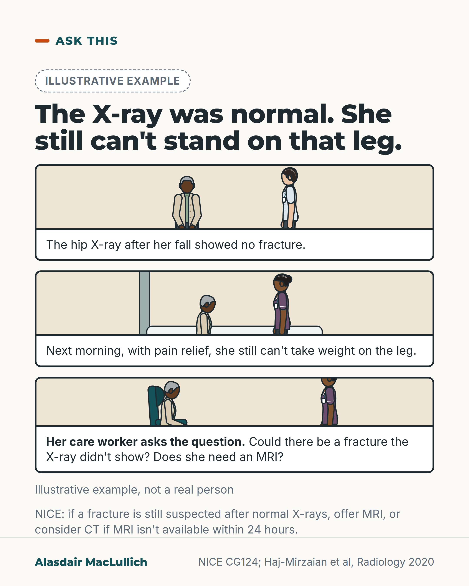

# G028: A normal X-ray, and still can't stand

- Category: C03 Hip fracture
- Audience: public
- Series: Ask this
- Post type: public_explanation
- Visual format: comic strip (3 panels)
- Status: text text_final, visual final
- Working id: C03-P07 (candidate C03-02)

## Insight

X-rays find most broken hips, but if a fracture is still suspected after normal X-rays, NICE says to offer an MRI (or consider CT if MRI is not available within 24 hours). Not being able to take weight on the leg the next day, despite pain relief, is a reason to look again.

## Angle and position

Give families and care workers the question that should outlast a normal X-ray: can the person take weight on that leg? If not, ask whether an MRI is needed.

Basis: mixed: NICE recommendation and guideline text and the Haj-Mirzaian review are documented or empirical; prompting families to ask is practical judgement

## X (908 characters)

```text
A hip X-ray finds most broken hips, but not all. The NICE guideline estimates X-rays find 90 to 98 in every 100 broken hips.

Suppose the person still can't take weight on the leg the day after the injury, despite good pain relief. The NICE guideline then says doctors should look again and strongly suspect a hip fracture. If a fracture is still suspected after normal X-rays, NICE says to offer an MRI. If MRI isn't available within 24 hours, it says to consider a CT scan.

A review pooled 35 studies of older people whose X-rays showed no definite fracture but whose doctors still suspected one. MRI found a hip fracture needing surgery in about 4 in 10 of them. That figure applies to this selected group, not to everyone with hip pain after a fall.

If you are a relative or care worker, you can ask: "They still can't take weight on that leg. Could the X-ray have missed a fracture? Is an MRI needed?"
```

## LinkedIn (1393 characters)

```text
The NICE guideline estimates that X-rays pick up 90 to 98 in every 100 broken hips. A normal X-ray is usually right, but a few fractures do not show on it. A person who still can't take weight on the leg the next day needs a second look.

Being unable to take weight on the leg is a typical sign of a broken hip. The NICE guideline says that if someone still can't take weight on the leg the day after the injury, despite good pain relief, doctors should look again. They should strongly suspect a hip fracture. Being able to stand does not rule out a fracture. Not being able to stand can have other causes, such as bruising, so it raises suspicion but does not confirm a fracture.

If a broken hip is still suspected after normal hip X-rays, NICE says to offer an MRI scan. If MRI isn't available within 24 hours, or can't be done, it says to consider a CT scan. (NICE guidance applies formally to England and Wales.)

A review of 35 studies looked at older people, average age 77. Their doctors suspected a hip fracture that the X-ray did not show. Of those people, MRI found a hip fracture needing surgery in about 4 in 10. That figure applies to this selected group, not to everyone with hip pain after a fall.

If you are a relative or a care worker, the words to use are: "They still can't take weight on that leg. Could there be a hip fracture the X-ray didn't show? Is an MRI needed?"
```

## Bluesky (299 characters)

```text
X-rays find most broken hips. If the person still can't take weight on the leg the next day despite pain relief, NICE says to strongly suspect a fracture.

If one is still suspected, NICE says to offer an MRI, or consider CT if MRI isn't available in 24 hours. Ask: "Could the X-ray have missed it?"
```

## Threads (499 characters)

```text
A normal hip X-ray is usually right, but not always. The NICE guideline estimates X-rays find 90 to 98 in every 100 broken hips.

If the person still can't take weight on the leg the next day and a fracture is still suspected, NICE says to offer an MRI. If MRI isn't available within 24 hours, consider CT. In a review of older people with normal X-rays but a still-suspected fracture, MRI found one needing surgery in about 4 in 10.

Ask: "Could the X-ray have missed a fracture? Is an MRI needed?"
```

## Source reply

Sources: https://www.nice.org.uk/guidance/cg124/chapter/recommendations https://doi.org/10.1148/radiol.2020192167

## Visual



Alt text: Illustrative three-panel comic. An older woman after a fall is seen with a doctor after a normal hip X-ray. The next morning a care worker beside her bed sees she still cannot take weight on the leg. The care worker asks whether an MRI could show a fracture the X-ray missed.

Editable source: `visuals/src/G028.html`

Design instructions: comic strip (3 panels); 1080x1350 card(s) via base.css, teal/orange palette, sand ground only on P09; data claims: ['C03-02-a', 'C03-02-b', 'C03-02-c', 'C03-02-d']. Source: visuals/src/C03-P07.html (generated by simple HTML/SVG, kit people only in P07, P09). 

## Sources and verification

- C03-02-a (supported): If a hip fracture is still suspected after normal hip X-rays, NICE guidance recommends offering MRI; if MRI is not available within 24 hours or is contraindicated, CT should be considered.
  - Source: National Clinical Guideline Centre. The management of hip fracture in adults (NICE clinical guideline 124). Full guideline: methods, evidence and guidance. London: NCGC/Royal College of Physicians; 2011 (with May 2017 update note).; National Institute for Health and Care Excellence. Hip fracture: management. Clinical guideline CG124. Recommendations (web page). London: NICE; 2011, last updated 2023.
  - Passage: "4.2.1 Imaging options in occult hip fracture ➢ Offer magnetic resonance imaging (MRI) if hip fracture is suspected despite negative X-rays of the hip of an adequate standard. If MRI is not available within 24 hours or is contraindicated, consider computed tomography (CT)." (NICE CG124 full guideline 2011, Guideline summary section 4.2.1; repeated in section 5.6.2 Recommendations and link to evidence (pages 50 to 51))
- C03-02-b (supported_with_qualification): Inability to bear weight is a typical feature of hip fracture, and inability to weight bear the day after the injury despite adequate pain relief should prompt reassessment and a high suspicion of hip fracture; its absence does not exclude a fracture.
  - Source: National Clinical Guideline Centre. The management of hip fracture in adults (NICE clinical guideline 124). Full guideline: methods, evidence and guidance. London: NCGC/Royal College of Physicians; 2011 (with May 2017 update note).
  - Passage: "Importantly, no clinical decision rule has yet become available that would allow clinicians to exclude a hip fracture without imaging. To avoid misdiagnosis with hip pain being attributed erroneously to soft tissue injury and the patient being discharged, a high index of clinical suspicion of hip fracture is required. This applies in all patients presenting with a typical history - usually hip pain following trauma, e.g. a fall – as certain typical features, such as the inability to bear weight or a shortened, abducted and externally rotated leg, may be absent. ... Optimal strategy for patient selection and timing of secondary imaging strategies to ensure early diagnosis of occult hip fractures, while avoiding over investigation of patients with soft tissue injury only, is yet to be determined. However, the inability to weight bear on the day following the injury, in spite of adequate analgesia, should prompt clinicians to re- evaluate the patient and have a high index of suspicion of hip fracture." (NICE CG124 full guideline 2011, Chapter 5 Imaging options in occult hip fracture, 5.1 Introduction (pages 45 to 46))
- C03-02-c (supported_with_qualification): Among older people whose doctors still suspected a hip fracture after X-rays showed no definite fracture, MRI found a hip fracture needing surgery in about 4 in 10.
  - Source: Haj-Mirzaian A, Eng J, Khorasani R, Raja AS, Levin AS, Smith SE, et al. Use of advanced imaging for radiographically occult hip fracture in elderly patients: a systematic review and meta-analysis. Radiology. 2020;296(3):521-531.
  - Passage: "Background The overall rate of hip fractures not identified on radiographs but that require surgery (ie, surgical hip fractures) remains unclear in elderly patients who are suspected to have such fractures based on clinical findings. ... Studies were included if patients were clinically suspected to have hip fracture but there was no radiographic evidence of surgical hip fracture (including absence of any definite fracture or only presence of isolated greater trochanter [GT] fracture). The rate of surgical hip fracture was reported in each study in which MRI was used as the reference standard. ... Results Thirty-five studies were identified (2992 patients; mean age, 76.8 years ± 6.0 [standard deviation]; 66% female). The frequency of radiographically occult surgical hip fracture was 39% (1110 of 2835 patients; 95% confidence interval [CI]: 35%, 43%) in studies of patients with no definite radiographic fracture and 92% (134 of 157 patients; 95% CI: 83%, 98%) in studies of patients with radiographic evidence of isolated GT fracture (moderate SOE). The frequency of occult fracture was higher in patients aged at least 80 years (44%, 529 of 1184), those with an equivocal radiographic report (58%, 71 of 126), and those with a history of trauma (41%, 977 of 2370) (moderate SOE)." (Abstract (Background, Materials and Methods, Results))
- C03-02-d (supported_with_qualification): X-rays detect most hip fractures; the NICE guideline estimates their sensitivity at 90% to 98%.
  - Source: National Clinical Guideline Centre. The management of hip fracture in adults (NICE clinical guideline 124). Full guideline: methods, evidence and guidance. London: NCGC/Royal College of Physicians; 2011 (with May 2017 update note).
  - Passage: "Hip radiographs have an estimated sensitivity of between 90% and 98%, and the initial films will therefore miss only a small proportion of hip fractures. It is, however, essential to ensure that the radiographs are of satisfactory quality." (NICE CG124 full guideline 2011, Chapter 5, 5.1 Introduction (page 45))

Verification notes: NICE full guideline Drive copy (official document) and NICE web extract: offer MRI, consider CT if not within 24 h (C03-02-a); non-weight-bearing next day narrative text attributed as 'the NICE guideline says' (C03-02-b); 90 to 98 in 100 estimate (C03-02-d). Haj-Mirzaian 2020 (abstract): 39% in selected group only, 44% not used. Applies formally to England and Wales (stated in LinkedIn). Dialogue is illustrative, in a labelled strip. Captions are written in general terms; the named woman appears only in the labelled illustrative comic. Fix2: wording only; the selected-group qualification for the 4 in 10 figure added to the X version.

## Attention and follow potential

Pause: Care workers and relatives told 'the X-ray is clear' while the person still can't stand.

Gain: The exact words to ask for a second look, with the guideline behind them.

Follow: Useful questions for families and care workers, grounded in guidance.

## Open issues

None.
