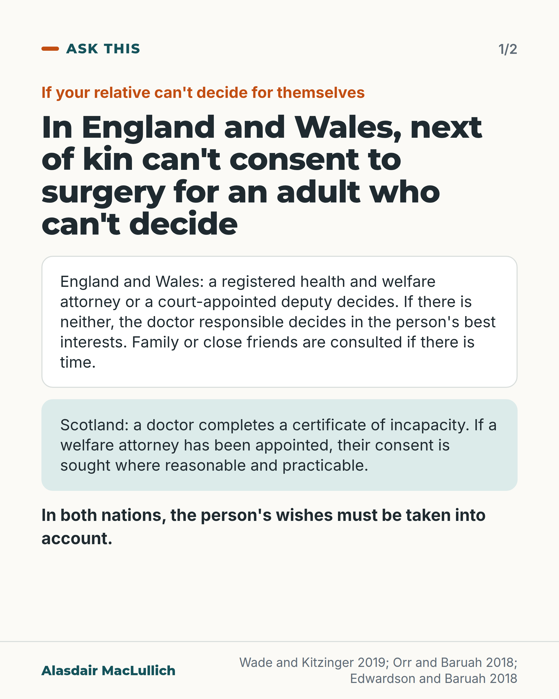
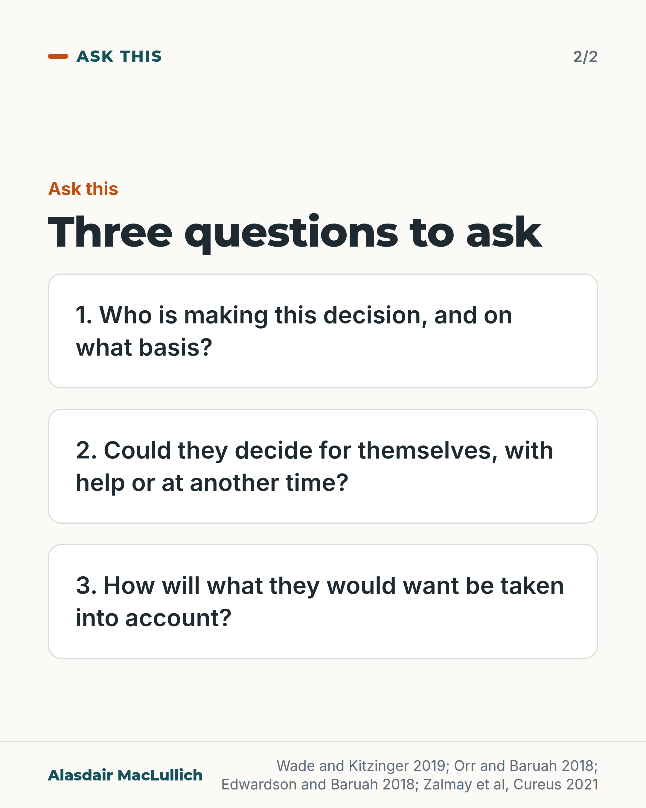

# G029: Who signs the form?

- Category: C03 Hip fracture
- Audience: public
- Series: Ask this
- Post type: public_explanation
- Visual format: carousel (2 slides, question card)
- Status: text text_final, visual final
- Working id: C03-P08 (candidate C03-09)

## Insight

In England and Wales, being next of kin does not give you legal power to consent to an operation for an adult who can't decide. An appointed health and welfare attorney or court deputy may; otherwise the doctor decides in the person's best interests. In Scotland a doctor completes a certificate of incapacity and seeks a welfare attorney's consent where reasonable and practicable. In both, the person's wishes must be taken into account.

## Angle and position

The family's usual legal role is to inform the decision, not make it; the most useful thing they bring is what the person would want. Families should be told who is deciding and on what basis (judgement).

Basis: mixed: the legal position is documented in peer-reviewed summaries (Wade 2019, Orr 2018, Edwardson 2018, Zalmay 2021); being told who decides and why is ethical judgement

## X (1136 characters)

```text
In England and Wales, being next of kin does not give you the legal right to consent to an operation for your mother.

If she can't decide for herself, the decision is made by someone she appointed in a registered legal document called a lasting power of attorney for health and welfare. Or it is made by a deputy appointed by a court with that power. If there is no one like that, the doctor responsible usually decides, in her best interests. If she made a valid written refusal of that treatment earlier (an advance decision), that overrides all of these. Her wishes, values and beliefs must be taken into account, and family or close friends should be consulted if there is time.

In Scotland the law is different. Treatment can go ahead once a doctor completes a certificate of incapacity (a form saying she can't decide for herself). If she appointed a welfare attorney with power over medical decisions, the doctor must ask that person for consent where this is reasonable and practicable. Her past and present wishes must be taken into account as far as practicable.

You can ask: who is making this decision, and on what basis?
```

## LinkedIn (1975 characters)

```text
Being next of kin does not give you the legal right to consent to an operation for your mother. That is the law in England and Wales. Hip fracture surgery is usually needed quickly, and some people can't decide for themselves at that moment.

Under the Mental Capacity Act 2005, if she can't decide, the decision is made by:
1. Someone she appointed in a legal document called a lasting power of attorney for health and welfare. It must be registered to be used, or
2. A deputy appointed by a court with power over her health decisions, or
3. If there is no one like that, usually the doctor responsible, in her best interests.

If she made a valid written refusal of that treatment earlier (an advance decision), that overrides all three.

The decision must take account of what she would want: her wishes, values and beliefs. Family or close friends should be consulted if there is time. In an emergency that conversation may be brief.

In Scotland the law is different. Treatment can go ahead once a doctor completes a certificate of incapacity (a form saying she can't decide for herself). If she has appointed a welfare attorney with power over medical decisions, the doctor must ask that person for consent where it is reasonable and practicable. Her past and present wishes and feelings must be taken into account. Certain people, including any welfare attorney or guardian, must be consulted where that is reasonable and practicable.

Capacity is about one decision at one time. A person may be able to make some decisions but not others, and it can change during the day. You can ask whether she could decide with help, or later in the day, though a hip operation can't wait long.

Our view: you should be told clearly who is making the decision and on what legal basis, and asked what she would want.

Questions you can ask:
Who is making this decision?
Could she decide for herself, with help or at another time?
How will what she would want be taken into account?
```

## Bluesky (299 characters)

```text
In England and Wales, next of kin can't consent to surgery for an adult who can't decide. A health and welfare attorney (named in a registered legal document) or a court-appointed deputy can. Otherwise the doctor usually decides in the person's best interests. Ask who is deciding. Scotland differs.
```

## Threads (488 characters)

```text
Being next of kin does not give you the legal right, in England and Wales, to consent to your mother's hip operation.

If she can't decide, someone she appointed as a health and welfare attorney (named in a legal document) may. Otherwise the doctor responsible decides in her best interests, and must take her wishes and values into account. Scotland's law differs: a doctor completes a certificate of incapacity (a form saying she can't decide).

Ask: who is deciding, and on what basis?
```

## Source reply

Sources: https://doi.org/10.1177/0269215519852987 https://doi.org/10.1016/j.bjae.2018.01.006 https://doi.org/10.1016/j.bjae.2018.04.001 https://doi.org/10.7759/cureus.20322

## Visual



Alt text: Card 1: in England and Wales, next of kin can't consent to surgery for an adult who can't decide; an attorney or deputy decides, or the responsible doctor. In Scotland, a doctor completes a certificate of incapacity. The person's wishes must be taken into account.



Alt text: Card 2: three questions to ask: who is making the decision and on what basis; could they decide with help or at another time; how will what they would want be taken into account.

Editable source: `visuals/src/G029.html`

Design instructions: carousel (2 slides, question card); 1080x1350 card(s) via base.css, teal/orange palette, sand ground only on P09; data claims: ['C03-09-a', 'C03-09-b', 'C03-09-c', 'C03-09-d', 'C03-09-e']. Source: visuals/src/C03-P08.html (generated by simple HTML/SVG, kit people only in P07, P09). 

## Sources and verification

- C03-09-a (supported): In England and Wales, being next of kin does not by itself give legal power to consent to an operation for an adult who lacks capacity: the decision-maker is someone the person appointed through a lasting power of attorney (health and welfare), or a court-appointed deputy; otherwise it is usually the responsible clinician, who decides in the person's best interests.
  - Source: Wade DT, Kitzinger C. Making healthcare decisions in a person's best interests when they lack capacity: clinical guidance based on a review of evidence. Clin Rehabil. 2019;33(10):1571-85.; Orr T, Baruah R. Consent in anaesthesia, critical care and pain medicine. BJA Educ. 2018;18(5):135-9.; Zalmay P, Collis J, Wilson H. Patients lacking the capacity to consent to hip fracture surgery may be undergoing major operations without their next of kin being involved in best-interests decisions: a quality improvement report. Cureus. 2021;13(12):e20322.
  - Passage: "Wade and Kitzinger 2019 abstract: "Context: The legal framework is the Mental Capacity Act (MCA) 2005, which applies to England and Wales. Theory: Unless there is a valid and applicable Advance Decision, an appointed decision-maker needs to decide for those without capacity. This may be someone appointed by the patient through a Lasting Power of Attorney, or a Deputy appointed by the court. Otherwise the decision-maker is usually the responsible clinician." Orr and Baruah 2018: "If a patient is unable to consent, treatment is carried out in their best interests." ... "A patient may have an advanced decision, lasting power of attorney for health and welfare (LPA) or a court-appointed deputy." Zalmay 2021: "The Consent Form Four (CF) is filled out when treatment is offered to a patient who is deemed to lack the capacity to be involved in this decision-making. Within it, a section entitled 'Involvement of those close to the patient' outlines that the clinician taking consent should seek the views of those close to the patient, and requires them to document this discussion (Appendix 1]. This is part of the best-interests decision-making process as outlined by the Mental Capacity Act 2005 []."" (Wade 2019 abstract (Context, Theory); Orr 2018 full text, 'The Mental Capacity Act 2005'; Zalmay 2021 full text, Introduction)
- C03-09-b (supported): Under the Mental Capacity Act, family and close friends must be consulted (if time permits) and the person's own wishes and values inform the best-interests decision.
  - Source: Orr T, Baruah R. Consent in anaesthesia, critical care and pain medicine. BJA Educ. 2018;18(5):135-9.; Wade DT, Kitzinger C. Making healthcare decisions in a person's best interests when they lack capacity: clinical guidance based on a review of evidence. Clin Rehabil. 2019;33(10):1571-85.; Zalmay P, Collis J, Wilson H. Patients lacking the capacity to consent to hip fracture surgery may be undergoing major operations without their next of kin being involved in best-interests decisions: a quality improvement report. Cureus. 2021;13(12):e20322.
  - Passage: "Orr and Baruah 2018: "If a patient is unable to consent, treatment is carried out in their best interests. Assessment of best interests must include social, psychological, and medical factors and should be informed by the patient's attitudes and opinions. If time permits, family or close friends must be consulted. If this is not possible, and the course of action proposed may have serious consequences or the risks and benefits are finely balanced, an Independent Mental Capacity Advocate should be consulted." Wade and Kitzinger 2019: "Once persistent lack of capacity is confirmed, an early meeting should be arranged with family and friends, to start a process of sharing information about the patient's medical condition and their values, wishes, feelings and beliefs with a view to making timely treatment decisions in the patient's best interests." Zalmay 2021: "When a patient is judged to lack the capacity to consent to a procedure, the Mental Capacity Act outlines that where appropriate, the clinician should seek the views of those interested in their welfare, usually referring to their NoK or lasting power of attorney []."" (Orr 2018 full text ('The Mental Capacity Act 2005'); Wade 2019 abstract (Solution); Zalmay 2021 full text (Intervention design))
- C03-09-c (supported_with_qualification): In Scotland, the Adults with Incapacity (Scotland) Act 2000 gives doctors general authority to treat an adult who can't consent once a certificate of incapacity is completed; but if the person has a welfare attorney with power over medical decisions, the doctor must seek that attorney's consent where reasonable and practicable.
  - Source: Edwardson S, Baruah R. Scots law and its relevance to anaesthesia, critical care, and pain medicine. BJA Educ. 2018;18(6):178-84.
  - Passage: ""The Act gives a 'general authority' to healthcare practitioners to treat a patient who is incapable of consenting to treatment provided that a certificate of incapacity has been completed (Fig. 1), and provided that the treatment falls within the general principles of the Act. Medical treatment is defined as 'any procedure or treatment designed to safeguard or promote physical or mental health'. If the patient is known to have appointed a proxy decision maker who has been granted power of attorney to make decisions regarding welfare, this general authority does not apply and the practitioner issuing the certificate must seek the consent of the welfare power of attorney before commencing treatment, where it is reasonable and practicable to do so. In an emergency, common law authority to provide treatment for the emergency preservation of life remains in place and completion of a certificate is not required to render this emergency treatment lawful."" (Edwardson and Baruah 2018, full text, 'Mental capacity in Scots law')
- C03-09-d (supported): In Scotland, any treatment under the Act must take account of the person's past and present wishes and feelings, and involve consultation with specified people, including any guardian or welfare attorney; there is a presumption of capacity.
  - Source: Edwardson S, Baruah R. Scots law and its relevance to anaesthesia, critical care, and pain medicine. BJA Educ. 2018;18(6):178-84.
  - Passage: ""In Scots law, there is a presumption that adults are legally capable of making decisions for themselves [presumption of capacity also applies to the Mental Capacity Act (2005) in England and Wales]." ... "The general principles of the Act are laid out in Section 1. This states that an intervention carried out under the Act: (i) should achieve a benefit not otherwise achievable; (ii) is the least restrictive option (i.e. the action made or decision taken should be the minimum necessary to achieve the intended purpose); (iii) account is taken of past and present expressed wishes and feelings as far as this is practicable; (iv) there is consultation with another specified person as far as is reasonable and practicable. Specified persons include a guardian or welfare attorney."" (Edwardson and Baruah 2018, full text, 'Mental capacity in Scots law')
- C03-09-e (supported): Capacity is decision-specific and can fluctuate; a person who can communicate with help is not incapable for that reason alone, so it is fair to ask whether she could decide with help and time.
  - Source: Orr T, Baruah R. Consent in anaesthesia, critical care and pain medicine. BJA Educ. 2018;18(5):135-9.; Edwardson S, Baruah R. Scots law and its relevance to anaesthesia, critical care, and pain medicine. BJA Educ. 2018;18(6):178-84.
  - Passage: "Orr and Baruah 2018: "A patient may lack capacity to make decisions about some aspects of their care but retain the capacity to make decisions about more straightforward aspects." ... "This decision confirms that capacity is time-and decision-specific and can fluctuate." Edwardson and Baruah 2018: "If this inability to communicate can be overcome with human or mechanical aids, it does not constitute incapacity for the purposes of the Act."" (Orr 2018 full text ('Consent: ethical principles'; 'Capacity: evolution of case law'); Edwardson 2018 full text)

Verification notes: England and Wales: Wade and Kitzinger 2019 (abstract), Orr and Baruah 2018 (full text) and Zalmay 2021 Cureus (PMC full text, PubMed-indexed hip fracture source, as the editor asked) support C03-09-a and b; LPA must be registered. Scotland: Edwardson and Baruah 2018 (full text) supports certificate of incapacity, welfare attorney consent where reasonable and practicable, and past and present wishes taken into account with certain people consulted (C03-09-c, d). Editor's check: the claim that a Scottish guardian with medical treatment powers can also consent was NOT verified in an opened source (the opened text lists guardians only among those to be consulted), so only the welfare attorney is named. The 'next of kin cannot consent' statement is limited to England and Wales, where C03-09-a supports it; the Scotland wording does not say what the law gives relatives. Northern Ireland is not described. No claim is made about how often relatives are asked to sign. Capacity is decision-specific with the time-critical qualification (C03-09-e). 'Our view' marks the judgement. Fix2: legal terms explained; advance decision (Wade and Kitzinger 2019) added to LinkedIn to match X; Scotland consultation wording follows C03-09-d (welfare attorney or guardian; relatives not named); third question changed so it is a question the relative can put to staff.

## Attention and follow potential

Pause: Relatives who have been handed a form or asked 'are you happy for us to go ahead?'.

Gain: An accurate account of who decides in England, Wales and Scotland, and three questions to ask.

Follow: Clear, careful explanations of rights around decisions in later life.

## Open issues

- Editor asked to verify that a Scottish guardian with medical treatment powers can consent: not verified in an opened source, so the post names only a welfare attorney as someone whose consent is sought; a guardian appears only among the people to be consulted (C03-09-d). The statute (Adults with Incapacity (Scotland) Act 2000) was not opened.
