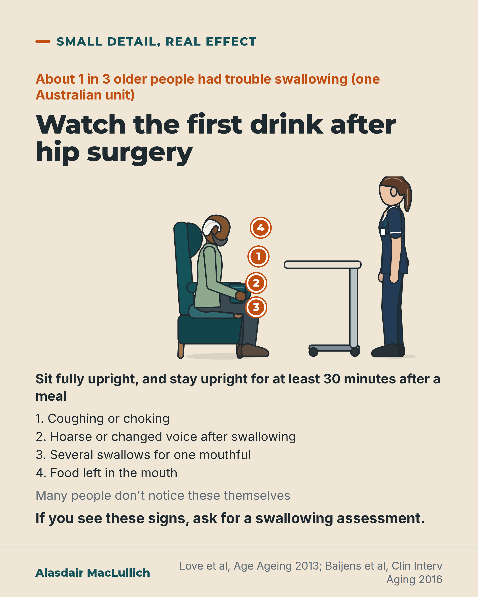

# G030: Watch the first drink after surgery

- Category: C03 Hip fracture
- Audience: both
- Series: Small detail, real effect
- Post type: teaching
- Visual format: annotated scene
- Status: text text_final, visual final
- Working id: C03-P09 (candidate C03-07)

## Insight

Roughly 1 in 3 older people have trouble swallowing after hip fracture surgery, and many don't notice it themselves. Watching the first drinks and meals, sitting fully upright, for coughing, a changed voice or repeated swallows gives a reason to ask for a swallowing assessment.

## Angle and position

Swallowing problems are thought of as a stroke problem; after hip fracture they are common and easy to miss. The first drink after surgery is a moment when staff and family are both present.

Basis: mixed: prevalence, associations and warning signs are empirical or consensus (Love 2013, Suzuki 2023, Mateos-Nozal 2021, Allen 2020, ESSD-EUGMS 2016); watching the first drink is clinical judgement, not a tested intervention

## X (1321 characters)

```text
The first drink after a hip operation is a time to look for trouble swallowing.

In one Australian unit, about 1 in 3 older people (61 of 181) had trouble swallowing after hip fracture surgery. It was more common in people who were older, came from a care home, or had a brain or nerve condition, or a lung condition.

In a New Zealand hospital, people with hip fracture and a recorded swallowing problem more often had aspiration pneumonia. This is a chest infection from food or drink going the wrong way. It affected about 1 in 10 of them, compared with fewer than 1 in 100 of the others. They were older on average, and this link does not show that the swallowing problem caused it. We did not find a study showing that watching the first drink prevents pneumonia.

Signs to watch for: coughing or choking, a hoarse or changed voice after swallowing, or lots of throat clearing. Also watch for several swallows for one mouthful, or food left in the mouth. Many older people don't notice these themselves.

The person should sit fully upright to eat and drink, and stay upright for at least half an hour after a meal. This is standard advice for people with swallowing difficulty. After hip surgery, sitting upright may need help and good pain relief.

If you see these signs, ask the ward for a swallowing assessment.
```

## LinkedIn (1712 characters)

```text
Trouble swallowing is common after a hip operation, and many older people don't notice it themselves. The first drink is a time to look for it.

In one Australian hospital unit, about 1 in 3 older people (61 of 181) had trouble swallowing after hip fracture surgery. Across studies the average is roughly a third, with wide variation; one Spanish study that tested everyone at the bedside found more than half.

Trouble swallowing was more common in people who were older, came from a care home, or already had a brain or nerve condition, or a lung condition.

In a New Zealand hospital, people with hip fracture and a recorded swallowing problem more often had aspiration pneumonia. This is a chest infection from food or drink going the wrong way. It affected about 1 in 10 of them, compared with fewer than 1 in 100 of the others. They were also more likely to die within 30 days: 18 in 100, compared with 4 in 100. They were older on average, and this link does not show that the swallowing problem caused the deaths. We did not find a study showing that watching the first drink prevents pneumonia.

Signs to watch for at a drink or meal, from a European consensus paper:
1. Coughing or choking
2. A hoarse or changed voice after swallowing
3. Lots of throat clearing
4. Swallowing several times for one mouthful
5. Food left in the mouth

Many older people don't notice these problems themselves. Sitting fully upright to eat and drink, and staying upright for at least half an hour after a meal, is standard advice. After hip surgery, sitting upright may need help and good pain relief.

Families may be present at the first drink as well as staff. If you see these signs, ask for a swallowing assessment.
```

## Bluesky (295 characters)

```text
In one Australian unit, about 1 in 3 older people had trouble swallowing after hip fracture surgery. Many don't notice it.

At the first drink, the person should sit fully upright. Watch for coughing, a changed voice or several swallows per mouthful. If you see them, ask for a swallowing check.
```

## Threads (421 characters)

```text
Trouble swallowing is common after a hip operation: about 1 in 3 older people in one Australian unit. Many don't notice it themselves. It is linked with chest infection from food or drink going the wrong way.

At the first drink, the person should sit fully upright. Watch for coughing or choking, a hoarse or changed voice, or several swallows for one mouthful. If you see them, ask the ward for a swallowing assessment.
```

## Source reply

Sources: https://doi.org/10.1093/ageing/aft037 https://doi.org/10.1016/j.archger.2023.105312 https://doi.org/10.1093/ageing/afab032 https://doi.org/10.1002/lary.28194 https://doi.org/10.2147/CIA.S107750

## Visual



Alt text: Annotated scene: an older man sits upright in a high-backed chair holding a cup, with a nurse standing nearby. Four numbered pins mark signs to watch: coughing or choking, hoarse voice, several swallows per mouthful, food left in the mouth. About 1 in 3 older people had swallowing trouble in one Australian unit.

Editable source: `visuals/src/G030.html`

Design instructions: annotated scene; 1080x1350 card(s) via base.css, teal/orange palette, sand ground only on P09; data claims: ['C03-07-a', 'C03-07-b', 'C03-07-c', 'C03-07-d', 'C03-07-e', 'C03-07-f']. Source: visuals/src/C03-P09.html (generated by simple HTML/SVG, kit people only in P07, P09). 

## Sources and verification

- C03-07-a (supported_with_qualification): In an Australian orthogeriatric unit, 34% of older people had swallowing difficulty after hip fracture surgery.
  - Source: Love AL, Cornwell PL, Whitehouse SL. Oropharyngeal dysphagia in an elderly post-operative hip fracture population: a prospective cohort study. Age Ageing. 2013;42(6):782-5.
  - Passage: "one hundred and eighty-one patients with a mean age of 83 years (range: 65-103) admitted to a specialised orthogeriatric unit were assessed for OD post-surgery for hip fracture. ... OD was found to be present post-operatively in 34% (n = 61) of the current population." (Abstract, Methods and Results)
- C03-07-b (supported_with_qualification): Across studies, around a third of older people have swallowing problems after hip fracture surgery, with estimates ranging widely depending on how and when swallowing is tested.
  - Source: Suzuki M, Nagano A, Ueshima J, Saino Y, Kawase F, Kobayashi H, et al. Prevalence of dysphagia in patients after orthopedic surgery. Arch Gerontol Geriatr. 2024;119:105312.; Mateos-Nozal J, Sanchez Garcia E, Romero Rodríguez E, Cruz-Jentoft AJ. Oropharyngeal dysphagia in older patients with hip fracture. Age Ageing. 2021;50(4):1416-1421.
  - Passage: "Suzuki 2024: 'The estimated dysphagia prevalence rates [95 % confidence interval] of cervical spine disease, hip fractures, and others were 16 % [8-27], 32 % [15-54], and 6 % [4-8], respectively.' Mateos-Nozal 2021: 'a total of 320 patients (mean age 86.2 years, 73.4% women) were assessed for dysphagia within 72 hours post-surgery using the Volume-Viscosity Swallow Test. ... dysphagia was present in 176 (55%) patients.'" (Abstracts, Results)
- C03-07-c (supported): Swallowing problems after hip fracture surgery were more likely in people who were older, lived in a care home, or already had neurological or lung conditions.
  - Source: Love AL, Cornwell PL, Whitehouse SL. Oropharyngeal dysphagia in an elderly post-operative hip fracture population: a prospective cohort study. Age Ageing. 2013;42(6):782-5.
  - Passage: "Multivariate logistic regression analyses revealed the presence of pre-existing neurological and respiratory medical co-morbidities, presence of post-operative delirium, age and living in a residential aged care facility prior to hospital admission to be associated with the post-operative OD." (Abstract, Results)
- C03-07-d (supported_with_qualification): Swallowing problems after hip fracture are linked with aspiration pneumonia and higher death rates.
  - Source: Allen J, Greene M, Sabido I, Stretton M, Miles A. Economic costs of dysphagia among hospitalized patients. Laryngoscope. 2020;130(4):974-979.
  - Passage: "Two groups were identified and compared: those with a coded diagnosis of dysphagia (n = 165) in addition to hip/femur fracture (HF + D), and a group with hip fracture alone (HF-D) (n = 2,288) ... For those in the HF + D group, mean age was 85 years compared to 78 years in the HF-D group (P < .05) ... Mortality within 30 days of admission was significantly higher (18% vs. 4%,respectively) ... Rate of aspiration pneumonia was 14 times greater in HF + D (9.7%) compared with HF-D (0.7%)." (Abstract, Methods and Results)
- C03-07-e (supported_with_qualification): Signs of a swallowing problem include coughing or choking on drinks, a change in the voice after swallowing, throat clearing, swallowing several times per mouthful and food left in the mouth; many older people do not notice their own swallowing problem.
  - Source: Baijens LW, Clavé P, Cras P, Ekberg O, Forster A, Kolb GF, et al. European Society for Swallowing Disorders - European Union Geriatric Medicine Society white paper: oropharyngeal dysphagia as a geriatric syndrome. Clin Interv Aging. 2016;11:1403-1428.
  - Passage: "Prominent among the main symptoms are aspiration, residue, excessive throat clearing, coughing, hoarse voice, atypical ventilation periods, and repetitive swallowing. An added risk is that many older people are unaware of their swallowing dysfunction. ... bedside clinical tests with water or other liquids together with oximetry, to look for coughing, choking, voice changes, and desaturation ... Clinical signs of impaired safety include cough, fall in oxygen saturation ≥3%, and voice changes; and signs of impaired efficacy include impaired labial seal, piecemeal deglutition, and oral and pharyngeal residue." (Full text: 'Combination of symptoms' and 'Screening and clinical assessment of dysphagia' sections)
- C03-07-f (supported_with_qualification): People with swallowing difficulty are advised to eat and drink sitting fully upright and to stay upright for at least 30 minutes after meals.
  - Source: Baijens LW, Clavé P, Cras P, Ekberg O, Forster A, Kolb GF, et al. European Society for Swallowing Disorders - European Union Geriatric Medicine Society white paper: oropharyngeal dysphagia as a geriatric syndrome. Clin Interv Aging. 2016;11:1403-1428.
  - Passage: "A general directive is to swallow in an upright position (90° seated)and to maintain this posture after the meal for at least 30 minutes." (Full text, 'Swallow postures and maneuvers')

Verification notes: Love 2013 (abstract): 61 of 181 (C03-07-a) and associations (C03-07-c; delirium association omitted, excluded topic). Suzuki 2023 and Mateos-Nozal 2021 (abstracts): roughly a third on average, over half with bedside testing (C03-07-b). Allen 2020 (abstract): unadjusted association with aspiration pneumonia and 30-day death, older group (C03-07-d); 18 vs 4 in 100 not repeated in X. ESSD-EUGMS 2016 (full text): signs and upright posture (C03-07-e/f), source wording 'hoarse or changed voice'. The ask for an assessment is advice (C03-07-g not found: no staff group named). No claim that watching prevents pneumonia. Fix2: opening no longer implies that watching the first drink is proven to help; reason it matters added from C03-07-d with the link-versus-cause qualification and the evidence gap; mortality figures (crude 18 vs 4 in 100) added to LinkedIn.

## Attention and follow potential

Pause: Swallowing is seen as a stroke problem; its frequency after hip fracture surprises families and many staff.

Gain: Five signs to watch and a posture to use at a moment when family and staff are both there.

Follow: Small, practical ward details with the evidence behind them.

## Open issues

- Checker flag 'Aging' (us_spelling?) in the visual credit line is the journal title Clin Interv Aging; kept as a proper name.
