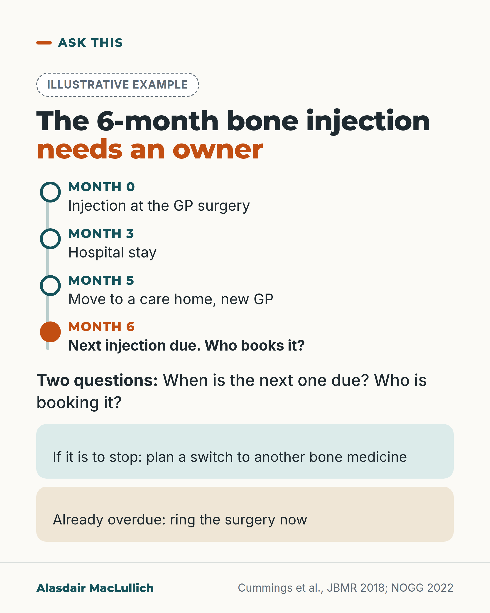

# G031: The bone injection date needs an owner

- Category: C04 Osteoporosis and bone health
- Audience: public
- Series: Ask this
- Post type: decision_support
- Visual format: diagram (timeline)
- Status: text text_final, visual final
- Working id: C04-P01 (candidate C04-07)

## Insight

Denosumab is given every 6 months and its effect wears off fast if a dose is missed, so anyone on it should know the next due date and who is booking it; if it is to stop, guidance is to switch to another bone medicine.

## Angle and position

A due date can pass without anyone deciding to stop. Two questions a family can ask protect against that. This post owns the 'do not stop denosumab without a switch' point.

Basis: mixed: rebound and fracture rates are empirical (post hoc trial analysis); the switch is guideline recommendation; 'ring now if overdue' is practical judgement

## X (968 characters)

```text
Denosumab (brand name Prolia) is a bone injection given once every 6 months. The date of the next one needs someone who owns it.

When denosumab stops, its effect wears off fast. Bone breakdown starts rising about 3 months after a missed dose. By about a year, the bone density gained (how solid the bone is on a scan) is back where it started.

In a follow-up of a large trial, women on denosumab had about 1 spinal fracture per 100 women per year. After stopping, this rose to about 7 per 100 per year. This was a later analysis, not a trial of stopping.

If you have this injection, or care for someone who does, ask two questions. When is the next one due? Who is booking it?

If it is going to stop, UK and European guidance is to switch to a different bone medicine about 6 months after the last injection. The usual choice is a bisphosphonate, a type of bone medicine.

If the date has already passed, ring the GP surgery or clinic now and ask what the plan is.
```

## LinkedIn (1714 characters)

```text
Denosumab (brand name Prolia) is a bone injection given once every 6 months. The date of the next one needs someone who owns it.

When denosumab stops, its effect wears off fast. Bone breakdown starts rising about 3 months after a missed dose. By about 6 months it is above the level before treatment. By about a year, the bone density gained (how solid the bone is on a scan) is back where it started.

The fracture figures come from a follow-up of the large FREEDOM trial in women with osteoporosis. On denosumab, women had about 1 spinal fracture per 100 women per year. After stopping, this rose to about 7 per 100 per year. Women who had only ever had a dummy injection had about 8 per 100, so stopping took the rate close to that. About 3 in 100 women who stopped had more than one spinal fracture. Fractures elsewhere in the skeleton did not rise. This was a later analysis, not a randomised trial of stopping.

A UK study of GP records found more spinal fractures in people whose next injection was more than 16 weeks late than in people who had it on time. It was observational, so it shows a link rather than proof.

Nobody has to decide to stop the injection for the date to pass. In my view the safeguard is simple enough for any family to use:

1. Know the date the next injection is due.
2. Know who is booking it: the GP surgery, a clinic or a care home.
3. If it is going to stop, ask for the switch plan. UK and European guidance is to change to another bone medicine, usually a bisphosphonate (a type of bone medicine), about 6 months after the last injection.

If the date has already passed, ring the surgery or clinic now. Ask whether the injection can be given, or what the plan is to switch.
```

## Bluesky (296 characters)

```text
Denosumab (Prolia) is a bone injection every 6 months. If it lapses, bone loss returns within months, and in a trial follow-up spinal fractures rose.

Ask: when is the next one due, and who is booking it?

To stop it, guidance is to switch to another bone medicine. Overdue? Ring the surgery now.
```

## Threads (418 characters)

```text
Denosumab (Prolia) is a bone injection given every 6 months. If a dose is missed, its effect wears off fast.

In a follow-up of a large trial, spinal fractures rose from about 1 to about 7 per 100 women a year after stopping.

If you have it, ask: when is the next one due, and who is booking it? If it is to stop, UK guidance is a planned switch to another bone medicine. If the date has passed, ring the surgery now.
```

## Source reply

Sources: Cummings 2018 https://pubmed.ncbi.nlm.nih.gov/29105841/ ; NOGG 2022 https://pubmed.ncbi.nlm.nih.gov/35378630/ ; Tsourdi 2021 https://pubmed.ncbi.nlm.nih.gov/33103722/ ; Lyu 2020 https://pubmed.ncbi.nlm.nih.gov/32716706/

## Visual



Alt text: Illustrative timeline of one year on a 6-monthly bone injection: injection at the GP surgery at month 0, hospital stay at month 3, move to a care home with a new GP at month 5, next injection due at month 6 with the question who books it. Two questions: when is it due, who is booking it. If stopping, plan a switch; if overdue, ring the surgery now.

Editable source: `visuals/src/G031.html`

Design instructions: Timeline component with four events, last one highlighted in burnt orange; labelled Illustrative example. Drawn markers from the brief (door, bed, calendar) left out to keep the pass simple; two boxes beneath.

## Sources and verification

- C04-07-a (supported): Denosumab for osteoporosis is a 60 mg injection under the skin given every 6 months.
  - Source: Gregson CL, Armstrong DJ, Bowden J, Cooper C, Edwards J, Gittoes NJL, et al. UK clinical guideline for the prevention and treatment of osteoporosis. Arch Osteoporos. 2022;17(1):58.
  - Passage: "Denosumab is given as a subcutaneous injection of 60 mg once every 6 months." (NOGG 2022 full text, section 'Anti-resorptive drugs: denosumab')
- C04-07-b (supported): When denosumab is stopped or a dose is missed, bone breakdown rises above pre-treatment levels and the bone density gained is lost within about a year.
  - Source: Cummings SR, Ferrari S, Eastell R, Gilchrist N, Jensen JB, McClung M, et al. Vertebral fractures after discontinuation of denosumab: a post hoc analysis of the randomized placebo-controlled FREEDOM trial and its extension. J Bone Miner Res. 2018;33(2):190-198.; Gregson CL, Armstrong DJ, Bowden J, Cooper C, Edwards J, Gittoes NJL, et al. UK clinical guideline for the prevention and treatment of osteoporosis. Arch Osteoporos. 2022;17(1):58.
  - Passage: "Cummings 2018 (Abstract): "Denosumab discontinuation increases bone turnover markers 3 months after a scheduled dose is omitted, reaching above-baseline levels by 6 months, and decreases bone mineral density (BMD) to baseline levels by 12 months." NOGG 2022: "Denosumab cessation leads to rapid reductions in BMD and elevations in bone turnover to levels above those seen before treatment initiation [...]."" (Cummings 2018 Abstract (background sentence summarising earlier trials); NOGG 2022 denosumab section)
- C04-07-c (supported_with_qualification): After stopping denosumab, spinal fracture rates rose to those of untreated women, and a larger share of those who fractured had several spinal fractures.
  - Source: Cummings SR, Ferrari S, Eastell R, Gilchrist N, Jensen JB, McClung M, et al. Vertebral fractures after discontinuation of denosumab: a post hoc analysis of the randomized placebo-controlled FREEDOM trial and its extension. J Bone Miner Res. 2018;33(2):190-198.; Gregson CL, Armstrong DJ, Bowden J, Cooper C, Edwards J, Gittoes NJL, et al. UK clinical guideline for the prevention and treatment of osteoporosis. Arch Osteoporos. 2022;17(1):58.
  - Passage: "Cummings 2018 (Abstract): "Of 1001 participants who discontinued denosumab during FREEDOM or Extension, the vertebral fracture rate increased from 1.2 per 100 participant-years during the on-treatment period to 7.1, similar to participants who received and then discontinued placebo (n = 470; 8.5 per 100 participant-years). Among participants with ≥1 off-treatment vertebral fracture, the proportion with multiple (>1) was larger among those who discontinued denosumab (60.7%) than placebo (38.7%; p = 0.049), corresponding to a 3.4% and 2.2% risk of multiple vertebral fractures, respectively. The odds (95% confidence interval) of developing multiple vertebral fractures after stopping denosumab were 3.9 (2.1-7. 2) times higher in those with prior vertebral fractures ... The rates (per 100 participant-years) of nonvertebral fractures during the off-treatment period were similar (2.8, denosumab; 3.8, placebo)."" (Cummings 2018 Abstract, Results)
- C04-07-d (supported_with_qualification): In UK primary care records, a denosumab dose delayed by more than 16 weeks was linked with a higher risk of spinal fracture than on-time dosing.
  - Source: Lyu H, Yoshida K, Zhao SS, Wei J, Zeng C, Tedeschi SK, et al. Delayed denosumab injections and fracture risk among patients with osteoporosis: a population-based cohort study. Ann Intern Med. 2020;173(7):516-526.
  - Passage: ""Investigators identified 2594 patients initiating denosumab therapy. The risk for composite fracture over 6 months was 27.3 in 1000 for on-time dosing, 32.2 in 1000 for short delay, and 42.4 in 1000 for long delay. Compared with on-time injections, short delay had a hazard ratio (HR) for composite fracture of 1.03 (95% CI, 0.63 to 1.69) and long delay an HR of 1.44 (CI, 0.96 to 2.17) (for trend = 0.093). For vertebral fractures, short delay had an HR of 1.48 (CI, 0.58 to 3.79) and long delay an HR of 3.91 (CI, 1.62 to 9.45)." Conclusion: "Although delayed administration of subsequent denosumab doses by more than 16 weeks is associated with increased risk for vertebral fracture compared with on-time dosing, evidence is insufficient to conclude that fracture risk is increased at other anatomical sites with long delay."" (Lyu 2020 Abstract, Results and Conclusion)
- C04-07-e (supported): Denosumab should not be stopped without a plan to switch to another bone treatment; the switch (for example a bisphosphonate) is started about 6 months after the last injection.
  - Source: Tsourdi E, Langdahl B, Cohen-Solal M, Aubry-Rozier B, Eriksen EF, Guanabens N, et al. Discontinuation of denosumab therapy for osteoporosis: a systematic review and position statement by ECTS. Bone. 2017;105:11-17.; Tsourdi E, Zillikens MC, Meier C, Body JJ, Gonzalez Rodriguez E, Anastasilakis AD, et al. Fracture risk and management of discontinuation of denosumab therapy: a systematic review and position statement by ECTS. J Clin Endocrinol Metab. Published online 2020 Oct 26. doi:10.1210/clinem/dgaa756.; Gregson CL, Armstrong DJ, Bowden J, Cooper C, Edwards J, Gittoes NJL, et al. UK clinical guideline for the prevention and treatment of osteoporosis. Arch Osteoporos. 2022;17(1):58.; Cummings SR, Ferrari S, Eastell R, Gilchrist N, Jensen JB, McClung M, et al. Vertebral fractures after discontinuation of denosumab: a post hoc analysis of the randomized placebo-controlled FREEDOM trial and its extension. J Bone Miner Res. 2018;33(2):190-198.
  - Passage: "ECTS 2017 (Abstract): "Based on current data, denosumab should not be stopped without considering alternative treatment in order to prevent rapid BMD loss and a potential rebound in vertebral fracture risk." ECTS 2020/21 (Abstract): "In case of denosumab discontinuation, alternative antiresorptive treatment should be initiated 6 months after the final denosumab injection." NOGG 2022: "The increase in vertebral fracture risk following cessation of denosumab therapy emphasises the need to consider continued treatment with an alternative anti-resorptive drug following denosumab withdrawal. An intravenous infusion of 5 mg of zoledronate, 6 months after the last denosumab injection, reduces subsequent bone loss [...], although this effect is not seen in all patients and may not be maintained beyond one year, particularly in those who have had more than 3 years of denosumab treatment." Cummings 2018: "Therefore, patients who discontinue denosumab should rapidly transition to an alternative antiresorptive treatment."" (ECTS 2017 and 2020 Abstracts; NOGG 2022 denosumab section; Cummings 2018 Abstract conclusion)
- C04-07-f (supported_with_qualification): If the injection is already overdue, contact the GP or clinic now and ask for the injection or a switch plan.
  - Source: Cummings SR, Ferrari S, Eastell R, Gilchrist N, Jensen JB, McClung M, et al. Vertebral fractures after discontinuation of denosumab: a post hoc analysis of the randomized placebo-controlled FREEDOM trial and its extension. J Bone Miner Res. 2018;33(2):190-198.; Tsourdi E, Zillikens MC, Meier C, Body JJ, Gonzalez Rodriguez E, Anastasilakis AD, et al. Fracture risk and management of discontinuation of denosumab therapy: a systematic review and position statement by ECTS. J Clin Endocrinol Metab. Published online 2020 Oct 26. doi:10.1210/clinem/dgaa756.; Lyu H, Yoshida K, Zhao SS, Wei J, Zeng C, Tedeschi SK, et al. Delayed denosumab injections and fracture risk among patients with osteoporosis: a population-based cohort study. Ann Intern Med. 2020;173(7):516-526.
  - Passage: "Cummings 2018: "... and 1.6 (1.3-1.9) times higher with each additional year of off-treatment follow-up" (odds of multiple vertebral fractures). ECTS 2020: "Patients having sustained VFx should be offered prompt treatment to reduce high bone turnover." Lyu 2020: "delayed administration of subsequent denosumab doses by more than 16 weeks is associated with increased risk for vertebral fracture compared with on-time dosing"." (Abstracts as named)

Verification notes: Dosing and rebound: NOGG 2022 full text; fracture rates: Cummings 2018 abstract (post hoc, women, per 100 participant-years; non-spinal not higher; 'more than one', not 'at once'); delay: Lyu 2020 abstract (observational, spinal only); switch: ECTS 2017/2021 and NOGG. 'Ring now' marked as practical advice (C04-07-f). Timeline labelled illustrative.

## Attention and follow potential

Pause: A family member realises they do not know when the next injection is due.

Gain: Two questions and one action that prevent an unplanned stop.

Follow: Practical questions families can ask about common medicines.

## Open issues

None.
