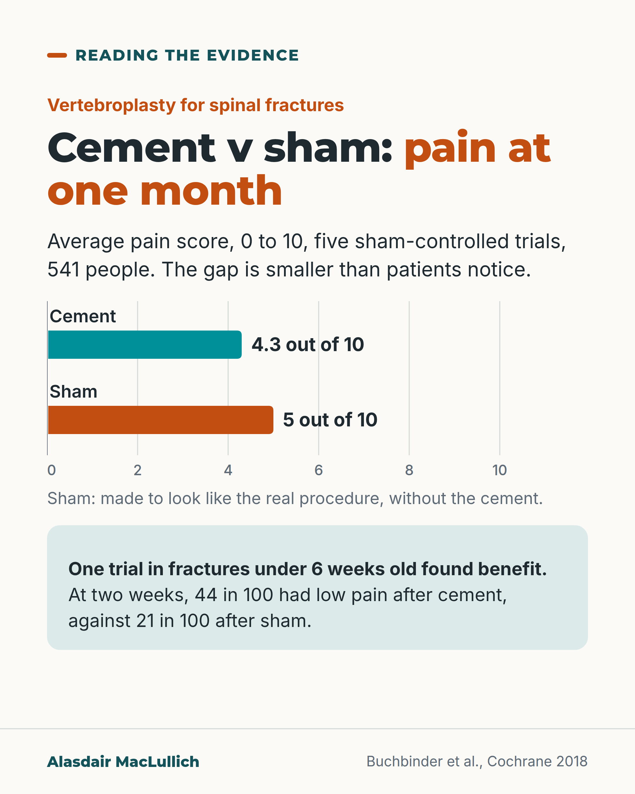

# G032: Cement for spinal fractures against a sham

- Category: C04 Osteoporosis and bone health
- Audience: both
- Series: Reading the evidence
- Post type: evidence_interpretation
- Visual format: chart
- Status: text text_final, visual final
- Working id: C04-P02 (candidate C04-17)

## Insight

When vertebroplasty was compared with a sham procedure, pain at one month differed by less than patients notice; pain eased in both groups. One trial in very recent, very painful fractures found benefit.

## Angle and position

Improvement after a procedure does not show the procedure caused it; the sham comparison separates the two. Position: not a routine treatment.

Basis: empirical finding (Cochrane 2018, sham trials, VAPOUR) plus guideline position (NOGG 2022, ASBMR); 'should not be routine' follows that guidance

## X (975 characters)

```text
Vertebroplasty means injecting cement into a broken spinal bone. Five trials compared it with a sham procedure, made to look like the real one but without the cement. At one month, pain averaged 4.3 out of 10 after cement and 5 out of 10 after the sham.

That gap is smaller than the difference patients notice. Disability and quality of life were much the same. Pain eased in both groups, including people who had no cement.

Trials where people knew whether they had cement, compared with usual care, looked better. The Cochrane review (a review that pools the trials) judged them likely to have overestimated the benefit.

One sham trial went the other way. It had 120 people with severe pain from fractures under 6 weeks old. At two weeks, 44 in 100 had low pain after cement, against 21 in 100 after the sham.

UK guidance says the evidence does not support routine use. First come pain relief that lets you keep moving, physiotherapy-guided exercise and bone treatment.
```

## LinkedIn (1879 characters)

```text
Injecting cement into a broken spinal bone is called vertebroplasty. It is offered to people with painful osteoporotic spinal fractures, and many feel better afterwards.

Feeling better afterwards is the problem for anyone reading the evidence. Pain from a spinal fracture often eases over weeks. People who have a procedure also expect to improve. A sham procedure, made to look like the real one but without the cement, separates the two.

A 2018 Cochrane review found five trials that did this, with 541 people. At one month, pain averaged 4.3 out of 10 after cement and 5 out of 10 after the sham. That gap is smaller than the difference patients notice. Disability and quality of life were much the same. In the sham trials, pain eased in both groups.

Trials where people knew they had had the procedure, compared with usual care, looked better. The review authors judged those open trials likely to have overestimated the benefit.

The result that went the other way deserves the same attention. One sham trial had 120 people with severe pain (7 out of 10 or more) from fractures under 6 weeks old. At two weeks, 44 in 100 had low pain after cement, against 21 in 100 after the sham. That keeps the question open for a narrow group.

Serious complications, including bone infection and pressure on the spinal cord, have been reported. They are uncommon, and the trials were too small to say whether overall risk is higher.

Balloon kyphoplasty, a similar procedure that first inflates a balloon in the bone, has not been tested against a sham. The UK osteoporosis guideline and a US specialist task force say the evidence does not support routine use of either procedure.

What helps meanwhile: pain relief used safely so you can keep moving, physiotherapy-guided exercise, and starting bone treatment, because a recent spinal fracture raises the risk of another one soon.
```

## Bluesky (296 characters)

```text
Vertebroplasty injects cement into a broken spinal bone. Against a sham (no cement), pain at one month was 4.3 v 5 out of 10, a gap patients would not notice. One trial in very recent, severe fractures found benefit.

UK guidance: not routine. Pain relief, movement and bone treatment come first.
```

## Threads (467 characters)

```text
Vertebroplasty means injecting cement into a broken spinal bone. In five trials against a sham procedure (made to look real, but no cement), pain at one month averaged 4.3 out of 10 after cement and 5 after the sham, a gap smaller than patients notice. Pain eased in both groups.

One trial in fractures under 6 weeks old with severe pain did find benefit.

UK guidance says not routine. Pain relief that keeps you moving, physiotherapy and bone treatment come first.
```

## Source reply

Sources: Cochrane 2018 https://pubmed.ncbi.nlm.nih.gov/30399208/ ; Clark 2016 (VAPOUR) https://pubmed.ncbi.nlm.nih.gov/27544377/ ; NOGG 2022 https://pubmed.ncbi.nlm.nih.gov/35378630/

## Visual



Alt text: Bar chart of average pain at one month out of 10 in five sham-controlled trials of vertebroplasty, 541 people: 4.3 with cement, 5 with sham. The gap is smaller than patients notice. One trial in fractures under 6 weeks old found benefit: low pain at two weeks in 44 in 100 after cement, 21 in 100 after sham.

Editable source: `visuals/src/G032.html`

Design instructions: Bar chart from zero (0 to 10), direct labels; teal for cement, burnt orange for sham, each labelled. Sham defined beneath; VAPOUR exception in a mint panel with its numbers.

## Sources and verification

- C04-17-a (supported): A Cochrane review found high- to moderate-certainty evidence from five sham-controlled trials that vertebroplasty gives no clinically important benefit for pain, disability, quality of life or treatment success at one month, whatever the duration of pain.
  - Source: Buchbinder R, Johnston RV, Rischin KJ, Homik J, Jones CA, Golmohammadi K, et al. Percutaneous vertebroplasty for osteoporotic vertebral compression fracture. Cochrane Database Syst Rev. 2018;11(11):CD006349.
  - Passage: ""Twenty-one trials were included: five compared vertebroplasty with placebo (541 randomised participants), eight with usual care (1136 randomised participants), seven with kyphoplasty (968 randomised participants)..." ... "Compared with placebo, high- to moderate-quality evidence from five trials indicates that vertebroplasty provides no clinically important benefits with respect to pain, disability, disease-specific or overall quality of life or treatment success at one month." ... "Mean pain (on a scale zero to 10, higher scores indicate more pain) was five points with placebo and 0.7 points better (0.3 better to 1.2 better) with vertebroplasty, an absolute pain reduction of 7% (3% better to 12% better, minimal clinical important difference is 15%)" ... "Our subgroup analyses indicate that the effects did not differ according to duration of pain (acute versus subacute)." Plain language summary: "People who had vertebroplasty rated their pain as 4.3 points." "People who had placebo rated their pain as 5 points."" (Abstract (Main results; Authors' conclusions) and plain language summary)
- C04-17-b (supported): Open trials comparing vertebroplasty with usual care probably overestimated its benefit.
  - Source: Buchbinder R, Johnston RV, Rischin KJ, Homik J, Jones CA, Golmohammadi K, et al. Percutaneous vertebroplasty for osteoporotic vertebral compression fracture. Cochrane Database Syst Rev. 2018;11(11):CD006349.; [No authors listed]. Percutaneous vertebroplasty and balloon kyphoplasty for painful osteoporotic vertebral compression fractures: a health technology assessment. Ont Health Technol Assess Ser. 2025;25(4):1-253.
  - Passage: ""Sensitivity analyses confirmed that open trials comparing vertebroplasty with usual care are likely to have overestimated any benefit of vertebroplasty. Correcting for these biases would likely drive any benefits observed with vertebroplasty towards the null, in keeping with findings from the placebo-controlled trials."" (Abstract (Authors' conclusions))
- C04-17-c (supported_with_qualification): Serious adverse events reported after vertebroplasty include bone infection, spinal cord compression, damage to the spinal cord covering and respiratory failure; whether overall risk is increased is uncertain.
  - Source: Buchbinder R, Johnston RV, Rischin KJ, Homik J, Jones CA, Golmohammadi K, et al. Percutaneous vertebroplasty for osteoporotic vertebral compression fracture. Cochrane Database Syst Rev. 2018;11(11):CD006349.
  - Passage: ""Notably, serious adverse events reported with vertebroplasty included osteomyelitis, cord compression, thecal sac injury and respiratory failure." ... "Numerous serious adverse events have been observed following vertebroplasty. However due to the small number of events, we cannot be certain about whether or not vertebroplasty results in a clinically important increased risk of new symptomatic vertebral fractures and/or other serious adverse events."" (Abstract (Main results; Authors' conclusions))
- C04-17-d (supported): One sham-controlled trial (VAPOUR) in people with severe pain from fractures under 6 weeks old found more people reached low pain at 14 days with vertebroplasty.
  - Source: Clark W, Bird P, Gonski P, Diamond TH, Smerdely P, McNeil HP, et al. Safety and efficacy of vertebroplasty for acute painful osteoporotic fractures (VAPOUR): a multicentre, randomised, double-blind, placebo-controlled trial. Lancet. 2016;388(10052):1408-16.; Clark W, Bird P, Diamond T, Gonski P, Gebski V. Cochrane vertebroplasty review misrepresented evidence for vertebroplasty with early intervention in severely affected patients. BMJ Evid Based Med. 25(3):85-9 (PubMed publication date 2019 Mar 9).
  - Passage: ""This was a multicentre, randomised, double-blind, placebo-controlled trial of vertebroplasty in four hospitals in Sydney, Australia. We recruited patients with one or two osteoporotic vertebral fractures of less than 6 weeks' duration and Numeric Rated Scale (NRS) back pain greater than or equal to 7 out of 10." ... "120 patients were enrolled. 61 patients were randomly assigned to vertebroplasty and 59 to placebo. 24 (44%) patients in the vertebroplasty group and 12 (21%) in the control group had an NRS pain score below 4 out of 10 at 14 days (between-group difference 23 percentage points, 95% CI 6-39; p=0·011)."" (Abstract (Methods; Findings))
- C04-17-e (supported): In sham-controlled trials, pain improved substantially in both groups, including those who had the sham procedure.
  - Source: Buchbinder R, Osborne RH, Ebeling PR, Wark JD, Mitchell P, Wriedt C, et al. A randomized trial of vertebroplasty for painful osteoporotic vertebral fractures. N Engl J Med. 2009;361(6):557-68.; Kallmes DF, Comstock BA, Heagerty PJ, Turner JA, Wilson DJ, Diamond TH, et al. A randomized trial of vertebroplasty for osteoporotic spinal fractures. N Engl J Med. 2009;361(6):569-79.
  - Passage: "Buchbinder 2009: "Vertebroplasty did not result in a significant advantage in any measured outcome at any time point. There were significant reductions in overall pain in both study groups at each follow-up assessment. At 3 months, the mean (+/-SD) reductions in the score for pain in the vertebroplasty and control groups were 2.6+/-2.9 and 1.9+/-3.3, respectively". Kallmes 2009: "Both groups had immediate improvement in disability and pain scores after the intervention."" (Abstracts (Results))
- C04-17-f (supported): The sham-controlled evidence is for vertebroplasty; for balloon kyphoplasty there is insufficient evidence of benefit over non-surgical care, and routine use of either is not supported by current specialist and UK guidance.
  - Source: Ebeling PR, Akesson K, Bauer DC, Buchbinder R, Eastell R, Fink HA, et al. The efficacy and safety of vertebral augmentation: a second ASBMR task force report. J Bone Miner Res. 2019;34(1):3-21.; Gregson CL, Armstrong DJ, Bowden J, Cooper C, Edwards J, Gittoes NJL, et al. UK clinical guideline for the prevention and treatment of osteoporosis. Arch Osteoporos. 2022;17(1):58.
  - Passage: "ASBMR: "For patients with acutely painful VF, percutaneous vertebroplasty provides no demonstrable clinically significant benefit over placebo. Results did not differ according to duration of pain. There is also insufficient evidence to support kyphoplasty over nonsurgical management, percutaneous vertebroplasty, vertebral body stenting, or KIVA®." ... "Routine use of vertebral augmentation is not supported by current evidence. When it is offered, patients should be fully informed about the evidence." NOGG: "The current evidence does not support the routine use of percutaneous vertebroplasty or balloon kyphoplasty for the treatment of painful osteoporotic vertebral fractures, as these procedures do not show consistent patient benefit"" (ASBMR abstract; NOGG full text, 'Management of symptomatic osteoporotic vertebral fractures')
- C04-17-g (supported): Recommended care after a painful spinal fracture includes safe pain relief to restore mobility, physiotherapist-supervised exercise, and prompt treatment to prevent further fractures.
  - Source: Gregson CL, Armstrong DJ, Bowden J, Cooper C, Edwards J, Gittoes NJL, et al. UK clinical guideline for the prevention and treatment of osteoporosis. Arch Osteoporos. 2022;17(1):58.; Ebeling PR, Akesson K, Bauer DC, Buchbinder R, Eastell R, Fink HA, et al. The efficacy and safety of vertebral augmentation: a second ASBMR task force report. J Bone Miner Res. 2019;34(1):3-21.
  - Passage: "NOGG: "Analgesia for acute pain is important to allow restoration of function and mobility but must be used safely" ... "Physiotherapist supervised exercise following vertebral fracture improves pain and physical performance" ... "Ensure prompt secondary fracture prevention is started following a fracture, with follow-up through fracture liaison services for all postmenopausal women, and men aged 50 years and older, with a newly diagnosed vertebral fracture" ... "Patients with a recent vertebral fracture have a high imminent risk of further fragility fracture". ASBMR: "Anti-osteoporotic medications reduce the risk of subsequent vertebral fractures by 40-70%."" (NOGG full text, 'Management of symptomatic osteoporotic vertebral fractures'; ASBMR abstract)

Verification notes: Cochrane 2018 abstract (C04-17-a,b,c); VAPOUR (C04-17-d, not called inpatients); sham arm improvement (Buchbinder 2009, Kallmes 2009); NOGG/ASBMR 'not routine' (C04-17-f); NICE TA279 not used.

## Attention and follow potential

Pause: Clinicians and patients who assume cement fixes the pain.

Gain: A clear reading of sham-controlled evidence, including the exception.

Follow: Careful readings of procedures and trials.

## Open issues

None.
