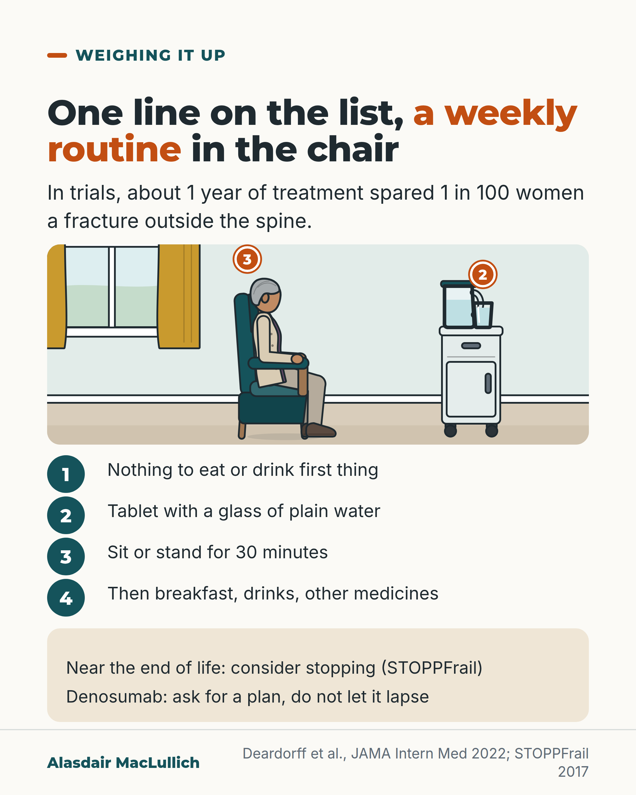

# G033: The weekly bone tablet in the last months of life

- Category: C04 Osteoporosis and bone health
- Audience: both
- Series: Weighing it up
- Post type: decision_support
- Visual format: annotated scene
- Status: text text_final, visual final
- Working id: C04-P03 (candidate C04-04)

## Insight

In trials a bisphosphonate took about a year to spare 1 in 100 women a non-spinal fracture, so for someone likely to live only months, the tablet's routine may bring effort with little time to help, and stopping can be right.

## Angle and position

Set the medicine-list entry beside the routine it demands. Position: review bone medicines near the end of life; stopping is reasonable and is not a withdrawal of care.

Basis: mixed: time to benefit and trial result are empirical; STOPPFrail is expert consensus; that reviewing the drug does not reduce care is ethical judgement

## X (914 characters)

```text
'Alendronic acid, weekly' is one line on a medicine list. For the person taking it, it means nothing to eat or drink first thing, a glass of plain water, then sitting or standing for 30 minutes before breakfast.

In trials, it took about a year of treatment before 1 in every 100 women treated was spared a fracture outside the spine. Those women were aged on average 63 to 74 and were not near the end of life.

For someone likely to live only weeks or a few months, the routine may come with little time to help. STOPPFrail, an expert list for reviewing medicines near the end of life, includes osteoporosis medicines and calcium tablets among those to consider stopping.

One exception: denosumab injections should not just lapse; if the person may live longer than a few months, ask for a plan.

Stopping a bone tablet does not mean less pain relief, falls care or comfort. We should say so when we suggest it.
```

## LinkedIn (1861 characters)

```text
'Alendronic acid, weekly' is one line on a medicine list. For the person taking it, the line means nothing to eat or drink first thing, the tablet swallowed with a glass of plain water, then sitting or standing for 30 minutes before breakfast, drinks or other medicines. People who are unable to stay upright for that long should not take it.

The benefit takes time to arrive. A meta-analysis (one pooled analysis of many trials) of bisphosphonate trials looked at medicines of this type, including alendronic acid. It took about a year of treatment before 1 in every 100 women treated was spared a fracture outside the spine. It took about 20 months before 1 in every 200 was spared a hip fracture. The women in those trials were aged on average 63 to 74 and were not frail or near the end of life. People at very high risk may benefit sooner, so the year is a guide, not a rule.

In the frailest people the trial evidence is thin. A small 2-year trial in 181 frail women in care homes, average age 85, gave one bone infusion or a dummy. Bone density improved, but fractures were not fewer: 20 in 100 with treatment and 16 in 100 with the dummy. The trial was too small to settle the question.

STOPPFrail is a list agreed by experts to help review medicines in frail older people near the end of life. It includes calcium tablets and osteoporosis medicines among those to consider stopping, because their benefit is unlikely to arrive within a year. It is a prompt for a shared decision, not an instruction.

One exception: denosumab injections should not just lapse, because bone loss after stopping starts within months. If the person may live longer than that, ask for a plan.

In my judgement, stopping a bone tablet near the end of life should never mean less pain relief, less falls care or less comfort. We should say that out loud when we suggest it.
```

## Bluesky (294 characters)

```text
In trials of women aged 63 to 74 on average, a year of bisphosphonate treatment spared about 1 in 100 a non-spinal fracture. For someone likely to live only months, the weekly tablet routine may not help in time. Stopping can be right.

Denosumab is the exception: it needs a plan, not a lapse.
```

## Threads (448 characters)

```text
A weekly alendronic acid tablet means an empty stomach, a glass of plain water and 30 minutes upright before breakfast.

In trials, about a year of treatment spared 1 in 100 women a fracture outside the spine. Those women were 63 to 74 on average, not near the end of life.

For someone likely to live only months, stopping can be right. Denosumab is the exception: ask for a plan. Stopping the tablet should never mean less comfort or pain relief.
```

## Source reply

Sources: Deardorff 2022 https://pubmed.ncbi.nlm.nih.gov/34807231/ ; STOPPFrail 2017 https://pubmed.ncbi.nlm.nih.gov/28119312/ ; Greenspan 2015 https://pubmed.ncbi.nlm.nih.gov/25867538/ ; NOGG 2022 https://pubmed.ncbi.nlm.nih.gov/35378630/

## Visual



Alt text: Drawing of an older woman sitting in an armchair beside a bedside table with a jug and glass of water, with a numbered list of the weekly tablet routine: nothing to eat or drink first, tablet with plain water, sit or stand 30 minutes, then breakfast. About 1 year of treatment spared 1 in 100 women a fracture outside the spine. Near the end of life consider stopping; denosumab needs a plan.

Editable source: `visuals/src/G033.html`

Design instructions: Small Kit scene (older woman in armchair, bedside table with jug and glass) with pins 2 and 3 matching the numbered list; no text in the drawing. Breakfast tray and clock from the brief omitted.

## Sources and verification

- C04-04-a (supported_with_qualification): In trials, bisphosphonates took about a year (12.4 months) to prevent one non-spinal fracture per 100 women treated, and about 20 months to prevent one hip fracture per 200 women.
  - Source: Deardorff WJ, Cenzer I, Nguyen B, Lee SJ. Time to benefit of bisphosphonate therapy for the prevention of fractures among postmenopausal women with osteoporosis: a meta-analysis of randomized clinical trials. JAMA Intern Med. 2022;182(1):33-41.
  - Passage: ""Of 67 full-text articles identified, 10 RCTs comprising 23 384 postmenopausal women with osteoporosis were included ... mean (SD) age ranging from 63 (7) years to 74 (3) years and follow-up duration ranging from 12 to 48 months. The pooled meta-analysis found that 12.4 months (95% CI, 6.3-18.4 months) were needed to avoid 1 nonvertebral fracture per 100 postmenopausal women receiving bisphosphonate therapy at an ARR of 0.010. To prevent 1 hip fracture, 200 postmenopausal women with osteoporosis would need to receive bisphosphonate therapy for 20.3 months (95% CI, 11.0-29.7 months) at an ARR of 0.005." Conclusion: "These results suggest that bisphosphonate therapy is most likely to benefit postmenopausal women with osteoporosis who have a life expectancy greater than 12.4 months."" (Deardorff 2022 Abstract, Results and Conclusions)
- C04-04-b (supported_with_qualification): STOPPFrail lists calcium supplements and bone-strengthening drugs for osteoporosis (including bisphosphonates and denosumab) among medicines to consider stopping in frail older people with limited life expectancy, because benefit is unlikely within a year.
  - Source: Lavan AH, Gallagher P, Parsons C, O'Mahony D. STOPPFrail (Screening Tool of Older Persons Prescriptions in Frail adults with limited life expectancy): consensus validation. Age Ageing. 2017;46(4):600-607.; Curtin D, Gallagher P, O'Mahony D. Deprescribing in older people approaching end-of-life: development and validation of STOPPFrail version 2. Age Ageing. 2021;50(2):465-471.
  - Passage: "Lavan 2017 (full-text excerpts via Scite): "Section G: Musculoskeletal System G1: Calcium supplementation Unlikely to be of any benefit in the short term G2: Anti-resorptive/bone anabolic drugs FOR OSTEOPOROSIS [bisphosphonates, strontium, teriparatide, denosumab] Unlikely to be of any benefit in the short term"; "Anti-resorptive/bone anabolic drugs for osteoporosis (bisphosphonates, strontium, teriparatide, denosumab) Benefits unlikely to be achieved within 1 year, increased short-intermediate term risk of associated adverse drug events."; "Anti-resorptive medications are challenging to administer, have a less favourable side effect profile and in some cases have been shown to continue to have clinical benefits after cessation e.g. bisphosphonates." Lavan 2017 (Abstract): "STOPPFrail comprises 27 criteria relating to medications that are potentially inappropriate in frail older patients with limited life expectancy." Curtin 2021 (Abstract): "STOPPFrail version 2 emphasises the importance of shared decision-making in the deprescribing process. A new method for identifying older people who are likely to be approaching end-of-life is included along with 25 deprescribing criteria."" (Lavan 2017 criteria list (Section G) and Discussion, via Scite full-text excerpts; Curtin 2021 Abstract)
- C04-04-c (supported): Alendronic acid has to be taken after an overnight fast with a full glass of plain water, at least 30 minutes before food, drink or other medicines, sitting or standing and not lying down for 30 minutes.
  - Source: Gregson CL, Armstrong DJ, Bowden J, Cooper C, Edwards J, Gittoes NJL, et al. UK clinical guideline for the prevention and treatment of osteoporosis. Arch Osteoporos. 2022;17(1):58.
  - Passage: ""Alendronate should be taken after an overnight fast and at least 30 min before the first food or drink (other than water) of the day or any other oral medicinal products or supplementation (including calcium). Tablets should be swallowed whole with a glass of plain water (~ 200 ml) whilst the patient is sitting or standing in an upright position. Patients should not lie down for 30 min after taking the tablet." Also: "Oral bisphosphonates are contraindicated in people with abnormalities of the oesophagus that delay oesophageal emptying such as stricture or achalasia, and inability to stand or sit upright for at least 30–60 min."" (NOGG 2022 full text, 'Anti-resorptive drugs: bisphosphonates' and 'Contraindications and special precautions')
- C04-04-d (supported_with_qualification): Denosumab is the exception: stopping it causes rapid bone loss and a rebound in spinal fractures, so it needs a planned decision if the person may live longer than several months.
  - Source: Cummings SR, Ferrari S, Eastell R, Gilchrist N, Jensen JB, McClung M, et al. Vertebral fractures after discontinuation of denosumab: a post hoc analysis of the randomized placebo-controlled FREEDOM trial and its extension. J Bone Miner Res. 2018;33(2):190-198.; Gregson CL, Armstrong DJ, Bowden J, Cooper C, Edwards J, Gittoes NJL, et al. UK clinical guideline for the prevention and treatment of osteoporosis. Arch Osteoporos. 2022;17(1):58.
  - Passage: "Cummings 2018: "Denosumab discontinuation increases bone turnover markers 3 months after a scheduled dose is omitted, reaching above-baseline levels by 6 months ... Therefore, patients who discontinue denosumab should rapidly transition to an alternative antiresorptive treatment." NOGG 2022: "Patients who discontinue denosumab have an increased risk of sustaining multiple vertebral fractures."" (Cummings 2018 Abstract; NOGG 2022 denosumab section)
- C04-04-e (supported_with_qualification): In a trial of one zoledronic acid infusion in 181 frail women in care homes, bone density improved but fewer fractures were not shown over 2 years.
  - Source: Greenspan SL, Perera S, Ferchak MA, Nace DA, Resnick NM. Efficacy and safety of single-dose zoledronic acid for osteoporosis in frail elderly women: a randomized clinical trial. JAMA Intern Med. 2015;175(6):913-21.
  - Passage: ""Included were 181 women 65 or older with osteoporosis, including those with cognitive impairment, immobility, and multimorbidity, who were living in nursing homes and assisted-living facilities ... mean (SE) age (85.4 [0.6] years) ... The treatment and placebo groups' fracture rates were 20% and 16%, respectively (OR, 1.30; 95% CI, 0.61-2.78); mortality rates were 16% and 13% (OR, 1.24; 95% CI, 0.54-2.86)." Conclusion: "Since it is not known whether such therapy reduces the risk of fracture in this cohort, any change in nursing home practice must await results of larger trials powered to assess fracture rates."" (Greenspan 2015 Abstract)

Verification notes: Deardorff 2022 abstract (trial women 63 to 74, not frail); STOPPFrail v1 full-text excerpts (v1 wording only); routine from NOGG; Greenspan 2015 as contrary/too small; denosumab one sentence (C04-04-d). Calcium details not used.

## Attention and follow potential

Pause: Families and prescribers who see bone tablets continued in someone who is dying.

Gain: A time-to-benefit reason to review, and the one exception.

Follow: Treatment decisions weighed with the person's time and goals.

## Open issues

None.
