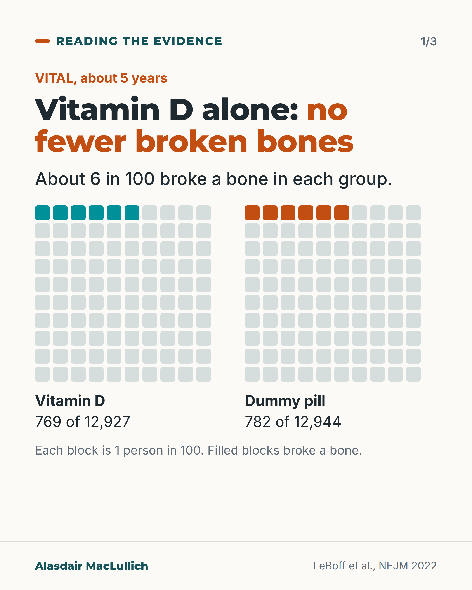
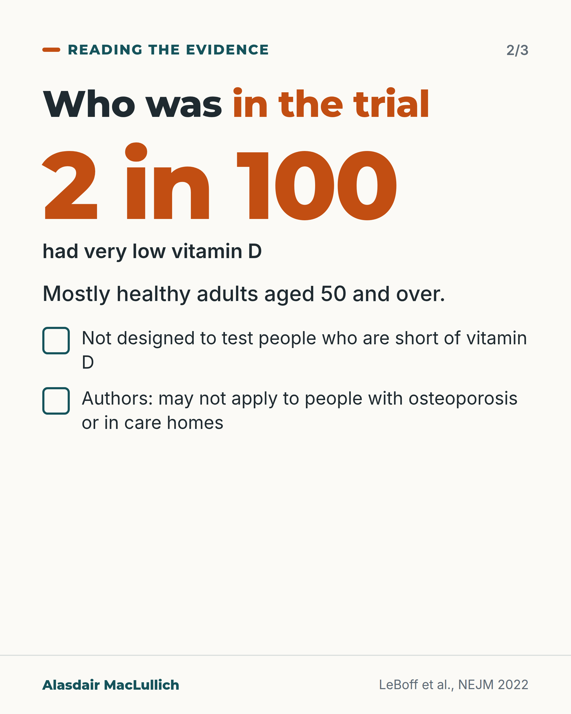
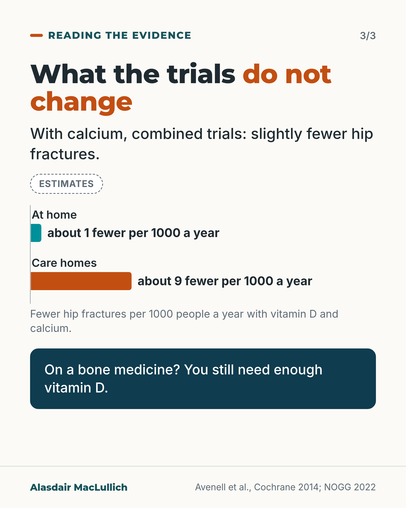

# G034: Who was in the big vitamin D trials

- Category: C04 Osteoporosis and bone health
- Audience: both
- Series: Reading the evidence
- Post type: evidence_interpretation
- Visual format: carousel
- Status: text text_final, visual final
- Working id: C04-P04 (candidate C04-20)

## Insight

VITAL and D-Health found vitamin D alone did not reduce fractures in mostly healthy people who were mostly not deficient; the evidence for deficient people is thin, and vitamin D with calcium slightly reduced hip fractures in pooled trials.

## Angle and position

Keep the trial population separate from the people a claim is about. 'No benefit in people like those studied' differs from 'no benefit for anyone'.

Basis: empirical findings (VITAL, D-Health, meta-analyses) plus guideline statement; the reading is clinical interpretation

## X (855 characters)

```text
Two very large trials found vitamin D tablets did not prevent broken bones. The people in them were mostly healthy, and in VITAL most were not short of vitamin D.

In VITAL, nearly 26,000 Americans aged 50 and over took vitamin D or a dummy pill for about 5 years. About 6 in 100 in each group broke a bone. D-Health, in over 20,000 Australians aged 60 to 84, found the same.

In VITAL only about 2 in 100 had very low levels. That small group showed no benefit either, but the evidence for deficient people is thin.

Vitamin D with calcium cut hip fractures slightly in pooled trials: an estimated 1 fewer per 1000 people a year at home, and 9 fewer per 1000 in care homes.

Read these trials as: extra vitamin D alone does not prevent fractures in people like those studied. If you take a bone medicine, UK guidance still says you need enough vitamin D.
```

## LinkedIn (1810 characters)

```text
Two very large trials found vitamin D tablets did not prevent broken bones. The people in them were mostly healthy, and in VITAL most were not short of vitamin D. Both facts belong in the headline.

VITAL enrolled nearly 26,000 generally healthy Americans aged 50 and over. They took 2000 units of vitamin D a day or a dummy pill for about 5 years. About 6 in 100 in each group broke a bone (769 of 12,927 with vitamin D against 782 of 12,944 with the dummy). Hip fractures were no different.

D-Health gave over 20,000 Australians aged 60 to 84 a monthly dose or a dummy for about 5 years. 5.6 in 100 broke a bone with vitamin D and 5.9 in 100 with the dummy, not a clear difference.

Most VITAL volunteers had normal vitamin D levels. Only about 2 in 100 were very low. The trial was not designed to test people who are short of vitamin D, and in that small very-low group there was no sign of benefit either. The authors say the results may not apply to people with osteoporosis or to older people in care homes. So the evidence for people short of vitamin D is thin, not absent.

Reviews that combined many trials agree that vitamin D on its own does not prevent fractures. Vitamin D given with calcium cut hip fractures slightly. The estimate is 1 fewer hip fracture per 1000 older people a year at home, and 9 fewer per 1000 a year in care homes, where hip fractures are far more common. Those per-1000 figures are estimates from applying the combined result to typical risks.

A fair reading: extra vitamin D alone does not prevent fractures in people like those studied. That is a narrower statement than 'vitamin D is useless'.

UK guidance still says people on bone medicines should have enough vitamin D. It also says calcium with vitamin D should go to those at risk whose diet is short of calcium.
```

## Bluesky (282 characters)

```text
VITAL and D-Health (over 45,000 people) found vitamin D alone did not cut fractures. Most were healthy; in VITAL most were not short of vitamin D. Evidence for people who are short is thin.

With calcium, hip fractures fell slightly. On a bone drug, you still need enough vitamin D.
```

## Threads (492 characters)

```text
Two huge trials, VITAL and D-Health, found vitamin D alone did not prevent broken bones. About 6 in 100 broke a bone either way.

Most people were healthy, and in VITAL most were not short of vitamin D. Evidence for people who are short is thin, not absent.

Vitamin D with calcium slightly cut hip fractures when trials were combined. Hip fractures are commoner in care homes, so more are estimated to be prevented there. On a bone medicine, UK guidance says you still need enough vitamin D.
```

## Source reply

Sources: LeBoff 2022 (VITAL) https://pubmed.ncbi.nlm.nih.gov/35939577/ ; Waterhouse 2023 (D-Health) https://pubmed.ncbi.nlm.nih.gov/37011645/ ; Avenell 2014 Cochrane https://pubmed.ncbi.nlm.nih.gov/24729336/ ; NOGG 2022 https://pubmed.ncbi.nlm.nih.gov/35378630/

## Visual



Alt text: Two 10 by 10 grids, 6 filled in each. In the VITAL trial about 6 in 100 broke a bone over about 5 years, with vitamin D (769 of 12,927) and with a dummy pill (782 of 12,944). Vitamin D alone did not mean fewer broken bones.



Alt text: Big number: 2 in 100 had very low vitamin D. The trial was mostly healthy adults aged 50 and over, not designed to test people short of vitamin D; authors say results may not apply to people with osteoporosis or in care homes.



Alt text: Bars labelled as estimates: with calcium, about 1 fewer hip fracture per 1000 people a year at home and about 9 fewer per 1000 in care homes. On a bone medicine you still need enough vitamin D.

Editable source: `visuals/src/G034.html`

Design instructions: Three-card carousel. Card 1 two icon arrays with 6 of 100 filled; card 2 big number 2 in 100 and two limits; card 3 bars for 1 and 9 per 1000, labelled Estimates. Park drawing of walkers replaced by a number card.

## Sources and verification

- C04-20-a (supported): VITAL: in 25,871 US adults not selected for vitamin D deficiency, low bone mass or osteoporosis, 2000 IU vitamin D a day for a median 5.3 years did not reduce total, non-spinal or hip fractures.
  - Source: LeBoff MS, Chou SH, Ratliff KA, Cook NR, Khurana B, Kim E, et al. Supplemental vitamin D and incident fractures in midlife and older adults. N Engl J Med. 2022;387(4):299-309.
  - Passage: ""Participants were not recruited on the basis of vitamin D deficiency, low bone mass, or osteoporosis." ... "Among 25,871 participants ... we confirmed 1991 incident fractures in 1551 participants over a median follow-up of 5.3 years. Supplemental vitamin D, as compared with placebo, did not have a significant effect on total fractures (which occurred in 769 of 12,927 participants in the vitamin D group and in 782 of 12,944 participants in the placebo group; hazard ratio, 0.98; 95% confidence interval [CI], 0.89 to 1.08; P = 0.70), nonvertebral fractures (hazard ratio, 0.97; 95% CI, 0.87 to 1.07; P = 0.50), or hip fractures (hazard ratio, 1.01; 95% CI, 0.70 to 1.47; P = 0.96)."" (Abstract; full text Results)
- C04-20-b (supported_with_qualification): Few VITAL participants were deficient; the trial was not designed to test deficient people, and the small group with very low levels showed no benefit either; results may not apply to people with osteoporosis or osteomalacia or to older people in institutions.
  - Source: LeBoff MS, Chou SH, Ratliff KA, Cook NR, Khurana B, Kim E, et al. Supplemental vitamin D and incident fractures in midlife and older adults. N Engl J Med. 2022;387(4):299-309.
  - Passage: ""The mean baseline 25-hydroxyvitamin D level (16,757 participants) was 30.7±10.0 ng per milliliter. At baseline, 401 (2.4%) had 25-hydroxyvitamin D levels of less than 12 ng per milliliter and 2161 (12.9%) had levels of less than 20 ng per milliliter." ... "In post hoc analyses, we found no benefit for supplementation in the relatively small number of participants with baseline 25-hydroxyvitamin D levels of less than 12 ng per milliliter (401 participants)." ... "We evaluated only one vitamin D dose, and the trial was not designed to test the effects of vitamin D supplementation in those who are vitamin D deficient. Only a small percentage of participants (2.4%) had vitamin D levels of less than 12 ng per milliliter." ... "In addition, results may not be generalizable to adults with osteoporosis or osteomalacia or older institutionalized persons."" (Full text: Results (Trial participants; Fracture incidence); Discussion (limitations))
- C04-20-c (supported): D-Health: in 21,315 Australians aged 60 to 84, 60,000 IU vitamin D monthly for up to 5 years did not reduce fractures.
  - Source: Waterhouse M, Ebeling PR, McLeod DSA, English D, Romero BD, Baxter C, et al. The effect of monthly vitamin D supplementation on fractures: a tertiary outcome from the population-based, double-blind, randomised, placebo-controlled D-Health trial. Lancet Diabetes Endocrinol. 2023;11(5):324-32.
  - Passage: ""We did a population-based, double-blind, randomised, placebo-controlled trial of oral vitamin D supplementation (60 000 IU per month) for up to 5 years in adults aged 60-84 years living in Australia." ... "Over a median follow-up of 5·1 years (IQR 5·1-5·1), 568 (5·6%) participants in the vitamin D group and 603 (5·9%) in the placebo group had one or more fractures. There was no effect on fracture risk overall (HR 0·94 [95% CI 0·84-1·06]), and the interaction between randomisation group and time was not significant (p=0·14). However, the HR for total fractures appeared to decrease with increasing follow-up time."" (Abstract (Methods; Findings))
- C04-20-e (supported): Meta-analyses find vitamin D alone does not prevent fractures, while vitamin D with calcium gives a small reduction in hip fractures, larger in absolute terms for people living in institutions.
  - Source: Bolland MJ, Grey A, Avenell A. Effects of vitamin D supplementation on musculoskeletal health: a systematic review, meta-analysis, and trial sequential analysis. Lancet Diabetes Endocrinol. 2018;6(11):847-58.; Avenell A, Mak JC, O'Connell D. Vitamin D and vitamin D analogues for preventing fractures in post-menopausal women and older men. Cochrane Database Syst Rev. 2014;2014(4):CD000227.; Yao P, Bennett D, Mafham M, Lin X, Chen Z, Armitage J, et al. Vitamin D and calcium for the prevention of fracture: a systematic review and meta-analysis. JAMA Netw Open. 2019;2(12):e1917789.
  - Passage: "Bolland 2018: "In pooled analyses, vitamin D had no effect on total fracture (36 trials; n=44 790, relative risk 1·00, 95% CI 0·93-1·07), hip fracture (20 trials; n=36 655, 1·11, 0·97-1·26), or falls". Avenell 2014: "There is high quality evidence that vitamin D alone, in the formats and doses tested, is unlikely to be effective in preventing hip fracture" ... "There is high quality evidence that vitamin D plus calcium results in a small reduction in hip fracture risk (nine trials, 49,853 participants; RR 0.84, 95% confidence interval (CI) 0.74 to 0.96; P value 0.01). In low-risk populations (residents in the community: with an estimated eight hip fractures per 1000 per year), this equates to one fewer hip fracture per 1000 older adults per year (95% CI 0 to 2). In high risk populations (residents in institutions: with an estimated 54 hip fractures per 1000 per year), this equates to nine fewer hip fractures per 1000 older adults per year (95% CI 2 to 14)." Yao 2019: "a meta-analysis of 6 RCTs (49 282 participants, 5449 fractures, 730 hip fractures) of combined supplementation with vitamin D ... and calcium ... found a 6% reduced risk of any fracture (RR, 0.94; 95% CI, 0.89-0.99) and a 16% reduced risk of hip fracture (RR, 0.84; 95% CI, 0.72-0.97)."" (Abstracts (Findings / Main results))
- C04-20-f (supported): UK guidance says people taking osteoporosis drugs should be vitamin D replete, and that calcium with vitamin D supplements should be targeted to those at risk who do not get enough calcium in their diet.
  - Source: Gregson CL, Armstrong DJ, Bowden J, Cooper C, Edwards J, Gittoes NJL, et al. UK clinical guideline for the prevention and treatment of osteoporosis. Arch Osteoporos. 2022;17(1):58.
  - Passage: ""Overall, there is little evidence that vitamin D supplementation alone reduces fracture incidence, although it may reduce falls risk [,]; (). However, it is important for patients taking antiresorptive and anabolic osteoporosis drug therapies to be vitamin D replete. In clinical practice, dietary sources of calcium are the preferred option and calcium (combined with vitamin D) supplementation should be targeted to those who do not get sufficient calcium from their diet and who are at risk of osteoporosis and/"" (NOGG full text, calcium and vitamin D section)

Verification notes: VITAL full text (C04-20-a,b, including very-low subgroup stated); D-Health abstract (not described as replete); meta-analyses per-1000 estimates labelled; NOGG vitamin D statement. Chapuy not used.

## Attention and follow potential

Pause: Readers who saw headlines that vitamin D is useless.

Gain: How to read a trial population, and what still applies.

Follow: Readings of big trials that keep the population in view.

## Open issues

- Checker flags VITAL: this is the trial name (acronym), not the banned word; justified.
- check_posts flags 'VITAL' as banned word 'vital'; false positive: it is the trial's proper name (VITAL trial), kept.
