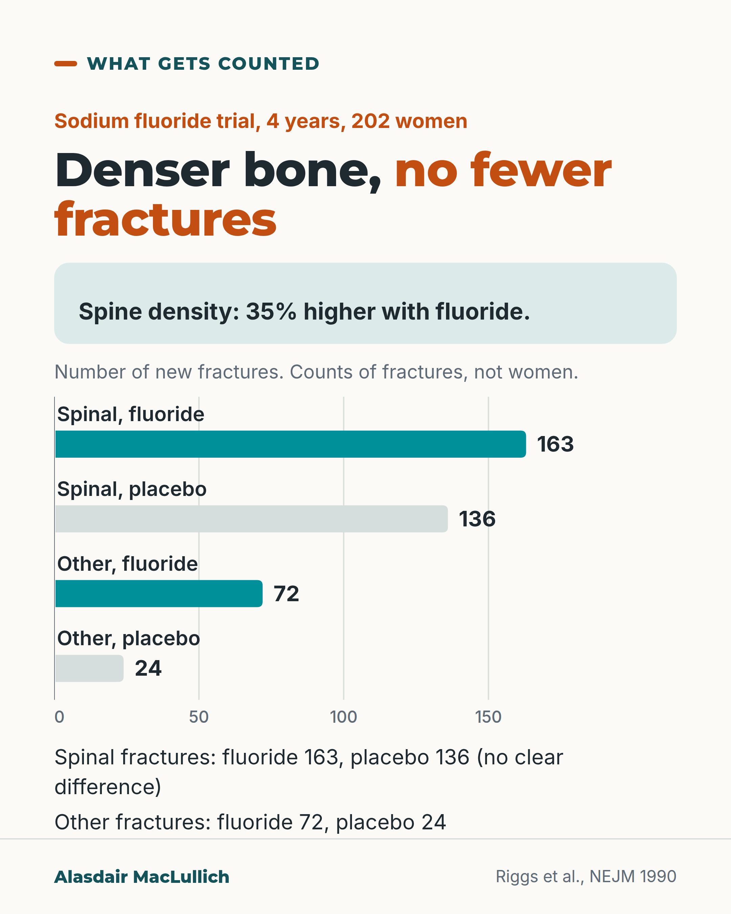

# G035: Bone density is a stand-in for fractures

- Category: C04 Osteoporosis and bone health
- Audience: practitioners
- Series: What gets counted
- Post type: teaching
- Visual format: chart
- Status: text text_final, visual final
- Working id: C04-P05 (candidate C04-29)

## Insight

Fluoride raised spine density by about a third and did not reduce spinal fractures, while fractures elsewhere rose; for approved drugs, one person's repeat scan is a poor guide to whether treatment is working.

## Angle and position

What gets counted: the density number versus the fractures people experience. Check adherence and look for new fractures rather than judging by a small scan change.

Basis: empirical findings (Riggs 1990, Haguenauer 2000, Black 2020, Cummings 2002, Bell 2009) plus guideline recommendation (NOGG); position is clinical interpretation

## X (779 characters)

```text
In 1990, a trial of sodium fluoride raised spine bone density by 35% more than placebo over four years in 202 women with osteoporosis.

Spinal fractures were not reduced: 163 new spinal fractures with fluoride, 136 with placebo. Fractures away from the spine numbered 72 against 24. These are counts of fractures, not women.

For approved drugs, density gains do track fracture reduction across whole trials. But density explains only part of the benefit: with alendronate, the spine density gain accounted for about 16% of the fall in spinal fractures. And a repeat scan in one person varies more than the real differences between people.

Do not judge a bone medicine by a small change on one person's repeat scan. Check it is being taken correctly, and look for new fractures.
```

## LinkedIn (1766 characters)

```text
In 1990, a trial of sodium fluoride raised spine bone density by 35% more than placebo over four years, in 202 women with osteoporosis and spinal fractures.

Spinal fractures were not reduced: 163 new spinal fractures with fluoride and 136 with placebo, not a clear difference. Fractures away from the spine numbered 72 with fluoride against 24 with placebo. These are counts of fractures, not numbers of women, and only 66 and 69 women completed the trial. A review of 11 fluoride trials found the same pattern with high doses.

Fluoride is not a current treatment. The lesson is about what we count. A density number is easy to measure and compare. Fractures, pain, height and independence are what people experience.

For the drugs in current use, density is a reasonable guide across whole trials: in 23 trials with over 90,000 people, drugs that raised hip density more cut fractures more. That is why density is used to judge new drugs.

It also explains only part of the benefit: with alendronate, the spine density gain accounted for about 16% of the fall in spinal fractures. In one person it is a weaker guide still. In alendronate trial data, the scan's own variation from one measurement to the next was larger than the differences between people, and the authors concluded that routine repeat scans in the first three years are unnecessary and can mislead.

What UK guidance asks instead, if someone breaks a bone on treatment:

1. Check whether the medicine has been taken correctly (less than 80% of doses taken correctly counts as poor adherence).
2. Look for other causes of bone loss.
3. Use density, with a risk calculator, when deciding after 3 to 5 years whether to continue.

A small change on one repeat scan does not mean the drug is failing.
```

## Bluesky (284 characters)

```text
In a 1990 trial, fluoride raised spine density 35% more than placebo but did not cut spinal fractures; there were more other fractures (72 v 24 fractures).

For approved drugs, one person's repeat scan is a poor guide. Check the medicine is taken correctly and look for new fractures.
```

## Threads (498 characters)

```text
A 1990 trial of fluoride raised spine density 35% more than placebo. Spinal fractures were not reduced (163 v 136); other fractures numbered 72 v 24.

For approved drugs, density tracks benefit across whole trials. But it explains only part of the benefit: with alendronate, about 16% of the fall in spinal fractures. One person's repeat scan varies more than real differences between people.

Before blaming the drug for a small scan change, check it is taken correctly and look for new fractures.
```

## Source reply

Sources: Riggs 1990 https://pubmed.ncbi.nlm.nih.gov/2407957/ ; Black 2020 https://pubmed.ncbi.nlm.nih.gov/32707115/ ; Cummings 2002 https://pubmed.ncbi.nlm.nih.gov/11893367/ ; Bell 2009 https://pubmed.ncbi.nlm.nih.gov/19549996/ ; NOGG 2022 https://pubmed.ncbi.nlm.nih.gov/35378630/

## Visual



Alt text: Bar chart of fracture counts in a 4-year sodium fluoride trial of 202 women. Spine density was 35% higher with fluoride. Spinal fractures: 163 with fluoride, 136 with placebo, no clear difference. Other fractures: 72 with fluoride, 24 with placebo. Counts of fractures, not women.

Editable source: `visuals/src/G035.html`

Design instructions: Bars from zero of fracture counts, teal fluoride and grey placebo, each labelled with arm and count; 35% density gain in a separate mint panel; 'counts of fractures, not women' stated.

## Sources and verification

- C04-29-a (supported_with_qualification): In a 4-year trial in 202 postmenopausal women with osteoporosis and spinal fractures, sodium fluoride raised spine bone density by about a third compared with placebo, but spinal fractures were not reduced and fractures away from the spine were about three times as common.
  - Source: Riggs BL, Hodgson SF, O'Fallon WM, Chao EY, Wahner HW, Muhs JM, et al. Effect of fluoride treatment on the fracture rate in postmenopausal women with osteoporosis. N Engl J Med. 1990;322(12):802-9.
  - Passage: ""we conducted a four-year prospective clinical trial in 202 postmenopausal women with osteoporosis and vertebral fractures who were randomly assigned to receive sodium fluoride (75 mg per day) or placebo. All received a calcium supplement (1500 mg per day). Sixty-six women in the fluoride group and 69 women in the placebo group completed the trial. As compared with the placebo group, the treatment group had increases in median bone mineral density of 35 percent (P less than 0.0001) in the lumbar spine ... The number of new vertebral fractures was similar in the treatment and placebo groups (163 and 136, respectively; P not significant), but the number of nonvertebral fractures was higher in the treatment group (72 vs. 24; P less than 0.01)."" (Abstract)
- C04-29-b (supported): Across 11 fluoride trials, fluoride raised spine bone density but did not reduce spinal fractures, and non-spinal fractures increased at 4 years, especially with high doses of non-slow-release fluoride.
  - Source: Haguenauer D, Welch V, Shea B, Tugwell P, Adachi JD, Wells G. Fluoride for the treatment of postmenopausal osteoporotic fractures: a meta-analysis. Osteoporos Int. 2000;11(9):727-38.
  - Passage: ""Eleven studies (1429 subjects) met the inclusion criteria. The increase in lumbar spine bone mineral density (BMD) was found to be higher in the treatment group than in the control group with a WMD 8.1% (95% CI: 7.15, 9.09) after 2 years of treatment and 16.1% (95% CI: 14.65, 17.5) after 4 years. The RR for new vertebral fractures was not significant at 2 years [0.87 (95% CI: 0.51, 1.46)] or at 4 years [0.9 (95% CI: 0.71, 1.14)]. The RR for new nonvertebral fractures was not significant at 2 years [1.2 (95% CI: 0.68, 2.10)] but was increased at 4 years in the treated group [1.85 (95% CI: 1.36, 2.50)], especially if used at high doses and in a non-slow-release form." ... "Thus, although fluoride has an ability to increase bone mineral density at the lumbar spine, it does not result in a reduction in vertebral fractures."" (Abstract)
- C04-29-c (supported_with_qualification): For the osteoporosis drugs tested in placebo-controlled trials, larger average bone density gains go with larger fracture reductions across trials.
  - Source: Black DM, Bauer DC, Vittinghoff E, Lui LY, Grauer A, Marin F, et al. Treatment-related changes in bone mineral density as a surrogate biomarker for fracture risk reduction: meta-regression analyses of individual patient data from multiple randomised controlled trials. Lancet Diabetes Endocrinol. 2020;8(8):672-82.
  - Passage: ""Individual patient data from 91 779 participants of 23 randomised, placebo-controlled trials were included. ... The meta-regression revealed significant associations between treatment-related changes in hip, femoral neck, and spine BMD and reductions in vertebral (r0·73, p<0·0001; 0·59, p=0·0005; 0·61, p=0·0003), hip (0·41, p=0·014; 0·41, p=0·0074; 0·34, p=0·023) and non-vertebral fractures (0·53, p=0·0021; 0·65, p<0·0001; 0·51, p=0·0019). ... Hip BMD changes explained substantial proportions (44-67%) of treatment-related fracture risk reduction." Interpretation: "Treatment-related BMD changes are strongly associated with fracture reductions across randomised trials of osteoporosis therapies with differing mechanisms of action. These analyses support BMD as a surrogate outcome for fracture outcomes in future randomised trials of new osteoporosis therapies"" (Abstract (Findings; Interpretation))
- C04-29-d (supported): With antiresorptive drugs, the rise in spine density explains only part of the fall in spinal fractures; fracture reductions were larger than density changes predicted.
  - Source: Cummings SR, Karpf DB, Harris F, Genant HK, Ensrud K, LaCroix AZ, et al. Improvement in spine bone density and reduction in risk of vertebral fractures during treatment with antiresorptive drugs. Am J Med. 2002;112(4):281-9.
  - Passage: ""The reductions in risk were greater than predicted from improvement in bone mineral density; for example, the model estimated that treatments predicted to reduce fracture risk by 20% (RR = 0.80), based on improvement in bone mineral density, actually reduce the risk of fracture by about 45% (RR = 0.55). In the Fracture Intervention Trial, improvement in spine bone mineral density explained 16% (95% CI: 11% to 27%) of the reduction in the risk of vertebral fracture with alendronate." Conclusion: "Improvement in spine bone mineral density during treatment with antiresorptive drugs accounts for a predictable but small part of the observed reduction in the risk of vertebral fracture."" (Abstract (Results; Conclusion))
- C04-29-e (supported): Routine repeat bone density scans in the first three years after starting a potent bisphosphonate are unnecessary and may mislead, because measurement variation is larger than the differences between people in treatment response.
  - Source: Bell KJ, Hayen A, Macaskill P, Irwig L, Craig JC, Ensrud K, et al. Value of routine monitoring of bone mineral density after starting bisphosphonate treatment: secondary analysis of trial data. BMJ. 2009;338:b2266.
  - Passage: ""The mean effect of three years' treatment with alendronate was to increase hip bone mineral density by 0.030 g/cm(2). There was some between-person variation in the effects of alendronate, but this was small in size compared with within-person variation. Alendronate treatment is estimated to result in increases in hip bone density >or=0.019 g/cm(2) in 97.5% of patients." Conclusion: "Monitoring bone mineral density in postmenopausal women in the first three years after starting treatment with a potent bisphosphonate is unnecessary and may be misleading. Routine monitoring should be avoided in this early period after bisphosphonate treatment is commenced."" (Abstract (Results; Conclusions))
- C04-29-f (supported): UK guidance says that if someone has a fragility fracture while on treatment, check whether the treatment has been taken correctly and look for secondary causes; fracture risk is reassessed after about 5 years of oral or 3 years of intravenous bisphosphonate.
  - Source: Gregson CL, Armstrong DJ, Bowden J, Cooper C, Edwards J, Gittoes NJL, et al. UK clinical guideline for the prevention and treatment of osteoporosis. Arch Osteoporos. 2022;17(1):58.
  - Passage: ""Review treatment adherence in men and women who sustain a fragility fracture whilst on drug treatment, (poor adherence is when less than 80% of treatment has been taken correctly) and investigate for secondary causes of osteoporosis" ... "Plan to prescribe oral bisphosphonates (alendronate, ibandronate and risedronate) for at least 5 years and then re-assess fracture risk." ... "Plan to prescribe intravenous bisphosphonate (zoledronate) for at least 3 years and then re-assess fracture risk." ... "Fracture risk assessment in patients receiving drug treatment should be performed using FRAX with BMD"" (Full text, 'Duration and monitoring of bisphosphonate treatment' and 'Reassessment of fracture risk in individuals on osteoporosis drug treatment', recommendations 5 and 6)

Verification notes: Riggs 1990 abstract (counts; completers noted in LinkedIn); Haguenauer 2000; Black 2020 trial-level; Cummings 2002 16%; Bell 2009; NOGG adherence and 3 to 5 year reassessment. ISCD claim not used. Avoided 'spinal fractures went up'.

## Attention and follow potential

Pause: Clinicians who repeat DXA to judge whether a drug works.

Gain: Why density is a surrogate and what to check instead.

Follow: Teaching on what services measure versus what patients experience.

## Open issues

None.
