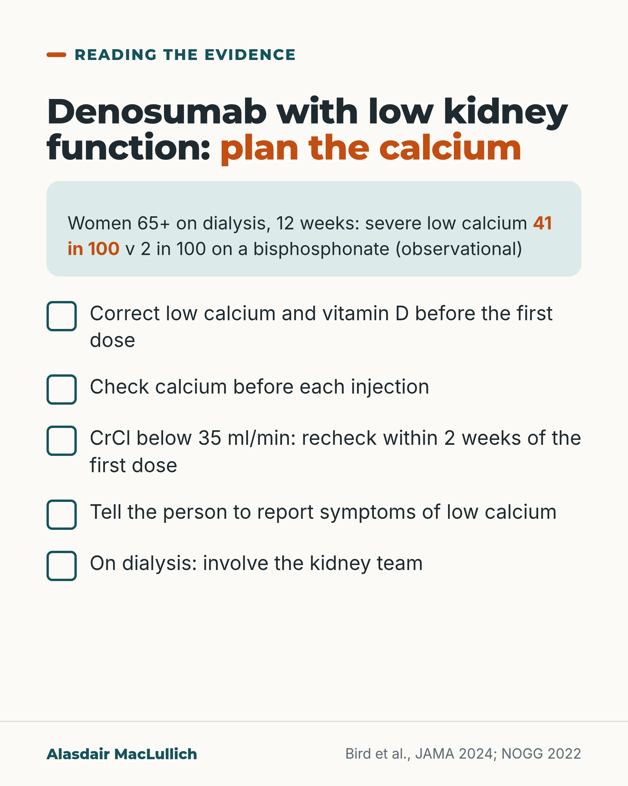

# G036: Denosumab on dialysis: plan the calcium

- Category: C04 Osteoporosis and bone health
- Audience: practitioners
- Series: Reading the evidence
- Post type: evidence_interpretation
- Visual format: checklist
- Status: text text_final, visual final
- Working id: C04-P06 (candidate C04-24)

## Insight

In older women on dialysis, about 41 in 100 starting denosumab had severe low calcium within 12 weeks, against 2 in 100 on a bisphosphonate, so calcium and vitamin D need correcting first and checking afterwards, with the kidney team involved.

## Angle and position

Qualifies the earlier point that low eGFR should not mean no bone treatment: denosumab is often the option, and it needs a calcium plan.

Basis: empirical findings (Bird 2024, observational) plus product information as reported in NOGG; kidney-team involvement is expert commentary

## X (687 characters)

```text
Low kidney function often rules out a bisphosphonate, and denosumab, which the kidneys do not clear, becomes the alternative. It needs a calcium plan.

In a US study of women aged 65 and over on dialysis, about 41 in 100 who started denosumab had a severe drop in blood calcium within 12 weeks, against 2 in 100 who started a bisphosphonate tablet. It was observational, and many drops were found on routine dialysis bloods.

UK product information, as reported by NOGG: correct low calcium and vitamin D first, check calcium before each dose, and recheck within 2 weeks of the first dose if creatinine clearance is below 35 ml/min.

On dialysis, involve the kidney team in the decision.
```

## LinkedIn (1619 characters)

```text
Low kidney function often rules out a bisphosphonate. Zoledronate and risedronate should not be used, and alendronate and ibandronate need caution. Denosumab, which the kidneys do not clear, is often the alternative. That is right, and it needs a qualification.

In a US study of women aged 65 and over on dialysis, about 41 in 100 who started denosumab had a severe drop in blood calcium within 12 weeks, against 2 in 100 who started a bisphosphonate tablet. About 11 in 100 on denosumab had a very severe drop. The study was observational, and much of the low calcium was found on routine monthly dialysis blood tests.

A larger US study looked only at low calcium needing hospital or emergency care. The risk rose as kidney function fell: about 3 in 100 people on dialysis and about 6 in 1,000 with stage 4 or 5 kidney disease not on dialysis, against almost none on bisphosphonate tablets. The two studies used different definitions, so their figures should not be merged.

UK product information, as reported by NOGG 2022:

1. Find and correct low calcium, including from low vitamin D, before the first dose.
2. Check calcium before each injection.
3. With creatinine clearance below 35 ml/min, check calcium again within 2 weeks of the first injection.
4. Tell patients to report symptoms of low calcium.

In people on dialysis, weak bones are often part of a kidney-related bone disorder. Expert commentary advises that the kidney team is part of the decision and the calcium plan.

Low kidney function is a reason to plan bone treatment carefully, with calcium checks written into the plan from the first dose.
```

## Bluesky (281 characters)

```text
In US women 65+ on dialysis, about 41 in 100 starting denosumab had severe low calcium within 12 weeks, v 2 in 100 on a bisphosphonate (observational).

Correct calcium and vitamin D first, check calcium before each dose and within 2 weeks if CrCl <35, and involve the kidney team.
```

## Threads (468 characters)

```text
Denosumab is often the choice when kidneys rule out a bisphosphonate.

In a US study of women aged 65 and over on dialysis, about 41 in 100 starting denosumab had a severe drop in calcium within 12 weeks, against 2 in 100 on a bisphosphonate tablet. Observational, and many drops were found on routine bloods.

Correct calcium and vitamin D first, check calcium before each dose, recheck within 2 weeks if creatinine clearance is under 35, and involve the kidney team.
```

## Source reply

Sources: Bird 2024 JAMA https://pubmed.ncbi.nlm.nih.gov/38241060/ ; Bird 2024 Ann Intern Med https://pubmed.ncbi.nlm.nih.gov/39556837/ ; NOGG 2022 https://pubmed.ncbi.nlm.nih.gov/35378630/

## Visual



Alt text: Checklist for denosumab with low kidney function. In women 65 and over on dialysis, severe low calcium within 12 weeks: 41 in 100 on denosumab against 2 in 100 on a bisphosphonate (observational). Correct calcium and vitamin D first, check calcium before each injection, recheck within 2 weeks if CrCl is below 35, report symptoms, involve the kidney team.

Editable source: `visuals/src/G036.html`

Design instructions: Checklist card with five tick items; the 41 in 100 figure in burnt orange with its population and comparator in a mint panel. Syringe and blood tube icons omitted.

## Sources and verification

- C04-24-a (supported_with_qualification): In older women on dialysis, severe low calcium within 12 weeks of starting denosumab was far more common than with oral bisphosphonates (41.1% vs 2.0%).
  - Source: Bird ST, Smith ER, Gelperin K, Jung TH, Thompson A, Kambhampati R, et al. Severe hypocalcemia with denosumab among older female dialysis-dependent patients. JAMA. 2024;331(6):491-499.; Lloret MJ, Jorgensen HS, Evenepoel P. Denosumab-induced hypocalcemia in patients treated with dialysis: an avoidable complication? Clin Kidney J. 2024;17(3):sfae048.
  - Passage: "Bird JAMA 2024 (Abstract): "Retrospective cohort study of female dialysis-dependent Medicare patients aged 65 years or older who initiated treatment with denosumab or oral bisphosphonates from 2013 to 2020 ... In the unweighted cohorts, 607 of 1523 denosumab-treated patients and 23 of 1281 oral bisphosphonate–treated patients developed severe hypocalcemia. The 12-week weighted cumulative incidence of severe hypocalcemia was 41.1% with denosumab vs 2.0% with oral bisphosphonates (weighted risk difference, 39.1% [95% CI, 36.3%-41.9%] ...). The 12-week weighted cumulative incidence of very severe hypocalcemia was also increased with denosumab (10.9%) vs oral bisphosphonates (0.4%)". Conclusion: "denosumab should be administered after careful patient selection and with plans for frequent monitoring." Lloret 2024: "Life-threatening symptoms (seizures, arrhythmias) occurred in 5.4% of denosumab-treated patients and 1.3% died."" (Bird 2024 JAMA Abstract; Lloret 2024 commentary (secondary report of Bird full text))
- C04-24-b (supported_with_qualification): Across kidney function, the risk of needing emergency care for low calcium after denosumab rose with worsening chronic kidney disease stage and was higher with CKD mineral and bone disorder.
  - Source: Bird ST, Gelperin K, Smith ER, Jung TH, Lyu H, Thompson A, et al. The effect of denosumab on risk for emergently treated hypocalcemia by stage of chronic kidney disease: a target trial emulation. Ann Intern Med. 178(1):29-38. Epub 2024 Nov 19.
  - Passage: ""Risk for emergently treated hypocalcemia with denosumab versus oral bisphosphonates increased with worsening CKD stage ( < 0.001), with greatest risk among dialysis-dependent (DD) patients (3.01% vs. 0.00%; RD, 3.01% [95% CI, 2.27% to 3.77%]) and non-dialysis-dependent (NDD) patients with CKD stages 4 and 5 (0.57% vs. 0.03%; RD, 0.54% [CI, 0.41% to 0.68%]). Among patients with stages 4 and 5 CKD (NDD + DD), denosumab had a greater risk for emergently treated hypocalcemia versus oral bisphosphonates in those with CKD-MBD (1.53% vs. 0.02%; RD, 1.51% [CI, 1.21% to 1.78%]) than in those without CKD-MBD (0.22% vs. 0.03%; RD, 0.19% [CI, 0.08% to 0.31%])."" (Bird 2024/25 Ann Intern Med Abstract, Results)
- C04-24-c (supported): UK product information (as reported in NOGG): check calcium before each denosumab dose; in people predisposed to low calcium (for example creatinine clearance below 35 ml/min) check again within 2 weeks of the first dose; correct low calcium and vitamin D deficiency before starting.
  - Source: Gregson CL, Armstrong DJ, Bowden J, Cooper C, Edwards J, Gittoes NJL, et al. UK clinical guideline for the prevention and treatment of osteoporosis. Arch Osteoporos. 2022;17(1):58.
  - Passage: ""Hypocalcaemia, as a side-effect of denosumab treatment, increases with the degree of renal impairment; patients should be advised to report symptoms of hypocalcaemia. Pre-existing hypocalcaemia must be investigated and, where due to vitamin D deficiency, treated with vitamin D (100,000 to 300,000 IU orally as a loading dose in divided doses) before denosumab treatment is initiated. Adequate intake of calcium and vitamin D is important in all patients, especially those with severe renal impairment. The SPC states all patients should have calcium checked prior to each dose. In patients predisposed to hypocalcaemia (e.g., patients with a creatinine clearance < 35 ml/min), serum calcium levels should also be checked within 2 weeks after the initial dose []."" (NOGG 2022 full text, 'Anti-resorptive drugs: denosumab')
- C04-24-d (supported_with_qualification): In advanced CKD, especially on dialysis, bone fragility may be CKD mineral and bone disorder; high bone turnover raises hypocalcaemia risk; planning with the kidney team is advised.
  - Source: Bird ST, Smith ER, Gelperin K, Jung TH, Thompson A, Kambhampati R, et al. Severe hypocalcemia with denosumab among older female dialysis-dependent patients. JAMA. 2024;331(6):491-499.; Lloret MJ, Jorgensen HS, Evenepoel P. Denosumab-induced hypocalcemia in patients treated with dialysis: an avoidable complication? Clin Kidney J. 2024;17(3):sfae048.; Bird ST, Gelperin K, Smith ER, Jung TH, Lyu H, Thompson A, et al. The effect of denosumab on risk for emergently treated hypocalcemia by stage of chronic kidney disease: a target trial emulation. Ann Intern Med. 178(1):29-38. Epub 2024 Nov 19.
  - Passage: "Bird JAMA 2024 (Abstract, Importance): "Chronic kidney disease-mineral and bone disorder is nearly universal in dialysis-dependent patients, complicating diagnosis and treatment of skeletal fragility." Lloret 2024: "Management of osteoporosis for patients on dialysis should be centred in the dialysis unit because it needs to be integrated in the overall treatment of CKD-MBD []. Knowledge of bone turnover determines therapy choices in this patient population []. A high bone turnover calls for parathyroid hormone (PTH) suppressive therapy, particularly if the plan is to initiate (potent) antiresorptive therapy. High turnover bone disease is a robust risk factor for iatrogenic hypocalcemia ... Coordination of care in the dialysis unit should also include a post-denosumab hypocalcemia prevention regimen, which may involve (transient) increase of the calcium supply via diet, supplements or dialysate, ensuring adequate intake of vitamin D and close monitoring of serum calcium levels."" (Bird 2024 JAMA Abstract (background); Lloret 2024 commentary full text)
- C04-24-f (supported): Denosumab is often considered when kidney function rules out a bisphosphonate: several bisphosphonates are contraindicated or cautioned in severe renal impairment, and denosumab is not cleared by the kidneys.
  - Source: Gregson CL, Armstrong DJ, Bowden J, Cooper C, Edwards J, Gittoes NJL, et al. UK clinical guideline for the prevention and treatment of osteoporosis. Arch Osteoporos. 2022;17(1):58.; Lloret MJ, Jorgensen HS, Evenepoel P. Denosumab-induced hypocalcemia in patients treated with dialysis: an avoidable complication? Clin Kidney J. 2024;17(3):sfae048.
  - Passage: "NOGG: "Zoledronate and risedronate are contraindicated in severe renal impairment (GFR ≤ 35 ml/min for zoledronate and ≤ 30 ml/min for risedronate), whilst alendronate and ibandronate are cautioned against (GFR ≤ 35 ml/min for alendronate and ≤ 30 ml/min for ibandronate)." Lloret 2024: "denosumab rapidly gaining interest in the nephrology community because of its potency and non-renal clearance."" (NOGG 2022 'Contraindications and special precautions'; Lloret 2024)

Verification notes: Bird JAMA 2024 abstract (dialysis women 65+, observational); Bird Ann Intern Med abstract (emergency care definition kept separate); NOGG report of SPC (C04-24-c); bisphosphonate renal limits (C04-24-f); kidney team per Lloret commentary. FDA claim not used.

## Attention and follow potential

Pause: Prescribers who reach for denosumab when eGFR is low.

Gain: A concrete calcium plan and the population the 41% applies to.

Follow: Prescribing detail that changes safety.

## Open issues

None.
