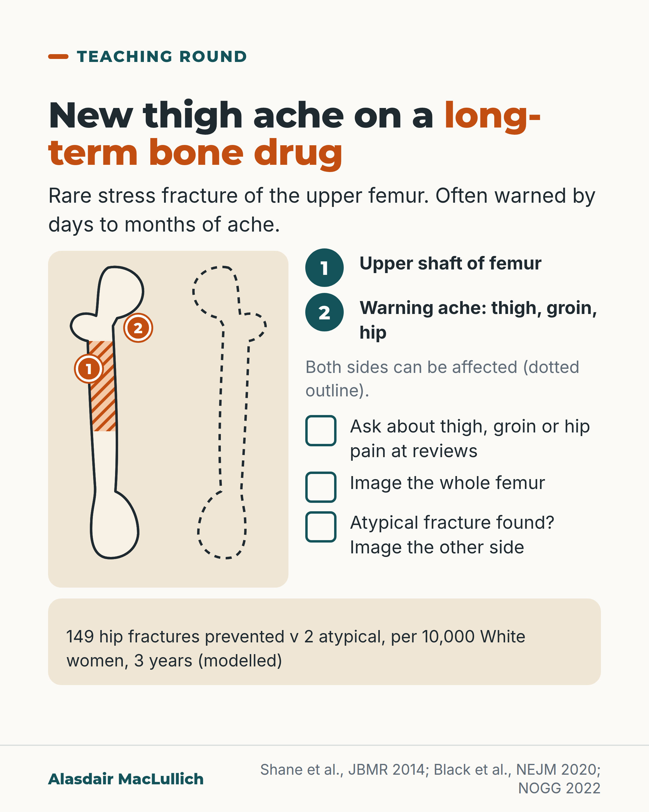

# G037: New thigh ache on a long-term bone drug

- Category: C04 Osteoporosis and bone health
- Audience: practitioners
- Series: Teaching round
- Post type: teaching
- Visual format: diagram with outline drawing
- Status: text text_final, visual final
- Working id: C04-P07 (candidate C04-16)

## Insight

Atypical femoral fractures are rare, but they often give warning thigh, groin or hip pain and are often bilateral, so ask about pain at every review and image the whole femur, then the other side if one is found.

## Angle and position

Posts usually stop at 'rare'; the practical point is that warning pain gives a chance to find an incomplete fracture. Keep the benefit-harm balance in view.

Basis: empirical findings (Shane 2014 case series, Black 2020 modelled estimates) and guideline recommendation (NOGG 2022)

## X (741 characters)

```text
What should a new thigh ache mean in someone on a bisphosphonate for years?

Usually something else: thigh pain is common. But atypical thigh-bone fractures, rare stress fractures of the upper shaft, often give days to months of thigh, groin or hip ache first. In early case series, about 7 in 10 had warning pain and about 1 in 4 had changes in both thighs.

UK guidance: ask about this pain at reviews. If present, image the whole femur (X-ray, isotope scan or MRI). If an atypical fracture is found, image the other side.

The balance stays favourable: modelled estimates give 149 hip fractures prevented for 2 atypical fractures per 10,000 White women with osteoporosis over 3 years (less favourable, but still positive, in Asian women).
```

## LinkedIn (1628 characters)

```text
What should a new thigh ache mean in someone on a bisphosphonate for years?

Usually something else. Thigh pain is common and has many causes. The reason to ask is to find the few people with an early stress fracture.

Atypical thigh-bone fractures are rare stress fractures of the upper shaft of the femur. On bisphosphonates they occur in about 3 to 50 people per 100,000 per year, perhaps nearer 100 per 100,000 after many years of use. They have also been reported with denosumab, and they occur in people on neither drug. The risk rises with years of bisphosphonate treatment and falls soon after stopping.

They often give warning. In the early case series reviewed by an ASBMR task force, about 7 in 10 people had an ache in the thigh, groin or hip for days, weeks or months beforehand, and about 1 in 4 had fractures or X-ray changes in both femurs. Another series found warning pain in about a third, so the proportions vary.

What UK guidance (NOGG 2022) asks:

1. Ask people on these medicines to report unexplained thigh, groin or hip pain, and ask at reviews.
2. If it is present, image the whole length of the femur: X-ray, isotope scan or MRI.
3. If an atypical fracture is found, image the other femur too.

If the X-ray does not explain continuing pain, MRI can show a stress fracture the X-ray misses.

Keep the balance in view. For every 10,000 White women treated for 3 years, researchers estimated about 149 hip fractures prevented and 2 atypical fractures. For Asian women the balance was less favourable, 91 prevented and 8 caused, though still positive. These are modelled estimates, not observed counts.
```

## Bluesky (242 characters)

```text
Atypical thigh-bone fractures on long-term bisphosphonates are rare, but often give weeks of thigh, groin or hip ache first.

Ask about that pain at reviews. If present, image the whole femur; if a fracture is found, image the other side too.
```

## Threads (475 characters)

```text
Most thigh pain in people on long-term bisphosphonates has other causes. But atypical thigh-bone fractures, rare stress fractures, often give days to months of thigh, groin or hip ache first, and can affect both sides.

Ask about this pain at every review. If present, image the whole femur. If an atypical fracture is found, image the other one.

Modelled estimates: 149 hip fractures prevented for 2 atypical fractures per 10,000 White women with osteoporosis over 3 years.
```

## Source reply

Sources: Shane 2014 ASBMR task force https://pubmed.ncbi.nlm.nih.gov/23712442/ ; Black 2020 NEJM https://pubmed.ncbi.nlm.nih.gov/32813950/ ; NOGG 2022 https://pubmed.ncbi.nlm.nih.gov/35378630/

## Visual



Alt text: Line drawing of two thigh bones, the upper shaft of one shaded and marked 1, a numbered mark 2 at the hip for warning ache, the other bone dotted to show both sides can be affected. Ask about thigh, groin or hip pain at reviews; image the whole femur; if found, image the other side. Modelled: 149 hip fractures prevented against 2 atypical per 10,000 White women over 3 years.

Editable source: `visuals/src/G037.html`

Design instructions: Simple outline drawing of both femurs, left upper shaft hatched, right dotted, two numbered pins explained in the key; checklist of three actions; modelled figure labelled. Standing man omitted.

## Sources and verification

- C04-16-a (supported): Atypical femoral fractures are rare stress fractures below the hip or along the thigh-bone shaft, reported with bisphosphonates and denosumab; absolute risk on bisphosphonates is about 3 to 50 per 100,000 person-years, perhaps about 100 per 100,000 with long-term use.
  - Source: Shane E, Burr D, Abrahamsen B, Adler RA, Brown TD, Cheung AM, et al. Atypical subtrochanteric and diaphyseal femoral fractures: second report of a task force of the American Society for Bone and Mineral Research. J Bone Miner Res. 2014;29(1):1-23.; Gregson CL, Armstrong DJ, Bowden J, Cooper C, Edwards J, Gittoes NJL, et al. UK clinical guideline for the prevention and treatment of osteoporosis. Arch Osteoporos. 2022;17(1):58.
  - Passage: "Shane 2014 (Abstract): "Atypical femur fractures (AFFs) located in the subtrochanteric region and diaphysis of the femur have been reported in patients taking BPs and in patients on denosumab, but they also occur in patients with no exposure to these drugs ... This newer evidence suggests that AFFs are stress or insufficiency fractures ... the absolute risk of AFFs in patients on BPs is low, ranging from 3.2 to 50 cases per 100,000 person-years. However, long-term use may be associated with higher risk (∼100 per 100,000 person-years)." NOGG: "the absolute risk was consistently low, ranging between 3.2 and 50 cases/100,000 person-years of exposure [...]. This estimate appeared to double with prolonged duration of BP use (> 3 years, median duration 7 years), and declined with discontinuation"." (Shane 2014 Abstract; NOGG 2022 'Rare adverse effects' section)
- C04-16-b (supported_with_qualification): Many atypical femoral fractures are preceded by days to months of aching thigh, groin or hip pain, and they are often on both sides.
  - Source: Gregson CL, Armstrong DJ, Bowden J, Cooper C, Edwards J, Gittoes NJL, et al. UK clinical guideline for the prevention and treatment of osteoporosis. Arch Osteoporos. 2022;17(1):58.; Shane E, Burr D, Abrahamsen B, Adler RA, Brown TD, Cheung AM, et al. Atypical subtrochanteric and diaphyseal femoral fractures: second report of a task force of the American Society for Bone and Mineral Research. J Bone Miner Res. 2014;29(1):1-23.
  - Passage: "NOGG: "[Atypical femoral fractures] are often bilateral, associated with prodromal pain and tend to heal poorly. Prodromal pain can be felt in the thigh, groin or hip for days, weeks, or months before fracture." Shane 2014 (full-text snippet, section 'AFFs: original case definition and clinical characteristics'): "Approximately 70% of patients had a history of prodromal groin or thigh pain, 28% had bilateral fractures and bilateral radiographic abnormalities, and 26% had delayed healing." Shane 2014 (full-text excerpt, another study reviewed): "A stress fracture of the contralateral femur was present in 40% of AFFs versus 2% of ordinary fractures, and an additional 21% of AFF cases had focal cortical hypertrophy of the contralateral femur. One‐third of women with AFFs had prodromal pain"." (NOGG 2022 'Rare adverse effects' section; Shane 2014 full-text passages via Scite)
- C04-16-c (supported_with_qualification): People on bisphosphonate or denosumab should be told to report unexplained thigh, groin or hip pain; if it occurs, the whole femur should be imaged, and if an atypical fracture is found, the other femur too.
  - Source: Gregson CL, Armstrong DJ, Bowden J, Cooper C, Edwards J, Gittoes NJL, et al. UK clinical guideline for the prevention and treatment of osteoporosis. Arch Osteoporos. 2022;17(1):58.
  - Passage: ""12. During bisphosphonate or denosumab therapy, advise patients to report any unexplained thigh, groin or hip pain and if such symptoms develop, the femur should be imaged (by full-length femur X-ray, isotope scanning or MRI) (). 13. If an AFF is identified, image the contralateral femur ()."" (NOGG 2022 'Rare adverse effects of long-term bisphosphonate and denosumab treatment', Recommendations 12 and 13)
- C04-16-d (supported_with_qualification): MRI can show an early stress fracture; CT if MRI is not possible; an isotope bone scan is less specific.
  - Source: Shane E, Burr D, Abrahamsen B, Adler RA, Brown TD, Cheung AM, et al. Atypical subtrochanteric and diaphyseal femoral fractures: second report of a task force of the American Society for Bone and Mineral Research. J Bone Miner Res. 2014;29(1):1-23.
  - Passage: ""Options for imaging include magnetic resonance imaging (MRI), which could detect a cortical fracture line and associated bone and marrow edema or hyperemia, indicative of a stress fracture. If MRI cannot be performed, computed tomography (CT) could detect the cortical fracture or lucency and associated new‐bone formation. Radionuclide bone scan could detect focal bone and marrow hyperemia but with less specificity than MRI or CT."" (Shane 2014 full text (Scite excerpt), management section)
- C04-16-e (supported_with_qualification): Risk rises with duration, falls rapidly after stopping, is higher in Asian women, and remains small compared with fractures prevented: per 10,000 White women treated for 3 years, 149 hip fractures prevented vs 2 atypical fractures.
  - Source: Black DM, Geiger EJ, Eastell R, Vittinghoff E, Li BH, Ryan DS, et al. Atypical femur fracture risk versus fragility fracture prevention with bisphosphonates. N Engl J Med. 2020;383(8):743-753.
  - Passage: "Full text: "The number of osteoporotic and hip fractures prevented, as compared with the number of bisphosphonate-associated atypical femur fractures that occurred, in 10,000 treated women with osteoporosis ... Among Whites ... after 3 years, there were 2 bisphosphonate-associated atypical fractures as compared with 149 hip fractures prevented and 541 clinical fractures prevented. After 5 years, the respective numbers were 8, 286, and 859 ... At 3 years [Asians], there were 8 bisphosphonate-associated atypical fractures as compared with 91 hip fractures prevented and 330 clinical fractures prevented." Abstract: "Other risk factors included race (hazard ratio for Asians vs. Whites, 4.84 ...), height, weight, and glucocorticoid use. Bisphosphonate discontinuation was associated with a rapid decrease in the risk of atypical fracture." Full text: "Among the 196,129 women, 277 atypical femur fractures occurred (1.74 fractures per 10,000 patient-years)"." (Black 2020 Abstract and Results (risk-benefit analysis), full text)
- C04-16-f (supported_with_qualification): Most thigh pain in people on bisphosphonates is not an atypical fracture, but some is.
  - Source: Shane E, Burr D, Abrahamsen B, Adler RA, Brown TD, Cheung AM, et al. Atypical subtrochanteric and diaphyseal femoral fractures: second report of a task force of the American Society for Bone and Mineral Research. J Bone Miner Res. 2014;29(1):1-23.; Gregson CL, Armstrong DJ, Bowden J, Cooper C, Edwards J, Gittoes NJL, et al. UK clinical guideline for the prevention and treatment of osteoporosis. Arch Osteoporos. 2022;17(1):58.
  - Passage: "Shane 2014 (full-text excerpt describing Powell and colleagues): "All completed a questionnaire that included questions on dental health, thigh pain ... One patient had ONJ and 27 (13.4%) reported thigh pain during the 3‐month audit. Bilateral femoral radiographs obtained for those with thigh pain, revealed four patients (2%) with six AFFs; all were on pamidronate (duration 8 to 22 years) and none were being treated for osteoporosis or Paget's disease."" (Shane 2014 'Update on epidemiology and risk factors' (Scite excerpt))

Verification notes: Shane 2014 full-text passages (70%/28% from case series; another series one-third); rates C04-16-a; NOGG imaging wording used rather than 'X-ray both'; Black 2020 modelled estimates incl. Asian women; most thigh pain other causes (C04-16-f).

## Attention and follow potential

Pause: Prescribers who stop at 'rare' and never ask about thigh pain.

Gain: A question to ask and a clear imaging rule, with the benefit balance.

Follow: Short clinical teaching points for reviews.

## Open issues

None.
