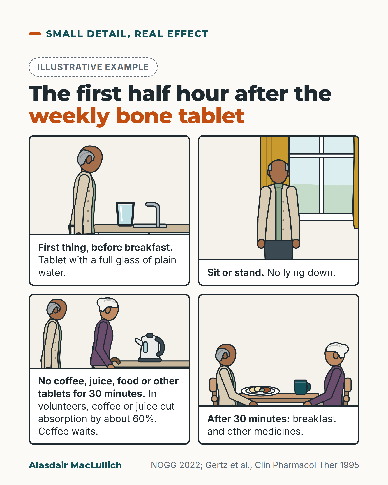

# G038: The first half hour after the weekly bone tablet

- Category: C04 Osteoporosis and bone health
- Audience: public
- Series: Small detail, real effect
- Post type: public_explanation
- Visual format: comic strip
- Status: text text_final, visual final
- Working id: C04-P08 (candidate C04-13)

## Insight

Very little alendronic acid is absorbed even when taken correctly, and coffee, juice or food cut that further, so take it first thing with plain water, stay upright and wait 30 minutes.

## Angle and position

Lead with the instruction; each rule has a reason. Absorption findings, not fracture outcomes.

Basis: guideline instructions (NOGG) and empirical absorption findings in volunteers (Gertz 1995); gullet irritation from case reports

## X (664 characters)

```text
Take the weekly bone tablet first thing, with a full glass of plain water, sitting or standing. Then wait at least 30 minutes before food, other drinks or other tablets, including calcium. Do not lie down.

Each rule has a reason. Less than 1 part in 100 of each alendronic acid tablet is absorbed, even when taken correctly.

In absorption studies in volunteers, taking it with black coffee or orange juice cut the amount absorbed by about 60 per cent. With breakfast, by more than 85 per cent.

The water and staying upright help the tablet pass into the stomach. If swallowing becomes painful or you get new heartburn, stop it and ask your pharmacist or doctor.
```

## LinkedIn (1390 characters)

```text
Take the weekly bone tablet first thing, with a full glass of plain water (about 200 mL), sitting or standing. Then wait at least 30 minutes before any food, any drink other than water, or any other tablets, including calcium. Do not lie down during those 30 minutes.

The leaflet's rules can look fussy. Each one has a reason.

Only a tiny fraction of each alendronic acid tablet is absorbed: less than 1 part in 100, even when it is taken with water on an empty stomach. That figure comes from absorption studies in volunteers.

In those studies, taking the tablet with black coffee or orange juice instead of water cut the amount absorbed by about 60 per cent. Taking it with breakfast, or within 2 hours after breakfast, cut it by more than 85 per cent. These are measures of absorption, not of fractures, but they show how easily a small amount becomes smaller.

Thirty minutes is the minimum, set as a practical compromise. Guidance says at least 30 minutes.

The full glass of water and staying upright help the tablet pass quickly into the stomach. Reports of gullet irritation from alendronic acid were mostly linked with taking it with little water or lying down afterwards. If swallowing becomes painful or you get new heartburn, stop taking it and ask your doctor or pharmacist.

If you are not sure you have the routine right, a community pharmacist can go through it with you.
```

## Bluesky (254 characters)

```text
Weekly bone tablet (alendronic acid): take it first thing with a full glass of plain water, stay upright, and wait 30 minutes before food, drinks or other tablets.

Under 1% is absorbed anyway. In volunteers, coffee or orange juice cut that by about 60%.
```

## Threads (421 characters)

```text
Take the weekly bone tablet first thing with a full glass of plain water, sitting or standing, and wait at least 30 minutes before food, other drinks or other tablets.

Less than 1 part in 100 is absorbed even done right. In volunteer studies, coffee or orange juice cut absorption by about 60 per cent, and breakfast by more than 85.

If swallowing becomes painful or you get new heartburn, stop and ask your pharmacist.
```

## Source reply

Sources: Gertz 1995 https://pubmed.ncbi.nlm.nih.gov/7554702/ ; de Groen 1996 https://pubmed.ncbi.nlm.nih.gov/8793925/ ; NOGG 2022 https://pubmed.ncbi.nlm.nih.gov/35378630/

## Visual



Alt text: Four-panel illustrative comic. An older man takes the weekly bone tablet with a full glass of plain water before breakfast, then stands. His partner, with a walking stick, waits by the kettle: no coffee, juice, food or other tablets for 30 minutes. In volunteers coffee or juice cut absorption by about 60%. After 30 minutes they sit to breakfast.

Editable source: `visuals/src/G038.html`

Design instructions: Four-panel illustrative comic in a kitchen with an older man and his partner (walking stick); no text in drawings; captions beneath; labelled Illustrative example. Panel 2 simplified to a standing figure (newspaper omitted).

## Sources and verification

- C04-13-a (supported): UK guidance says to take alendronic acid after an overnight fast, swallowed whole with a glass of plain water (about 200 mL) while sitting or standing, at least 30 minutes before the first food or drink (other than water), other medicines or supplements including calcium, and not to lie down for 30 minutes afterwards.
  - Source: Gregson CL, Armstrong DJ, Bowden J, Cooper C, Edwards J, Gittoes NJL, et al. UK clinical guideline for the prevention and treatment of osteoporosis. Arch Osteoporos. 2022;17(1):58.
  - Passage: ""Alendronate should be taken after an overnight fast and at least 30 min before the first food or drink (other than water) of the day or any other oral medicinal products or supplementation (including calcium). Tablets should be swallowed whole with a glass of plain water (~ 200 ml) whilst the patient is sitting or standing in an upright position. Patients should not lie down for 30 min after taking the tablet."" (NOGG full text, 'Specific drug options: Anti-resorptive drugs: bisphosphonates' (alendronate))
- C04-13-b (supported_with_qualification): Even when taken correctly, less than 1 in 100 of the alendronate dose is absorbed (0.76% in women, 0.59% in men, fasting with water and food 2 hours later).
  - Source: Gertz BJ, Holland SD, Kline WF, Matuszewski BK, Freeman A, Quan H, et al. Studies of the oral bioavailability of alendronate. Clin Pharmacol Ther. 1995;58(3):288-98.
  - Passage: ""In women, oral bioavailability of alendronate was independent of dose (5 to 80 mg) and averaged (90% confidence interval) 0.76% (0.58, 0.98) when taken with water in the fasting state, followed by a meal 2 hours later. Bioavailability was similar in men [0.59%, (0.43, 0.81)]."" (Abstract)
- C04-13-c (supported_with_qualification): In volunteer absorption studies, black coffee or orange juice taken with the tablet cut absorption by about 60%, and taking it with or up to 2 hours after breakfast cut absorption by more than 85%.
  - Source: Gertz BJ, Holland SD, Kline WF, Matuszewski BK, Freeman A, Quan H, et al. Studies of the oral bioavailability of alendronate. Clin Pharmacol Ther. 1995;58(3):288-98.
  - Passage: ""Taking alendronate either concurrently with or 2 hours after breakfast drastically (> 85%) impaired availability. Black coffee or orange juice alone, when taken with the drug, also reduced bioavailability (approximately 60%)."" (Abstract)
- C04-13-d (supported): Waiting 30 or 60 minutes before breakfast gave about 40% less absorption than waiting 2 hours; the authors set at least 30 minutes as a practical minimum for long-term use.
  - Source: Gertz BJ, Holland SD, Kline WF, Matuszewski BK, Freeman A, Quan H, et al. Studies of the oral bioavailability of alendronate. Clin Pharmacol Ther. 1995;58(3):288-98.
  - Passage: ""Taking alendronate either 60 or 30 minutes before a standardized breakfast reduced bioavailability by 40% relative to the 2-hour wait." ... "A practical dosing recommendation, derived from these findings and reflective of the long-term nature of therapy for a disease such as osteoporosis, is that patients take the drug with water after an overnight fast and at least 30 minutes before any other food or beverage."" (Abstract)
- C04-13-e (supported_with_qualification): Alendronate can irritate the gullet (oesophagus); reported cases were linked with taking it with little or no water, lying down during or after the dose, or carrying on after symptoms began.
  - Source: de Groen PC, Lubbe DF, Hirsch LJ, Daifotis A, Stephenson W, Freedholm D, et al. Esophagitis associated with the use of alendronate. N Engl J Med. 1996;335(14):1016-21.; Gregson CL, Armstrong DJ, Bowden J, Cooper C, Edwards J, Gittoes NJL, et al. UK clinical guideline for the prevention and treatment of osteoporosis. Arch Osteoporos. 2022;17(1):58.
  - Passage: "de Groen: "In patients for whom adequate information was available, esophagitis seemed to be associated with swallowing alendronate with little or no water, lying down during or after ingestion of the tablet, ... continuing to take alendronate after the onset of symptoms, and having preexisting esophageal disorders." ... "Recommendations to reduce the risk of esophagitis include swallowing alendronate with 180 to 240 ml (6 to 8 oz) of water on arising in the morning, remaining upright for at least 30 minutes after swallowing the tablet and until the first food of the day has been ingested, and discontinuing the drug promptly if esophageal symptoms develop." NOGG: "Oral bisphosphonates are contraindicated in people with abnormalities of the oesophagus that delay oesophageal emptying such as stricture or achalasia, and inability to stand or sit upright for at least 30–60 min."" (de Groen abstract (Results; Conclusions); NOGG full text, bisphosphonate contraindications)

Verification notes: Routine: NOGG full text (plain water; tap/mineral/bedtime/missed-dose not used); absorption: Gertz 1995 abstract, volunteer absorption only; gullet irritation: de Groen 1996 case reports, no rate given.

## Attention and follow potential

Pause: People who take the tablet with their morning coffee.

Gain: The routine and the reason behind each step.

Follow: Small practical details that change how medicines work.

## Open issues

None.
