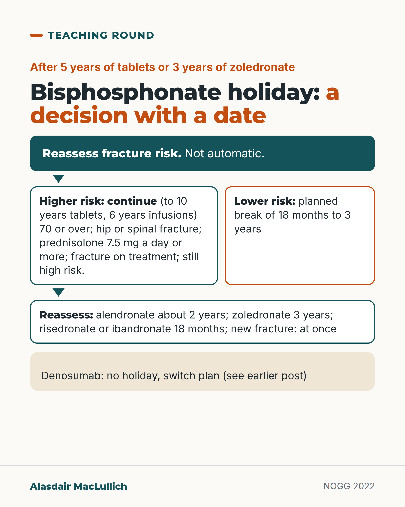

# G039: Bisphosphonate holidays: who pauses, who continues

- Category: C04 Osteoporosis and bone health
- Audience: practitioners
- Series: Teaching round
- Post type: teaching
- Visual format: diagram
- Status: text text_final, visual final
- Working id: C04-P09 (candidate C04-14)

## Insight

After 5 years of tablets or 3 years of zoledronate, reassess: people at higher risk usually continue; lower-risk people can take a planned 18 to 36 month break with a reassessment date.

## Angle and position

'Drug holiday' is a risk-based decision with a date, not an automatic stop at five years.

Basis: guideline recommendation (NOGG 2022, ASBMR) and trial evidence (FLEX, HORIZON extension); position is clinical interpretation

## X (671 characters)

```text
Five years of bisphosphonate tablets, or three of yearly zoledronate, is a review date. UK guidance says a drug holiday is not automatic.

Continue, usually to 10 years of tablets or 6 of infusions, if the person is 70 or over, has had a hip or spinal fracture, takes 7.5 mg of prednisolone a day or more, broke a bone on treatment, or still has a high risk when recalculated.

Lower-risk people can take a planned break of 18 months to 3 years. Reassess at about 2 years for alendronate, 3 for zoledronate, 18 months for risedronate, or at once after a new fracture.

Denosumab is different; see the earlier post on switching.

Write the reassessment date in the record.
```

## LinkedIn (1730 characters)

```text
Five years of bisphosphonate tablets, or three years of yearly zoledronate infusions, is a review date. UK guidance (NOGG 2022) is clear that a drug holiday is not automatic: each person's fracture risk is looked at again and the decision is individual.

Continue, usually for up to 10 years of tablets or 6 years of infusions, if the person:

1. is 70 or over
2. has had a hip or spinal fracture
3. takes steroid tablets at 7.5 mg of prednisolone a day or more
4. has broken a bone during treatment
5. still has a high fracture risk when it is recalculated

For people at lower risk, a planned break of 18 months to 3 years can be offered. Reassess after about 2 years for alendronate, 3 years for zoledronate and 18 months for risedronate or ibandronate. Restart at once if a new fracture happens.

The trials show what continuing buys. In FLEX, women who carried on alendronate for 5 more years had fewer spinal fractures that caused symptoms (about 2 in 100 against 5 in 100), but the same rate of other fractures (19 in 100 in both groups). In the zoledronate extension, 3 more infusions meant fewer spinal fractures seen on X-ray (14 women against 30, of about 616 in each group), with no clear difference in other fractures.

Bisphosphonates stay in bone, so their effect fades slowly after stopping, faster for alendronate than for zoledronate. The rare atypical thigh-bone fracture becomes more likely with more years of treatment and less likely soon after stopping.

None of this applies to denosumab, which needs a switch plan before it stops (see the earlier post).

In practice: make the holiday a named decision, write the reassessment date in the record, and tell the person what would bring treatment back sooner.
```

## Bluesky (275 characters)

```text
After 5 years of bisphosphonate tablets or 3 of zoledronate, reassess; a holiday is not automatic.

Continue if 70+, previous hip or spinal fracture, high-dose steroids, fracture on treatment, or still high risk. Others: planned 18 to 36 month break with a reassessment date.
```

## Threads (401 characters)

```text
Five years of bisphosphonate tablets, or three of zoledronate, is a review date, not an automatic stop.

UK guidance: continue if 70 or over, previous hip or spinal fracture, prednisolone 7.5 mg a day or more, a fracture on treatment, or still high risk. Lower-risk people can take an 18 month to 3 year break.

Denosumab is different (see the earlier post). Write the reassessment date in the record.
```

## Source reply

Sources: NOGG 2022 https://pubmed.ncbi.nlm.nih.gov/35378630/ ; Adler 2016 ASBMR https://pubmed.ncbi.nlm.nih.gov/26350171/ ; Black 2006 FLEX https://pubmed.ncbi.nlm.nih.gov/17190893/ ; Black 2012 https://pubmed.ncbi.nlm.nih.gov/22161728/

## Visual



Alt text: Flow diagram. After 5 years of tablets or 3 of zoledronate, reassess fracture risk; a holiday is not automatic. Higher risk (70 or over, hip or spinal fracture, prednisolone 7.5 mg a day or more, fracture on treatment, still high risk): continue. Lower risk: planned break of 18 months to 3 years, then reassess. Denosumab has no holiday.

Editable source: `visuals/src/G039.html`

Design instructions: Flow: reassess box, two branches (continue, planned break) then reassessment timings; denosumab note at the foot. Branches differ by border colour and label.

## Sources and verification

- C04-14-a (supported): UK guidance plans oral bisphosphonates for at least 5 years and yearly zoledronate infusions for at least 3 years, then a reassessment of fracture risk.
  - Source: Gregson CL, Armstrong DJ, Bowden J, Cooper C, Edwards J, Gittoes NJL, et al. UK clinical guideline for the prevention and treatment of osteoporosis. Arch Osteoporos. 2022;17(1):58.
  - Passage: ""Plan to prescribe oral bisphosphonates (alendronate, ibandronate and risedronate) for at least 5 years and then re-assess fracture risk. Longer durations of treatment, for at least 10 years, are recommended in the following men and women ... Plan to prescribe intravenous bisphosphonate (zoledronate) for at least 3 years and then re-assess fracture risk. Longer durations of treatment, for at least 6 years, are recommended in the following men and women"" (NOGG 2022 full text, 'Duration and monitoring of bisphosphonate treatment', Recommendations)
- C04-14-b (supported_with_qualification): People who usually continue beyond 5 years (oral) or 3 years (IV): aged 70 or over, previous hip or spinal fracture, high-dose steroid tablets, a new fragility fracture during treatment, or fracture risk still above the treatment threshold on reassessment.
  - Source: Gregson CL, Armstrong DJ, Bowden J, Cooper C, Edwards J, Gittoes NJL, et al. UK clinical guideline for the prevention and treatment of osteoporosis. Arch Osteoporos. 2022;17(1):58.; Adler RA, El-Hajj Fuleihan G, Bauer DC, Camacho PM, Clarke BL, Clines GA, et al. Managing osteoporosis in patients on long-term bisphosphonate treatment: report of a task force of the American Society for Bone and Mineral Research. J Bone Miner Res. 2016;31(1):16-35.
  - Passage: "NOGG 2022 summary recommendation 17: "Longer durations of treatment will be needed in those who are older (age ≥ 70 years), have had a hip or vertebral fracture, are on high-dose oral glucocorticoids (≥ 7.5 mg/day of prednisolone or equivalent over 3 months), or have a further fragility fracture during osteoporosis treatment." NOGG recommendation 6: "Fracture risk assessment in patients receiving drug treatment should be performed using FRAX with BMD ... If the FRAX-derived fracture probability exceeds the intervention threshold drug treatment should be continued". NOGG body text: "Post-hoc analyses from the alendronate and zoledronate extension studies suggest that women most likely to benefit from long-term bisphosphonate therapy are those with low hip BMD (T-score < − 2.0 in FLEX and ≤ − 2.5 in HORIZON), those with a prevalent vertebral fracture and those who sustained one or more incident fractures during the initial 3 or 5 years of treatment". Adler 2016 (Abstract): "In women at high risk, for example, older women, those with a low hip T-score or high fracture risk score, those with previous major osteoporotic fracture, or who fracture on therapy, continuation of treatment for up to 10 years (oral) or 6 years (intravenous), with periodic evaluation, should be considered."" (NOGG 2022 summary recommendations (item 17), recommendation 6, and duration section body text; Adler 2016 Abstract)
- C04-14-c (supported): For lower-risk people, a pause of 18 to 36 months can be considered, with reassessment 18 months to 3 years later depending on the drug, and treatment restarted after any new fracture.
  - Source: Gregson CL, Armstrong DJ, Bowden J, Cooper C, Edwards J, Gittoes NJL, et al. UK clinical guideline for the prevention and treatment of osteoporosis. Arch Osteoporos. 2022;17(1):58.; Adler RA, El-Hajj Fuleihan G, Bauer DC, Camacho PM, Clarke BL, Clines GA, et al. Managing osteoporosis in patients on long-term bisphosphonate treatment: report of a task force of the American Society for Bone and Mineral Research. J Bone Miner Res. 2016;31(1):16-35.
  - Passage: "NOGG summary 17: "In lower-risk patients, a temporary treatment pause of 18 to 36 months can be considered after 5 years’ oral bisphosphonate or 3 years’ intravenous bisphosphonate"; summary 21: "Reassess fracture risk 18 months to 3 years after pausing drug treatment." NOGG recommendations: "If a new fracture occurs after bisphosphonate treatment is discontinued, reassess using FRAX and restart treatment"; "If bisphosphonate treatment is discontinued and no new fracture occurs, reassess using FRAX after 18 months for risedronate and ibandronate, 2 years for alendronate, and 3 years for zoledronate to inform whether treatment should be restarted". Adler 2016: "For women not at high fracture risk after 3 to 5 years of BP treatment, a drug holiday of 2 to 3 years can be considered."" (NOGG 2022 summary recommendations 17 and 21; duration recommendations; Adler 2016 Abstract)
- C04-14-d (supported): UK guidance does not support routine drug holidays; the decision is individual.
  - Source: Gregson CL, Armstrong DJ, Bowden J, Cooper C, Edwards J, Gittoes NJL, et al. UK clinical guideline for the prevention and treatment of osteoporosis. Arch Osteoporos. 2022;17(1):58.
  - Passage: ""Stopping osteoporosis treatment, be it with bisphosphonate or denosumab, is associated with an increased risk of fragility fracture, such that routine cessation of anti-resorptive therapy (so-called drug holidays) is not supported by a review of the evidence"; "Treatment review in patients taking bisphosphonates is therefore critical [] and each patient must be assessed individually to assess relative risks and benefits; there is no standard policy for ‘all patients’"" (NOGG 2022 'Reassessment of fracture risk' and duration sections)
- C04-14-e (supported_with_qualification): In FLEX, women who continued alendronate beyond 5 years had fewer clinical spinal fractures than those who stopped, but no difference in non-spinal fractures.
  - Source: Black DM, Schwartz AV, Ensrud KE, Cauley JA, Levis S, Quandt SA, et al. Effects of continuing or stopping alendronate after 5 years of treatment: the Fracture Intervention Trial Long-term Extension (FLEX): a randomized trial. JAMA. 2006;296(24):2927-38.
  - Passage: ""After 5 years, the cumulative risk of nonvertebral fractures (RR, 1.00; 95% CI, 0.76-1.32) was not significantly different between those continuing (19%) and discontinuing (18.9%) alendronate. Among those who continued, there was a significantly lower risk of clinically recognized vertebral fractures (5.3% for placebo and 2.4% for alendronate; RR, 0.45; 95% CI, 0.24-0.85) but no significant reduction in morphometric vertebral fractures (11.3% for placebo and 9.8% for alendronate; RR, 0.86; 95% CI, 0.60-1.22)." Also: "switching to placebo for 5 years resulted in declines in BMD ... but mean levels remained at or above pretreatment levels 10 years earlier."" (FLEX Abstract, Results)
- C04-14-f (supported_with_qualification): In the HORIZON extension, 6 versus 3 years of zoledronic acid reduced spinal fractures seen on X-ray, with no difference in other fractures.
  - Source: Black DM, Reid IR, Boonen S, Bucci-Rechtweg C, Cauley JA, Cosman F, et al. The effect of 3 versus 6 years of zoledronic acid treatment of osteoporosis: a randomized extension to the HORIZON-Pivotal Fracture Trial (PFT). J Bone Miner Res. 2012;27(2):243-54.
  - Passage: ""1233 postmenopausal women who received ZOL for 3 years in the core study were randomized to 3 additional years of ZOL (Z6, n = 616) or placebo (Z3P3, n = 617) ... New morphometric vertebral fractures were lower in the Z6 (n = 14) versus Z3P3 (n = 30) group (odds ratio = 0.51; p = 0.035), whereas other fractures were not different." Conclusion: "after 3 years of annual ZOL, many patients may discontinue therapy up to 3 years. However, vertebral fracture reductions suggest that those at high fracture risk, particularly vertebral fracture, may benefit by continued treatment."" (HORIZON-PFT extension Abstract)
- C04-14-g (supported): Bisphosphonates stay in bone, so some benefit persists after stopping.
  - Source: Gregson CL, Armstrong DJ, Bowden J, Cooper C, Edwards J, Gittoes NJL, et al. UK clinical guideline for the prevention and treatment of osteoporosis. Arch Osteoporos. 2022;17(1):58.; Black DM, Reid IR, Boonen S, Bucci-Rechtweg C, Cauley JA, Cosman F, et al. The effect of 3 versus 6 years of zoledronic acid treatment of osteoporosis: a randomized extension to the HORIZON-Pivotal Fracture Trial (PFT). J Bone Miner Res. 2012;27(2):243-54.
  - Passage: "NOGG: "Bisphosphonates are retained the long term in bone allowing the beneficial effects to persist for some time after cessation of treatment administration." HORIZON extension: "Small differences in bone density and markers in those who continued versus those who stopped treatment suggest residual effects". NOGG: "Withdrawal of bisphosphonate treatment is associated with decreases in BMD and increased bone turnover after 2–3 years for alendronate [...], and 1–2 years for ibandronate and risedronate [...]. In the case of zoledronate, withdrawal after 3 years’ treatment is associated with only a small decrease in BMD after a further 3 years without treatment [...]. Comparison between the offset of alendronate and zoledronate at 3 years showed alendronate-treated patients had greater reductions in total hip BMD and greater rises in PINP, despite a longer treatment exposure with alendronate, supporting a more rapid offset of drug effect than with zoledronate"." (NOGG duration section; HORIZON extension Abstract)
- C04-14-h (supported_with_qualification): The risk of atypical thigh-bone fracture rises with years of bisphosphonate use and falls quickly after stopping.
  - Source: Black DM, Geiger EJ, Eastell R, Vittinghoff E, Li BH, Ryan DS, et al. Atypical femur fracture risk versus fragility fracture prevention with bisphosphonates. N Engl J Med. 2020;383(8):743-753.
  - Passage: "Abstract: "The risk of atypical femur fracture increased with longer duration of bisphosphonate use and rapidly decreased after bisphosphonate discontinuation." Full text: "Rates of atypical fractures decreased with time since bisphosphonate discontinuation (4.50 per 10,000 person-years among current users [including ≤3 months since discontinuation], 1.81 per 10,000 person-years at >3 months to 15 months since discontinuation, and approximately 0.50 per 10,000 person-years at >15 months after discontinuation)."" (Black 2020 Abstract; Results (full text))
- C04-14-i (supported): Denosumab has no drug holiday: stopping it without switching leads to rapid bone loss and more multiple spinal fractures (refer to the C04-07 post).
  - Source: Cummings SR, Ferrari S, Eastell R, Gilchrist N, Jensen JB, McClung M, et al. Vertebral fractures after discontinuation of denosumab: a post hoc analysis of the randomized placebo-controlled FREEDOM trial and its extension. J Bone Miner Res. 2018;33(2):190-198.; Gregson CL, Armstrong DJ, Bowden J, Cooper C, Edwards J, Gittoes NJL, et al. UK clinical guideline for the prevention and treatment of osteoporosis. Arch Osteoporos. 2022;17(1):58.; Tsourdi E, Langdahl B, Cohen-Solal M, Aubry-Rozier B, Eriksen EF, Guanabens N, et al. Discontinuation of denosumab therapy for osteoporosis: a systematic review and position statement by ECTS. Bone. 2017;105:11-17.
  - Passage: "NOGG: "Denosumab cessation leads to rapid reductions in BMD and elevations in bone turnover to levels above those seen before treatment initiation"; ECTS 2017: "denosumab should not be stopped without considering alternative treatment in order to prevent rapid BMD loss and a potential rebound in vertebral fracture risk."" (NOGG denosumab section; ECTS 2017 Abstract)

Verification notes: NOGG 2022 full text for criteria and intervals (hip T-score threshold not used); FLEX and HORIZON extension abstracts with qualifications; Black 2020 for AFF offset. Denosumab one clause referring to C04-07 post, not the ending.

## Attention and follow potential

Pause: Prescribers who stop every bisphosphonate at five years.

Gain: The UK continuation criteria and reassessment intervals in one place.

Follow: Series invitation included on LinkedIn (Teaching round).

## Open issues

None.
