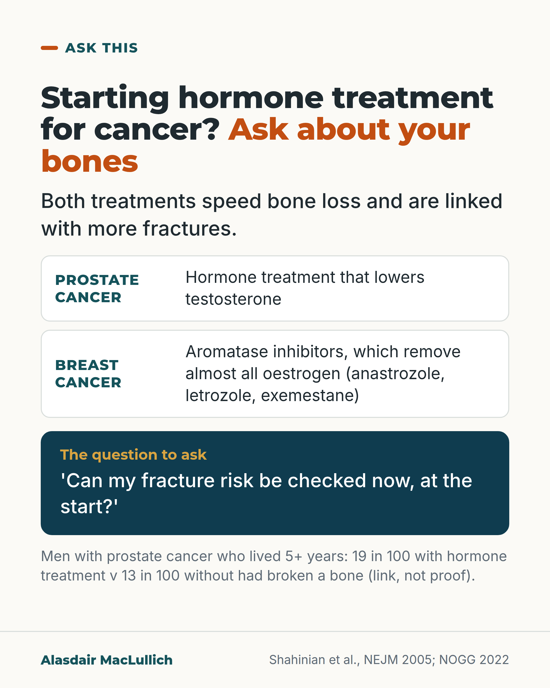

# G040: Hormone treatment for cancer: ask about your bones

- Category: C04 Osteoporosis and bone health
- Audience: public
- Series: Ask this
- Post type: decision_support
- Visual format: question card
- Status: text text_final, visual final
- Working id: C04-P10 (candidate C04-22)

## Insight

Hormone treatment for prostate cancer and aromatase inhibitors for breast cancer speed bone loss and are linked with more fractures, so ask for a fracture risk check when treatment starts.

## Angle and position

Cancer care concentrates on the cancer; bone loss from hormone treatment is predictable and can be assessed early. Reaches men.

Basis: empirical findings (Shahinian 2005 observational; NOGG summaries) plus UK guidance and consensus; the 'ask' is practical advice

## X (739 characters)

```text
If you are a man starting long-term hormone treatment for prostate cancer, ask about your bones at the start.

Treatment that lowers testosterone thins bone fastest in the first 6 to 12 months. In US records, men who lived at least 5 years were compared. About 19 in 100 who had hormone treatment had broken a bone, against about 13 in 100 who did not. That study shows a link, not proof.

Women taking aromatase inhibitors for breast cancer (anastrozole, letrozole, exemestane) have the same question. These drugs remove almost all oestrogen. They also speed bone loss and are linked with more fractures.

UK guidance says both groups should have their fracture risk checked when treatment starts. If nobody has mentioned your bones, ask.
```

## LinkedIn (1726 characters)

```text
If you are a man starting long-term hormone treatment for prostate cancer, ask about your bones at the start.

Treatment that lowers testosterone thins bone fastest in the first 6 to 12 months. That is why the first appointments are the time to ask.

In US records of men with prostate cancer, among men who lived at least 5 years after diagnosis, about 19 in 100 who had hormone treatment had broken a bone, compared with about 13 in 100 who did not. The study was observational, so it shows a link, and men who had more doses had more fractures. Across 16 studies of more than half a million men, the link was consistent.

Women have the same question to ask. Aromatase inhibitors for breast cancer (anastrozole, letrozole, exemestane) work by removing almost all oestrogen, and they speed up bone loss. Women taking them lose on average 1 to 3 per cent of bone density a year and have more fractures than women not taking them. Tamoxifen has not been found to thin bone after the menopause.

What UK guidance says:

1. Every woman starting an aromatase inhibitor should have her fracture risk checked, with a bone density scan where practical.
2. Every man starting long-term hormone treatment for prostate cancer should have his fracture risk worked out, with a scan where possible.

UK specialists writing in 2020 said bone health was often not well managed in men on this treatment.

If the check shows a high risk, bone medicines can stop the thinning. In women on aromatase inhibitors, some have been shown to prevent fractures. In men the fracture evidence is thinner, but the bone loss can be prevented.

If you are starting one of these treatments and nobody has mentioned your bones, ask for a fracture risk check.
```

## Bluesky (259 characters)

```text
Starting hormone treatment for prostate cancer, or an aromatase inhibitor for breast cancer? Both speed bone loss and are linked with more fractures.

UK guidance says your fracture risk should be checked at the start. If nobody has mentioned your bones, ask.
```

## Threads (467 characters)

```text
Men starting long-term hormone treatment for prostate cancer lose bone fastest in the first 6 to 12 months. In US records, among men who lived at least 5 years, 19 in 100 who had hormone treatment had broken a bone, against 13 in 100 who did not. That is a link, not proof.

Aromatase inhibitors for breast cancer remove almost all oestrogen and also speed bone loss.

UK guidance: a fracture risk check when treatment starts. If nobody has mentioned your bones, ask.
```

## Source reply

Sources: Shahinian 2005 https://pubmed.ncbi.nlm.nih.gov/15647578/ ; Brown 2020 https://pubmed.ncbi.nlm.nih.gov/32995252/ ; NOGG 2022 https://pubmed.ncbi.nlm.nih.gov/35378630/ ; Hadji 2017 https://pubmed.ncbi.nlm.nih.gov/28413771/

## Visual



Alt text: Question card. Hormone treatment for prostate cancer and aromatase inhibitors for breast cancer both speed bone loss. Suggested question: can my fracture risk be checked now, at the start? In men with prostate cancer who lived 5 or more years, 19 in 100 on hormone treatment had broken a bone against 13 in 100 without, a link not proof.

Editable source: `visuals/src/G040.html`

Design instructions: Question card: two comparison rows, the suggested question in a deep teal panel (a suggested question, not a quotation), measured result in small text. Clinic drawing from the brief omitted.

## Sources and verification

- C04-22-a (supported_with_qualification): In US registry and Medicare records of 50,613 men with prostate cancer, among men who survived at least 5 years, 19.4% of those given androgen deprivation therapy had a fracture compared with 12.6% of those not given it; the study is observational.
  - Source: Shahinian VB, Kuo YF, Freeman JL, Goodwin JS. Risk of fracture after androgen deprivation for prostate cancer. N Engl J Med. 2005;352(2):154-64.
  - Passage: ""We studied the records of 50,613 men who were listed in the linked database of the Surveillance, Epidemiology, and End Results program and Medicare as having received a diagnosis of prostate cancer in the period from 1992 through 1997." ... "Of men surviving at least five years after diagnosis, 19.4 percent of those who received androgen-deprivation therapy had a fracture, as compared with 12.6 percent of those not receiving androgen-deprivation therapy (P<0.001). In the Cox proportional-hazards analyses, adjusted for characteristics of the patient and the tumor, there was a statistically significant relation between the number of doses of gonadotropin-releasing hormone received during the 12 months after diagnosis and the subsequent risk of fracture."" (Abstract (Methods; Results))
- C04-22-b (supported): A 2021 meta-analysis of 16 cohort studies (519,168 men) found androgen deprivation therapy was linked with higher fracture risk (odds ratio 1.39), with moderate-certainty evidence.
  - Source: Wu CC, Chen PY, Wang SW, Tsai MH, Wang YCL, Tai CL, et al. Risk of fracture during androgen deprivation therapy among patients with prostate cancer: a systematic review and meta-analysis of cohort studies. Front Pharmacol. 2021;12:652979.
  - Passage: ""Sixteen eligible studies were included, and total population was 519,168 men. ADT use is associated with increasing fracture risk (OR, 1.39; 95% CI, 1.26-1.52) and fracture requiring hospitalization (OR, 1.55; 95% CI, 1.29-1.88)." ... "The GRADE level of evidence was moderate for any fracture and low for fracture requiring hospitalization."" (Abstract (Results))
- C04-22-c (supported): UK guidance says bone loss from androgen deprivation therapy is rapid in the first 6 to 12 months, fracture risk is raised in the 5 years after starting, and aromatase inhibitors and androgen deprivation are among medicines known to increase hip fracture risk.
  - Source: Gregson CL, Armstrong DJ, Bowden J, Cooper C, Edwards J, Gittoes NJL, et al. UK clinical guideline for the prevention and treatment of osteoporosis. Arch Osteoporos. 2022;17(1):58.
  - Passage: ""Osteoporosis caused by ADT is associated with rapid loss of BMD within 6–12 months of initiation of ADT []; (). There is a significant increase in fracture risk in men with prostate cancer in the 5 years following the initiation of ADT when compared to those not receiving ADT" ... "In addition to glucocorticoids, several medications are known to increase hip fracture risk including thyroid hormone excess, aromatase inhibitors for the treatment of breast cancer and androgen deprivation for the treatment of prostate cancer"" (NOGG full text, 'Men receiving androgen-deprivation therapy'; 'Glucocorticoid-induced osteoporosis' section)
- C04-22-d (supported): Aromatase inhibitors (anastrozole, letrozole, exemestane) speed up bone loss (on average 1 to 3% a year in postmenopausal women) and are linked with more fractures; the excess risk is seen mainly during treatment.
  - Source: Gregson CL, Armstrong DJ, Bowden J, Cooper C, Edwards J, Gittoes NJL, et al. UK clinical guideline for the prevention and treatment of osteoporosis. Arch Osteoporos. 2022;17(1):58.; Hadji P, Aapro M, Al-Dagri N, Alokail M, Biver E, Body JJ, et al. Management of aromatase inhibitor-associated bone loss (AIBL) in women with hormone-sensitive breast cancer: an updated joint position statement of the IOF, CABS, ECTS, IEG, ESCEO, IMS, and SIOG. J Bone Oncol. 2025;53:100694.; Tseng OL, Spinelli JJ, Gotay CC, Ho WY, McBride ML, Dawes MG. Aromatase inhibitors are associated with a higher fracture risk than tamoxifen: a systematic review and meta-analysis. Ther Adv Musculoskelet Dis. 2018;10(4):71-90.
  - Passage: "NOGG: "The use of aromatase inhibitors (AI) in postmenopausal women induces bone loss at an average rate of 1–3% per year at sites rich in trabecular bone." Hadji 2025: "AI, which are now more commonly prescribed due to improved anticancer efficacy, are associated with a higher fracture risk than tamoxifen due to their ability to almost completely suppress circulating and tissue estrogen levels, and are known to accelerate bone loss and increase fracture risk in this population beyond that seen with natural menopause" ... "A meta-analysis of 30 randomized controlled trials (RCTs) including 117,974 breast cancer patients found a significantly higher incidence of osteoporotic fractures, in AI users versus those not treated with AI (controls), particularly for vertebral fractures []. The relative risk (RR) for hip fractures and non-vertebral fractures was 1.18 (p < 0.001 in each case) versus controls, while the RR for vertebral fractures was 1.84 (p < 0.001)." Tseng: "Compared with the tamoxifen group, aromatase inhibitor-associated fracture risk increased by 33% (pooled RR 1.33; 95% CI 1.21-1.47) during the tamoxifen/aromatase inhibitor treatment period, but did not increase (pooled RR 0.99; 95% CI 0.72-1.37) during the post-tamoxifen/aromatase inhibitor treatment period."" (NOGG full text, 'Women receiving aromatase inhibitor therapy'; Hadji 2025 full text section 3.1; Tseng abstract)
- C04-22-e (supported): Tamoxifen, the other common hormone tablet for breast cancer, has not been found to harm bone or raise fracture risk in postmenopausal women.
  - Source: Hadji P, Aapro M, Al-Dagri N, Alokail M, Biver E, Body JJ, et al. Management of aromatase inhibitor-associated bone loss (AIBL) in women with hormone-sensitive breast cancer: an updated joint position statement of the IOF, CABS, ECTS, IEG, ESCEO, IMS, and SIOG. J Bone Oncol. 2025;53:100694.; Tseng OL, Spinelli JJ, Gotay CC, Ho WY, McBride ML, Dawes MG. Aromatase inhibitors are associated with a higher fracture risk than tamoxifen: a systematic review and meta-analysis. Ther Adv Musculoskelet Dis. 2018;10(4):71-90.
  - Passage: "Hadji 2025: "In contrast to the case in premenopausal women, tamoxifen has not been found to have a negative impact on BMD or fracture risk in postmenopausal women []. Indeed, results of a systematic review and meta-analysis suggest it may potentially preserve bone mass in postmenopausal women" Tseng: "Similar fracture risk was observed in women treated and not treated with tamoxifen [pooled risk ratio (RR) 0.95; 95% confidence interval (CI) 0.84-1.07]."" (Hadji 2025 full text section 3.1; Tseng abstract)
- C04-22-f (supported): UK guidance says all women starting an aromatase inhibitor should have their fracture risk assessed (FRAX, counting the AI as a cause of osteoporosis, with a bone density scan where practical), and international position statements say every woman starting or on an AI should be told of the risk and have it assessed.
  - Source: Gregson CL, Armstrong DJ, Bowden J, Cooper C, Edwards J, Gittoes NJL, et al. UK clinical guideline for the prevention and treatment of osteoporosis. Arch Osteoporos. 2022;17(1):58.; Hadji P, Aapro MS, Body JJ, Gnant M, Brandi ML, Reginster JY, et al. Management of aromatase inhibitor-associated bone loss (AIBL) in postmenopausal women with hormone sensitive breast cancer: joint position statement of the IOF, CABS, ECTS, IEG, ESCEO, IMS, and SIOG. J Bone Oncol. 2017;7:1-12.; Hadji P, Aapro M, Al-Dagri N, Alokail M, Biver E, Body JJ, et al. Management of aromatase inhibitor-associated bone loss (AIBL) in women with hormone-sensitive breast cancer: an updated joint position statement of the IOF, CABS, ECTS, IEG, ESCEO, IMS, and SIOG. J Bone Oncol. 2025;53:100694.
  - Passage: "NOGG recommendation 24: "All women starting aromatase inhibitor (AI) therapy should have their fracture risk assessed using FRAX, considering AI use as a secondary cause of osteoporosis, including BMD measurement where practical" Hadji 2017: "In all patients initiating AI treatment, fracture risk should be assessed and recommendation with regard to exercise and calcium/vitamin D supplementation given." Hadji 2025: "All women receiving AI treatment should be informed of this significantly increased risk and its consequences and have their individual fracture risk evaluated to determine an appropriate management strategy."" (NOGG full text, recommendation 24; Hadji 2017 abstract (Conclusions); Hadji 2025 full text, Conclusions)
- C04-22-g (supported): UK consensus guidance, supported by NOGG, says all men starting or continuing long-term androgen deprivation therapy should get bone health advice and have fracture risk calculated with FRAX (with a bone density scan where feasible), repeated after 12 to 18 months if near the treatment threshold.
  - Source: Brown JE, Handforth C, Compston JE, Cross W, Parr N, Selby P, et al. Guidance for the assessment and management of prostate cancer treatment-induced bone loss. A consensus position statement from an expert group. J Bone Oncol. 2020;25:100311.; Gregson CL, Armstrong DJ, Bowden J, Cooper C, Edwards J, Gittoes NJL, et al. UK clinical guideline for the prevention and treatment of osteoporosis. Arch Osteoporos. 2022;17(1):58.
  - Passage: "Brown 2020: "All men starting or continuing long-term ADT should receive lifestyle advice regarding bone health. Calcium/vitamin D supplementation should be offered if required. Fracture risk should be calculated (using the FRAX® tool), with BMD assessment included where feasible." ... "Those near to, but below an intervention threshold, and patients going on to additional systemic therapies (particularly those requiring glucocorticoids), should have FRAX® (including BMD) repeated after 12-18 months." NOGG: "The NOGG supports the recent guideline published by Brown et al. 2020" ... "A recent UK consensus statement on prostate cancer treatment-induced bone loss concluded that fracture risk should be calculated using FRAX, considering ADT use as a secondary cause of osteoporosis, and including BMD where available and practical."" (Brown 2020 abstract (Results/recommendations); NOGG full text, 'Men receiving androgen-deprivation therapy')
- C04-22-h (supported_with_qualification): UK expert guidance in 2020 judged that fracture risk from prostate cancer treatment was not well managed and that prostate cancer guidelines lacked specific bone health recommendations.
  - Source: Brown JE, Handforth C, Compston JE, Cross W, Parr N, Selby P, et al. Guidance for the assessment and management of prostate cancer treatment-induced bone loss. A consensus position statement from an expert group. J Bone Oncol. 2020;25:100311.
  - Passage: ""In this context, careful consideration of skeletal health is required to reduce the risk of treatment-related fragility fractures and their associated morbidity and mortality. This risk is currently not well-managed." ... "Current PC guidelines lack specific recommendations for optimising bone health."" (Abstract (Background))
- C04-22-i (supported_with_qualification): If fracture risk is high, treatment helps: bisphosphonates and denosumab prevent bone loss in men on androgen deprivation therapy (fracture reduction shown for denosumab in one trial, not clearly for bisphosphonates), and in women on aromatase inhibitors denosumab and risedronate have been shown to reduce fracture risk.
  - Source: Gregson CL, Armstrong DJ, Bowden J, Cooper C, Edwards J, Gittoes NJL, et al. UK clinical guideline for the prevention and treatment of osteoporosis. Arch Osteoporos. 2022;17(1):58.; Bassatne A, El Meski N, Horanieh R, Andary F, Rhayem C, Mukherji D, et al. Benefits and harms of antiresorptive therapy in men with non-metastatic prostate cancer on androgen deprivation therapy: a systematic review and meta-analysis of randomized controlled trials. Metabolism. 2026;182:156668.
  - Passage: "NOGG: "Bisphosphonates and denosumab are effective drug treatments for preventing BMD loss in men with prostate cancer taking ADT, although effects on fracture risk have not been demonstrated." ... "Denosumab and zoledronate both lead to significant gains in BMD at the spine and hip in postmenopausal women with breast cancer receiving AI, and both denosumab and risedronate have been shown to reduce fracture risk" Bassatne 2026: "Oral bisphosphonates had no effect on fracture incidence at 12-months (RR = 0.57; 95%CI[0.10, 3.23]; very low certainty). Intravenous bisphosphonates had no effect on the risk of morphometric vertebral fractures at 36-months (RR = 1.06; 95%CI[0.57,1.98]; very low certainty). One trial showed that denosumab probably results in a large reduction in new morphometric vertebral fracture risk at 12 (RR = 0.15), 24 (RR = 0.31) and 36-months (RR = 0.38; 95%CI[0.19-0.78]). Treatment with bisphosphonates or denosumab for 12-months increased BMD at the hip (+1.5 to +3.9%) and lumbar spine (+4.0 to +6.8%)"" (NOGG full text, ADT and AI sections; Bassatne abstract (Results))

Verification notes: Shahinian 2005 (crude subgroup, 'linked with'); Wu 2021 consistency without number; NOGG for rapid early loss, AI bone loss, AI assessment; Brown 2020 consensus via NOGG; tamoxifen statement limited to after menopause; NICE NG131 not used.

## Attention and follow potential

Pause: Men and women starting cancer hormone treatment who never thought about bones.

Gain: One question to ask at the right time.

Follow: Questions people can ask in appointments.

## Open issues

None.
