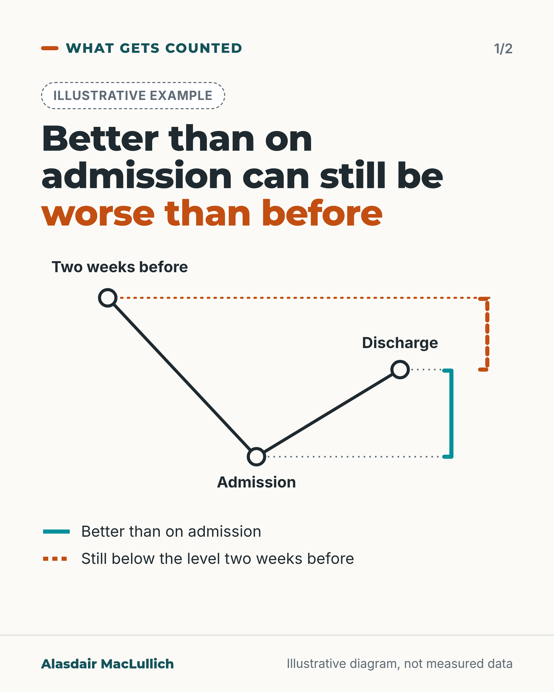
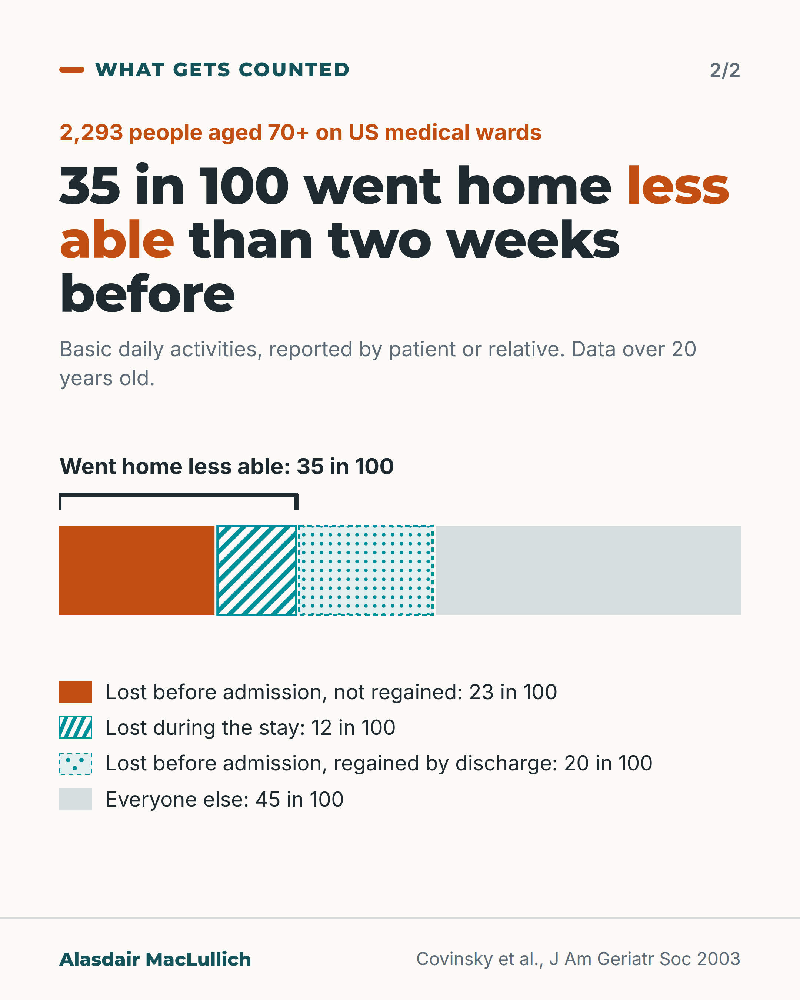

# G041: Better than on admission, worse than before

- Category: C05 Frailty, function and recovery
- Audience: practitioners
- Series: What gets counted
- Post type: teaching
- Visual format: carousel (timeline diagram, then chart)
- Status: text text_final, visual final
- Working id: C05-P01 (candidate C05-01)

## Insight

Measuring recovery from the day of admission hides loss of function that happened before the person arrived. In one large cohort, about 1 in 3 older medical inpatients went home less able than two weeks before admission, mostly because of loss before arrival that was not regained.

## Angle and position

Progress measured from the worst day looks like recovery; the useful reference point is the person two weeks before the illness. Position (judgement): record the pre-illness level and state the gap at discharge.

Basis: mixed: cohort findings on decline (empirical); the recording habit is clinical judgement

## X (885 characters)

```text
A ward note saying "improving since admission" can be true while the person goes home less able than before they fell ill.

A US study followed 2,293 people aged 70 and over on medical wards. 35 in 100 left hospital less able than they were two weeks before admission. The five tasks were washing, dressing, eating, getting in and out of bed and using the toilet.

23 in 100 had already declined in those tasks before they arrived and had not regained them by discharge. 12 in 100 declined during the stay. Together that makes the 35 in 100.

The data are over 20 years old. A 2020 review of studies in adults aged 65 and over found about 3 in 10 lost independence in basic daily activities after an acute hospital stay. That share changed little by the year the study began.

We should record the level two weeks before the illness, and say at discharge how far the person is from it.
```

## LinkedIn (2031 characters)

```text
A ward note saying "improving since admission" can be true while the person goes home less able than before they became ill.

A note that measures from the day of admission leaves out loss that happened before the person arrived.

A US study followed 2,293 people aged 70 and over admitted to medical wards (Covinsky 2003). 35 in 100 went home less able in basic daily activities than they had been two weeks before admission. The activities were washing, dressing, eating, getting in and out of bed and using the toilet.

Most of that loss came before the ward. 23 in 100 had declined before arrival and had not recovered by discharge. 12 in 100 declined during the stay. That makes the 35 in 100 (23 plus 12). A further 20 in 100 had declined before admission but had recovered by discharge, so they are not in the 35.

The older the person, the more often they went home less able than before the illness. The share was 23 in 100 at 70 to 74 and 63 in 100 at 90 and over (not adjusted for other differences).

A 2020 review (Loyd, J Am Med Dir Assoc) pooled studies of 7,375 adults aged 65 and over. About 3 in 10 lost independence in basic daily activities after an acute hospital stay, a similar share to the 35 in 100 above. The share changed little by the year the study began. Results varied widely between studies.

Limits: function was reported by patients or relatives, the five activities do not include walking, and the Covinsky data are more than 20 years old.

In a 2001 study of 525 medical patients aged 70 and over at one US centre, most paper hospital records did not say whether the person could manage individual daily tasks before admission. Walking was the exception. Electronic records may differ.

No trial has tested whether recording the level before the illness improves outcomes. Even so, we should record what the person could do two weeks before the illness, and write at discharge how far they are from that level. A line such as "Two weeks before: X. Now: Y." gives the next team a reference point.
```

## Bluesky (287 characters)

```text
A US study followed 2,293 medical inpatients aged 70 and over (data over 20 years old). 35 in 100 went home less able to wash or dress than two weeks before admission. 23 in 100 had declined before arrival and not regained it by discharge.

We should record the level before the illness.
```

## Threads (495 characters)

```text
"Improving since admission" can still mean worse than before the illness.

A US study followed 2,293 medical inpatients aged 70 and over. 35 in 100 went home less able to wash or dress than two weeks before admission. 23 in 100 had declined before arriving and had not regained it by discharge.

The data are over 20 years old, but a 2020 review found about 3 in 10 lost independence in daily activities after a hospital stay.

We should record the level before illness and the gap at discharge.
```

## Source reply

Sources: https://doi.org/10.1046/j.1532-5415.2003.51152.x | https://doi.org/10.1016/j.jamda.2019.09.015 | https://doi.org/10.1111/j.1525-1497.2001.00625.x

## Visual



Alt text: Illustrative line diagram, no numbers. Function starts high two weeks before, drops to its lowest at admission, then rises by discharge but stays below the starting level. A solid teal bracket marks the gain since admission; a dashed orange bracket marks the gap still left.



Alt text: Bar divided into 100 parts for 2,293 people aged 70+ on US medical wards: 23 lost function before admission and did not regain it, 12 lost it during the stay, 20 lost it before admission but regained it, 45 everyone else. 35 in 100 went home less able. Data over 20 years old.

Editable source: `visuals/src/G041.html`

Design instructions: Carousel of 2, 1080x1350. Card 1 off-white: SVG three-point line (before high, admission lowest, discharge between), teal solid bracket and orange dashed bracket with dotted level lines, legend; no numbers. Card 2: stacked bar 23/12/20/45 in orange solid, teal hatch, teal dots dashed outline, grey, with 35 bracket and legend. Claim C05-01-a.

## Sources and verification

- C05-01-a (supported): In 2,293 medical inpatients aged 70 and over, 35% left hospital with worse basic daily function than 2 weeks before admission: 23% of all patients had declined before admission and not recovered by discharge, and 12% declined only during the stay; a further 20% declined before admission but recovered by discharge.
  - Source: Covinsky KE, Palmer RM, Fortinsky RH, Counsell SR, Stewart AL, Kresevic D, et al. Loss of independence in activities of daily living in older adults hospitalized with medical illnesses: increased vulnerability with age. J Am Geriatr Soc. 2003;51(4):451-8.
  - Passage: "Two thousand two hundred ninety-three patients aged 70 and older (mean age 80, 64% women, 24% nonwhite). At the time of hospital admission, patients or their surrogates were interviewed about their independence in five ADLs (bathing, dressing, eating, transferring, and toileting) 2 weeks before admission (baseline) and at admission. Subjects were interviewed about ADL function at discharge. ... Thirty-five percent of patients declined in ADL function between baseline and discharge. This included the 23% of patients who declined between baseline and admission and failed to recover to baseline function between admission and discharge and the 12% of patients who did not decline between baseline and admission but declined between hospital admission and discharge. Twenty percent of patients declined between baseline and admission but recovered to baseline function between admission and discharge." (Abstract (Participants, Measurements, Results))
- C05-01-b (supported): Decline from the level two weeks before admission to discharge rose steeply with age, from 23% at 70 to 74 to 63% at 90 and over.
  - Source: Covinsky KE, Palmer RM, Fortinsky RH, Counsell SR, Stewart AL, Kresevic D, et al. Loss of independence in activities of daily living in older adults hospitalized with medical illnesses: increased vulnerability with age. J Am Geriatr Soc. 2003;51(4):451-8.
  - Passage: "The frequency of ADL decline between baseline and discharge varied markedly with age (23%, 28%, 38%, 50%, and 63% in patients aged 70-74, 75-79, 80-84, 85-89, and > or =90, respectively, P <.001)." (Abstract, Results)
- C05-01-d (supported_with_qualification): More recent pooled evidence shows about 30% of older adults lose independence in basic daily activities after an acute hospital stay, with little change by study start year.
  - Source: Loyd C, Markland AD, Zhang Y, Fowler M, Harper S, Wright NC, et al. Prevalence of hospital-associated disability in older adults: a meta-analysis. J Am Med Dir Assoc. 2020;21(4):455-461.e5.
  - Passage: "Random effects meta-analysis across included studies identified combined prevalence of HAD as 30% (95% CI 24%, 33%; P < .001). The effect of study initiation year on the prevalence rate was minimal. A large amount of heterogeneity was observed between studies, which may be due in part to nonstandardized measurement of ADL impairment or other methodological differences." (Abstract, Results)
- C05-01-e (supported_with_qualification): The Covinsky cohort dates from the 1990s (published 2003).
  - Source: Covinsky KE, Palmer RM, Fortinsky RH, Counsell SR, Stewart AL, Kresevic D, et al. Loss of independence in activities of daily living in older adults hospitalized with medical illnesses: increased vulnerability with age. J Am Geriatr Soc. 2003;51(4):451-8.; Counsell SR, Holder CM, Liebenauer LL, Palmer RM, Fortinsky RH, Kresevic DM, Quinn LM, Allen KR, Covinsky KE, Landefeld CS. Effects of a multicomponent intervention on functional outcomes and process of care in hospitalized older patients: a randomized controlled trial of Acute Care for Elders (ACE) in a community hospital. J Am Geriatr Soc. 2000;48(12):1572-81.
  - Passage: "Counsell 2000 abstract: "A total of 1,531 community-dwelling patients, aged 70 or older, admitted for an acute medical illness between November 1994 and May 1997." Scite Smart Citations for Covinsky 2003 list this trial (10.1111/j.1532-5415.2000.tb03866.x) as cited in the Methods section." (Counsell 2000 abstract (Participants); Scite citation record for Covinsky 2003 (Methods))
- C05-01-f (supported_with_qualification): Function before admission is often not documented in hospital notes, and when it is, it misses impairment.
  - Source: Bogardus ST Jr, Towle V, Williams CS, Desai MM, Inouye SK. What does the medical record reveal about functional status? A comparison of medical record and interview data. J Gen Intern Med. 2001;16(11):728-36.; Covinsky KE, Pierluissi E, Johnston CB. Hospitalization-associated disability: "She was probably able to ambulate, but I'm not sure". JAMA. 2011;306(16):1782-93.
  - Passage: "Bogardus 2001: "Subjects were 525 medical patients, aged 70 years or older, hospitalized at an academic medical center. Patient interviews determined status for 7 basic activities of daily living (BADLs) and 7 instrumental activities of daily living (IADLs). Medical records were reviewed to assess documentation of BADLs and IADLs. Most medical records contained no documentation of individual BADLs and IADLs (61% to 98% of records lacking documentation), with the exception of walking (24% of medical records lacking documentation). Impairment prevalence was lower in medical records than at interview for all BADLs and IADLs, and agreement between interview and medical record was poor (kappa < 0.40 for individual BADLs and IADLs)." ... "assuming that nondocumentation of functional status is equivalent to independence may be unwarranted." Scite Methods snippet: "The patient provided information on sociodemographics ... and preadmission BADLs and IADLs". Covinsky 2011 abstract: "Since recognition of functional status problems is an essential prerequisite to preventing and managing disability, we also describe a pragmatic approach toward functional status assessment in the hospital focused on evaluation of ADLs, mobility, and cognition."" (Bogardus 2001 Abstract (Methods, Results, Conclusions) and Methods snippet via Scite; Covinsky 2011 Abstract)
- C05-01-g (supported_with_qualification): Position: hospital teams should record function from about two weeks before the illness and state at discharge how far the person is from that level.
  - Source: Covinsky KE, Palmer RM, Fortinsky RH, Counsell SR, Stewart AL, Kresevic D, et al. Loss of independence in activities of daily living in older adults hospitalized with medical illnesses: increased vulnerability with age. J Am Geriatr Soc. 2003;51(4):451-8.; Covinsky KE, Pierluissi E, Johnston CB. Hospitalization-associated disability: "She was probably able to ambulate, but I'm not sure". JAMA. 2011;306(16):1782-93.
  - Passage: "Covinsky 2003: "patients or their surrogates were interviewed about their independence in five ADLs ... 2 weeks before admission (baseline) and at admission." Conclusion: "Many hospitalized older people are discharged with ADL function that is worse than their baseline function." Covinsky 2011: "we also describe a pragmatic approach toward functional status assessment in the hospital focused on evaluation of ADLs, mobility, and cognition."" (Covinsky 2003 Abstract (Measurements, Conclusion); Covinsky 2011 Abstract)

Verification notes: Covinsky 2003 abstract: 35/23/12/20 are percentages of all 2,293 patients, age gradient 23% to 63% (C05-01-a, b; crude figures). Loyd 2020 abstract (published online 2019): pooled about 30% across 7,375 people, large heterogeneity (C05-01-d). Publication year 2003 gives "over 20 years old" (C05-01-e). Bogardus 2001 abstract: documentation of individual daily tasks, one centre, paper records (C05-01-f). Recording habit is marked as judgement and as untested (C05-01-g). Walking is not one of the five activities, so mobility is not claimed. Slide 1 is a conceptual diagram labelled Illustrative example with no numbers; the claim that a note measured from admission omits pre-admission loss follows from the 23-in-100 finding. Removed from the earlier draft: the unsupported statements that most people improve from admission and that admission is often the worst day. The "Two weeks before: X. Now: Y." line is a suggested format, not a published standard.

## Attention and follow potential

Pause: The claim that 'improving' notes can coexist with a net loss.

Gain: A concrete reference point (two weeks before) and a discharge line format.

Follow: Careful reading of what routine measures miss.

## Open issues

- Exact enrolment years of the Covinsky cohort were not read (full text closed); text says only "over 20 years old".
