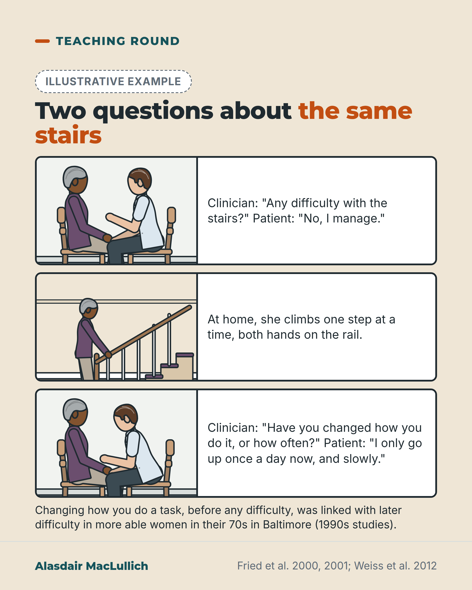

# G042: Still doing it, but differently

- Category: C05 Frailty, function and recovery
- Audience: practitioners
- Series: Teaching round
- Post type: teaching
- Visual format: comic strip
- Status: text text_final, visual final
- Working id: C05-P02 (candidate C05-02)

## Insight

A yes or no question about difficulty misses people who have changed how or how often they do a task. That change (preclinical disability) marks people who are already slower and weaker and more likely to develop difficulty.

## Angle and position

Revised angle: add one history question about changed method or frequency; state population limits; do not claim acting early prevents disability.

Basis: mixed: cohort findings (empirical); adding the question to the history is clinical judgement

## X (817 characters)

```text
"Any difficulty with stairs?" "No." That answer can miss the person who now takes them one at a time, holding the rail with both hands.

A Baltimore study in the 1990s followed women in their 70s, among the more able two thirds of women their age. Some reported no difficulty but had changed how or how often they walked or climbed stairs. These women were already slower and weaker than women who had not changed. Over the next 18 months they were more likely to develop difficulty. A smaller Finnish study of men and women aged 75 to 81 found a similar pattern over 2 years.

We should add one question to the history: "Have you changed how you do this, or how often, because of your health?" The researchers proposed this stage as a point to offer help. Whether acting then prevents disability has not been tested.
```

## LinkedIn (1662 characters)

```text
"Any difficulty with stairs?" "No."

That answer can miss the person who now takes the stairs one at a time, holding the rail with both hands. Researchers call this stage preclinical disability: the task still gets done, but the method or frequency has changed.

In a Baltimore study of 436 women aged 70 to 80 (Fried 2001), women who had changed how or how often they walked half a mile or climbed 10 steps, but reported no difficulty, were measured as slower, weaker and less steady than women with no change. They were not as affected as women who reported difficulty.

Some women reported no difficulty at the start. Those who had changed how they walked or climbed stairs had about 3 to 4 times the odds of developing difficulty over the next 18 months. This held after allowing for walking speed (Fried 2000).

A later analysis of the same women pointed the same way. Women who newly reported such changes were more likely to report new walking difficulty a year and a half later, though the uncertainty was wide (Weiss 2012).

A smaller Finnish study of people aged 75 to 81 found a similar pattern in men and women over 2 years (Mänty 2007).

Limits: the main studies were of women in their 70s in Baltimore, the more able two thirds of their age group, recruited in 1994 and 1995. The researchers proposed this stage as a point to offer help; these studies did not test whether acting then prevents disability.

The question used in the research: "Have you changed the way you walk half a mile, or how often you do this, because of a health or physical condition?"

We should add this question to the functional history, next to the difficulty question.
```

## Bluesky (297 characters)

```text
"Any difficulty with stairs?" can miss a change in how people climb.

In more able Baltimore women in their 70s, those who changed how they climbed yet reported no difficulty were slower and more likely to develop difficulty in 18 months. A Finnish study found the same pattern.

Ask about change.
```

## Threads (493 characters)

```text
"Any difficulty with stairs?" can get a no from someone taking them one step at a time.

In a 1990s Baltimore study of more able women in their 70s, some reported no difficulty but had changed how they walked or climbed stairs. They were already slower and weaker, and more likely to develop difficulty within 18 months. A Finnish study found a similar pattern.

Ask: "Have you changed how or how often you do this because of your health?" Whether acting early prevents disability is untested.
```

## Source reply

Sources: https://doi.org/10.1016/s0895-4356(01)00357-2 | https://doi.org/10.1093/gerona/55.1.m43 | https://doi.org/10.1016/j.archger.2011.08.018 | https://doi.org/10.1016/j.apmr.2007.06.016

## Visual



Alt text: Three-panel comic. A clinician asks a woman in her late 70s about difficulty with stairs and she says no. At home she climbs one step at a time holding the rail with both hands. The clinician then asks whether she has changed how or how often she climbs. Illustrative; linked to later difficulty in Baltimore studies.

Editable source: `visuals/src/G042.html`

Design instructions: Single 1080x1350 sand card, three horizontal comic panels (art left, caption right), illustrative badge. Panels: older Black woman in clinic with doctor; same woman on a staircase hands on rail; clinic with doctor leaning in. Drawn with kit.js; text from visual_brief.

## Sources and verification

- C05-02-a (supported): Older women who had changed how or how often they did a mobility task, without reporting difficulty, had walking speed, balance and strength between those of women with no change and women with difficulty.
  - Source: Fried LP, Young Y, Rubin G, Bandeen-Roche K. Self-reported preclinical disability identifies older women with early declines in performance and early disease. J Clin Epidemiol. 2001;54(9):889-901.
  - Passage: "The Women's Health and Aging Study II, an observational study of 436 women 70-80 years of age who were among the two-thirds least disabled living in the community. ... (3) no difficulty but reported modification and/or change in frequency of task performance (a self-report measure of preclinical disability predictive of incident difficulty). ... Physical performance decreased, and disease frequency increased, in association with decreasing self-reported mobility function (in walking one-half mile and climbing 10 steps), across three self-report categories: High Function, Preclinical Disability (Task Modification but No Difficulty) and Disability (Difficulty). These findings pertained for measures of walking speed, balance, strength, and knee and hip osteoarthritis." (Abstract)
- C05-02-b (supported_with_qualification): In the same cohort, women without mobility difficulty who reported changing how they did a task had 3 to 4 times the odds of developing walking or stair difficulty over 18 months.
  - Source: Fried LP, Bandeen-Roche K, Chaves PH, Johnson BA. Preclinical mobility disability predicts incident mobility disability in older women. J Gerontol A Biol Sci Med Sci. 2000;55(1):M43-52.
  - Passage: "At baseline, 69.3% of the cohort reported no difficulty with mobility. After 18 months, 16.0 and 11.7% of this group reported incident difficulty walking 1/2 mile or climbing up 10 steps, respectively. Those reporting baseline task modification due to underlying health problems, our measure of preclinical disability, were at three- to fourfold higher odds of progressing to difficulty than were those without such modification. In multivariate logistic regression analyses, this self-report measure, task modification without difficulty, and objective measures of performance were independently and jointly predictive of incident mobility difficulty. Specifically, for incident difficulty walking 1/2 mile, self-reported task modification odds ratio (OR) = 3.67 ... for incident difficulty climbing up 10 stairs, OR for task modification = 3.84" (Abstract, Results)
- C05-02-c (supported_with_qualification): Women who newly reported changing how or how often they walked were more likely 1.5 years later to report new walking difficulty and to have stopped walking 8 blocks outdoors; the question used was 'Have you changed the way you walk 1/2 mile, or how often you do this, due to a health or physical condition?'
  - Source: Weiss CO, Wolff JL, Egleston B, Seplaki CL, Fried LP. Incident preclinical mobility disability (PCMD) increases future risk of new difficulty walking and reduction in walking activity. Arch Gerontol Geriatr. 2012;54(3):e329-33.
  - Passage: "Abstract: "Data are from a prospective study of 436 community-dwelling women age 70-79 years. Outcome measures include subjective and objective measures of walking ability at 3 years. ... Compared to women without, women with incident PCMD at 1.5 years after baseline were 2.7 (95%CI 1.4-7.2) times more likely to report that they no longer walk outdoors at least 8 blocks and 4.9 (1.9-13.1) times more likely to report new difficulty walking." Methods (full text): "The main variable of interest, reported PCMD, was obtained as part of a series of task-specific questions about changing the frequency or method of performing daily activities: 'Have you changed the way you walk 1/2 mile (about 5–6 city blocks), or how often you do this, due to a health or physical condition?'" Table 2 heading: "Modeled Risk Ratios (PCMD+/PCMD−)"; footnote: "RR and change in mean are from propensity-adjusted marginal structural models estimating causal association with PCMD− as the reference group". Methods: "Participants were recruited from a sample representing the higher functioning two-thirds of women age 70–79 in eastern Baltimore City and Baltimore County, Maryland and were enrolled in 1994 and 1995."" (Abstract; Methods sections 2.1 to 2.5; Table 2 (via Undermind PDF read and Scite Smart Citation snippet))
- C05-02-d (supported): The finding was replicated in Finnish men and women aged 75 to 81: preclinical mobility limitation predicted progression to major mobility limitation over 2 years.
  - Source: Mänty M, Heinonen A, Leinonen R, Törmäkangas T, Sakari-Rantala R, Hirvensalo M, von Bonsdorff MB, Rantanen T. Construct and predictive validity of a self-reported measure of preclinical mobility limitation. Arch Phys Med Rehabil. 2007;88(9):1108-13.
  - Passage: "A total of 632 community-living (age range, 75-81 y) women and men took part in the baseline assessments and 302 persons in the semi-annual interviews on mobility limitation over 2 years. ... Preclinical mobility limitation was defined as self-reported tiredness or modification of task performance without task difficulty. ... At baseline, participants with preclinical mobility limitation showed intermediate levels of walking speed and muscle power, compared with those with no limitation or manifest mobility limitation. Participants reporting baseline preclinical mobility limitation had 3- to 6-fold higher age- and sex-adjusted risk of progressing to major manifest mobility limitation during the 2-year follow-up compared with participants with no limitation at baseline" (Abstract)
- C05-02-e (supported): Limitation: the US studies were in initially high-functioning women aged 70 to 79 in Baltimore, enrolled in 1994 and 1995.
  - Source: Weiss CO, Wolff JL, Egleston B, Seplaki CL, Fried LP. Incident preclinical mobility disability (PCMD) increases future risk of new difficulty walking and reduction in walking activity. Arch Gerontol Geriatr. 2012;54(3):e329-33.; Fried LP, Bandeen-Roche K, Chaves PH, Johnson BA. Preclinical mobility disability predicts incident mobility disability in older women. J Gerontol A Biol Sci Med Sci. 2000;55(1):M43-52.
  - Passage: "Weiss (Methods): "Participants were recruited from a sample representing the higher functioning two-thirds of women age 70–79 in eastern Baltimore City and Baltimore County, Maryland and were enrolled in 1994 and 1995." Fried 2000: "The participants were 436 community-dwelling women, 70-80 years of age at baseline, not cognitively impaired, and reporting difficulty in no areas, or only one area, of physical function"." (Weiss 2012 Methods (Scite Smart Citation snippet); Fried 2000 Abstract)

Verification notes: Fried 2001 abstract (C05-02-a); Fried 2000 abstract odds ratios (C05-02-b, 'odds' wording); Weiss 2012 full text, question wording and 2012 citation (C05-02-c); Mänty 2007 abstract (C05-02-d); population limits (C05-02-e) in every version. No claim that early action prevents disability. Comic dialogue illustrative.

## Attention and follow potential

Pause: A familiar history question that gets a misleading no.

Gain: One exact question to add to a functional history.

Follow: Practical history-taking points with their evidence limits.

## Open issues

- Fried 2001 abstract gives women aged 70 to 80; the cohort was recruited at 70 to 79. Captions say "in their 70s"; LinkedIn gives 70 to 80 for Fried 2001 as sourced and "in their 70s" in the limits line.
