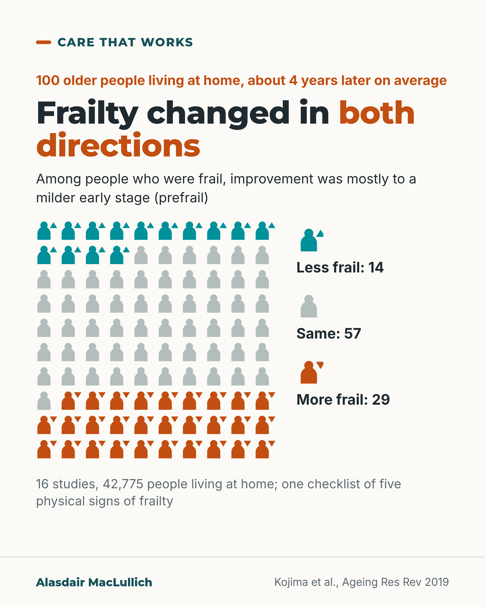

# G043: Frailty can move both ways

- Category: C05 Frailty, function and recovery
- Audience: public
- Series: Care that works
- Post type: public_explanation
- Visual format: chart
- Status: text text_final, visual final
- Working id: C05-P03 (candidate C05-07)

## Insight

Frailty often changes over time. About 14 in 100 older people living at home became less frail over about 4 years, while 29 in 100 became more frail; improvement was most often by one step.

## Angle and position

Public reassurance without false hope: show worsening next to improvement, show that improvement is mostly one step, and give the guideline first step (strength exercise; protein or calories if losing weight).

Basis: mixed: pooled cohort findings and guideline recommendations (empirical); the advice to ask for reassessment is judgement

## X (799 characters)

```text
Being told you are frail describes where you are now. It can change, in both directions.

16 studies followed 42,775 older people living at home. They were reassessed after about 4 years on average (range 1 to 10). 14 in 100 became less frail. 29 in 100 became more frail, about twice as many. 57 in 100 stayed the same. The studies used one checklist of five physical signs of frailty.

Among people who were frail, 40 in 100 improved to the early stage, called prefrail. Only 3 in 100 lost all signs of frailty.

International guidelines name exercise that includes strength training as the first treatment, with extra protein or calories if you are losing weight or not getting enough nourishment.

You can ask what strength exercise is open to you, and when your frailty will be looked at again.
```

## LinkedIn (1645 characters)

```text
Being told you are frail describes where you are now. It can change, in both directions.

A 2019 review pooled 16 studies of 42,775 older people living at home, followed for about 4 years on average (Kojima 2019). Of those reassessed:

1. About 14 in 100 became less frail.
2. About 29 in 100 became more frail.
3. About 57 in 100 stayed the same.

So worsening was about twice as common as improvement. Improvement was real, though. People who were prefrail (the early stage of frailty) were much more likely to lose all frailty signs than people who were frail. About 23 in 100 prefrail people later showed none of the signs. About 18 in 100 became frail.

Among people who were frail, improvement was mostly to the early stage. About 40 in 100 moved to prefrail, about 55 in 100 stayed frail, and only about 3 in 100 later showed none of the signs. A US study of 754 people found the same: going straight from frail to not frail at all was very rare, under 1 in 100 in each 18-month period. That fits the 3 in 100 above, which covers about 4 years on average.

These figures come from people living at home, and all the studies used one checklist of five physical signs of frailty.

International frailty guidelines recommend, as the first step, an exercise programme that includes strength training. They recommend protein or calorie supplements for people who are losing weight or undernourished. They also recommend a fuller assessment for anyone found to be frail (Dent 2019).

If you have been told you are frail, you can ask two things: what exercise to build strength is available to you, and when your frailty will be looked at again.
```

## Bluesky (298 characters)

```text
Frailty can change both ways. Over about 4 years, 14 in 100 older people at home became less frail and 29 in 100 more frail.

Among frail people, most improvement was to a milder stage.

Guidelines name strength exercise as the first treatment. If called frail, ask when it will be looked at again.
```

## Threads (493 characters)

```text
Being called frail describes where you are now. It can change in both directions.

16 studies followed 42,775 older people living at home for about 4 years on average. 14 in 100 became less frail and 29 in 100 more frail. Among frail people, 40 in 100 moved to a milder early stage and 3 in 100 lost all signs of frailty.

Guidelines name exercise with strength training as the first treatment, plus protein or calories if you are losing weight.

Ask when your frailty will be looked at again.
```

## Source reply

Sources: https://doi.org/10.1016/j.arr.2019.01.010 | https://doi.org/10.1001/archinte.166.4.418 | https://doi.org/10.1007/s12603-019-1273-z

## Visual



Alt text: Ten by ten array of 100 person icons: 14 teal with up arrows are less frail, 57 grey are the same, 29 orange with down arrows are more frail, about 4 years later on average. Pooled from 16 studies of 42,775 people living at home. Improvement among frail people was mostly to prefrail.

Editable source: `visuals/src/G043.html`

Design instructions: Single card, 10x10 person icons (14 teal with up arrow, 57 grey, 29 orange with down arrow) with direct legend; claim C05-07-a (Kojima 2019).

## Sources and verification

- C05-07-a (supported): In pooled community studies (average follow-up about 4 years), about 14 in 100 older people became less frail, about 29 in 100 became more frail and about 57 in 100 stayed the same.
  - Source: Kojima G, Taniguchi Y, Iliffe S, Jivraj S, Walters K. Transitions between frailty states among community-dwelling older people: a systematic review and meta-analysis. Ageing Res Rev. 2019;50:81-8.
  - Passage: ""Among 42,775 community-dwelling older people from 16 studies with a mean follow-up of 3.9 years (range: 1-10 years), 13.7% (95%CI = 11.7-15.8%) improved, 29.1% (95%CI = 25.9-32.5%) worsened and 56.5% (95%CI = 54.2-58.8%) maintained the same frailty status."" (Abstract, Results)
- C05-07-b (supported): Improvement to meeting no frailty criteria was much more common among prefrail people (about 23 in 100) than frail people (about 3 in 100); among frail people, about 40 in 100 moved to prefrail and about 55 in 100 stayed frail.
  - Source: Kojima G, Taniguchi Y, Iliffe S, Jivraj S, Walters K. Transitions between frailty states among community-dwelling older people: a systematic review and meta-analysis. Ageing Res Rev. 2019;50:81-8.
  - Passage: ""Among those who were prefrail at baseline, corresponding rates to robust, prefrail and frail were 23.1% (95%CI = 18.8-27.6%), 58.2% (95%CI = 55.6-60.7%) and 18.2% (95%CI = 14.9-21.7%), respectively. Among those who were frail at baseline, pooled rates of transitioning to robust, prefrail and remaining frail were 3.3% (95%CI = 1.6-5.5%), 40.3% (95%CI = 34.6-46.1%) and 54.5% (95%CI = 47.6-61.3%), respectively." ... "Given that while one quarter of prefrail older people improved to robust only 3% of frail older people did, early interventions should be considered."" (Abstract, Results and Conclusions)
- C05-07-c (supported): In a US cohort assessed every 18 months, moving from frail to not frail was very rare (0% to 0.9%), and moves to greater frailty were more common than moves to lesser frailty.
  - Source: Gill TM, Gahbauer EA, Allore HG, Han L. Transitions between frailty states among community-living older persons. Arch Intern Med. 2006;166(4):418-23.
  - Passage: ""Of the 754 participants, 434 (57.6%) had at least 1 transition between any 2 of the 3 frailty states during 54 months." ... "During the 18-month intervals, transitions to states of greater frailty were more common (rates up to 43.3%) than transitions to states of lesser frailty (rates up to 23.0%), and the probability of transitioning from being frail to nonfrail was very low (rates, 0%-0.9%), even during an extended period."" (Abstract, Results)
- C05-07-d (supported): International guidelines recommend a physical activity programme with a resistance (strength) training component as first-line management of frailty (strong recommendation), with protein or calorie supplements when weight loss or undernutrition is present (conditional recommendation).
  - Source: Dent E, Morley JE, Cruz-Jentoft AJ, Woodhouse L, Rodriguez-Manas L, Fried LP, et al. Physical frailty: ICFSR international clinical practice guidelines for identification and management. J Nutr Health Aging. 2019;23(9):771-87.
  - Passage: ""First-line therapy for the management of frailty should include a multi-component physical activity programme with a resistance-based training component (strong recommendation). Protein/caloric supplementation is recommended when weight loss or undernutrition are present (conditional recommendation)." Also: "For individuals screened as positive for frailty, a more comprehensive clinical assessment should be performed to identify signs and underlying mechanisms of frailty (strong recommendation)."" (Abstract, Recommendations for Management; Recommendations for Screening and Assessment)

Verification notes: Kojima 2019 abstract (C05-07-a, b): worsening shown beside improvement; percentages described as of people reassessed (handling of deaths not stated); one definition (five-item frailty phenotype), people living at home. Gill 2006 abstract (C05-07-c): under 1 in 100 per 18 months from frail to non-frail. ICFSR guideline abstract (C05-07-d) wording used instead of "most consistent evidence"; protein or calorie supplements are for people losing weight or undernourished. Removed from the earlier draft: the description of prefrail as one or two signs such as slow walking or weak grip (not in the claim file), and a "few months" reassessment interval (not supported). Advice to ask about reassessment and exercise is judgement.

## Attention and follow potential

Pause: A label many people assume is permanent.

Gain: Realistic odds of change and two questions to ask.

Follow: Balanced numbers for older people and families.

## Open issues

None.
