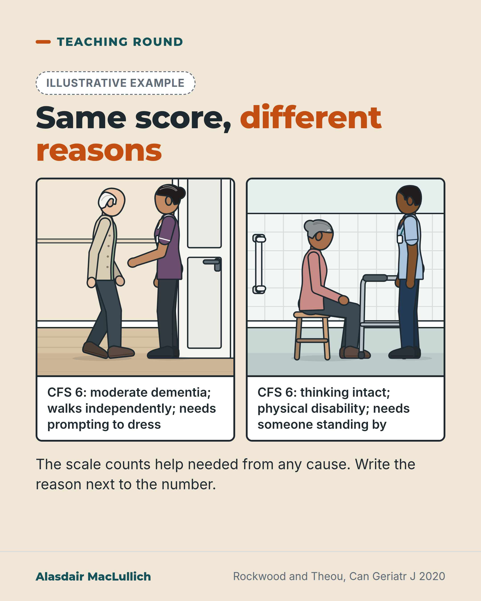

# G044: Two routes to the same CFS 6

- Category: C05 Frailty, function and recovery
- Audience: practitioners
- Series: Teaching round
- Post type: teaching
- Visual format: comparison
- Status: text text_final, visual final
- Working id: C05-P04 (candidate C05-16)

## Insight

The Clinical Frailty Scale counts dependence from any cause, so the same score can describe moderate dementia or a physical disability. The number alone does not say which.

## Angle and position

Write the reason next to the number (practice suggestion, marked as judgement). No claim that outcomes differ by route.

Basis: mixed: scale definitions and developer guidance (empirical/documentary); recording habit is clinical judgement

## X (619 characters)

```text
Two people can both score 6 on the Clinical Frailty Scale for different reasons.

The scale counts the help a person needs, from any cause. Its developers say level 6 can describe two different people. One has moderate dementia and can wash and dress only with prompting. The other thinks clearly but needs a person standing by because of a physical disability.

For people with dementia, the guidance says the frailty level generally follows the stage of dementia.

The score is a clinical judgement and the start of a care plan. We should write the reason next to it: "CFS 6 (moderate dementia; walks independently)".
```

## LinkedIn (1650 characters)

```text
Two people can both score 6 on the Clinical Frailty Scale (CFS) for different reasons.

The scale describes how much help a person needs, whatever the cause. Level 7, for example, means complete dependence for personal care, whether the cause is physical or cognitive.

Level 6 describes someone who needs help with all activities outside the home and with housework. They often have trouble with stairs, need help to bathe, and may need prompting or someone standing by while dressing.

The developers point out that this pattern fits two quite different people. One has moderate dementia and can wash and dress only with prompting. The other thinks clearly but needs a person standing by because of a physical disability (Rockwood and Theou 2020).

The guidance adds that in dementia the frailty level generally follows the stage of dementia: mild dementia with level 5, moderate with 6, severe with 7. "Generally" marks this as a guide to scoring, with exceptions.

The developers describe the score as a clinical judgement that summarises function, cognition and mobility. They say a care plan is still needed, and that predicting outcome also needs the severity of the current illness.

No study was found comparing outcomes for people who reach the same score by different routes, and no published guidance recommends recording the route. The suggestion below follows from how the scale is built.

Two example entries, not real patients: "CFS 6 (moderate dementia; walks independently)" and "CFS 6 (severe arthritis; needs standby help)". Each tells the next reader what kind of help to plan for.

We should write the reason next to the number.
```

## Bluesky (269 characters)

```text
A Clinical Frailty Scale score of 6 can mean moderate dementia with prompting to dress. It can also mean clear thinking with a physical disability, where someone must stand by. The scale counts help needed from any cause.

We should write the reason next to the number.
```

## Threads (430 characters)

```text
Two people can both score 6 on the Clinical Frailty Scale for different reasons.

The scale counts the help a person needs, from any cause. Its developers say level 6 fits someone with moderate dementia who can dress only with prompting, and someone with intact thinking who needs standby help because of a physical disability.

We should write the reason next to the number, e.g. "CFS 6 (moderate dementia; walks independently)".
```

## Source reply

Source: Rockwood and Theou, Can Geriatr J 2020 https://doi.org/10.5770/cgj.23.463

## Visual



Alt text: Two drawn scenes, both scoring CFS 6. On the left an older man with moderate dementia walks on his own while a carer helps with dressing. On the right a woman with intact thinking sits on a shower stool, a walking frame beside her, with a support worker standing by. Write the reason next to the number.

Editable source: `visuals/src/G044.html`

Design instructions: Single sand card, two equal drawn panels: older white man walking with carer helping to dress; older South Asian-heritage style woman on shower stool with frame and support worker. Labels below. No CFS pictograms.

## Sources and verification

- C05-16-a (supported): CFS version 2.0 defines level 7 (living with severe frailty) as completely dependent for personal care from whatever cause, physical or cognitive.
  - Source: Rockwood K, Theou O. Using the Clinical Frailty Scale in allocating scarce health care resources. Can Geriatr J. 2020;23(3):210-5.
  - Passage: "Figure 1 (CFS version 2.0): "7 | LIVING WITH SEVERE FRAILTY Completely dependent for personal care, from whatever cause (physical or cognitive). Even so, they seem stable and not at high risk of dying (within ~6 months)."" (Figure 1 (CFS version 2.0), page 2 of the PDF; transcribed via Undermind read_pdfs)
- C05-16-b (supported): CFS scoring guidance says that in people with dementia the degree of frailty generally corresponds to the degree of dementia; in moderate dementia people can do personal care with prompting.
  - Source: Rockwood K, Theou O. Using the Clinical Frailty Scale in allocating scarce health care resources. Can Geriatr J. 2020;23(3):210-5.
  - Passage: "Figure 1: "SCORING FRAILTY IN PEOPLE WITH DEMENTIA The degree of frailty generally corresponds to the degree of dementia. Common symptoms in mild dementia include forgetting the details of a recent event, though still remembering the event itself, repeating the same question/story and social withdrawal. In moderate dementia, recent memory is very impaired, even though they seemingly can remember their past life events well. They can do personal care with prompting. In severe dementia, they cannot do personal care without help. In very severe dementia they are often bedfast. Many are virtually mute." Body text: "The degree of dementia generally corresponds to the degree of frailty."" (Figure 1 (dementia scoring box); body text section 'Scoring the Clinical Frailty Scale in People with Cognitive Impairment')
- C05-16-c (supported): CFS 6 (living with moderate frailty) describes needing help with all outside activities and keeping house, often problems with stairs, help with bathing, and possibly minimal help (cuing, standby) with dressing.
  - Source: Rockwood K, Theou O. Using the Clinical Frailty Scale in allocating scarce health care resources. Can Geriatr J. 2020;23(3):210-5.
  - Passage: "Figure 1: "6 | LIVING WITH MODERATE FRAILTY People who need help with all outside activities and with keeping house. Inside, they often have problems with stairs and need help with bathing and might need minimal assistance (cuing, standby) with dressing."" (Figure 1 (CFS version 2.0))
- C05-16-d (supported): The same CFS level can be reached by a cognitive route or a physical route: the developers state that the level-6 pattern applies both to moderate dementia and to cognitively intact people whose physical disability means they need someone nearby.
  - Source: Rockwood K, Theou O. Using the Clinical Frailty Scale in allocating scarce health care resources. Can Geriatr J. 2020;23(3):210-5.
  - Passage: ""With [Level 6 - Living with Moderate Frailty] (previously 'Moderately Frail'), dependence now extends past instrumental ADLs to intermediate ones, notably including dependence in bathing. Often at this level minimal assistance with personal care might be needed. Moderate dementia is the case when people who are dependent in their performance of instrumental ADLs can still do their basic or personal ADLs with prompting. This can also be the case in people who are cognitively intact, but whose disability obliges them to have someone nearby (so-called 'standby assistance' or 'set-up')." Also for level 7: "Still, people living with severe frailty can be mobile."" (Body text, section 'Using the Clinical Frailty Scale to Grade Clinically Meaningfully Increased Risk' (level name stripped from PMC text; restored in brackets from Figure 1))
- C05-16-e (supported): The CFS is a judgement-based summary that requires clinical judgement; prognosis needs both baseline frailty and the severity of the acute illness; the score is no substitute for a patient-centred care plan.
  - Source: Rockwood K, Theou O. Using the Clinical Frailty Scale in allocating scarce health care resources. Can Geriatr J. 2020;23(3):210-5.
  - Passage: ""It is not a questionnaire. Grading the degree of frailty requires clinical judgement that is based in part on screening criteria..." ... "Still, as discussed below, their prognosis requires information about both their baseline degree of frailty, and the severity of their acute illness." ... "In geriatric medicine, the goal of grading the degree of frailty is both to ease communication through a shared language, and also as the foundation for a care plan. The care plan needs to address the gap between the current level of function, cognition, mobility, and social relationships (especially with the primary carer) and how those have changed with the acute illness (when present)." ... "It should not be confused with the more instrumental purpose to which the Clinical Frailty Scale is now being put, which is no substitute for a patient-centred care plan."" (Body text: 'What is the Clinical Frailty Scale?'; 'Summary')
- C05-16-g (supported_with_qualification): Position: record what drove the CFS score (physical, cognitive or both) beside the number, and do not use the number alone to judge how someone will tolerate surgery, rehabilitation or exercise.
  - Source: Rockwood K, Theou O. Using the Clinical Frailty Scale in allocating scarce health care resources. Can Geriatr J. 2020;23(3):210-5.
  - Passage: "See C05-16-d and C05-16-e: "This can also be the case in people who are cognitively intact, but whose disability obliges them to have someone nearby"; "requires clinical judgement"; "no substitute for a patient-centred care plan"." (Body text (as above))

Verification notes: Rockwood and Theou 2020 full text and Figure 1 (C05-16-a to e). Level 6 wording is paraphrased (copyright). The two-person comparison follows the developers' statement that the level-6 pattern fits moderate dementia and intact thinking with physical disability needing standby help (C05-16-d); drawings and the two sample entries are labelled illustrative. Habit is judgement (C05-16-g); no outcome-by-route claim is made and the evidence gap is stated. Searching for outcome studies was limited.

## Attention and follow potential

Pause: A number clinicians use daily that hides its route.

Gain: A simple documentation habit.

Follow: Scale-use teaching grounded in developer guidance.

## Open issues

None.
