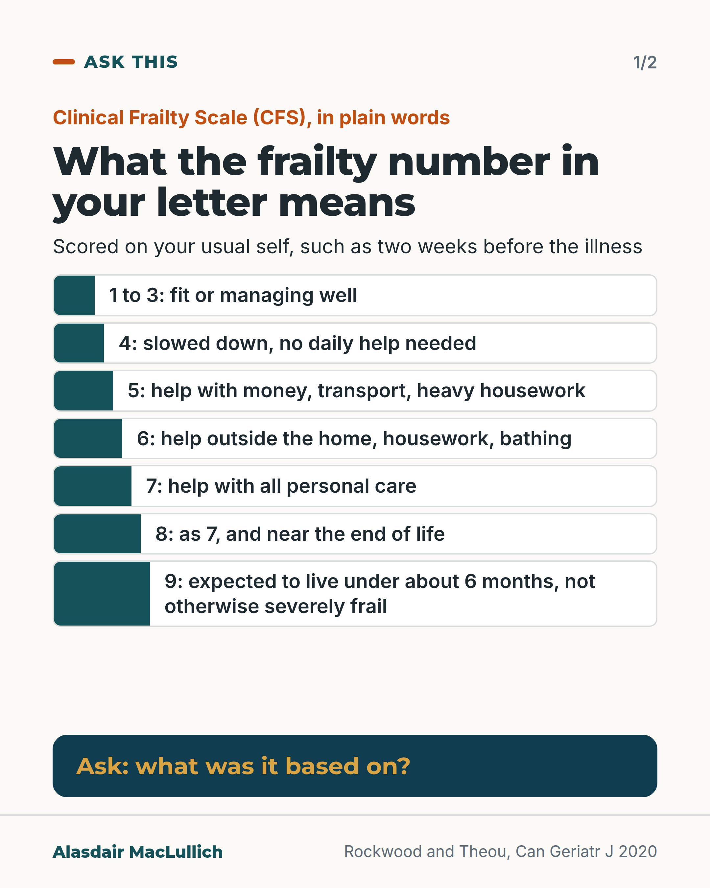
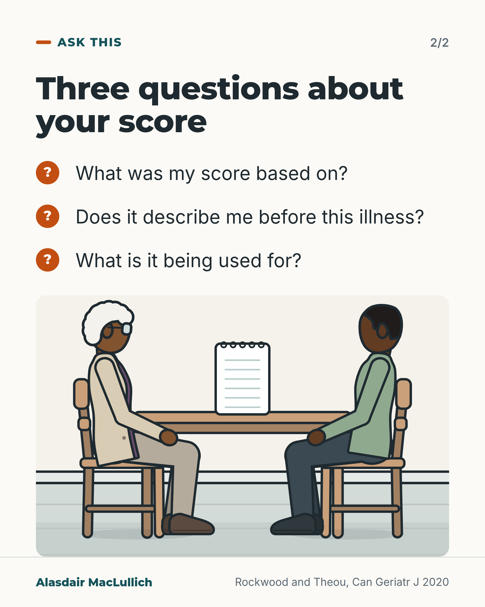

# G045: What the frailty number in a letter means

- Category: C05 Frailty, function and recovery
- Audience: public
- Series: Ask this
- Post type: public_explanation
- Visual format: diagram
- Status: text text_final, visual final
- Working id: C05-P05 (candidate C05-24)

## Insight

"CFS" in a letter means the Clinical Frailty Scale, from 1 (very fit) to 9 (terminally ill). Levels 5 to 8 describe increasing need for help; level 4 needs no daily help. It is meant to describe your usual self.

## Angle and position

A plain translation of the scale plus questions the person can ask.

Basis: empirical (scale definitions and developer guidance); the suggestion to ask is judgement

## X (872 characters)

```text
"CFS 6" in a hospital letter means the Clinical Frailty Scale, which runs from 1 (very fit) to 9 (terminally ill).

Levels 1 to 3 are fit or managing well. Level 4 is very mild frailty: you are slowed down, but need no help from others day to day.

Levels 5 to 8 describe increasing need for help. At 5, help with things like money, transport or heavy housework. At 6, help outside the home, with housework and bathing. At 7, complete help with personal care; 8 is the same, near the end of life. Level 9, called terminally ill, is for people expected to live less than about 6 months. They are not otherwise severely frail, and many are still active.

The score should describe your usual self, such as two weeks before this illness. Level 9 is the exception, based on the current illness. Doctors use it as one input to plan care, so you can ask what yours was based on.
```

## LinkedIn (1623 characters)

```text
"CFS 6" in a hospital letter with no explanation means the Clinical Frailty Scale.

The scale has 9 levels, from 1 (very fit) to 9 (terminally ill). In plain words:

1. Levels 1 to 3: very fit, fit, or managing well.
2. Level 4, very mild frailty: symptoms slow you down, but you do not need help from others day to day.
3. Level 5, mild frailty: help with things like money, transport and heavy housework.
4. Level 6, moderate frailty: help with everything outside the home, with housework and with bathing.
5. Level 7, severe frailty: needing others for all personal care.
6. Level 8, very severe frailty: the same, and approaching the end of life.
7. Level 9: expected to live less than about 6 months, but not otherwise severely frail. Many are still active.

So levels 5 to 8 describe increasing need for help. Older letters may use earlier names, such as "vulnerable" for level 4.

The score is meant to describe how you usually are, not how you seem while ill. The developers give the example of how someone was two weeks before coming into hospital. Level 9 is the one exception, based on the current illness.

Doctors use the score to help judge how someone may cope with illness and treatment and to plan care. It is one input and depends on a clinician's judgement. It was designed for older people. It is not well tested in younger people or in people with a long-standing single disability (Rockwood and Theou 2020). The score is one input. It should not be the only thing that decides treatment.

You can ask: what was my score based on, does it describe me before this illness, and what is it being used for?
```

## Bluesky (226 characters)

```text
"CFS 6" in a letter means the Clinical Frailty Scale, 1 (very fit) to 9 (terminally ill). Levels 5 to 8 mean increasing need for help; level 4 needs no daily help.

It should describe your usual self. Ask what it was based on.
```

## Threads (406 characters)

```text
"CFS 6" in a hospital letter means the Clinical Frailty Scale: 1 is very fit, 9 is terminally ill.

Level 4 means symptoms slow you down but you need no daily help. Levels 5 to 8 describe increasing need for help; 6 means help outside the home, with housework and bathing.

It should describe your usual self, such as two weeks before the illness. Ask what yours was based on and what it is being used for.
```

## Source reply

Source: Rockwood and Theou, Can Geriatr J 2020 https://doi.org/10.5770/cgj.23.463

## Visual



Alt text: Ladder of Clinical Frailty Scale levels in plain words: 1 to 3 fit or managing well; 4 slowed down; 5 help with money, transport, heavy housework; 6 help outside the home and bathing; 7 all personal care; 8 as 7, near end of life; 9 under about 6 months. Ask what the score was based on.



Alt text: Three questions to ask about a frailty score: what was it based on, does it describe me before this illness, and what is it being used for. A drawn older Black woman and her adult son sit at a kitchen table with a paper between them.

Editable source: `visuals/src/G045.html`

Design instructions: Carousel of 2. Card 1: ladder of rows with bar widths rising by level, deep teal panel 'Ask'. Card 2: three question ticks and kitchen-table scene (older Black woman and adult son, blank notepad). Paraphrase only.

## Sources and verification

- C05-24-a (supported): CFS version 2.0 has 9 levels: very fit, fit, managing well, living with very mild frailty, living with mild frailty, living with moderate frailty, living with severe frailty, living with very severe frailty, terminally ill.
  - Source: Rockwood K, Theou O. Using the Clinical Frailty Scale in allocating scarce health care resources. Can Geriatr J. 2020;23(3):210-5.
  - Passage: "Figure 1: "1 | VERY FIT ... 2 | FIT ... 3 | MANAGING WELL ... 4 | LIVING WITH VERY MILD FRAILTY ... 5 | LIVING WITH MILD FRAILTY ... 6 | LIVING WITH MODERATE FRAILTY ... 7 | LIVING WITH SEVERE FRAILTY ... 8 | LIVING WITH VERY SEVERE FRAILTY ... 9 | TERMINALLY ILL". Abstract: "It also introduces an updated version (CFS version 2.0), with revised level names (e.g., 'vulnerable' becomes 'living with very mild frailty') and minor edits to level descriptions."" (Figure 1; Abstract)
- C05-24-b (supported): Levels 5 to 8 describe increasing need for help from others; level 4 (living with very mild frailty) means symptoms limit activities but the person does not depend on others for daily help (editor's guidance).
  - Source: Rockwood K, Theou O. Using the Clinical Frailty Scale in allocating scarce health care resources. Can Geriatr J. 2020;23(3):210-5.
  - Passage: "Figure 1: "4 | LIVING WITH VERY MILD FRAILTY Previously 'vulnerable,' this category marks early transition from complete independence. While not dependent on others for daily help, often symptoms limit activities. A common complaint is being 'slowed up' and/or being tired during the day. 5 | LIVING WITH MILD FRAILTY People who often have more evident slowing, and need help with high order instrumental activities of daily living (finances, transportation, heavy housework)... 6 | ... People who need help with all outside activities and with keeping house... 7 | ... Completely dependent for personal care, from whatever cause (physical or cognitive)... 8 | LIVING WITH VERY SEVERE FRAILTY Completely dependent for personal care and approaching end of life. Typically, they could not recover even from a minor illness." Body text: "Levels 5 to 7 relate to changes in function."" (Figure 1; body text)
- C05-24-c (supported_with_qualification): The CFS is meant to describe the person's usual (baseline) state, for example how they were about two weeks before an acute illness, not how they seem while ill.
  - Source: Rockwood K, Theou O. Using the Clinical Frailty Scale in allocating scarce health care resources. Can Geriatr J. 2020;23(3):210-5.
  - Passage: ""The key to scoring the Clinical Frailty Scale is to determine the person's baseline health state. This is especially needed in clinical settings where health can change quickly. For example, many older patients in the Emergency Department who were fit two weeks ago (their baseline state), may appear to be frail while ill; a prospect that becomes more likely the longer they wait there." ... "We then ask about four features: how the person moved, functioned, thought, and felt about their health over the last two weeks." Abstract: "the Clinical Frailty Scale assays the baseline state"." (Body text, 'What is the Clinical Frailty Scale?'; Abstract)
- C05-24-d (supported): Level 9 (terminally ill) applies to people with a life expectancy under about 6 months who are not otherwise living with severe frailty, and is the one level scored on the current rather than baseline state.
  - Source: Rockwood K, Theou O. Using the Clinical Frailty Scale in allocating scarce health care resources. Can Geriatr J. 2020;23(3):210-5.
  - Passage: "Figure 1: "9 | TERMINALLY ILL Approaching the end of life. This category applies to people with a life expectancy <6 months, who are not otherwise living with severe frailty. (Many terminally ill people can still exercise until very close to death.)" Body text: "[Level 9] is notable for being the only level in which the current state trumps the baseline state, in that the terminally ill person might have been operating at any frailty level at baseline." ... "Even so, if a terminally ill person was completely dependent for personal care at baseline, they would be scored as Level 8."" (Figure 1; body text, 'Using the Clinical Frailty Scale in People Towards the End of Life')
- C05-24-e (supported): What the score is used for and its limits: prognosis and setting care goals (and, during COVID-19, triage for scarce resources); it requires clinical judgement; it is not widely validated in younger people or people with stable single-system disabilities.
  - Source: Rockwood K, Theou O. Using the Clinical Frailty Scale in allocating scarce health care resources. Can Geriatr J. 2020;23(3):210-5.
  - Passage: ""In ordinary time (i.e., with no pandemic), the Clinical Frailty Scale is used both in prognosis and to set care goals." Abstract: "The key points discussed are that the Clinical Frailty Scale assays the baseline state, it is not widely validated in younger people or those with stable single-system disabilities, and it requires clinical judgement. The Clinical Frailty Scale is now commonly used as a triage tool to make important clinical decisions such as allocating scarce health care resources for COVID-19 management". Body text: "In geriatric medicine, the goal of grading the degree of frailty is both to ease communication through a shared language, and also as the foundation for a care plan."" (Abstract; body text)
- C05-24-f (supported): The CFS is copyright (Rockwood, 2005 to 2020; all rights reserved; permission via geriatricmedicineresearch.ca).
  - Source: Rockwood K, Theou O. Using the Clinical Frailty Scale in allocating scarce health care resources. Can Geriatr J. 2020;23(3):210-5.
  - Passage: "Figure 1: "Clinical Frailty Scale ©2005–2020 Rockwood. Version 2.0 (EN). All rights reserved. For permission: www.geriatricmedicineresearch.ca"" (Figure 1 footer)

Verification notes: All from Rockwood and Theou 2020 full text and Figure 1 (C05-24-a to f). Editor's guidance applied: levels 5 to 8 describe increasing need for help; level 4 (very mild frailty) needs no daily help. Level 9 described as the one level based on the current illness; two weeks is given as an example of the baseline, not a strict rule. Score described as one input needing clinical judgement. Visual paraphrases the levels in plain words (copyright) and does not reproduce pictograms or level text. The sentence that a person's worth does not depend on a number, and that the score alone should not decide treatment, is ethical judgement, not a finding. One short series invitation (no schedule).

## Attention and follow potential

Pause: An unexplained number in their own letter.

Gain: A translation and three questions.

Follow: Plain explanations of hospital jargon.

## Open issues

None.
