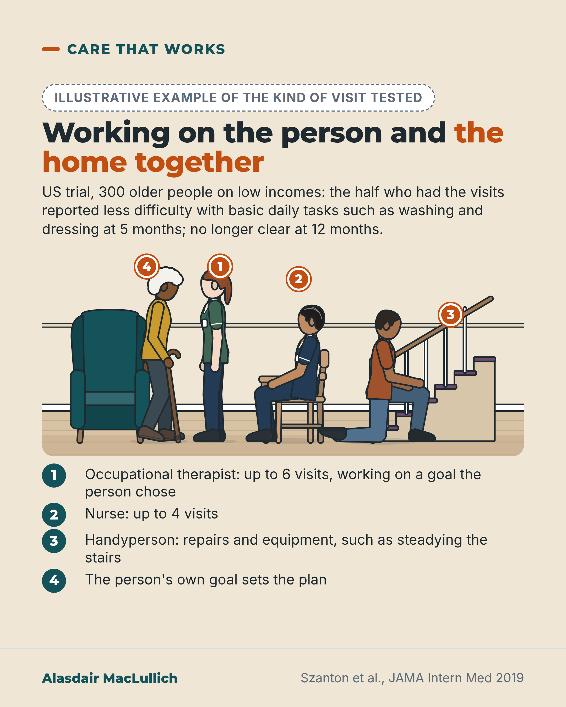

# G046: An occupational therapist, a nurse and a handyperson

- Category: C05 Frailty, function and recovery
- Audience: public
- Series: Care that works
- Post type: good_care
- Visual format: annotated scene
- Status: text text_final, visual final
- Working id: C05-P06 (candidate C05-19)

## Insight

A US trial that worked on both the person and the home reduced difficulty with basic daily tasks such as washing and dressing (on an overall score) at 5 months, but the gain faded by 12 months and a later trial after hospital did not repeat it.

## Angle and position

Revised angle: good care that looks at both person and house, with the limits stated as plainly as the benefit; action as a question, no provider named.

Basis: mixed: trial findings (empirical); the suggestion to ask for a combined look is judgement

## X (889 characters)

```text
Difficulty with everyday tasks can come from two places: what your body can do, and how your home is set up.

A Baltimore trial included 300 older people on low incomes. Half were offered up to 10 home visits from an occupational therapist, a nurse and a handyperson. The visits worked on goals each person chose. The rest had social visits. At 5 months the first group reported less difficulty with basic daily tasks, on an overall score. The tasks included washing, dressing and using the toilet. About 8 in 10 of those who answered said it made life easier a great deal, against 4 in 10 of those given social visits.

Household tasks did not clearly improve. By 12 months the difference was no longer clear. A 2025 trial of the same programme after hospital did not clearly improve basic daily tasks.

If tasks are getting harder, ask whether someone can look at both you and your home.
```

## LinkedIn (1663 characters)

```text
Difficulty with everyday tasks can come from two places: what your body can do, and how your home is set up.

A US trial called CAPABLE worked on both (Szanton 2019). 300 older people on low incomes in Baltimore, who had difficulty with everyday tasks, took part. About half were offered up to 10 home visits over 5 months: up to 6 from an occupational therapist, up to 4 from a nurse, and repairs or equipment from a handyperson. The visits worked on goals each person chose. The comparison group had 10 friendly social visits.

After 5 months, people who had the programme reported less difficulty with basic tasks such as washing, dressing, using the toilet and getting in and out of bed. On a scale of difficulty with daily tasks, from 0 to 16, their average score was about 30% lower than the comparison group's.

About 8 in 10 said it made their life easier a great deal, against about 4 in 10 with social visits.

Limits:

1. Household tasks such as shopping and cooking did not clearly improve.
2. At 12 months, seven months after the visits stopped, the difference between the groups was no longer clear.
3. A 2025 trial tested the same programme in 268 people about 60 days after leaving hospital. All had already had home health care. Basic daily tasks did not clearly improve compared with no further care. A measure of walking and stairs improved more.
4. Most participants were Black women with low incomes in one US city.

Judgement: an assessment of difficulty at home should look at the person and the house together. If daily tasks are getting harder for you, ask whether an occupational therapist can look at how you do things and at your home.
```

## Bluesky (299 characters)

```text
A US trial of 300 low-income older people sent an occupational therapist, nurse and handyperson to half. The rest got social visits. At 5 months the first half reported less difficulty with washing and dressing; by 12 months the difference was unclear.

Ask for someone to look at you and your home.
```

## Threads (498 characters)

```text
Difficulty at home can come from your body or your home.

A US trial of 300 older people on low incomes sent an occupational therapist, nurse and handyperson to half. At 5 months they reported less difficulty with basic daily tasks such as washing and dressing, on an overall score, than those given social visits. The difference was not clear by 12 months. A 2025 trial after hospital did not clearly improve daily tasks.

If tasks are getting harder, ask for someone to look at you and your home.
```

## Source reply

Sources: https://doi.org/10.1001/jamainternmed.2018.6026 | https://doi.org/10.1111/jgs.70116

## Visual



Alt text: Drawn living room and staircase. An older Black woman with a walking stick talks with an occupational therapist; a nurse sits at a table; a handyperson kneels at the stair rail. Numbered pins match a key: therapist up to 6 visits, nurse up to 4, handyperson repairs, the person's own goal. US trial of 300 people: less daily difficulty at 5 months, not clear at 12.

Editable source: `visuals/src/G046.html`

Design instructions: Single sand card: illustrative badge, trial summary, kit scene (older Black woman with stick, OT, nurse at table, handyperson kneeling at stair rail), numbered pins 1 to 4, key list below. Trial summary text unchanged.

## Sources and verification

- C05-19-a (supported): CAPABLE trial design: 300 low-income adults aged 65 and over in Baltimore with difficulty in daily tasks; up to 10 home visits over 5 months from an occupational therapist, a nurse and a home repair worker, working on goals the person chose; controls had 10 social visits.
  - Source: Szanton SL, Xue QL, Leff B, Guralnik J, Wolff JL, Tanner EK, Boyd C, Thorpe RJ, Bishai D, Gitlin LN. Effect of a biobehavioral environmental approach on disability among low-income older adults: a randomized clinical trial. JAMA Intern Med. 2019;179(2):204-11.
  - Passage: "Abstract: "In this randomized clinical trial of 300 low-income community-dwelling adults with a disability in Baltimore, Maryland, between March 18, 2012, and April 29, 2016, 65 years or older, cognitively intact, and with self-reported difficulty with 1 or more activities of daily living (ADLs) or 2 or more instrumental ADLs (IADLs) ... The CAPABLE group received up to 10 home visits over 5 months by occupational therapists, registered nurses, and home modifiers to address self-identified functional goals by enhancing individual capacity and the home environment. The control group received 10 social home visits by a research assistant." Full text: "For 5 months, CAPABLE participants receive up to 6 one-hour home sessions with the OT; up to 4 one-hour home sessions with the RN; and up to $1300 worth of home repairs, modifications, and assistive devices. The cost of delivering CAPABLE services in this trial was $2825 per person" ... "In consultation with the team, the home modifier stabilizes stairs, levels flooring, and repairs floors"." (Abstract; full text Methods (Intervention))
- C05-19-b (supported_with_qualification): At 5 months, difficulty scores for basic daily activities were about 30% lower in the CAPABLE group than in the control group.
  - Source: Szanton SL, Xue QL, Leff B, Guralnik J, Wolff JL, Tanner EK, Boyd C, Thorpe RJ, Bishai D, Gitlin LN. Effect of a biobehavioral environmental approach on disability among low-income older adults: a randomized clinical trial. JAMA Intern Med. 2019;179(2):204-11.
  - Passage: "In unadjusted analyses, participants in the intervention group reported a 26% reduction (relative risk [RR], 0.74; 95% CI, 0.57-0.97; P = .03) in ADL disability scores compared with participants in the control group. ... In adjusted analyses, the CAPABLE treatment effect on ADL disability scores remained statistically significant (30% reduction; RR, 0.70; 95% CI, 0.54-0.93; P = .01) ... a The effect-size estimates are presented as the ratio of means between the intervention group (CAPABLE) and the attention control group after accounting for study attrition. ... Activities of daily living refer to self-reported difficulty or need for help when performing 8 essential ADLs: walking across a small room, bathing, upper-body dressing, lower-body dressing, eating, using the toilet, transferring in and out of bed, and grooming." (Full text Results (5-month outcomes), Table 2 footnote a, Methods (Outcomes))
- C05-19-c (supported): The 17% reduction in difficulty with household tasks (IADLs) was not statistically clear.
  - Source: Szanton SL, Xue QL, Leff B, Guralnik J, Wolff JL, Tanner EK, Boyd C, Thorpe RJ, Bishai D, Gitlin LN. Effect of a biobehavioral environmental approach on disability among low-income older adults: a randomized clinical trial. JAMA Intern Med. 2019;179(2):204-11.
  - Passage: "In adjusted analyses ... the effect on IADL scores was still not statistically significant (17% reduction; RR, 0.83; 95% CI, 0.65-1.06; P = .13) (Table 2). ... Instrumental activities of daily living refer to self-reported difficulty or need for help when performing 8 tasks: using the phone, shopping, preparing food, light housekeeping, washing laundry, traveling independently, taking medications, and managing finances independently." (Full text Results; Methods)
- C05-19-d (supported): By 12 months (7 months after visits ended), the difference in basic daily activities was no longer statistically clear.
  - Source: Szanton SL, Xue QL, Leff B, Guralnik J, Wolff JL, Tanner EK, Boyd C, Thorpe RJ, Bishai D, Gitlin LN. Effect of a biobehavioral environmental approach on disability among low-income older adults: a randomized clinical trial. JAMA Intern Med. 2019;179(2):204-11.
  - Passage: "Unadjusted analyses showed that participants in the intervention group reported a statistically nonsignificant 7% improvement in ADL disability scores (RR, 0.93; 95% CI, 0.72-1.21; P = .60) from baseline to 12-month measurement (7 months after the conclusion of CAPABLE visits), compared with the control participants. ... In adjusted analyses, the effect on ADL (RR, 0.90; 95% CI, 0.68- 1.18; P = .44) and IADL (RR, 1.03; 95% CI, 0.81-1.31; P = .80) scores remained statistically nonsignificant (Table 2). ... The effect of the CAPABLE intervention diminished between 5 and 12 months, which may suggest that a booster visit or call could be useful." (Full text Results (12-month outcomes); Discussion)
- C05-19-e (supported_with_qualification): More CAPABLE participants said the programme made their life easier (82% vs 43%).
  - Source: Szanton SL, Xue QL, Leff B, Guralnik J, Wolff JL, Tanner EK, Boyd C, Thorpe RJ, Bishai D, Gitlin LN. Effect of a biobehavioral environmental approach on disability among low-income older adults: a randomized clinical trial. JAMA Intern Med. 2019;179(2):204-11.
  - Passage: "The intervention group participants (n=119), compared with controls (n=123), responded with a great deal to the following survey items: overall benefit (91.6% [109] vs 63.4% [78]; P < .001); the CAPABLE program made their life easier (82.3% [98] vs 43.1% [53]; P < .001), made their home safer (82.3% [98] vs 28.5% [35]; P < .001), kept them living at home (79.8% [95] vs 43.4% [53]; P < .001)" (Full text Results (Perception of benefit))
- C05-19-g (supported): Population limits: 87% women, most self-identified as Black, low income, one US city.
  - Source: Szanton SL, Xue QL, Leff B, Guralnik J, Wolff JL, Tanner EK, Boyd C, Thorpe RJ, Bishai D, Gitlin LN. Effect of a biobehavioral environmental approach on disability among low-income older adults: a randomized clinical trial. JAMA Intern Med. 2019;179(2):204-11.
  - Passage: "Of the 152 participants in the intervention group, 133 (87.5%) were women and 19 (12.5%) were men, with a mean (SD) age of 75.7 (7.6) years, and 126 (82.9%) self-identified as black. Of the 148 participants in the control group, 129 (87.2%) were women ... and 133 (89.9%) self-identified as black. ... In addition, this study was limited to low-income older adults in Baltimore, Maryland, and the sample was predominantly black women, which may limit generalizability." (Full text Results; Discussion (limitations))
- C05-19-h (supported): Conflicting evidence: in a 2025 trial of 268 low-income people recently discharged from hospital, CAPABLE did not improve basic daily activities compared with no further care, though it improved a mobility measure.
  - Source: Szanton SL, Roth DL, Bowles K, Onorato N, Gitlin LN, Leff B. CAPABLE for people after hospitalization: a randomized trial. J Am Geriatr Soc. 2025;73(12):3663-9.
  - Passage: "This randomized clinical trial enrolled 268 low-income community-dwelling adults who had been discharged to home from the hospital 60 days prior, had a home health episode, yet had remaining difficulties in at least one activity of daily living. Participants were randomized to no further care or to CAPABLE ... The CAPABLE group decreased their ADL difficulty by -1.76 (CI -2.98, -0.54) and the control group decreased (-0.63: CI -1.86, 0.60) over 5 months, which was not statistically or clinically significant. However, the CAPABLE treatment group demonstrated greater improvement in a composite mobility measure than control participants (-0.52 and -0.02, respectively, p = 0.028). ... Among recently hospitalized persons receiving skilled home health care, CAPABLE did not improve ADLs." (Abstract)

Verification notes: Szanton 2019 full text (C05-19-a, b, c, d, e, g): design, 5-month result, unclear household-task result, 12-month fade, 8 in 10 vs 4 in 10 survey of respondents, population limits. Szanton 2025 abstract (C05-19-h). The 30% is a relative comparison of average scores and is not used in captions. No UK provider or availability is claimed (C05-19-i not found). Scene callouts keep to roles and visit numbers the trial reports; nurse content (pain, medicines) removed because it is not in the claim file. "Two places" framing is interpretation, not a trial finding.

## Attention and follow potential

Pause: An unusual team including a handyperson.

Gain: A reason to ask for a combined person-and-home assessment, with honest limits.

Follow: Good care examples told with their limits.

## Open issues

None.
