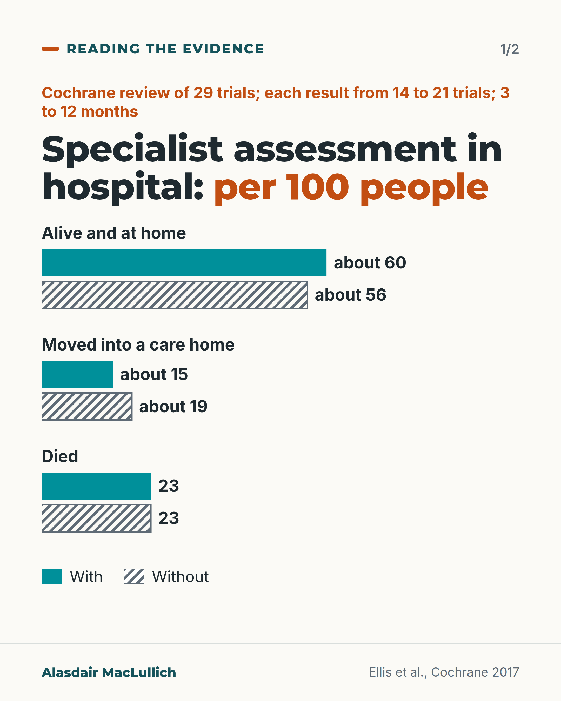
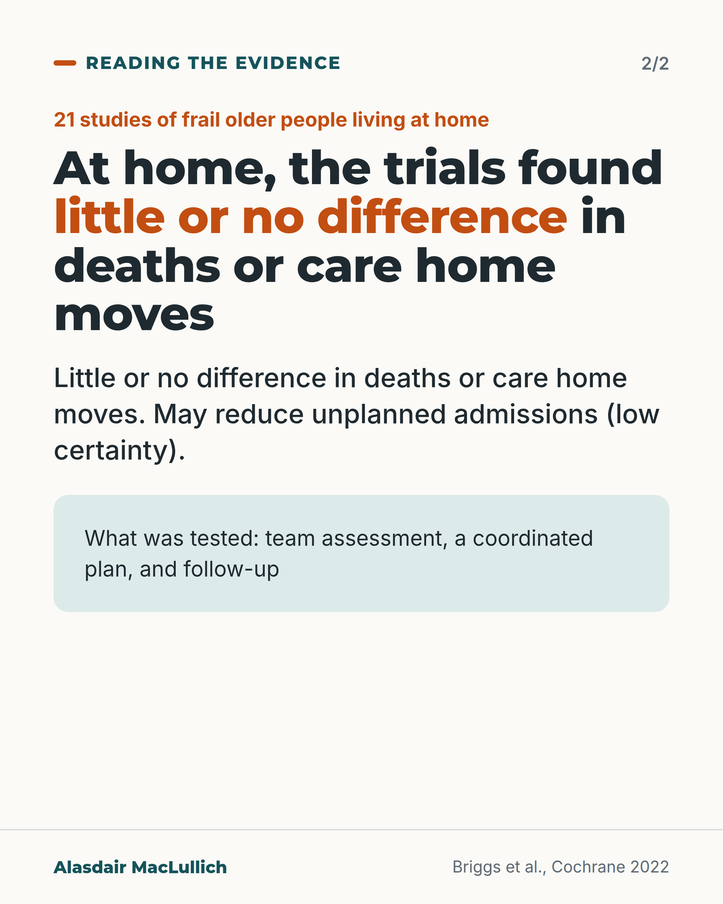

# G047: Where comprehensive geriatric assessment has shown benefit

- Category: C05 Frailty, function and recovery
- Audience: practitioners
- Series: Reading the evidence
- Post type: evidence_interpretation
- Visual format: chart
- Status: text text_final, visual final
- Working id: C05-P07 (candidate C05-08)

## Insight

Hospital comprehensive geriatric assessment has high-certainty evidence: about 3 more in 100 alive and at home, 3 to 4 fewer moved into care homes. For frail people at home, trials found little or no difference in deaths or care home moves.

## Angle and position

The same name covers different services; judge a service by the plan and follow-up, and match claims to the evidence for the setting.

Basis: mixed: Cochrane findings (empirical); the standard for services is judgement

## X (770 characters)

```text
Comprehensive geriatric assessment (CGA) has good evidence of modest benefit in hospital. For frail people living at home, the trials found little or no difference in deaths or care home moves.

In a Cochrane review of 29 hospital trials, about 60 in 100 were alive and at home 3 to 12 months later with CGA, against 56 in 100 without. About 15 in 100 had moved into a care home, against 19. Deaths were 23 in 100 in both groups, and need for help with daily tasks barely differed.

In 21 studies of frail people living at home, unplanned hospital admissions may be lower, but the evidence is low certainty.

In these reviews CGA means a team assessment followed by a coordinated plan that is followed up. Judgement: a service using the name should be able to show both.
```

## LinkedIn (1643 characters)

```text
Comprehensive geriatric assessment (CGA) has good evidence of modest benefit in hospital. For frail people living at home, the trials found little or no difference in deaths or care home moves. They found a possible reduction in unplanned admissions, on low-certainty evidence. The name covers both settings, so it helps to know which is which.

In the Cochrane reviews, CGA means a team assessing a frail older person's medical, mental and functional problems, then making and following up a coordinated plan of treatment. A form or a one-off assessment on its own is not what was tested.

Hospital (Ellis 2017; 29 trials, 13,766 people; each result below comes from 14 to 21 of these trials):

1. Alive and living at home 3 to 12 months later: about 60 in 100 with CGA, 56 in 100 without (high certainty).
2. Moved into a care home: about 15 in 100 against 19 in 100.
3. Deaths: 23 in 100 in both groups.
4. Help needed with daily tasks: little or no difference.

The effects are modest, and trials were mostly in high-income countries over several decades. An earlier analysis suggested dedicated wards did better than visiting teams; the 2017 update said the data were too few to tell.

Frail people at home (Briggs 2022; 21 studies): probably little or no difference in deaths, and little or no difference in care home moves over about a year. It may reduce unplanned hospital admissions, but that evidence is low certainty.

My judgement: a service that uses the name should be able to show the plan and the follow-up, not only the assessment. Claims for community services should match the more modest evidence, without dismissing them.
```

## Bluesky (299 characters)

```text
Cochrane, 29 hospital trials: with geriatric assessment about 60 in 100 were alive and at home at 3 to 12 months, vs 56 without. Fewer moved into care homes. Deaths were the same.

In 21 studies at home, little or no difference in deaths or care home moves. Tested: team assessment, plan, follow-up.
```

## Threads (490 characters)

```text
Comprehensive geriatric assessment in hospital: in 29 trials, about 60 in 100 were alive and at home 3 to 12 months later, against 56 in 100 without. Fewer went into care homes. Deaths were the same.

For frail people at home, 21 studies showed probably little or no difference in deaths or care home moves, and possibly fewer unplanned admissions (weak evidence).

The tested model is a team assessment plus a plan that is followed up. Judgement: a service using the name should show both.
```

## Source reply

Sources: https://doi.org/10.1002/14651858.CD006211.pub3 | https://doi.org/10.1002/14651858.CD012705.pub2 | https://doi.org/10.1136/bmj.d6553

## Visual



Alt text: Paired bars per 100 people from a Cochrane review of hospital specialist assessment, with versus without. Alive and at home: about 60 versus about 56. Moved into a care home: about 15 versus about 19. Died: 23 versus 23. Teal solid bars are with, hatched grey are without.



Alt text: Statement card on Cochrane evidence from 21 studies of frail older people at home: little or no difference in deaths or care home moves; may reduce unplanned admissions, low certainty. What was tested: team assessment, a coordinated plan, and follow-up.

Editable source: `visuals/src/G047.html`

Design instructions: Carousel of 2. Card 1: SVG paired bars (with solid teal, without hatched grey), max 70 per 100, claim C05-08-b (Ellis 2017). Card 2: statement card with Briggs 2022 text.

## Sources and verification

- C05-08-a (supported): In 29 trials (13,766 people), CGA for older people admitted to hospital increased the chance of being alive and at home at 3 to 12 months and reduced nursing home admission (high certainty), with little or no difference in death or dependence.
  - Source: Ellis G, Gardner M, Tsiachristas A, Langhorne P, Burke O, Harwood RH, Conroy SP, Kircher T, Somme D, Saltvedt I, Wald H, O'Neill D, Robinson D, Shepperd S. Comprehensive geriatric assessment for older adults admitted to hospital. Cochrane Database Syst Rev. 2017;9(9):CD006211.
  - Passage: "We included 29 trials recruiting 13,766 participants across nine, mostly high-income countries. CGA increases the likelihood that patients will be alive and in their own homes at 3 to 12 months' follow-up (risk ratio (RR) 1.06, 95% confidence interval (CI) 1.01 to 1.10; 16 trials, 6799 participants; high-certainty evidence), results in little or no difference in mortality at 3 to 12 months' follow-up (RR 1.00, 95% CI 0.93 to 1.07; 21 trials, 10,023 participants; high-certainty evidence), decreases the likelihood that patients will be admitted to a nursing home at 3 to 12 months follow-up (RR 0.80, 95% CI 0.72 to 0.89; 14 trials, 6285 participants; high-certainty evidence) and results in little or no difference in dependence (RR 0.97, 95% CI 0.89 to 1.04; 14 trials, 6551 participants; high-certainty evidence)." (Abstract, Main results)
- C05-08-b (supported_with_qualification): Absolute effects of hospital CGA per 1,000 people (Cochrane summary of findings).
  - Source: Ellis G, Gardner M, Tsiachristas A, Langhorne P, Burke O, Harwood RH, Conroy SP, Kircher T, Somme D, Saltvedt I, Wald H, O'Neill D, Robinson D, Shepperd S. Comprehensive geriatric assessment for older adults admitted to hospital. Cochrane Database Syst Rev. 2017;9(9):CD006211.
  - Passage: "Summary of findings for the main comparison: Comprehensive geriatric assessment (CGA) versus admission to hospital without CGA. Anticipated absolute effects (95% CI), Risk with usual care / Risk with CGA: Living at home (end of follow-up 3 to 12 months): Study population 561 per 1000 / 595 per 1000 (567 to 617). Mortality (end of follow-up 3 to 12 months): Study population 230 per 1000 / 230 per 1000 (214 to 247). Admission to a nursing home (end of follow-up 3 to 12 months): Study population 186 per 1000 / 151 per 1000 (136 to 169). Dependence: Study population 291 per 1000 / 282 per 1000 (259 to 302). Footnote: "*The risk in the intervention group (and its 95% confidence interval) is based on assumed risk in the comparison group and the relative effect of the intervention (and its 95% CI)."" (Summary of findings table for the main comparison, PDF page 6 (transcribed by Undermind read_pdfs reading agent))
- C05-08-c (supported): In 21 studies (7,893 people), CGA for frail older people living in the community probably made little or no difference to death, made little or no difference to nursing home admission (high certainty), and may reduce unplanned hospital admission (low certainty).
  - Source: Briggs R, McDonough A, Ellis G, Bennett K, O'Neill D, Robinson D. Comprehensive Geriatric Assessment for community-dwelling, high-risk, frail, older people. Cochrane Database Syst Rev. 2022;5(5):CD012705.
  - Passage: "We included 21 studies involving 7893 participants across 10 countries and four continents. ... CGA probably leads to little or no difference in mortality during a median follow-up of 12 months (risk ratio (RR) 0.88, 95% confidence interval (CI) 0.76 to 1.02; 18 studies, 7151 participants (adjusted for clustering); moderate-certainty evidence). CGA results in little or no difference in nursing home admissions during a median follow-up of 12 months (RR 0.93, 95% CI 0.76 to 1.14; 13 studies, 4206 participants (adjusted for clustering); high-certainty evidence). CGA may decrease the risk of unplanned hospital admissions during a median follow-up of 14 months (RR 0.83, 95% CI 0.70 to 0.99; 6 studies, 1716 participants (adjusted for clustering); low-certainty evidence). The effect of CGA on emergency department visits is uncertain and evidence was very low certainty" (Abstract, Main results)
- C05-08-e (supported): CGA is defined as a multidimensional, multidisciplinary diagnostic and therapeutic process that leads to a coordinated plan for treatment and follow-up, not only an assessment.
  - Source: Ellis G, Gardner M, Tsiachristas A, Langhorne P, Burke O, Harwood RH, Conroy SP, Kircher T, Somme D, Saltvedt I, Wald H, O'Neill D, Robinson D, Shepperd S. Comprehensive geriatric assessment for older adults admitted to hospital. Cochrane Database Syst Rev. 2017;9(9):CD006211.; Briggs R, McDonough A, Ellis G, Bennett K, O'Neill D, Robinson D. Comprehensive Geriatric Assessment for community-dwelling, high-risk, frail, older people. Cochrane Database Syst Rev. 2022;5(5):CD012705.
  - Passage: "Ellis 2017: "Comprehensive geriatric assessment (CGA) is a multi-dimensional, multi-disciplinary diagnostic and therapeutic process conducted to determine the medical, mental, and functional problems of older people with frailty so that a co-ordinated and integrated plan for treatment and follow-up can be developed." Briggs 2022: "CGA is not limited simply to assessment, but also directs a holistic management plan for older people, which leads to tangible interventions."" (Ellis 2017 Abstract, Background; Briggs 2022 Abstract, Background)
- C05-08-f (supported): The 2011 meta-analysis suggested larger benefit from designated wards than visiting teams; the 2017 update judged this comparison underpowered and uncertain.
  - Source: Ellis G, Whitehead MA, Robinson D, O'Neill D, Langhorne P. Comprehensive geriatric assessment for older adults admitted to hospital: meta-analysis of randomised controlled trials. BMJ. 2011;343:d6553.; Ellis G, Gardner M, Tsiachristas A, Langhorne P, Burke O, Harwood RH, Conroy SP, Kircher T, Somme D, Saltvedt I, Wald H, O'Neill D, Robinson D, Shepperd S. Comprehensive geriatric assessment for older adults admitted to hospital. Cochrane Database Syst Rev. 2017;9(9):CD006211.
  - Passage: "Ellis 2011 BMJ: "Subgroup interaction suggested differences between the subgroups 'wards' and 'teams' in favour of wards." Ellis 2017: "We are uncertain whether data show a difference in effect between wards and teams, as this analysis was underpowered."" (Ellis 2011 Abstract, Results; Ellis 2017 Abstract, Authors' conclusions)
- C05-08-g (supported_with_qualification): Position: services that call themselves CGA should be judged on whether they deliver and follow up a plan; claims for community services should match the more modest evidence.
  - Source: Ellis G, Gardner M, Tsiachristas A, Langhorne P, Burke O, Harwood RH, Conroy SP, Kircher T, Somme D, Saltvedt I, Wald H, O'Neill D, Robinson D, Shepperd S. Comprehensive geriatric assessment for older adults admitted to hospital. Cochrane Database Syst Rev. 2017;9(9):CD006211.; Briggs R, McDonough A, Ellis G, Bennett K, O'Neill D, Robinson D. Comprehensive Geriatric Assessment for community-dwelling, high-risk, frail, older people. Cochrane Database Syst Rev. 2022;5(5):CD012705.
  - Passage: "See C05-08-c and C05-08-e." (Derived)

Verification notes: Ellis 2017 full text summary of findings (C05-08-a,b; rounded 'about'); Briggs 2022 abstract (C05-08-c, words only); definition (C05-08-e); wards vs teams (C05-08-f); judgement marked (C05-08-g).

## Attention and follow potential

Pause: A common service name with different evidence by setting.

Gain: Absolute numbers to quote and a test for any service.

Follow: Evidence read in absolute terms.

## Open issues

None.
