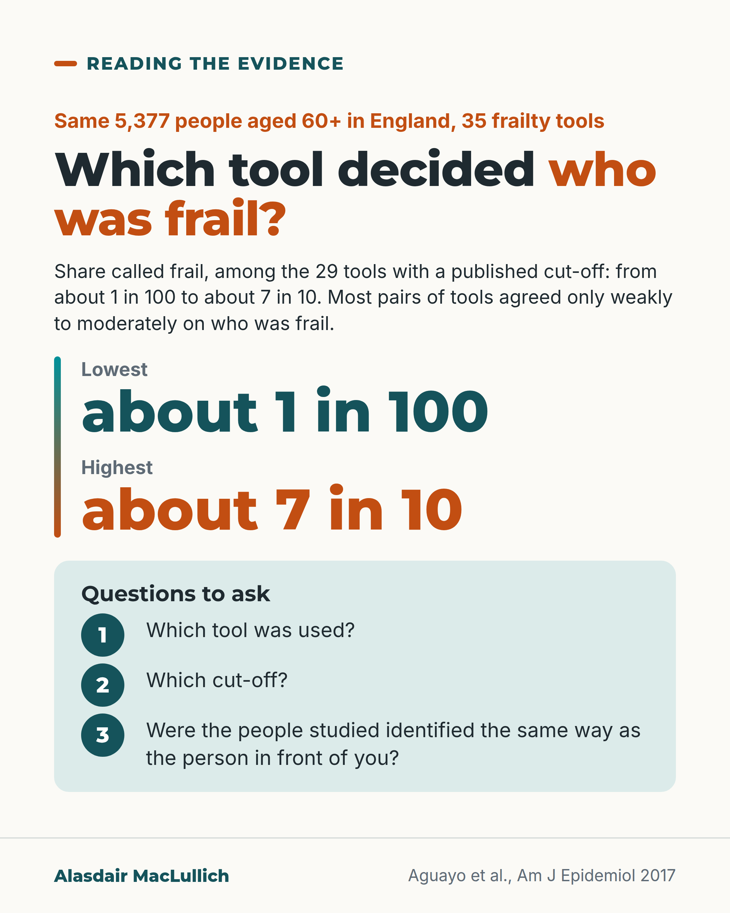

# G048: Which frailty?

- Category: C05 Frailty, function and recovery
- Audience: practitioners
- Series: Reading the evidence
- Post type: evidence_interpretation
- Visual format: question card
- Status: text text_final, visual final
- Working id: C05-P08 (candidate C05-04)

## Insight

Applied to the same 5,377 people, 35 frailty tools (29 with a published cut-off) labelled between about 1 in 100 and about 7 in 10 as frail, and often disagreed about who. Results from one tool do not transfer automatically to people labelled by another.

## Angle and position

Fallback for C05-14. Lead with the same-sample finding; the first question about any 'frail' study is which tool and cut-off.

Basis: mixed: cohort analysis (empirical); the 'first question' is judgement following from it

## X (877 characters)

```text
Before applying any study "in frail older people", check which tool decided who was frail.

Researchers applied 35 published frailty tools to the same 5,377 people aged 60 and over in England (data from 2004 to 2005). Among the 29 tools with a published cut-off, the share called frail ranged from about 1 in 100 to about 7 in 10, depending only on the tool.

The tools also disagreed about which individuals were frail. For almost 9 in 10 pairs of tools, agreement was moderate at best. In the authors' worked example, if 20 in 100 people were truly frail, the worst pairs of tools would label about 3 in 10 people differently.

The authors concluded that most tools can't be swapped for one another. Some tools were rebuilt from the study's data, so they approximate the originals.

Before applying a study to the person in front of you, check which tool and cut-off it used.
```

## LinkedIn (1546 characters)

```text
Before applying any study "in frail older people" to the person in front of you, check which tool and cut-off identified them as frail.

Aguayo and colleagues (2017) applied 35 published frailty scores to the same 5,377 people aged 60 and over in the English Longitudinal Study of Ageing. Because the people were the same, differences came from the tools alone.

Among the 29 tools that had a published cut-off, the share classed as frail ranged from about 1 in 100 to about 7 in 10 (up to 65 in 100 men and 72 in 100 women), depending on which tool was used.

The tools also disagreed about which individuals were frail. Almost 9 in 10 pairs of tools agreed only moderately at best. The authors gave an example. If 20 in 100 people were truly frail, the worst pairs of tools would label about 3 in 10 people differently.

One caveat: the scores were built from the study's own variables, so some approximate the original tools.

Between studies the spread is also wide. Community studies have reported frailty in anywhere from 4 in 100 to 59 in 100 older people. That is partly because of definitions and partly because of who was studied. Pooling many studies of people aged 50 and over, tools based on physical measures labelled about 1 in 8 as frail. Tools counting many health problems labelled about 1 in 4.

The authors concluded that most scores can't be treated as interchangeable. We should treat a trial result, a guideline threshold or a service criterion based on one tool as applying most directly to people identified the same way.
```

## Bluesky (295 characters)

```text
35 frailty tools were applied to the same 5,377 people aged 60 and over in England. The 29 with a published cut-off called between about 1 in 100 and about 7 in 10 of them frail. The tools often disagreed on who.

Before using a study "in frail older people", ask which tool and cut-off it used.
```

## Threads (444 characters)

```text
Who counts as frail depends on the tool used.

35 published frailty tools were applied to the same 5,377 people aged 60 and over in England. The 29 with a published cut-off labelled between about 1 in 100 and about 7 in 10 of them frail. For almost 9 in 10 pairs of tools, agreement on who was frail was moderate at best.

The authors concluded most tools can't be swapped. Before applying a frailty study, check which tool and cut-off it used.
```

## Source reply

Sources: https://doi.org/10.1093/aje/kwx061 | https://doi.org/10.1111/j.1532-5415.2012.04054.x | https://doi.org/10.1093/ageing/afaa219

## Visual



Alt text: Question card. In the same 5,377 people aged 60+ in England, the share called frail across 29 frailty tools with a published cut-off ranged from about 1 in 100 to about 7 in 10. Most tool pairs agreed only weakly to moderately. Three questions: which tool, which cut-off, and were the people studied identified like the person in front of you.

Editable source: `visuals/src/G048.html`

Design instructions: Single card: kicker, headline, summary text, two large text numerals (about 1 in 100 teal, about 7 in 10 orange) beside a gradient rule, mint panel with three numbered questions. Claim C05-04-b.

## Sources and verification

- C05-04-a (supported): When 35 published frailty scores were applied to the same 5,377 people aged 60+ in the English Longitudinal Study of Ageing, they often disagreed about which individuals were frail (Cohen's kappa 0.10 to 0.83; only about 1 in 9 pairs reached kappa 0.6 or more).
  - Source: Aguayo GA, Donneau AF, Vaillant MT, Schritz A, Franco OH, Stranges S, et al. Agreement between 35 published frailty scores in the general population. Am J Epidemiol. 2017;186(4):420-34.
  - Passage: "Abstract: "Data from 5,377 participants (ages ≥60 years) were analyzed (44.7% men, 55.3% women). FS showed widely differing degrees of agreement with the mean of all scores and between each pair of scores. Frailty classification also showed a very wide range of agreement (Cohen's κ = 0.10-0.83)." Results: "κ values ranged from 0.10 to 0.83 and were ≥0.80 for 0.8% of pairs, ≥0.60 and <0.80 for 10.4% of pairs, ≥0.40 and <0.60 for 35.3% of pairs, ≥0.20 and <0.40 for 45.9% of pairs, and <0.20 for 7.6% of pairs". Discussion: "Out of 595 pairs of scores, almost 90% had a κ value under 0.6." ... "We found that in some cases agreement was as low as 0.1 (10%), which, with a prevalence of 0.2, means that approximately 30% of individuals would be classified differently. The highest agreement (0.83 or 83%) translates to about 6% of individuals being classified differently, at the predefined prevalence of 0.2."" (Abstract; Results; Discussion (full text via Undermind read_pdfs))
- C05-04-b (supported): In the same ELSA sample, the proportion labelled frail ranged from about 1% to about 65% (men) and 72% (women) depending on the score used.
  - Source: Aguayo GA, Donneau AF, Vaillant MT, Schritz A, Franco OH, Stranges S, et al. Agreement between 35 published frailty scores in the general population. Am J Epidemiol. 2017;186(4):420-34.
  - Passage: "Results: "Prevalence as defined by the published cutoffs varied considerably. The mean prevalence of frailty was 23.1% (standard deviation, 19.7) for men (range, 0.8–65.0) and 28.9% (standard deviation, 21.9) for women (range, 1.0–72.4) (Table 3)." Discussion: "...indicates that published estimates of frailty prevalence, and consequently our insight into the magnitude of the frailty problem, is dependent to an overwhelming degree on the chosen instrument and cutoff level."" (Results; Table 3; Discussion (full text via Undermind read_pdfs))
- C05-04-c (supported_with_qualification): The authors concluded that most pairs of frailty scores can't be assumed to be interchangeable and that results based on different scores can't be compared or pooled.
  - Source: Aguayo GA, Donneau AF, Vaillant MT, Schritz A, Franco OH, Stranges S, et al. Agreement between 35 published frailty scores in the general population. Am J Epidemiol. 2017;186(4):420-34.
  - Passage: ""There is marked heterogeneity in the degree to which various FS estimate frailty and in the identification of particular individuals as frail. Different FS are based on different concepts of frailty, and most pairs cannot be assumed to be interchangeable. Research results based on different FS cannot be compared or pooled." Discussion: "Only 11.3% of pairs of scores had a κ value of 0.6 or higher, indicating that only a small minority of score pairs would identify the same individuals as being frail with an acceptable level of consistency."" (Abstract, Conclusions; Discussion)
- C05-04-d (supported_with_qualification): Across studies, reported community prevalence ranged from 4.0% to 59.1%; pooled prevalence was 9.9% with physical definitions and 13.6% with broader definitions (Collard 2012); a larger 2021 review found 12% with physical measures and 24% with frailty indexes.
  - Source: Collard RM, Boter H, Schoevers RA, Oude Voshaar RC. Prevalence of frailty in community-dwelling older persons: a systematic review. J Am Geriatr Soc. 2012;60(8):1487-92.; O'Caoimh R, Sezgin D, O'Donovan MR, Molloy DW, Clegg A, Rockwood K, et al. Prevalence of frailty in 62 countries across the world: a systematic review and meta-analysis of population-level studies. Age Ageing. 2021;50(1):96-104.
  - Passage: "Collard: "Reported prevalence in the community varies enormously (range 4.0-59.1%). ... The weighted prevalence was 9.9% for physical frailty (95% CI = 9.6-10.2; 15 studies; 44,894 participants) and 13.6% for the broad phenotype of frailty (95% CI = 13.2-14.0; 8 studies; 24,072 participants)". O'Caoimh: "In total, 240 studies reporting 265 prevalence proportions from 62 countries and territories, representing 1,755,497 participants, were included. Pooled prevalence in studies using physical frailty measures was 12% (95% CI = 11-13%; n = 178), compared with 24% (95% CI = 22-26%; n = 71) for the deficit accumulation model (those using a frailty index, FI)."" (Abstracts)

Verification notes: Aguayo 2017 full text (C05-04-a,b,c); Collard 2012 and O'Caoimh 2021 abstracts (C05-04-d), range attributed to definitions and populations. Tools at extremes not named. Replaces dropped C05-14 per fallback.

## Attention and follow potential

Pause: A range so wide in one population.

Gain: A first question for reading any frailty study.

Follow: Critical reading of frailty research.

## Open issues

None.
