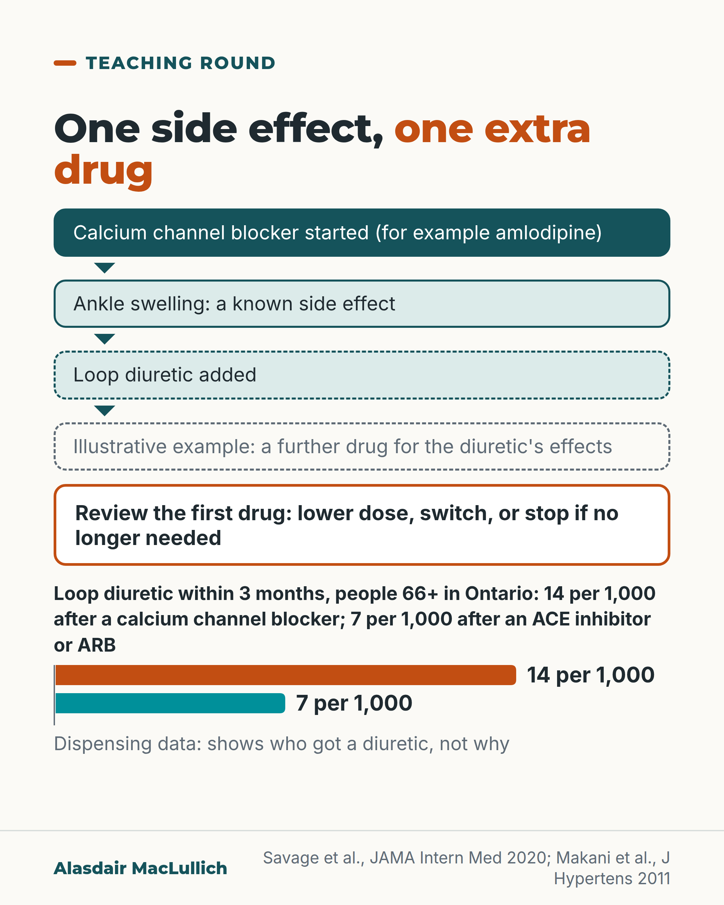

# G049: Swollen ankles after amlodipine

- Category: C06 Medicines and prescribing burden
- Audience: practitioners
- Series: Teaching round
- Post type: teaching
- Visual format: diagram (cascade) with small bar chart
- Status: text text_final, visual final
- Working id: C06-P01 (candidate C06-18)

## Insight

Ankle swelling after a calcium channel blocker can be a side effect of that drug; adding a loop diuretic starts a prescribing cascade, and population data show this happens at scale.

## Angle and position

Review the first drug before adding a second. Absolute figures from Ontario first, then the options.

Basis: mixed: empirical finding (Savage 2020 dispensing data, Makani trial meta-analysis); clinical interpretation (review the first drug), with the switch advice attributed as expert opinion

## X (994 characters)

```text
Ankle swelling that starts after amlodipine can be a side effect of amlodipine. The first step is to review that drug, before adding another.

A prescribing cascade is when a side effect of one medicine is mistaken for a new illness, and a second medicine is started to treat it.

In Ontario, among people aged 66 or over with high blood pressure, about 14 in 1,000 started on a calcium channel blocker were given a loop diuretic within 3 months. After other blood pressure tablets the figure was about 7 in 1,000. The pattern was still there a year on.

These are dispensing data: they show who got a diuretic, not why. The gap of about 7 per 1,000 is small per person and large across a population.

A UK narrative review (Drugs & Aging, 2020) judged switching the best approach, with a loop diuretic justified only when other options fail. That is expert opinion, not a trial result.

The options are a lower dose, a different blood pressure drug, or asking whether the drug is still needed.
```

## LinkedIn (2114 characters)

```text
Ankle swelling that starts after amlodipine can be a side effect of amlodipine. The first step is to review that drug, before adding another.

A prescribing cascade is when a side effect of one medicine is mistaken for a new illness, and a second medicine is started to treat it.

In Ontario, among people aged 66 or over with high blood pressure, about 14 in every 1,000 started on a calcium channel blocker were given a loop diuretic such as furosemide within 3 months. The figure was about 7 in 1,000 after a different blood pressure tablet, and 5 in 1,000 after an unrelated medicine. The pattern was still present a year after starting, and held when the analysis was limited to amlodipine.

These are dispensing data. They show who was given a diuretic, not whether swelling was the reason. The extra 7 or so per 1,000 is small for one person and large across a population.

The swelling itself is common. In trials, about 11 in 100 people on a calcium channel blocker had ankle oedema, against about 3 in 100 on placebo or other treatment, and it was more common at higher doses (16 in 100 against 6 in 100). Those trial participants averaged 56 years.

The options when it appears:
1. A lower dose.
2. A different blood pressure medicine.
3. Asking whether the drug is still needed.

A UK narrative review (Drugs & Aging, 2020) concluded that switching is the best approach and that a loop diuretic is justified only when other options fail; that is expert opinion. In trials, adding an ACE inhibitor or ARB cut the rate of swelling by about 4 in 10 in relative terms, though that adds a drug too.

The diuretic brings its own problems. In a US record review of 120 older veterans, mostly men, who were started on a loop diuretic after starting gabapentin or pregabalin, about 1 in 4 had an event within 2 months. It may have been due to the diuretic. The events were worse kidney function, a drop in blood pressure on standing, abnormal salts or a fall. Small study, no comparison group, and not a study of calcium channel blockers.

Before treating a new symptom, check the start dates on the drug chart.
```

## Bluesky (296 characters)

```text
Ankle swelling can be a side effect of amlodipine.

Ontario dispensing data: 14 in 1,000 aged 66+ starting a calcium channel blocker such as amlodipine got a loop diuretic within 3 months; 7 in 1,000 after other blood pressure tablets. Shows who, not why.

Review that drug before adding another.
```

## Threads (445 characters)

```text
Swollen ankles that start after amlodipine can be a side effect of the drug.

In Ontario, about 14 in 1,000 people aged 66 or over started on a calcium channel blocker such as amlodipine were given a loop diuretic within 3 months. After other blood pressure tablets it was about 7 in 1,000. Dispensing data show who got the diuretic, not why.

Before adding a water tablet, consider a lower dose, a different drug, or whether it is still needed.
```

## Source reply

Sources: Savage 2020 https://doi.org/10.1001/jamainternmed.2019.7087 ; Makani (J Hypertens) 2011 https://doi.org/10.1097/HJH.0b013e3283472643 ; Makani (Am J Med) 2011 https://doi.org/10.1016/j.amjmed.2010.08.007 ; Woodford 2020 https://doi.org/10.1007/s40266-019-00730-4 ; Growdon 2025 https://doi.org/10.1001/jamanetworkopen.2025.45274

## Visual



Alt text: Diagram of a prescribing cascade. A calcium channel blocker such as amlodipine is started, ankle swelling follows as a known side effect, and a loop diuretic is added. A dashed box shows an illustrative further drug. Advice: review the first drug. In Ontario, people 66+ given a diuretic within 3 months: 14 per 1,000 after a calcium channel blocker, 7 per 1,000 after an ACE inhibitor or ARB.

Editable source: `visuals/src/G049.html`

Design instructions: Single card, light ground. H1 with em. Vertical flow: deep teal box (CCB started), mint box (ankle swelling), dashed mint box (loop diuretic), dashed grey box (illustrative further drug), orange-outlined review box, then two horizontal bars via barChart 14 (orange) vs 7 (teal) per 1,000. Claim C06-18-a. Source line Savage 2020; Makani 2011.

## Sources and verification

- C06-18-a (supported): Among adults aged 66 or over with high blood pressure in Ontario, those newly given a calcium channel blocker were more often given a loop diuretic within 90 days than those newly given an ACE inhibitor or ARB or an unrelated drug (1.4% vs 0.7% and 0.5%).
  - Source: Savage RD, Visentin JD, Bronskill SE, Wang X, Gruneir A, Giannakeas V, et al. Evaluation of a common prescribing cascade of calcium channel blockers and diuretics in older adults with hypertension. JAMA Intern Med. 2020;180(5):643-651.
  - Passage: ""The cohort included 41 086 older adults (≥66 years) with hypertension who were newly dispensed a CCB, 66 494 individuals who were newly dispensed another antihypertensive medication, and 231 439 individuals who were newly dispensed an unrelated medication. At index (ie, the dispensing date), the mean (SD) age was 74.5 (6.9) years, and 191 685 (56.5%) were women. Individuals who were newly dispensed a CCB had a higher cumulative incidence at 90 days of being dispensed a loop diuretic than individuals in both control groups (1.4% vs 0.7% and 0.5%, P < .001)."" (Abstract, Results)
- C06-18-b (supported): The association persisted, slightly weaker, up to 1 year, and in people started on amlodipine alone; relative rates were 1.68 to 2.40 times higher than after an ACE inhibitor or ARB over the first 3 months.
  - Source: Savage RD, Visentin JD, Bronskill SE, Wang X, Gruneir A, Giannakeas V, et al. Evaluation of a common prescribing cascade of calcium channel blockers and diuretics in older adults with hypertension. JAMA Intern Med. 2020;180(5):643-651.
  - Passage: ""After adjustment, individuals who were newly dispensed a CCB had increased relative rates of being dispensed a loop diuretic compared with individuals who were newly dispensed an angiotensin-converting enzyme inhibitor or angiotensin II receptor blocker (HR, 1.68; 95% CI, 1.38-2.05 in the first 30 days after index [days 1-30]; 2.26; 95% CI, 1.76-2.92 in the subsequent 30 days [days 31-60]; and 2.40; 95% CI, 1.84-3.13 in the third month of follow-up [days 61-90]) ... This association persisted, although slightly attenuated, from 90 days to up to 1 year of follow-up and when restricted to a subgroup of individuals who were newly dispensed amlodipine."" (Abstract, Results)
- C06-18-c (supported): A prescribing cascade is when a side effect of one drug is taken for a new condition and a second drug is prescribed to treat it; the term was described by Rochon and Gurwitz in the BMJ in 1997.
  - Source: McCarthy LM, Savage R, Dalton K, Mason R, Li J, Lawson A, et al. ThinkCascades: a tool for identifying clinically important prescribing cascades affecting older people. Drugs Aging. 2022;39(10):829-840.; Savage RD, Visentin JD, Bronskill SE, Wang X, Gruneir A, Giannakeas V, et al. Evaluation of a common prescribing cascade of calcium channel blockers and diuretics in older adults with hypertension. JAMA Intern Med. 2020;180(5):643-651.; Rochon PA, Gurwitz JH. Optimising drug treatment for elderly people: the prescribing cascade. BMJ. 1997;315(7115):1096-9.
  - Passage: "McCarthy 2022: "Prescribing cascades occur when a drug is prescribed to manage side effects of another drug, typically when a side effect is misinterpreted as a new condition." Savage 2020: "A prescribing cascade occurs when the edema is misinterpreted as a new medical condition and a diuretic is subsequently prescribed to treat the edema." Rochon 1997 record title: "Optimising drug treatment for elderly people: the prescribing cascade."" (McCarthy 2022 Abstract; Savage 2020 Abstract (Importance); Rochon 1997 PubMed record (title only))
- C06-18-d (supported_with_qualification): Ankle swelling is a common, dose-related side effect of calcium channel blockers of the amlodipine type.
  - Source: Makani H, Bangalore S, Romero J, Htyte N, Berrios RS, Makwana H, et al. Peripheral edema associated with calcium channel blockers: incidence and withdrawal rate--a meta-analysis of randomized trials. J Hypertens. 2011;29(7):1270-80.; Woodford HJ. Calcium channel blockers co-prescribed with loop diuretics: a potential marker of poor prescribing? Drugs Aging. 2020;37(2):77-81.
  - Passage: "Makani 2011: "One hundred and six studies with 99 469 participants, mean age 56 ± 6 years, satisfied our inclusion criteria and were included in this analysis. The weighted incidence of peripheral edema was significantly higher in the CCBs group when compared with controls/placebo (10.7 vs. 3.2%, P < 0.0001). Similarly, the withdrawal rate due to edema was higher in patients on CCBs compared with control/placebo (2.1 vs. 0.5%, P < 0.0001). Both the incidence of edema and patient withdrawal rate due to edema increased with the duration of therapy with CCBs reaching 24 and 5%, respectively, after 6 months. ... Incidence of peripheral edema in patients on DHPs was 12.3% compared with 3.1% with non-DHPs (P < 0.0001). Edema with high-dose CCBs (defined as more than half the usual maximal dose) was 2.8 times higher than that with low-dose CCBs (16.1 vs. 5.7%, P < 0.0001)." Woodford 2020: "CCBs have no prognostic benefit in heart failure and have an absolute risk increase for oedema of around 8-18% (number needed to harm 6-13)."" (Makani 2011 Abstract, Results; Woodford 2020 Abstract)
- C06-18-e (supported_with_qualification): For calcium channel blocker ankle swelling the options are to lower the dose, switch to another drug, or reconsider the need for it; adding an ACE inhibitor or ARB also reduces the swelling; a loop diuretic is justified only where these fail.
  - Source: Woodford HJ. Calcium channel blockers co-prescribed with loop diuretics: a potential marker of poor prescribing? Drugs Aging. 2020;37(2):77-81.; Makani H, Bangalore S, Romero J, Htyte N, Berrios RS, Makwana H, et al. Peripheral edema associated with calcium channel blockers: incidence and withdrawal rate--a meta-analysis of randomized trials. J Hypertens. 2011;29(7):1270-80.; Makani H, Bangalore S, Romero J, Wever-Pinzon O, Messerli FH. Effect of renin-angiotensin system blockade on calcium channel blocker-associated peripheral edema. Am J Med. 2011;124(2):128-35.
  - Passage: "Woodford 2020: "The best way to manage the oedema caused by CCBs is to switch to an alternative medication. Only where this is not possible or fails to achieve therapeutic goals would the CCB-loop diuretic combination appear to be justified. In many cases, therapeutic practice could be improved by targeting people on CCB-loop diuretic combinations for medication review." Makani (Am J Med) 2011: "The incidence of peripheral edema with calcium channel blocker/renin-angiotensin system blocker combination was 38% lower than that with calcium channel blocker monotherapy (P<.00001) (relative risk [RR] 0.62; 95% confidence interval [CI], 0.53-0.74)." Makani (J Hypertens) 2011: "The risk of peripheral edema with lipophilic DHPs was 57% lower than with traditional DHPs (relative risk 0.43; 95% confidence interval 0.34-0.53; P < 0.0001)."" (Woodford 2020 Abstract; Makani Am J Med 2011 Abstract, Results; Makani J Hypertens 2011 Abstract, Results)
- C06-18-f (supported_with_qualification): Adding a loop diuretic brings its own harms, such as worse kidney function, dizziness or blood pressure drop on standing, abnormal salts in the blood and falls.
  - Source: Growdon ME, Tjota N, Campbell R, Gayda P, Jing B, Deardorff WJ, et al. Decision-making and downstream outcomes of the gabapentinoid-diuretic prescribing cascade. JAMA Netw Open. 2025;8(12):e2545274.
  - Passage: ""In the 60 days following LD initiation, 28 patients (23.3%) experienced 37 events potentially attributable to LD initiation. The most common downstream events were worsening kidney function (n = 9 [7.5%]), orthostasis (n = 7 [5.8%]), electrolyte abnormalities (n = 6 [5.0%]), and falls (n = 5 [4.2%]). Six patients (5.0%) were evaluated in the emergency department and/or hospital for potential downstream events." Also: "Gabapentinoids were rarely noted in the differential (n = 4 [3.3%])."" (Abstract, Results)

Verification notes: Savage 2020 (abstract): 14/7/5 per 1,000 at 90 days, persistence to 1 year and amlodipine subgroup; dispensing-data limitation stated. Definition: McCarthy 2022 full text, Savage. Makani 2011 abstract: oedema 11% vs 3%, dose 16% vs 6%, trial mean age 56 stated. Woodford 2020 abstract: switch advice labelled expert opinion. Makani 2011 RAS meta-analysis: RR 0.62 (38% lower rate, about 4 in 10, relative), noted it adds a drug. Growdon 2025 abstract: gabapentinoid first drug stated, small, no comparison. Not used: 'diuretics work poorly' (not found) and ThinkCascades list membership (partly supported). X version also carries the Woodford 2020 switch advice, labelled expert opinion.

## Attention and follow potential

Pause: A daily, familiar prescribing decision with a concrete number showing it happens at scale.

Gain: A rule for the next swollen ankle: check the start dates, then reduce or switch before adding a diuretic.

Follow: Teaching points that name the drug, the number and the alternative.

## Open issues

- Checker us_spelling hit on 'Aging' is the journal name Drugs & Aging (proper noun); justified.
- check_posts us_spelling? hit on 'Aging': it is part of the journal title 'Drugs & Aging' (Woodford 2020); justified, not changed.
