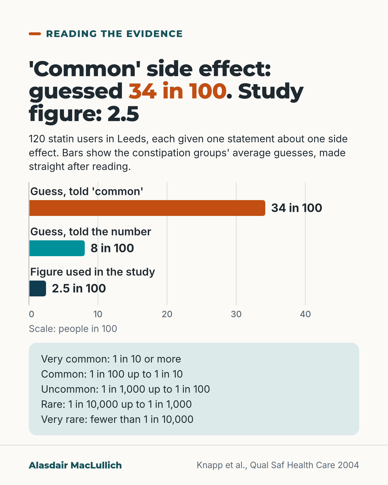

# G050: What 'common' means in a leaflet

- Category: C06 Medicines and prescribing burden
- Audience: both
- Series: Reading the evidence
- Post type: public_explanation
- Visual format: chart (horizontal bars)
- Status: text text_final, visual final
- Working id: C06-P02 (candidate C06-11)

## Insight

In a medicine leaflet 'common' means at most 1 in 10 and often far fewer; readers given the word alone guess far higher than readers given the number.

## Angle and position

Teach the frequency bands and show the size of the misreading, including that the number group overestimated too.

Basis: empirical finding (Knapp 2004, Buchter 2014); clinical interpretation (give numbers beside words)

## X (651 characters)

```text
In a medicine leaflet, 'common' means between 1 in 100 and 1 in 10 people. At most 10 in 100, and often fewer.

Readers tend to guess far higher. A UK study gave 120 people taking a statin a statement about constipation. Those told it was 'common' guessed on average that 34 in 100 people would get it. The figure used in the study was 2.5 in 100.

People given the number instead guessed about 8 in 100: still too high, but much closer.

This was a small study of first impressions, not of what people did next. Many leaflets now print a number beside the word.

If yours gives only the word: 'uncommon' means up to 1 in 100, 'rare' up to 1 in 1,000.
```

## LinkedIn (1548 characters)

```text
In a medicine leaflet, 'common' means between 1 in 100 and 1 in 10 people. At most 10 in 100, and often fewer.

The words have fixed meanings:
1. Very common: 1 in 10 or more.
2. Common: 1 in 100 up to 1 in 10.
3. Uncommon: 1 in 1,000 up to 1 in 100.
4. Rare: 1 in 10,000 up to 1 in 1,000.
5. Very rare: fewer than 1 in 10,000.

Readers often take these words to mean much higher figures. In a study in Leeds, 120 people taking a statin were each given a written statement about one side effect. Those told that constipation was 'common' guessed on average that 34 in 100 people would get it. The figure used in the study was 2.5 in 100. Those told the number guessed about 8 in 100: still too high, but far closer.

For a 'rare' side effect (4 in 10,000), the word alone led to an average guess of 18 in 100.

Across 10 trials, people given the words overestimated the chance of a side effect every time. People given numbers overestimated too, but by less. The word groups also rated the medicine more negatively, and in related studies said they were less likely to take it.

The limits are these. The Leeds study was small. The people running it knew in advance which statement each person would get. People answered straight after reading one statement. Many of the trials used healthy volunteers and made-up leaflets, and none measured whether anyone stopped a medicine. Many leaflets now print a number beside the word; these studies show what the word conveys on its own.

When you explain a side effect, say the number as well as the word.
```

## Bluesky (292 characters)

```text
In a medicine leaflet, 'common' means 1 in 100 up to 1 in 10 people.

In a UK study, statin users told constipation was 'common' guessed 34 in 100 would get it. The study's figure was 2.5 in 100. Those given the number guessed 8 in 100, still too high.

Ask for the number, not just the word.
```

## Threads (426 characters)

```text
'Common' in a medicine leaflet means between 1 in 100 and 1 in 10 people. At most 10 in 100.

In a small UK study, statin users told constipation was 'common' guessed 34 in 100 would get it. The figure used was 2.5 in 100. People given the number guessed about 8 in 100: too high, but closer.

'Uncommon' means up to 1 in 100. 'Rare' means up to 1 in 1,000. If a leaflet gives only the word, ask the pharmacist for the number.
```

## Source reply

Sources: Knapp 2004 https://doi.org/10.1136/qhc.13.3.176 ; Büchter 2014 https://doi.org/10.1186/1472-6947-14-76 ; Berry 2003 https://doi.org/10.2165/00002018-200326010-00001

## Visual



Alt text: Bar chart on a scale of people in 100. Told a side effect was 'common', statin users guessed 34 in 100 on average. Told the number, they guessed 8 in 100. The figure used in the study was 2.5 in 100. Below, the five leaflet frequency words with their ranges, from very common to very rare. Source: Knapp 2004, 120 statin users in Leeds.

Editable source: `visuals/src/G050.html`

Design instructions: Single card. barChart three bars 0 to 40 (34.2 orange, 8.1 teal, 2.5 deep teal) direct-labelled, mint panel listing five leaflet frequency bands. Claim C06-11-b.

## Sources and verification

- C06-11-a (supported): The European labelling convention used in UK and EU medicine leaflets defines frequency words as fixed bands: very common 1 in 10 or more; common 1 in 100 up to 1 in 10; uncommon 1 in 1,000 up to 1 in 100; rare 1 in 10,000 up to 1 in 1,000; very rare fewer than 1 in 10,000.
  - Source: Büchter RB, Fechtelpeter D, Knelangen M, Ehrlich M, Waltering A. Words or numbers? Communicating risk of adverse effects in written consumer health information: a systematic review and meta-analysis. BMC Med Inform Decis Mak. 2014;14:76.; Knapp P, Raynor DK, Berry DC. Comparison of two methods of presenting risk information to patients about the side effects of medicines. Qual Saf Health Care. 2004;13(3):176-80.
  - Passage: "Buchter 2014, Table 1 'European commission nomenclature for communicating frequency of adverse effects of drugs': "Very common (≥1/10) Common (≥1/100 to <1/10) Uncommon (≥1/1000 to <1/100) Rare (≥1/10000 to <1/1000) Very rare (<1/10000) Not known cannot be estimated from the available data". Knapp 2004 abstract: "verbal descriptors suggested by the European Union (EU) such as \"common\" (1-10% frequency) and \"rare\" (0.01-0.1%)"" (Buchter 2014 Background, Table 1 (PMC full text); Knapp 2004 Abstract (Objective))
- C06-11-b (supported): In a UK randomised study of 120 adults taking statins, those told constipation was 'common' estimated its likelihood at 34.2% on average, against 8.1% for those told the figure 2.5%; for pancreatitis described as 'rare', estimates were 18% with the word and 2.1% with the number 0.04%.
  - Source: Knapp P, Raynor DK, Berry DC. Comparison of two methods of presenting risk information to patients about the side effects of medicines. Qual Saf Health Care. 2004;13(3):176-80.
  - Passage: ""120 adults taking simvastatin or atorvastatin after cardiac surgery or myocardial infarction." "Cardiac rehabilitation clinics at two hospitals in Leeds, UK." "Within each side effect condition half the patients were given the information in verbal form and half in numerical form (for constipation, \"common\" or 2.5%; for pancreatitis, \"rare\" or 0.04%)." "The mean likelihood estimate given for the constipation side effect was 34.2% in the verbal group and 8.1% in the numerical group; for pancreatitis it was 18% in the verbal group and 2.1% in the numerical group."" (Abstract (Participants, Setting, Intervention, Results))
- C06-11-c (supported_with_qualification): The frequency words were associated with more negative views of the medicine than the equivalent numbers.
  - Source: Knapp P, Raynor DK, Berry DC. Comparison of two methods of presenting risk information to patients about the side effects of medicines. Qual Saf Health Care. 2004;13(3):176-80.; Berry DC, Raynor DK, Knapp P, Bersellini E. Patients' understanding of risk associated with medication use: impact of European Commission guidelines and other risk scales. Drug Saf. 2003;26(1):1-11.
  - Passage: "Knapp 2004: "The verbal descriptors were associated with more negative perceptions of the medicine than their equivalent numerical descriptors." Berry 2003: "In all studies it was found that people significantly over-estimated the likelihood of adverse effects occurring, given specific verbal descriptors. This in turn resulted in significantly higher ratings of their perceived risks to health and significantly lower ratings of their likelihood of taking the medicine."" (Knapp 2004 Abstract (Results); Berry 2003 Abstract)
- C06-11-d (supported_with_qualification): A systematic review of 10 randomised trials found that verbal frequency words consistently led to overestimation of side-effect risk; numbers also led to overestimation but less.
  - Source: Büchter RB, Fechtelpeter D, Knelangen M, Ehrlich M, Waltering A. Words or numbers? Communicating risk of adverse effects in written consumer health information: a systematic review and meta-analysis. BMC Med Inform Decis Mak. 2014;14:76.
  - Passage: ""Ten trials were included. Participants perceived probabilities presented in verbal terms as higher than in numeric terms: commonly used verbal descriptors systematically led to an overestimation of the absolute risk of adverse effects (Range of means: 3% - 54%). Numbers also led to an overestimation of probabilities, but the overestimation was smaller (2% - 20%)." Results: "MD for common side effects: -35.36 [CI: -39.92 to -30.81]". "Only between 9% and 50% of the participants in the numerical groups gave a correct probability for the adverse effects". Limitations: "Many studies were conducted with healthy volunteers and used fictional scenarios." "All outcomes were measured shortly after distribution of the information leaflets, and none of the studies had a follow-up."" (Abstract (Results); Results (Estimation of probabilities); Description of studies; Limitations of the included studies)
- C06-11-e (supported_with_qualification): Current EU guidance on leaflets pairs the frequency word with a number, rather than the word alone.
  - Source: Büchter RB, Fechtelpeter D, Knelangen M, Ehrlich M, Waltering A. Words or numbers? Communicating risk of adverse effects in written consumer health information: a systematic review and meta-analysis. BMC Med Inform Decis Mak. 2014;14:76.; European Medicines Agency. Product-information (QRD) templates - human. Amsterdam: EMA. [Web page not opened; search-engine extract only]
  - Passage: "Buchter 2014 Discussion: "Different preferences imply that using a combined verbal and numerical format may be the best compromise to suit various needs. This is also reflected in the current European Commission Guideline on readability from 2009 as well as the current EU template for patient leaflets". Also: "One study examined a combination of a verbal and numerical description, as it is currently included in the 2009 European Commission Guideline on the readability of package leaflets". EMA search extract (not opened): user testing showed double-sided expressions such as "affects more than 1 in 100 but less than 1 in 10" are not well understood and should not be used in package leaflets." (Buchter 2014 Discussion and Description of studies; EMA QRD search extract)

Verification notes: Bands from the European Commission table as reproduced in Büchter 2014 (full text). Knapp 2004 abstract: 34.2% vs 8.1% vs 2.5%, 18% for 'rare' 0.04%; small, unconcealed, immediate estimates stated. Büchter meta-analysis: overestimation in all 10 trials, numbers also overestimated. C06-11-c: negative ratings and stated intentions only (Berry 2003). C06-11-e: many leaflets now print a number (EMA page search extract only; used as context, not an essential claim). The 2.5 in 100 is the figure used in the study's statement, worded as such (not as a real-world rate).

## Attention and follow potential

Pause: A word everyone reads on leaflets turns out to mean something much smaller than people think.

Gain: The five frequency bands, and a reason to ask for the number.

Follow: Plain explanations of how risk is written down.

## Open issues

None.
